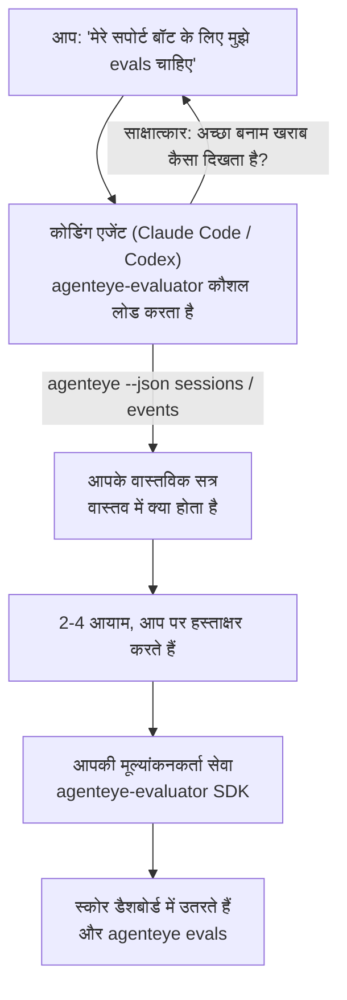

*"मुझे लगता है कि हमारा एजेंट कभी-कभी खराब है"* से लेकर एक तैनात स्कोरिंग सेवा तक जाएं, आपके कोडिंग एजेंट के साथ दोनों निर्णय और निर्माण करते हुए। **Failproof AI Observability मूल्यांकनकर्ता कौशल** (`agenteye-evaluator`) एक *Agent Skill* है: निर्देशों का एक छोटा फ़ोल्डर जो Claude Code या Codex जैसा कोडिंग एजेंट आवश्यकता पर लोड करता है। यह एजेंट को यह काम करना सिखाता है कि आपके *आपके* एजेंट के लिए कौन से गुणवत्ता आयाम ट्रैक करने लायक हैं, फिर [मूल्यांकनकर्ता सेवा](/hi/agenteye/evaluation-suite) लिखें, परीक्षण करें और तैनात करें जो उन्हें स्कोर करता है।

यह एक होस्ट किया गया स्कोरर **नहीं** है, एक रजिस्ट्री जिसे आप अपलोड करते हैं, या एक प्लगइन सिस्टम। आपका मूल्यांकनकर्ता अपनी HTTP सेवा के रूप में आपके अपने बुनियादी ढांचे पर रहता है, बिल्कुल [मूल्यांकन सूट](/hi/agenteye/evaluation-suite) गाइड में वर्णित है। कौशल केवल आपके एजेंट को इसे अच्छी तरह से बनाना सिखाता है, इसलिए यह जो कुछ भी करता है, आप स्वयं उसी कोड को लिखकर कर सकते हैं।

---

## कठिन हिस्सा यह तय करना है कि क्या स्कोर करना है

SDK सतह छोटी है — एक डेकोरेटर और दो मॉडल — और एक एजेंट [अनुबंध](/hi/agenteye/evaluation-suite#http-contract) से अकेले ही लिख सकता है। यह वह जगह नहीं है जहां मूल्यांकनकर्ता विफल होते हैं। वे विफल होते हैं क्योंकि वे गलत चीज को स्कोर करते हैं, और एक मूल्यांकनकर्ता जो गलत चीज को स्कोर करता है वह किसी से भी बदतर है: यह एक डैशबोर्ड तैयार करता है जिसे हर कोई अनदेखा करना सीख जाता है।

इसलिए कौशल का अधिकांश हिस्सा किसी भी कोड के अस्तित्व से पहले है। इसके पास एजेंट आपका साक्षात्कार करता है (*"एक ऐसा रन बताएं जो अच्छा गया; अब एक जो खराब गया"*), फिर [`agenteye` CLI](/hi/agenteye/cli) के माध्यम से आपके वास्तविक सत्रों को खींचे और उन्हें अंत तक पढ़ें। ये दोनों हिस्से आमतौर पर असहमत होते हैं, और यह अंतराल बिंदु है: आप क्या मापना चाहते हैं बनाम आपके प्रतिलेख वास्तव में क्या समर्थन कर सकते हैं। एक आयाम केवल तभी बचता है यदि वह घटनाओं से **कम्प्यूटेबल** है और **विभेदक** है — यदि वह आपके अच्छे रन और आपके खराब रन दोनों पर 0.9 स्कोर करता है, तो यह कुछ भी सिखाता नहीं और काटा जाता है।

जो वापस आता है वह 2-4 आयामों का एक प्रस्ताव है जिसमें तर्क संलग्न है, जो आप कोई भी पंक्ति लिखने से पहले पर हस्ताक्षर कर सकते हैं।



---

## यह अन्य मूल्यांकन टुकड़ों से कैसे संबंधित है

चार दस्तावेज स्कोरिंग को कवर करते हैं, और वे क्रम में एक-दूसरे को सौंपते हैं:

| पृष्ठ | यह क्या है | इसके लिए पहुंचें जब |
|---|---|---|
| **[मूल्यांकन](/hi/agenteye/evaluations)** | सुविधा: सत्र ग्रिड पर स्कोर, डैशबोर्ड, पुनः मूल्यांकन करें | आप जानना चाहते हैं कि स्वचालित स्कोरिंग आपको क्या मिलता है |
| **[मूल्यांकन सूट](/hi/agenteye/evaluation-suite)** | HTTP अनुबंध, SDK, सर्वर env vars | आप मूल्यांकनकर्ता को स्वयं लागू या डिबग कर रहे हैं |
| **मूल्यांकनकर्ता कौशल** (यह दस्तावेज़) | स्कोरर डिजाइन *और* निर्माण पर एक प्राकृतिक-भाषा सामने का दरवाज़ा | आप "मुझे evals चाहिए" से एक चलती सेवा तक जाना चाहते हैं |
| **[CLI कौशल](/hi/agenteye/cli-skill)** | `agenteye` CLI पर एक प्राकृतिक-भाषा सामने का दरवाज़ा | आप पहले से मौजूद स्कोर को *पढ़ना* चाहते हैं |
| **[Python SDK कौशल](/hi/agenteye/python-sdk-skill)** | अपने एजेंट को कम करने पर एक प्राकृतिक-भाषा सामने का दरवाज़ा | आपका एजेंट अभी तक सत्र उत्सर्जित नहीं है — स्कोर करने के लिए कुछ नहीं है |

### CLI कौशल बनाम: निर्माण बनाम पढ़ना

दोनों कौशल जानबूझकर गैर-अतिव्यापी हैं, और दोनों को स्थापित करना सामान्य सेटअप है — एजेंट आपसे पूछता है कि क्या करने के आधार पर उनके बीच चयन करता है:

- **`agenteye-evaluator`** (यह दस्तावेज़) वह चीज बनाता है जो *स्कोर का उत्पादन करता है*। इसकी नौकरी तब समाप्त होती है जब पहली बार स्कोर उतरते हैं।
- **[`agenteye-cli`](/hi/agenteye/cli-skill)** उन स्कोरों को पढ़ता है जो पहले से मौजूद हैं (`agenteye evals`)। *"क्या गुणवत्ता इस सप्ताह गिरी?"* इसका सवाल है, इस कौशल का नहीं।

---

## पूर्वापेक्षाएं

1. **`agenteye` CLI स्थापित और लॉगिन** (`pipx install agenteye`, फिर `agenteye login`)। कौशल इसे दो बार झुकाता है: वास्तविक सत्रों को खींचने के लिए जो वह डिजाइन करता है, और यह पुष्टि करने के लिए कि आपके स्कोर अंत में उतरे। आपकी लॉगिन को `events:read` की आवश्यकता है, साथ ही उस अंतिम जांच के लिए `evaluations:read` भी है। CLI कौशल की तरह, यह ईमेल किए गए एक-बार-कोड लॉगिन को आपके लिए पूरा **नहीं** कर सकता।
2. **मूल्यांकनकर्ता के लिए कहीं।** यह एक छवि में बनाया जाता है और एक दीर्घकालीन सेवा के रूप में चलाया जाता है, इसलिए इसे एक वास्तविक रेपो की आवश्यकता है, न कि एक स्क्रैच फ़ाइल। मूल्यांकनकर्ता अक्सर अपने स्वयं के रेपो में रहते हैं, स्कोर किए जा रहे एजेंट से अलग — कौशल एक मौजूदा को देखता है और एक नया काठी बनाने से पहले पूछता है।
3. **`agenteye-evaluator` SDK wheel** — अगला अनुभाग पढ़ें इससे पहले कि आपका एजेंट `pip` कमांड टाइप करना शुरू करे।

---

## इसे कहां से प्राप्त करें

कौशल Failproof AI के सार्वजनिक कौशल संग्रह में प्रकाशित है:

**[github.com/FailproofAI/skills](https://github.com/FailproofAI/skills)** → [`skills/agenteye-evaluator/`](https://github.com/FailproofAI/skills/tree/main/skills/agenteye-evaluator)

रिपोजिटरी सार्वजनिक है और कौशल को अपनी कोई साख की आवश्यकता नहीं है — यह केवल `agenteye` CLI को सत्र के साथ चलाता है जो आप लॉगिन करते हैं, और *आपके* रेपो में कोड लिखता है। ध्यान दें कि यह अपने स्वयं के फ़ोल्डर के रूप में शिप करता है और `pipx install agenteye` पैकेज के अंदर **नहीं** है, इसलिए वहां इसे न देखें।

## कौशल स्थापित करना

सबसे तेज़ रास्ता [`skills`](https://skills.sh) CLI है, जो फ़ोल्डर को फेच करता है और इसे जहां आपका एजेंट देखता है वहां छोड़ता है:

```bash
# Claude Code, केवल यह प्रोजेक्ट
npx skills add FailproofAI/skills --skill agenteye-evaluator -a claude-code

# हर प्रोजेक्ट (~/.claude/skills/ को स्थापित करता है)
npx skills add FailproofAI/skills --skill agenteye-evaluator -a claude-code -g --copy

# इसके बजाय Codex
npx skills add FailproofAI/skills --skill agenteye-evaluator -a codex
```

फिर इसे किसी अन्य कौशल की तरह प्रबंधित करें:

```bash
npx skills list -a claude-code           # क्या स्थापित है
npx skills update agenteye-evaluator     # नवीनतम संस्करण खींचें
npx skills remove agenteye-evaluator     # इसे हटाएं
```

हाथ से स्थापित करना पसंद है? एक Agent Skill केवल एक फ़ोल्डर है जिसमें `SKILL.md` है (साथ ही वैकल्पिक संदर्भ), इसलिए इसे कॉपी करना भी काम करता है:

- **Claude Code**: `agenteye-evaluator/` फ़ोल्डर को `~/.claude/skills/` (हर प्रोजेक्ट) या `<your-repo>/.claude/skills/` (केवल वह रेपो) में रखें। Claude Code इसे स्वचालित-खोजता है — `/skills` सूची से सत्यापित करें, या बस evals के लिए पूछें।
- **Codex (OpenAI)**: Codex समान `SKILL.md` को पढ़ता है। बंडल किया गया `agents/openai.yaml` `allow_implicit_invocation: true` सेट करता है, इसलिए Codex कार्य मेल होने पर कौशल को स्वचालित-चयन करता है; अन्यथा इसे `$agenteye-evaluator` के रूप में स्पष्ट रूप से आमंत्रित करें।

---

## SDK सार्वजनिक PyPI पर नहीं है

> **चेतावनी:** SDK को स्थापित करने देने से पहले यह पढ़ें।

कौशल सार्वजनिक है; जो SDK यह चलाता है वह नहीं है। `agenteye-evaluator` केवल एक निजी रिलीज़ आर्टिफैक्ट के रूप में शिप करता है, और `agenteye` के विपरीत, नाम सार्वजनिक PyPI पर **दावा नहीं किया गया है** — इसलिए एक नंगे `pip install agenteye-evaluator` एक अजनबी के पैकेज को सेवा में खींच सकता है जो आपके उत्पादन प्रतिलेखों को पढ़ता है। यह एक टाइपो नहीं है, एक सप्लाई-चेन समस्या है।

कौशल यह जानता है और इसके बजाय एक स्थापना सीढ़ी के नीचे काम करता है, पहले पायदान पर रुक जाता है जो लागू होता है: monorepo स्रोत यदि आप AgentEye रेपो के अंदर हैं, अन्यथा GitHub Releases से निजी रिलीज़ व्हील (पहुंच चाहिए), और यदि कोई भी नहीं पहुंचा है तो यह **रुकता है और आपको Failproof AI संपर्क से व्हील मांगने के लिए कहता है** बजाय तुरंत किए।

तो यदि आपका एजेंट सार्वजनिक PyPI से नंगे `pip install agenteye-evaluator` प्रस्तावित करता है, तो यह बताता है कि कौशल कभी लोड नहीं हुआ। वहां रुकें और जांचें कि यह स्थापित है।

---

## आप इससे क्या पूछ सकते हैं

एक वास्तविक राउंड-ट्रिप एक अस्पष्ट पूछ से शुरू होता है और कोड के साथ नहीं बल्कि एक हस्ताक्षरित डिजाइन के साथ समाप्त होता है:

```text
आप    ▸ मेरे सपोर्ट बॉट के लिए मुझे evals चाहिए। मुझे लगता है कि यह कभी-कभी खराब है।

एजेंट  ▸ मैं कुछ भी लिखने से पहले: एक रन बताएं जो अच्छा गया,
        और एक जो खराब गया।

आप    ▸ अच्छा: यह दस्तावेज़ों से उत्तर देता है। खराब: यह सामान बनाता है,
        या हार मान जाता है और कहता है "समर्थन से संपर्क करें"।

एजेंट  ▸ चल रहा है: agenteye --json sessions --status error --since 7d
        5 सत्र पढ़ रहे हैं, जिनमें से दो आप खराब कहेंगे।

        आपके शब्द तथ्यात्मकता और विक्षेपण कहते हैं। प्रतिलेख
        विक्षेपण पर सहमत हैं (5 में से 2 एक सपोर्ट हैंडऑफ के साथ समाप्त होते हैं,
        और यह model_response.content में स्पष्ट है), लेकिन तथ्यात्मकता
        को एक जमीन सच की जरूरत है जो आपके इवेंट्स नहीं ले जाते।

        तो मैं तीन चीजें स्कोर करूंगा:
          - विक्षेपण      नियम, सस्ता, आपके दो रन को अलग करता है
          - tool_efficiency नियम, run-004 में रिट्राई लूप पकड़ता है
          - groundedness    LLM न्यायाधीश: क्या आपने जो डॉक्स प्राप्त किए उनमें हर दावा है?

        "तथ्यात्मकता" को जमीन सच की जरूरत है जो हमारे पास नहीं है; groundedness
        सबसे करीबी चीज है जो आपके प्रतिलेख वास्तव में समर्थन कर सकते हैं।
        उन तीन नामों के साथ ठीक है? बाद में नाम बदलना इतिहास को विभाजित करता है।

आप    ▸ हाँ

एजेंट  ▸ इस रेपो में कोई मूल्यांकनकर्ता नहीं है। क्या मुझे यहां एक काठी करनी चाहिए, या क्या
        आपके पास कहीं और एक है?
```

वहां से यह पहले नियम-आधारित आयामों को लिखता है (मुक्त, तात्कालिक, नियतात्मक), उन्हें एक वास्तविक कब्जा किए गए सत्र के विरुद्ध परीक्षण करता है जिसमें खाली और कभी समाप्त न होने वाले सत्र शामिल हैं जो भोले मूल्यांकनकर्ताओं को क्रैश करते हैं, और केवल व्यक्तिपरक आयाम पर एक LLM न्यायाधीश तक पहुंचता है। यह [dispatcher की सीमाओं](/hi/agenteye/evaluation-suite#configuring-the-server) को जानता है — एक 30s अनुरोध समय सीमा और 8 समवर्ती कॉल तैनाती-व्यापी — इसलिए यदि न्यायाधीश विश्वसनीय रूप से फिट नहीं होगा, तो यह `JobPending` के साथ अतुल्यकालिक जाता है बजाय आपके न्यायाधीश को रद्द और पांच बार पांच बार पुनः प्रयास होने दिया।

फिर यह तैनात करता है, दोनों सर्वर env vars सेट करता है, और `agenteye --json evals --session-id <id>` के साथ पुष्टि करता है कि स्कोर वास्तव में उतरे। स्कोर उतरना ही एकमात्र सबूत है।

---

## क्या देखना है

- **आयाम नाम लगभग स्थायी हैं।** स्कोर कुंजियां मनमानी स्ट्रिंग हैं और मंच जो कुछ भी आप भेजते हैं उसका ट्रेंड करता है, जिसका अर्थ है कि डाउनस्ट्रीम में कोई भी बुरी पसंद को ठीक नहीं करता है। बाद में नाम बदलें और इतिहास विभाजित होता है: पुराने सत्र पुरानी कुंजी रखते हैं और ट्रेंड टूटता है। यह है कि कौशल कोड लिखने से पहले स्पष्ट साइन-ऑफ क्यों मिलता है — उस प्रॉम्प्ट को गंभीरता से लें।
- **फिक्सचर वास्तविक उत्पादन प्रतिलेख हैं।** वास्तविक सत्रों के विरुद्ध डिजाइन करने का अर्थ है उन्हें डिस्क पर खींचना, और वे ग्राहक डेटा शामिल कर सकते हैं। कौशल प्रतिबद्ध करने से पहले पूछता है; यदि संदेह में, `fixtures/` को रेपो से बाहर रखें और प्रत्येक डेवलपर को अपना खुद का खींचने दें।
- **एजेंट एक सेवा लिखता और तैनात करता है जो हर प्रतिलेख को पढ़ता है।** यह आप के रूप में कार्य करता है, आपकी CLI लॉगिन की अनुमति से बंधा हुआ है, लेकिन मूल्यांकनकर्ता की समीक्षा करें जैसे कि कोई अन्य कोड जो उत्पादन डेटा को छूता है।

---

## अगले कदम

- **[मूल्यांकन सूट](/hi/agenteye/evaluation-suite)**: HTTP अनुबंध, SDK, और सर्वर env vars कौशल कॉन्फ़िगर करता है।
- **[मूल्यांकन](/hi/agenteye/evaluations)**: जहां स्कोर उतरने के बाद दिखाई देते हैं।
- **[CLI कौशल](/hi/agenteye/cli-skill)**: बहन कौशल, परिणाम पढ़ने के लिए स्कोरर निर्माण के बजाय।
- **[CLI](/hi/agenteye/cli)**: कमांड संदर्भ कौशल द्वारा डिजाइन किए गए सत्र डेटा के पीछे।