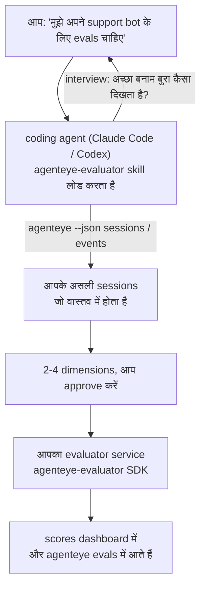

*"मुझे लगता है कि हमारा agent कभी-कभी खराब है"* से लेकर एक deployed scoring service तक जाएँ, जहाँ आपका coding agent फैसला लेने और बनाने दोनों काम करता है। **Failproof AI Observability evaluator skill** (`agenteye-evaluator`) एक *Agent Skill* है: निर्देशों का एक छोटा फोल्डर जिसे Claude Code या Codex जैसा coding agent आवश्यकतानुसार लोड करता है। यह agent को सिखाता है कि आपके *agent* के लिए कौन से quality dimensions ट्रैक करने लायक हैं, और फिर [evaluator service](/hi/agenteye/evaluation-suite) लिखें, परीक्षण करें और deploy करें जो उन्हें स्कोर करता है।

यह एक hosted scorer, एक registry जिसमें आप अपलोड करते हों, या एक plugin system **नहीं** है। आपका evaluator आपका अपना HTTP service रहता है, आपके अपने infrastructure पर, बिल्कुल जैसा [Evaluation suite](/hi/agenteye/evaluation-suite) गाइड में वर्णित है। यह skill केवल आपके agent को इसे अच्छी तरह से बनाना सिखाता है, इसलिए जो कुछ भी यह करता है, आप खुद यही कोड लिखकर कर सकते हैं।

---

## कठिन हिस्सा यह तय करना है कि क्या स्कोर करना है

SDK surface छोटा है — एक decorator और दो models — और एक agent इसे [contract](/hi/agenteye/evaluation-suite#http-contract) से ही लिख सकता है। यहीं evaluators असफल नहीं होते। वे असफल होते हैं क्योंकि वे गलत चीज को स्कोर करते हैं, और एक evaluator जो गलत चीज स्कोर करता है वह किसी से भी बदतर है: यह एक dashboard बनाता है जिसे सब लोग अनदेखा करना सीख जाते हैं।

इसलिए यह skill का अधिकांश हिस्सा कोई कोड लिखने से पहले की बात है। यह agent को आपसे interview करवाता है (*"एक ऐसा run describe करें जो अच्छा हुआ; अब एक जो बुरा हुआ"*), फिर [`agenteye` CLI](/hi/agenteye/cli) के जरिए आपके असली sessions को pull करता है और उन्हें अंत तक पढ़ता है। ये दोनों हिस्से आमतौर पर असहमत होते हैं, और यह gap ही महत्वपूर्ण है: आप क्या मापना चाहते हैं बनाम आपके transcripts वास्तव में क्या समर्थन कर सकते हैं। एक dimension तभी बचता है अगर यह events से **computable** हो और **discriminating** हो — अगर यह आपके अच्छे और बुरे दोनों runs पर 0.9 स्कोर करता है, तो यह कुछ नहीं सिखाता और काटा जाता है।

जो वापस आता है वह 2-4 dimensions का एक प्रस्ताव है, जिसमें reasoning जुड़ी हो, आपके approve करने के लिए कोई लाइन लिखने से पहले।



---

## यह अन्य evaluation pieces से कैसे संबंधित है

चार docs scoring को cover करते हैं, और वे क्रम में एक-दूसरे को सौंपते हैं:

| पृष्ठ | यह क्या है | यब पहुंचें जब |
|---|---|---|
| **[Evaluations](/hi/agenteye/evaluations)** | यह feature: sessions grid पर scores, dashboards, re-evaluate | आप जानना चाहते हैं कि automatic scoring आपको क्या देता है |
| **[Evaluation suite](/hi/agenteye/evaluation-suite)** | HTTP contract, SDK, server env vars | आप स्वयं evaluator को implement या debug कर रहे हैं |
| **Evaluator skill** (यह doc) | scorer को design *और* build करने पर एक natural-language front door | आप "मुझे evals चाहिए" से एक running service तक जाना चाहते हैं |
| **[CLI skill](/hi/agenteye/cli-skill)** | `agenteye` CLI पर एक natural-language front door | आप पहले से मौजूद scores को *पढ़ना* चाहते हैं |
| **[Python SDK skill](/hi/agenteye/python-sdk-skill)** | अपने agent को instrument करने पर एक natural-language front door | आपका agent अभी sessions emit नहीं कर रहा है — स्कोर करने के लिए कुछ नहीं है |

### CLI skill बनाम: build बनाम read

दोनों skills जानबूझकर non-overlapping हैं, और दोनों को install करना सामान्य setup है — agent आपसे जो पूछते हैं उसके आधार पर उनमें से चुनता है:

- **`agenteye-evaluator`** (यह doc) उस चीज को build करता है जो scores *produce* करता है। इसका काम तब समाप्त होता है जब scores पहली बार land हों।
- **[`agenteye-cli`](/hi/agenteye/cli-skill)** वह scores को read करता है जो पहले से मौजूद हैं (`agenteye evals`)। *"क्या इस हफ्ते quality गिरी?"* इसका सवाल है, इस skill का नहीं।

---

## Prerequisites

1. **`agenteye` CLI installed और logged in** (`pipx install agenteye`, फिर `agenteye login`)। यह skill इसे दो बार use करता है: असली sessions pull करने के लिए जिसके विरुद्ध यह design करता है, और अंत में आपके scores land करने की confirm करने के लिए। आपकी login को `events:read` चाहिए, साथ ही उस अंतिम check के लिए `evaluations:read`। CLI skill की तरह, यह emailed one-time-code login को आपके लिए complete **नहीं** कर सकता।
2. **Evaluator रहने के लिए कहीं।** यह एक image में build होता है और एक long-running service के रूप में run होता है, इसलिए इसे एक real repo की जरूरत है, scratch file नहीं। Evaluators अक्सर अपने स्वयं के repo में रहते हैं, स्कोर किए जा रहे agent से अलग — यह skill एक मौजूदा को खोजता है और नया scaffold करने से पहले पूछता है।
3. **`agenteye-evaluator` SDK wheel** — अगले section को read करें इससे पहले कि आपका agent `pip` commands टाइप करना शुरू करे।

---

## यह कहाँ से प्राप्त करें

यह skill Failproof AI के public skills collection में published है:

**[github.com/FailproofAI/skills](https://github.com/FailproofAI/skills)** → [`skills/agenteye-evaluator/`](https://github.com/FailproofAI/skills/tree/main/skills/agenteye-evaluator)

यह repository public है और skill को अपना कोई credential नहीं चाहिए — यह केवल `agenteye` CLI को उस session के साथ drive करता है जिसमें *आप* logged in हैं, और *आपके* repo में code लिखता है। ध्यान दें कि यह अपने folder के रूप में ships करता है और `pipx install agenteye` package के अंदर **नहीं** है, इसलिए वहाँ इसे न खोजें।

## Skill को install करना

सबसे तेज़ path [`skills`](https://skills.sh) CLI है, जो folder को fetch करता है और उसे वहाँ drop करता है जहाँ आपका agent देखता है:

```bash
# Claude Code, केवल यह project
npx skills add FailproofAI/skills --skill agenteye-evaluator -a claude-code

# हर project (installs to ~/.claude/skills/)
npx skills add FailproofAI/skills --skill agenteye-evaluator -a claude-code -g --copy

# बजाय Codex के
npx skills add FailproofAI/skills --skill agenteye-evaluator -a codex
```

फिर इसे किसी अन्य skill की तरह manage करें:

```bash
npx skills list -a claude-code           # क्या install है
npx skills update agenteye-evaluator     # latest version pull करें
npx skills remove agenteye-evaluator     # इसे remove करें
```

हाथ से install करना पसंद करते हैं? एक Agent Skill केवल एक `SKILL.md` (साथ optional references) युक्त folder है, इसलिए इसे copy करना भी काम करता है:

- **Claude Code**: `agenteye-evaluator/` folder को `~/.claude/skills/` (हर project) या `<your-repo>/.claude/skills/` (केवल वह repo) में रखें। Claude Code इसे auto-discover करता है — `/skills` list के साथ verify करें, या बस evals के लिए पूछें।
- **Codex (OpenAI)**: Codex वही `SKILL.md` read करता है। बंडल किया गया `agents/openai.yaml` `allow_implicit_invocation: true` set करता है, इसलिए Codex task से match होने पर skill को auto-select करता है; अन्यथा इसे explicitly as `$agenteye-evaluator` invoke करें।

---

## SDK public PyPI पर नहीं है

> **Warning:** इसे एक agent को SDK install करने देने से पहले read करें।

यह skill public है; जो SDK यह drive करता है वह नहीं है। `agenteye-evaluator` केवल एक private release artifact के रूप में ships करता है, और `agenteye` के विपरीत, यह नाम public PyPI पर **unclaimed** है — इसलिए एक bare `pip install agenteye-evaluator` किसी अजनबी के package को उस service में pull कर सकता है जो आपके production transcripts को read करता है। यह एक typo नहीं, एक supply-chain समस्या है।

यह skill यह जानता है और एक install ladder के नीचे काम करता है, पहले rung पर रुकता है जो लागू होता है: monorepo source अगर आप AgentEye repo के अंदर हैं, अन्यथा GitHub Releases से private release wheel (access चाहिए), और अगर न कोई पहुंचा है तो यह **रुकता है और आपको अपने Failproof AI contact से wheel के लिए पूछने के लिए कहता है** बजाय improvise करने के।

तो अगर आपका agent public PyPI से bare `pip install agenteye-evaluator` propose करता है, यह बताता है कि skill कभी load नहीं हुई। वहाँ रुकें और check करें कि यह install है।

---

## आप क्या पूछ सकते हैं

एक असली round-trip एक vague ask से शुरू होता है और code से नहीं, एक signed-off design के साथ समाप्त होता है:

```text
आप   ▸ मुझे अपने support bot के लिए evals चाहिए। मुझे लगता है कि यह कभी-कभी खराब है।

agent ▸ कुछ भी लिखने से पहले: एक ऐसा run describe करें जो अच्छा गया,
        और एक जो बुरा गया।

आप   ▸ अच्छा: यह docs से answer देता है। बुरा: यह stuff बनाता है,
        या हार मान लेता है और "contact support" कहता है।

agent ▸ चल रहा है: agenteye --json sessions --status error --since 7d
        5 sessions को read कर रहा हूँ, दो सहित जो आप बुरे कहेंगे।

        आपके शब्द factuality और deflection कहते हैं। Transcripts
        deflection पर सहमत हैं (5 में से 2 एक support hand-off के साथ समाप्त होते हैं,
        और यह model_response.content में स्पष्ट है), लेकिन factuality
        को एक ground truth चाहिए जो आपके events carry नहीं करते हैं।

        तो मैं तीन चीजें score करूँगा:
          - deflection      rules, सस्ता, आपके दोनों runs को अलग करता है
          - tool_efficiency rules, run-004 में retry loop को catch करता है
          - groundedness    LLM judge: क्या हर claim docs में है जो यह retrieve करता है?

        "factuality" को ground truth चाहिए जो हमारे पास नहीं है; groundedness
        सबसे करीबी चीज है जो आपके transcripts वास्तव में support कर सकते हैं।
        इन तीनों नामों से ठीक है? बाद में rename करने से history split होती है।

आप   ▸ हाँ

agent ▸ इस repo में कोई evaluator नहीं है। क्या मुझे यहाँ एक scaffold करना चाहिए, या आपके पास
        कहीं और एक है?
```

वहाँ से यह rules-based dimensions को पहले लिखता है (मुफ़्त, तुरंत, deterministic), उन्हें एक असली captured session के विरुद्ध test करता है जिसमें empty और कभी-finished नहीं होने वाले शामिल हैं जो naive evaluators को crash करते हैं, और केवल subjective dimension पर एक LLM judge तक पहुंचता है। यह [dispatcher's limits](/hi/agenteye/evaluation-suite#configuring-the-server) जानता है — एक 30s request timeout और 8 concurrent calls deployment-wide — इसलिए अगर judge विश्वसनीय रूप से fit नहीं होगा, तो यह `JobPending` के साथ async जाता है बजाय आपके judge को cancelled और पाँच बार retry किया जाता है और पाँच गुना cost पर।

फिर यह deploy करता है, दोनों server env vars set करता है, और `agenteye --json evals --session-id <id>` के साथ confirm करता है कि scores वास्तव में land हुए हैं। Scores landing ही एकमात्र proof है।

---

## क्या watch करें

- **Dimension names लगभग permanent हैं।** Score keys arbitrary strings हैं और platform जो कुछ भी आप भेजते हैं उसे trend करता है, जिसका मतलब downstream कुछ भी bad choice को ठीक नहीं करता है। बाद में rename करें और history split हो जाती है: पुरानी sessions पुरानी key रखते हैं और trend टूट जाता है। यही कारण है कि skill code लिखने से पहले explicit sign-off पाता है — उस prompt को seriously लें।
- **Fixtures असली production transcripts हैं।** Real sessions के विरुद्ध design करने का मतलब है उन्हें disk में pull करना, और वे customer data contain कर सकते हैं। यह skill git में commit करने से पहले पूछता है; अगर संदेह है, तो `fixtures/` को repo के बाहर रखें और हर developer को अपना खुद का pull करने दें।
- **Agent एक service लिखता और deploy करता है जो हर transcript को read करता है।** यह आपके रूप में act करता है, आपकी CLI login की permissions से bounded, लेकिन evaluator को review करें जैसे किसी अन्य code के लिए जो production data को touch करता है।

---

## अगले कदम

- **[Evaluation suite](/hi/agenteye/evaluation-suite)**: HTTP contract, SDK, और server env vars जो skill configure करता है।
- **[Evaluations](/hi/agenteye/evaluations)**: जहाँ scores दिखाई देते हैं एक बार वे land हों।
- **[CLI skill](/hi/agenteye/cli-skill)**: sibling skill, results को read करने के लिए scorer build करने के बजाय।
- **[CLI](/hi/agenteye/cli)**: command reference जो session data के पीछे है जो skill design करता है।