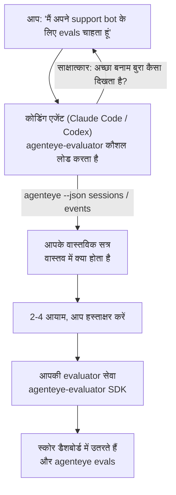

*"मुझे लगता है कि हमारा एजेंट कभी-कभी खराब है"* से लेकर एक तैनात स्कोरिंग सेवा तक जाएं, आपके कोडिंग एजेंट के साथ फैसला लेने और निर्माण दोनों को करते हुए। **Failproof AI Observability evaluator skill** (`agenteye-evaluator`) एक *Agent Skill* है: निर्देशों का एक छोटा फोल्डर जो एक कोडिंग एजेंट जैसे Claude Code या Codex मांग पर लोड करता है। यह एजेंट को यह काम करना सिखाता है कि कौन से गुणवत्ता आयाम आपके *एजेंट* के लिए ट्रैक करने लायक हैं, फिर [evaluator service](/hi/agenteye/evaluation-suite) लिखें, परीक्षण करें और तैनात करें जो उन्हें स्कोर करता है।

यह एक होस्ट किया गया स्कोरर **नहीं** है, एक रजिस्ट्री जिसमें आप अपलोड करते हैं, या एक प्लगइन सिस्टम नहीं है। आपका evaluator आपका अपना HTTP सेवा आपके अपने बुनियादी ढांचे पर रहता है, ठीक जैसा [Evaluation suite](/hi/agenteye/evaluation-suite) गाइड में वर्णित है। यह कौशल केवल आपके एजेंट को इसे अच्छी तरह से बनाना सिखाता है, इसलिए यह जो कुछ भी करता है, आप स्वयं समान कोड लिखकर कर सकते हैं।

---

## कठिन हिस्सा यह तय करना है कि क्या स्कोर करें

SDK सतह छोटी है — एक डेकोरेटर और दो मॉडल — और एक एजेंट [contract](/hi/agenteye/evaluation-suite#http-contract) से अकेले इसे लिख सकता है। यह वह जगह नहीं है जहां evaluators विफल होते हैं। वे विफल होते हैं क्योंकि वे गलत चीज़ को स्कोर करते हैं, और एक evaluator जो गलत चीज़ को स्कोर करता है वह कोई भी नहीं होने से बदतर है: यह एक डैशबोर्ड बनाता है जिसे हर कोई अनदेखा करना सीख जाता है।

इसलिए अधिकांश कौशल कोड होने से पहले का हिस्सा है। इसमें एजेंट आपसे साक्षात्कार लेता है (*"एक ऐसा रन बताएं जो अच्छा चला; अब एक बुरा"*), फिर [`agenteye` CLI](/hi/agenteye/cli) के माध्यम से आपके वास्तविक सत्र खींचता है और उन्हें अंत तक पढ़ता है। ये दोनों हिस्से आमतौर पर असहमत होते हैं, और यह अंतर बिंदु है: आप क्या मापने का इरादा रखते हैं बनाम आपके ट्रांसक्रिप्ट वास्तव में क्या समर्थन कर सकते हैं। एक आयाम केवल तभी जीवित रहता है जब वह घटनाओं से **computable** और **discriminating** हो — यदि यह आपके अच्छे रन और बुरे दोनों पर 0.9 का स्कोर देता है, तो यह कुछ नहीं सिखाता है और काट दिया जाता है।

जो वापस आता है वह 2-4 आयामों का एक प्रस्ताव है जिसके साथ तर्क संलग्न है, आपके हस्ताक्षर के लिए कोई भी पंक्ति लिखे जाने से पहले।



---

## यह अन्य मूल्यांकन टुकड़ों से कैसे संबंधित है

चार दस्तावेज़ स्कोरिंग को कवर करते हैं, और वे क्रम में एक दूसरे को सौंपते हैं:

| पृष्ठ | यह क्या है | इसके लिए पहुंचें जब |
|---|---|---|
| **[Evaluations](/hi/agenteye/evaluations)** | यह विशेषता: सत्र ग्रिड पर स्कोर, डैशबोर्ड, पुनः-मूल्यांकन करें | आप जानना चाहते हैं कि स्वचालित स्कोरिंग क्या देती है |
| **[Evaluation suite](/hi/agenteye/evaluation-suite)** | HTTP contract, SDK, सर्वर env vars | आप स्वयं evaluator को लागू या डीबग कर रहे हैं |
| **Evaluator skill** (यह दस्तावेज़) | स्कोरर को डिजाइन *और* बनाने पर एक प्राकृतिक-भाषा फ्रंट दरवाज़ा | आप "मैं evals चाहता हूं" से एक चलती हुई सेवा तक जाना चाहते हैं |
| **[CLI skill](/hi/agenteye/cli-skill)** | `agenteye` CLI पर एक प्राकृतिक-भाषा फ्रंट दरवाज़ा | आप जो स्कोर पहले से ही हैं उन्हें *पढ़ना* चाहते हैं |
| **[Python SDK skill](/hi/agenteye/python-sdk-skill)** | अपने एजेंट को instrumented करने पर एक प्राकृतिक-भाषा फ्रंट दरवाज़ा | आपका एजेंट अभी तक सत्र emit नहीं कर रहा है — स्कोर करने के लिए कुछ भी नहीं है |

### CLI कौशल बनाम: निर्माण बनाम पढ़ना

ये दोनों कौशल जानबूझकर गैर-अतिव्यापी हैं, और दोनों को स्थापित करना सामान्य सेटअप है — एजेंट आप जो पूछते हैं उसके आधार पर उनके बीच चुनता है:

- **`agenteye-evaluator`** (यह दस्तावेज़) उस चीज़ को बनाता है जो स्कोर *produce* करता है। इसका काम तब समाप्त होता है जब स्कोर पहली बार उतरते हैं।
- **[`agenteye-cli`](/hi/agenteye/cli-skill)** पहले से मौजूद स्कोर पढ़ता है (`agenteye evals`)। *"क्या गुणवत्ता इस हफ्ते गिरी?"* इसका सवाल है, इस कौशल का नहीं।

---

## पूर्वापेक्षाएं

1. **`agenteye` CLI स्थापित और लॉगिन** (`pipx install agenteye`, फिर `agenteye login`)। कौशल इसे दो बार लीवर करता है: वास्तविक सत्र खींचने के लिए जो यह डिजाइन करता है, और यह पुष्टि करने के लिए कि आपके स्कोर अंत में उतरे। आपकी लॉगिन को `events:read` की आवश्यकता है, साथ ही उस अंतिम जांच के लिए `evaluations:read`। CLI कौशल के साथ, यह ईमेल किए गए one-time-code लॉगिन को आपके लिए **पूरा नहीं कर सकता**।
2. **evaluator के लिए कहीं।** यह एक image में बनाया जाता है और एक लंबे समय तक चलने वाली सेवा के रूप में चलाया जाता है, इसलिए इसे एक वास्तविक repo की आवश्यकता है, scratch फ़ाइल नहीं। Evaluators अक्सर अपने स्वयं के repo में रहते हैं, जिस एजेंट को स्कोर किया जा रहा है उससे अलग — कौशल एक मौजूदा को खोजता है और एक नया scaffold करने से पहले पूछता है।
3. **`agenteye-evaluator` SDK wheel** — अगले अनुभाग को पढ़ें इससे पहले कि आपका एजेंट `pip` कमांड टाइप करना शुरू करे।

---

## इसे कहां प्राप्त करें

कौशल Failproof AI के सार्वजनिक कौशल संग्रह में प्रकाशित है:

**[github.com/FailproofAI/skills](https://github.com/FailproofAI/skills)** → [`skills/agenteye-evaluator/`](https://github.com/FailproofAI/skills/tree/main/skills/agenteye-evaluator)

Repository सार्वजनिक है और कौशल को अपना कोई credential की आवश्यकता नहीं है — यह केवल `agenteye` CLI को सत्र के साथ चलाता है *जिसमें आप* लॉगिन किए हैं, और *आपके* repo में कोड लिखता है। ध्यान दें कि यह अपने स्वयं के फोल्डर के रूप में शिप करता है और `pipx install agenteye` पैकेज के अंदर **नहीं** है, इसलिए वहां इसे न देखें।

## कौशल स्थापित करना

सबसे तेज़ रास्ता [`skills`](https://skills.sh) CLI है, जो फोल्डर को लाता है और इसे वहां गिराता है जहां आपका एजेंट देखता है:

```bash
# Claude Code, केवल यह प्रोजेक्ट
npx skills add FailproofAI/skills --skill agenteye-evaluator -a claude-code

# हर प्रोजेक्ट (~/.claude/skills/ में स्थापित करता है)
npx skills add FailproofAI/skills --skill agenteye-evaluator -a claude-code -g --copy

# इसके बजाय Codex
npx skills add FailproofAI/skills --skill agenteye-evaluator -a codex
```

फिर इसे किसी अन्य कौशल की तरह प्रबंधित करें:

```bash
npx skills list -a claude-code           # क्या स्थापित है
npx skills update agenteye-evaluator     # नवीनतम संस्करण खींचें
npx skills remove agenteye-evaluator     # इसे हटाएं
```

हाथ से स्थापित करना पसंद करते हैं? एक Agent Skill केवल एक फोल्डर है जिसमें `SKILL.md` (साथ ही optional references) है, इसलिए इसकी प्रतिलिपि भी काम करती है:

- **Claude Code**: `agenteye-evaluator/` फोल्डर को `~/.claude/skills/` (हर प्रोजेक्ट) या `<your-repo>/.claude/skills/` (केवल वह repo) में रखें। Claude Code इसे auto-discover करता है — `/skills` सूची के साथ सत्यापित करें, या बस evals के लिए पूछें।
- **Codex (OpenAI)**: Codex एक ही `SKILL.md` पढ़ता है। bundled `agents/openai.yaml` `allow_implicit_invocation: true` सेट करता है, इसलिए Codex जब एक कार्य मेल खाता है तब कौशल को auto-select करता है; अन्यथा इसे explicitly `$agenteye-evaluator` के रूप में invoke करें।

---

## SDK सार्वजनिक PyPI पर नहीं है

> **Warning:** इससे पहले पढ़ें कि एक एजेंट को SDK स्थापित करने दें।

कौशल सार्वजनिक है; यह जो SDK चलाता है वह नहीं है। `agenteye-evaluator` केवल एक private release artifact के रूप में शिप करता है, और `agenteye` के विपरीत, नाम सार्वजनिक PyPI पर **unclaimed** है — इसलिए एक bare `pip install agenteye-evaluator` किसी अजनबी के पैकेज को उस सेवा में खींच सकता है जो आपके production transcripts पढ़ता है। यह एक typo नहीं है, एक supply-chain समस्या है।

कौशल यह जानता है और एक स्थापना सीढ़ी के नीचे काम करता है, पहले rung पर रुकता है जो लागू होता है: monorepo स्रोत यदि आप AgentEye repo के अंदर हैं, अन्यथा GitHub Releases से private release wheel (access की जरूरत है), और यदि दोनों में से कोई भी नहीं पहुंचने योग्य है तो यह **रुकता है और आपको आपके Failproof AI संपर्क से wheel के लिए पूछने को कहता है** improvise करने के बजाय।

तो यदि आपका एजेंट सार्वजनिक PyPI से एक bare `pip install agenteye-evaluator` का प्रस्ताव देता है, तो वह संकेत है कि कौशल कभी लोड नहीं हुआ। वहां रुकें और जांचें कि यह स्थापित है।

---

## आप इससे क्या पूछ सकते हैं

एक वास्तविक round-trip एक vague ask से शुरू होता है और एक signed-off डिजाइन के साथ समाप्त होता है, कोड के साथ नहीं:

```text
आप   ▸ मैं अपने support bot के लिए evals चाहता हूं। मुझे लगता है कि यह कभी-कभी खराब है।

एजेंट ▸ कुछ भी लिखने से पहले: एक run बताएं जो अच्छा चला,
        और एक जो बुरा चला।

आप   ▸ अच्छा: यह docs से उत्तर देता है। बुरा: यह चीजें बनाता है,
        या हार मान जाता है और कहता है "support से संपर्क करें"।

एजेंट ▸ चल रहा है: agenteye --json sessions --status error --since 7d
        5 सत्र पढ़ रहा है, जिसमें दो हैं जिन्हें आप बुरा कहेंगे।

        आपके शब्द factuality और deflection कहते हैं। ट्रांसक्रिप्ट
        deflection पर सहमत हैं (5 में से 2 एक support hand-off के साथ समाप्त होते हैं,
        और यह model_response.content में स्पष्ट है), लेकिन factuality
        को एक ground truth की जरूरत है जो आपकी events carry नहीं करते।

        तो मैं तीन चीजें स्कोर करूंगा:
          - deflection      rules, सस्ता, आपके दोनों runs को अलग करता है
          - tool_efficiency rules, run-004 में retry loop को पकड़ता है
          - groundedness    LLM judge: क्या हर दावा docs में है जो इसे retrieve करता है?

        "factuality" को ground truth की जरूरत होगी जो हमारे पास नहीं है; groundedness
        आपके transcripts वास्तव में support कर सकते हैं उसका सबसे करीबी चीज है।
        उन तीन नामों के साथ ठीक है? बाद में नाम बदलना इतिहास को बाँटता है।

आप   ▸ हाँ

एजेंट ▸ इस repo में कोई evaluator नहीं है। क्या मुझे यहां एक scaffold करना चाहिए, या आपके
        पास एक कहीं और है?
```

वहां से यह नियम-आधारित आयामों को पहले लिखता है (free, instant, deterministic), उन्हें एक वास्तविक captured session के विरुद्ध परीक्षण करता है जिसमें खाली और कभी-खत्म न होने वाले शामिल हैं जो naive evaluators को crash करते हैं, और केवल subjective आयाम पर एक LLM judge तक पहुंचता है। यह [dispatcher की limits](/hi/agenteye/evaluation-suite#configuring-the-server) जानता है — 30s request timeout और 8 concurrent calls deployment-wide — तो यदि judge reliably fit नहीं होगा, तो यह `JobPending` के साथ async जाता है आपके judge को cancelled और पांच बार retried न होने देने के बजाय पांच बार की लागत पर।

फिर यह तैनात करता है, दो server env vars सेट करता है, और `agenteye --json evals --session-id <id>` के साथ पुष्टि करता है कि स्कोर वास्तव में उतरे। स्कोर उतरना एकमात्र प्रमाण है।

---

## क्या ध्यान रखें

- **Dimension नाम लगभग permanent होते हैं।** Score keys मनमाने strings हैं और प्लेटफॉर्म जो कुछ भी आप भेजते हैं उसे trend करता है, जिसका मतलब है कि कुछ भी downstream एक बुरे विकल्प को सही नहीं करता है। बाद में नाम बदलें और इतिहास बिखर जाता है: पुराने सत्र पुरानी key रखते हैं और trend टूट जाता है। यह वह कारण है कि कौशल कोड लिखने से पहले explicit sign-off देता है — उस prompt को गंभीरता से लें।
- **Fixtures वास्तविक production transcripts हैं।** वास्तविक सत्रों के विरुद्ध designing का मतलब है उन्हें disk पर खींचना, और वे customer data contain कर सकते हैं। कौशल उन्हें git में commit करने से पहले पूछता है; यदि संदेह हो तो `fixtures/` को repo से बाहर रखें और प्रत्येक developer को अपना खींचने दें।
- **एजेंट एक सेवा लिखता है और तैनात करता है जो हर transcript पढ़ता है।** यह आपके रूप में कार्य करता है, आपकी CLI login की permissions से bounded है, लेकिन evaluator को किसी भी अन्य कोड की तरह review करें जो production data को touch करता है।

---

## अगले कदम

- **[Evaluation suite](/hi/agenteye/evaluation-suite)**: HTTP contract, SDK, और server env vars जो कौशल configure करता है।
- **[Evaluations](/hi/agenteye/evaluations)**: जहां स्कोर दिखाई देते हैं एक बार वे उतरते हैं।
- **[CLI skill](/hi/agenteye/cli-skill)**: sibling कौशल, scorer बनाने के बजाय परिणामों को पढ़ने के लिए।
- **[CLI](/hi/agenteye/cli)**: command reference जिस सत्र डेटा के पीछे कौशल design करता है।