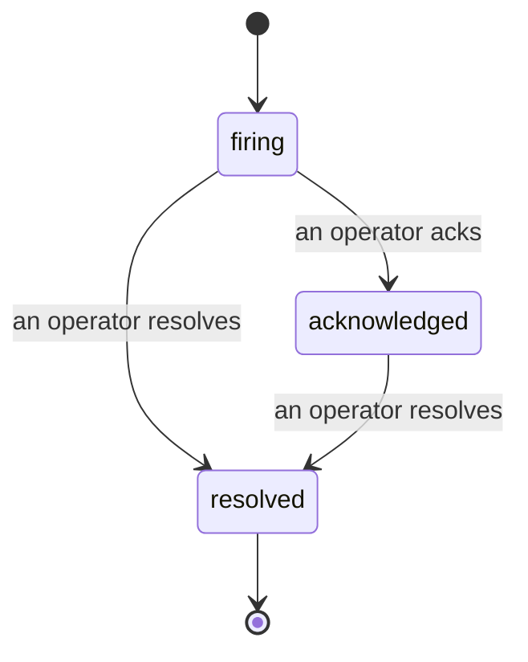

जब कोई अलर्ट फायर होता है, तो पहला सवाल हमेशा होता है "कौन इस पर है?" घटनाएं इसका जवाब देती हैं: जिस पल कुछ भी उल्लंघन करता है, सभी को दिखता है कि घटना खुली है, उसका मालिक कौन है, और अब तक बिल्कुल क्या हुआ है, एक स्वच्छ, जिम्मेदारी वाले रिकॉर्ड के साथ जिसे आप सीधे किसी पोस्ट-मॉर्टम को दे सकते हैं।

*इनबॉक्स खुली घटनाओं को स्थिति के अनुसार समूहित करता है और गंभीरता और असाइनी के अनुसार फ़िल्टर करता है, इसलिए आप देखते हैं कि मानव के हस्तक्षेप की क्या आवश्यकता है।*

## पहचानें कि किसके पास यह है, एक नज़र में

चैट थ्रेड में फिर से "क्या कोई इस पर देख रहा है?" न पूछें। एक उल्लंघन स्वचालित रूप से एक घटना खोलता है और इसे एक साझा इनबॉक्स में डालता है, जो स्थिति के अनुसार समूहित होता है। इसे स्वीकार करें और आपका नाम इस पर है, इसलिए बाकी टीम को पता है कि यह संभाला गया है। स्वीकृति साझा की जाती है: कई ऑपरेटर एक ही घटना को स्वीकार कर सकते हैं और प्रत्येक को अलग से रिकॉर्ड किया जाता है, इसलिए एक पूरा वॉर रूम नाम के अनुसार दिखता है बजाय एक दूसरे को धकेलने के। ट्रिएज के लिए एक मालिक असाइन करें, और इनबॉक्स को गंभीरता या असाइनी के अनुसार फ़िल्टर करें ताकि यह आपके लिए कम हो जाए।

## पूरी कहानी, एक टाइमलाइन में

जब घटना समाप्त हो जाती है, तो आपके पास पहले से ही रिपोर्ट है। कोई भी घटना खोलें और आपको उल्लंघन का सबूत, इसके असाइनी और सदस्य, समन्वय के लिए एक टिप्पणी थ्रेड, और एक केवल-अपेंड गतिविधि टाइमलाइन मिलता है।

*सब कुछ जो हुआ, क्रम में, प्रत्येक पंक्ति उस व्यक्ति द्वारा हस्ताक्षरित जिसने इसे किया।*

प्रत्येक कार्रवाई (खोला गया, स्वीकृत, समाधान किया गया, आदि) उस टाइमलाइन पर लिखी जाती है और कभी संपादित नहीं की जाती है। प्रत्येक प्रविष्टि को जिम्मेदार ठहराया जाता है: उस ऑपरेटर को जिसने इसे किया, ईमेल के द्वारा, या **स्वचालित** किसी भी चीज़ के लिए जो Failproof AI ने स्वयं की, जैसे कि उल्लंघन पर घटना खोलना। कुछ भी गुमनाम नहीं है और कुछ भी खो नहीं जाता है, इसलिए पोस्ट-मॉर्टम कम या ज्यादा खुद लिख लेता है।

## एक घटना कैसे आगे बढ़ती है

- **खुली (फायरिंग):** उल्लंघन घटना खोलता है और आपके चैनलों को एक बार पेज करता है। दोहराए गए उल्लंघन एक ही घटना में फोल्ड हो जाते हैं और इसके सबूत को रिफ्रेश करते हैं बजाय आपको बार-बार पेज करने के।
- **स्वीकृत:** एक ऑपरेटर इसे उठाता है। यह खुला रहता है, और बाद में उल्लंघन सबूत को शांति से अपडेट करते हैं।
- **समाधान किया गया:** एक ऑपरेटर इसे बंद कर देता है। स्वचालित समाधान जब स्थिति स्पष्ट होती है तो योजना बनाई जाती है लेकिन अभी तक सक्षम नहीं है, इसलिए एक घटना तब तक खुली रहती है जब तक कोई मानव इसे समाधान न कर दे, जो सभी को यह सच बताता है कि क्या वास्तव में स्पष्ट हुआ है। बाद में एक ही अलर्ट पर एक ताजी घटना खुल सकती है।

एक अलर्ट एक समय में सबसे अधिक एक खुली घटना रखता है, इसलिए एक फ्लैपिंग नियम आपको डुप्लिकेट से दबा नहीं सकता है। आप एक घटना को हाथ से भी खोल सकते हैं: कुछ ऐसी के लिए एक स्टैंडअलोन जो कोई अलर्ट नहीं पकड़ा, या किसी मौजूदा अलर्ट से जुड़ी हुई, यदि आपके पास `incidents:write` है।

## इसे कहाँ खोजें

घटनाएं `/<org-slug>/incidents` पर रहती हैं। देखने के लिए **`incidents:read`** की आवश्यकता है; एक मैन्युअली घटना खोलने के लिए **`incidents:write`** की आवश्यकता है; स्वीकार करने, असाइन करने, टिप्पणी करने, और समाधान करने के लिए **`incidents:ack`** की आवश्यकता है। पुरानी कुंजियां जिन्हें सेवानिवृत्त `alerts:ack` दी गई थी वह काम करती रहती हैं, क्योंकि इसे `incidents:ack` के रूप में सम्मानित किया जाता है, इसलिए आपके ऑन-कॉल रोटेशन को पुनः जारी करने की आवश्यकता नहीं है।

## संबंधित

- [अलर्ट](/hi/agenteye/alerts): वह नियम जो एक थ्रेसहोल्ड उल्लंघन होने पर ये घटनाएं खोलते हैं।
- [त्रुटि ट्रैकिंग](/hi/agenteye/error-tracking): एक जगह पर हर विफलता देखें और एक को अलर्ट में प्रचारित करें।
- [ऑडिट](/hi/agenteye/audits): निर्धारित विश्लेषक जो उन विफलताओं को खोजता है जिन्हें कोई नियम नहीं देख रहा था।