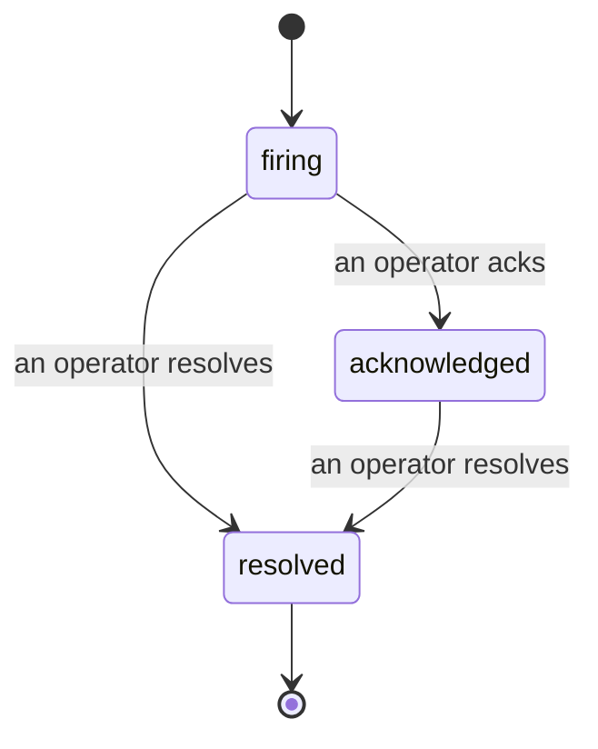

जब कोई अलर्ट ट्रिगर होता है, तो पहला सवाल हमेशा यही होता है "कौन इसे संभाल रहा है?" घटनाएं इसका जवाब देती हैं: जैसे ही कोई उल्लंघन होता है, सभी देख सकते हैं कि घटना खुली है, इसका मालिक कौन है, और अब तक बिल्कुल क्या हुआ है, एक साफ़, जिम्मेदार रिकॉर्ड के साथ जिसे आप सीधे पोस्ट-मॉर्टम को सौंप सकते हैं।

*इनबॉक्स खुली घटनाओं को स्थिति के अनुसार समूहीकृत करता है और गंभीरता और असाइनी के अनुसार फ़िल्टर करता है, ताकि आप देख सकें कि अभी किसी इंसान की जरूरत है।*

## एक नज़र में जानें कि किसके पास है

चैट थ्रेड में "क्या कोई इसे देख रहा है?" की बातचीत अब नहीं होगी। एक उल्लंघन स्वचालित रूप से एक घटना खोलता है और इसे एक साझा इनबॉक्स में डालता है, जो स्थिति के अनुसार समूहीकृत होता है। इसे स्वीकार करें और आपका नाम इस पर होगा, ताकि बाकी टीम जान सके कि इसे संभाला जा रहा है। स्वीकृति साझा है: कई ऑपरेटर एक ही घटना को स्वीकार कर सकते हैं और प्रत्येक अपने आप में दर्ज होता है, इसलिए एक पूरा वार डिब्बा नाम से दिखाई देता है, एक-दूसरे को ओवरराइट किए बिना। ट्रिएज के लिए एक मालिक असाइन करें, और इनबॉक्स को गंभीरता या असाइनी के अनुसार फ़िल्टर करें ताकि आप देख सकें कि क्या आपके पास है।

## पूरी कहानी, एक टाइमलाइन में

जब घटना समाप्त हो जाती है, तो आपके पास पहले से ही रिपोर्ट होती है। कोई भी घटना खोलें और आपको उल्लंघन का प्रमाण, इसके असाइनी और सदस्य, समन्वय के लिए एक टिप्पणी थ्रेड, और एक केवल-संलग्न गतिविधि टाइमलाइन मिलता है।

*जो कुछ हुआ, उसका क्रम में, प्रत्येक पंक्ति पर हस्ताक्षर वह व्यक्ति जिसने इसे किया।*

प्रत्येक क्रिया (खोला गया, स्वीकृत, समाधान किया गया, आदि) उस टाइमलाइन में लिखी जाती है और कभी संपादित नहीं की जाती है। प्रत्येक प्रविष्टि जिम्मेदार है: जिस ऑपरेटर ने इसे लिया था, ईमेल द्वारा, या **स्वचालित** के लिए कुछ भी जो Failproof AI Observability ने अपने आप किया था, जैसे उल्लंघन पर घटना खोलना। कुछ भी गुमनाम नहीं है और कुछ भी खो नहीं जाता है, इसलिए पोस्ट-मॉर्टम कम या ज्यादा अपने आप लिख जाता है।

## एक घटना कैसे आगे बढ़ती है

- **खुली (फायरिंग):** उल्लंघन घटना खोलता है और एक बार आपके चैनलों को सूचित करता है। दोहराए गए उल्लंघन एक ही घटना में गुना होते हैं और इसके बजाय अपने सबूत को ताज़ा करते हैं कि आपको बार-बार सूचित किया जाए।
- **स्वीकृत:** एक ऑपरेटर इसे उठाता है। यह खुली रहती है, और बाद में उल्लंघन सबूत को शांति से अपडेट करते हैं।
- **समाधान किया गया:** एक ऑपरेटर इसे बंद करता है। स्थिति साफ़ होने पर स्वचालित समाधान की योजना है लेकिन अभी सक्षम नहीं है, इसलिए एक घटना तब तक खुली रहती है जब तक कोई इंसान इसे समाधान नहीं करता, जो सभी को ईमानदार रखता है कि वास्तव में क्या साफ़ हुआ है। एक ताज़ी घटना बाद में एक ही अलर्ट पर खुल सकती है।

एक अलर्ट में एक बार में अधिकतम एक खुली घटना हो सकती है, इसलिए एक चलती हुई नियम आपको डुप्लिकेट से दफ़न नहीं कर सकती। आप हाथ से भी एक घटना खोल सकते हैं: कोई अलर्ट नहीं पकड़ी गई किसी चीज़ के लिए एक अलग, या एक मौजूदा अलर्ट से जुड़ी, यदि आपके पास `incidents:write` है।

## यह कहाँ मिलेगा

घटनाएं `/<org-slug>/incidents` पर रहती हैं। देखने के लिए **`incidents:read`** की आवश्यकता है; एक मैनुअल घटना खोलने के लिए **`incidents:write`** की आवश्यकता है; स्वीकार करने, असाइन करने, टिप्पणी करने, और समाधान करने के लिए **`incidents:ack`** की आवश्यकता है। पुरानी कुंजियों को `alerts:ack` को सेवानिवृत्त किया गया काम कर रहा है क्योंकि इसे `incidents:ack` के रूप में सम्मानित किया जाता है, इसलिए आपकी ऑन-कॉल रोटेशन को फिर से जारी नहीं करने की आवश्यकता नहीं है।

## संबंधित

- [अलर्ट](/hi/agenteye/alerts): नियम जो इन घटनाओं को खोलते हैं जब एक थ्रेशहोल्ड उल्लंघन होता है।
- [त्रुटि ट्रैकिंग](/hi/agenteye/error-tracking): हर विफलता को एक जगह देखें और एक को अलर्ट में बढ़ाएं।
- [ऑडिट](/hi/agenteye/audits): निर्धारित विश्लेषक जो विफलताओं को ढूंढता है जो कोई नियम नहीं देख रहा था।