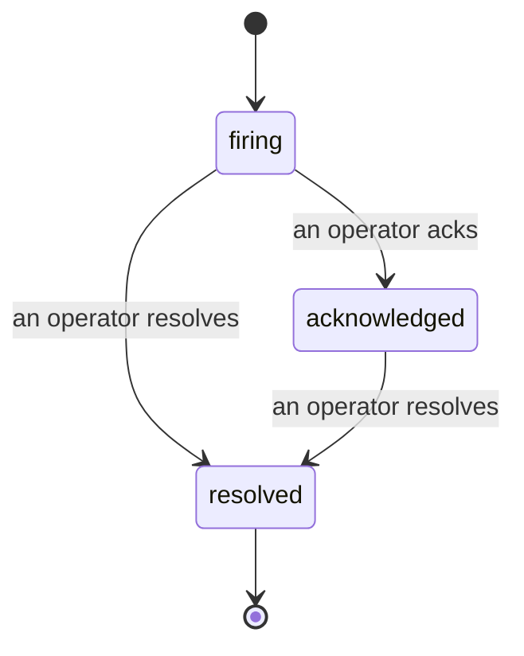

---
---
title: "इंसीडेंट्स"
description: "जब कोई अलर्ट ट्रिगर होता है, तो सभी देख सकते हैं कि इंसीडेंट खुला है, इसका मालिक कौन है, और अब तक क्या हुआ है — एक ही एट्रिब्यूटेड टाइमलाइन पर।"
---

जब अलर्ट ट्रिगर होता है, तो पहला सवाल हमेशा यह होता है "कौन इस पर काम कर रहा है?" इंसीडेंट्स इसका जवाब देते हैं: जिस क्षण कोई ब्रीच होता है, सभी देख सकते हैं कि इंसीडेंट खुला है, इसका मालिक कौन है, और अब तक बिल्कुल क्या हुआ है, साथ ही एक स्वच्छ, एट्रिब्यूटेड रिकॉर्ड जो आप सीधे पोस्ट-मॉर्टम को दे सकते हैं।

*इनबॉक्स खुले इंसीडेंट्स को स्टेट के अनुसार ग्रुप करता है और सेवेरिटी और असाइनी के आधार पर फ़िल्टर करता है, इसलिए आप देखते हैं कि किसे अभी मानवीय ध्यान की जरूरत है।*

## एक नज़र में जानें कि किसके पास है

चैट थ्रेड में "क्या कोई इस पर नज़र रख रहा है?" कहने की जरूरत नहीं। एक ब्रीच स्वचालित रूप से एक इंसीडेंट खोलता है और इसे एक साझा इनबॉक्स में डालता है, जो स्टेट के अनुसार ग्रुप किया गया है। इसे स्वीकार करें और आपका नाम इस पर होगा, इसलिए बाकी टीम जानती है कि इसे संभाला गया है। स्वीकृति साझा की गई है: कई ऑपरेटर्स एक ही इंसीडेंट को स्वीकार कर सकते हैं और प्रत्येक को अलग से रिकॉर्ड किया जाता है, इसलिए एक पूर्ण वॉर रूम नाम से दिखाई देता है, एक दूसरे को ओवरराइड करने के बजाय। ट्रिएज के लिए एक मालिक असाइन करें, और अपने लिए जो कुछ है उस तक सीमित करने के लिए इनबॉक्स को सेवेरिटी या असाइनी के आधार पर फ़िल्टर करें।

## पूरी कहानी, एक टाइमलाइन में

जब इंसीडेंट खत्म होता है, तो आपके पास पहले से ही राइट-अप होता है। कोई भी इंसीडेंट खोलें और आपको ब्रीच का सबूत, इसके असाइनी और सब्सक्राइबर्स, समन्वय के लिए एक कमेंट थ्रेड, और एक एपेंड-ओनली एक्टिविटी टाइमलाइन मिलता है।

*वह सब कुछ जो हुआ, क्रम में, प्रत्येक पंक्ति उस व्यक्ति द्वारा हस्ताक्षरित जिसने इसे किया।*

प्रत्येक एक्शन (खोला गया, स्वीकार किया गया, हल किया गया, आदि) उस टाइमलाइन में लिखा जाता है और कभी संपादित नहीं किया जाता है। प्रत्येक प्रविष्टि एट्रिब्यूटेड है: उस ऑपरेटर को जिसने इसे किया, ईमेल द्वारा, या **automated** के लिए कुछ भी जो Failproof AI Observability ने स्वयं किया, जैसे ब्रीच पर इंसीडेंट खोलना। कुछ भी गुमनाम नहीं है और कुछ भी खो नहीं है, इसलिए पोस्ट-मॉर्टम कमोबेश अपने आप लिख जाता है।

## एक इंसीडेंट कैसे चलता है

- **Open (firing):** ब्रीच इंसीडेंट को खोलता है और एक बार आपके चैनलों को पेज करता है। दोहराए गए ब्रीचेस एक ही इंसीडेंट में फोल्ड हो जाते हैं और इसके सबूत को रिफ्रेश करते हैं, न कि आपको बार-बार पेज करते हैं।
- **Acknowledged:** एक ऑपरेटर इसे लेता है। यह खुला रहता है, और बाद के ब्रीचेस साक्ष्य को शांति से अपडेट करते हैं।
- **Resolved:** एक ऑपरेटर इसे बंद करता है। जब स्थिति साफ़ हो जाती है तब स्वचालित समाधान की योजना है लेकिन अभी सक्षम नहीं है, इसलिए एक इंसीडेंट तब तक खुला रहता है जब तक कोई व्यक्ति इसे हल न करे, जो सभी को ईमानदार रहने के लिए मजबूर करता है कि वास्तव में क्या साफ़ हुआ है। एक ही अलर्ट पर बाद में एक नया इंसीडेंट खुल सकता है।

एक अलर्ट एक बार में अधिकतम एक खुला इंसीडेंट रखता है, इसलिए एक फ्लैपिंग नियम आपको डुप्लीकेट्स से दफ़न नहीं कर सकता। आप मैन्युअली भी एक इंसीडेंट खोल सकते हैं: कोई अलर्ट जो पकड़ा नहीं गया उसके लिए एक स्टैंडअलोन, या एक मौजूदा अलर्ट से जुड़ा हुआ, यदि आपके पास `incidents:write` है।

## इसे कहां खोजें

इंसीडेंट्स `/<org-slug>/incidents` पर रहते हैं। देखने के लिए **`incidents:read`** की जरूरत है; एक मैन्युअल इंसीडेंट खोलने के लिए **`incidents:write`** की जरूरत है; स्वीकार करने, असाइन करने, कमेंट करने, और हल करने के लिए **`incidents:ack`** की जरूरत है। पुरानी कुंजियाँ जिन्होंने सेवामुक्त `alerts:ack` को दी थी, काम करती रहती हैं, क्योंकि इसे `incidents:ack` के रूप में सम्मानित किया जाता है, इसलिए आपकी ऑन-कॉल रोटेशन को दोबारा जारी नहीं करना पड़ता।

## संबंधित

- [Alerts](/hi/agenteye/alerts): वह नियम जो इन इंसीडेंट्स को खोलते हैं जब एक थ्रेशहोल्ड का उल्लंघन होता है।
- [Error tracking](/hi/agenteye/error-tracking): एक जगह पर हर विफलता देखें और एक को अलर्ट में बढ़ाएं।
- [Audits](/hi/agenteye/audits): अनुसूचित विश्लेषक जो उन विफलताओं को ढूंढता है जो कोई नियम नहीं देख रहा था।