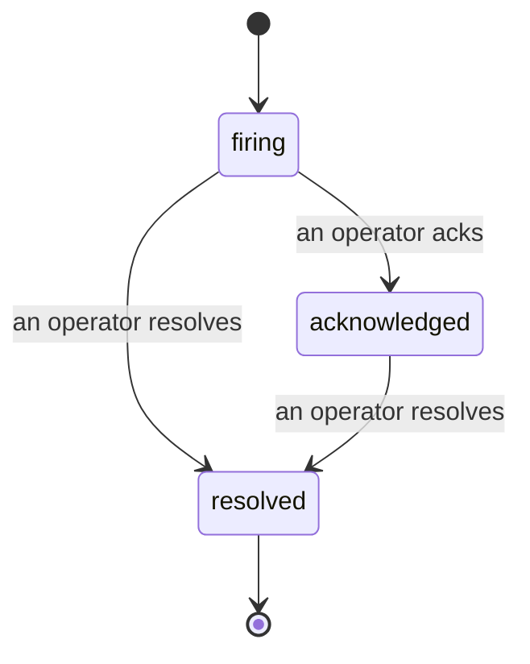

जब कोई अलर्ट फायर होता है, तो पहला सवाल हमेशा यही होता है "इस पर कौन काम कर रहा है?" इंसिडेंट्स इसका जवाब देते हैं: जैसे ही कोई ब्रीच होता है, सभी देख सकते हैं कि इंसिडेंट खुला है, उसका मालिक कौन है, और बिल्कुल क्या हुआ है, एक साफ, विशेषता प्राप्त रिकॉर्ड के साथ जिसे आप सीधे पोस्ट-मॉर्टम को दे सकते हैं।

*इनबॉक्स ओपन इंसिडेंट्स को स्टेट के अनुसार ग्रुप करता है और सेवेरिटी और असाइनी के अनुसार फिल्टर करता है, इसलिए आप देख सकते हैं कि अभी किसे मानवीय ध्यान की जरूरत है।*

## एक नजर में जानें कि इसे किसके पास है

अब चैट थ्रेड में "क्या कोई इसे देख रहा है?" नहीं। एक ब्रीच स्वचालित रूप से एक इंसिडेंट खोलता है और इसे एक साझा इनबॉक्स में डालता है, स्टेट के अनुसार ग्रुप किया गया। इसे स्वीकार करें और आपका नाम इस पर है, इसलिए बाकी की टीम को पता चल जाता है कि इसे संभाल लिया गया है। स्वीकृति साझा है: कई ऑपरेटर एक ही इंसिडेंट को स्वीकार कर सकते हैं और प्रत्येक को अलग से रिकॉर्ड किया जाता है, इसलिए एक पूरा वार कमरा नाम के साथ दिखाई देता है, एक दूसरे को ओवरराइड करने की बजाय। ट्रिएज के लिए एक मालिक असाइन करें, और इनबॉक्स को सेवेरिटी या असाइनी के अनुसार फिल्टर करें ताकि आप सिर्फ अपना देख सकें।

## पूरी कहानी, एक टाइमलाइन में

जब इंसिडेंट खत्म हो जाता है, तो आपके पास पहले से ही रिपोर्ट तैयार होती है। कोई भी इंसिडेंट खोलें और आपको ब्रीच का सबूत, इसके असाइनी और सब्सक्राइबर, समन्वय के लिए एक कमेंट थ्रेड, और एक अपेंड-ओनली एक्टिविटी टाइमलाइन मिलेगी।

*जो कुछ भी हुआ, क्रम में, प्रत्येक लाइन पर हस्ताक्षर जिसने इसे किया।*

हर क्रिया (खोला गया, स्वीकार किया गया, हल किया गया, आदि) उस टाइमलाइन में लिखी जाती है और कभी संपादित नहीं होती। हर प्रविष्टि विशेषता प्राप्त है: उस ऑपरेटर के लिए जिसने इसे लिया, ईमेल द्वारा, या **automated** के लिए Failproof AI द्वारा स्वयं की गई किसी भी चीज के लिए, जैसे ब्रीच पर इंसिडेंट खोलना। कुछ भी गुमनाम नहीं है और कुछ भी खो नहीं जाता है, इसलिए पोस्ट-मॉर्टम कमोबेश अपने आप लिख जाता है।

## एक इंसिडेंट कैसे आगे बढ़ता है

- **Open (firing):** ब्रीच इंसिडेंट खोलता है और आपके चैनलों को एक बार पेज करता है। दोहराए गए ब्रीच एक ही इंसिडेंट में फोल्ड हो जाते हैं और इसके सबूत को ताजा करते हैं, बजाय आपको बार-बार पेज करने के।
- **Acknowledged:** एक ऑपरेटर इसे उठाता है। यह खुला रहता है, और बाद के ब्रीच चुप्पी से सबूत को अपडेट करते हैं।
- **Resolved:** एक ऑपरेटर इसे बंद करता है। स्वचालित समाधान जब स्थिति साफ हो जाती है, वह योजनाबद्ध है लेकिन अभी सक्षम नहीं है, इसलिए एक इंसिडेंट तब तक खुला रहता है जब तक कोई इंसान इसे हल न कर दे, जो सभी को ईमानदार रखता है कि वास्तव में क्या साफ हो गया है। एक ही अलर्ट पर बाद में एक नया इंसिडेंट खुल सकता है।

एक अलर्ट एक बार में सबसे अधिक एक ओपन इंसिडेंट रखता है, इसलिए एक फ्लैपिंग नियम आपको डुप्लिकेट में दफन नहीं कर सकता। आप हाथ से भी एक इंसिडेंट खोल सकते हैं: कुछ के लिए एक स्टैंडअलोन जो कोई अलर्ट नहीं पकड़ा, या एक मौजूदा अलर्ट से जुड़ा हुआ, यदि आपके पास `incidents:write` है।

## यह कहां मिलेगा

इंसिडेंट्स `/<org-slug>/incidents` पर रहते हैं। देखने के लिए **`incidents:read`** की जरूरत है; मैनुअल इंसिडेंट खोलने के लिए **`incidents:write`** की जरूरत है; स्वीकार करना, असाइन करना, कमेंट करना, और हल करना **`incidents:ack`** की जरूरत है। पुरानी कुंजियां जिन्होंने सेवानिवृत्त `alerts:ack` दिया है, काम करती रहती हैं, क्योंकि इसे `incidents:ack` के रूप में मान्यता दी जाती है, इसलिए आपकी ऑन-कॉल रोटेशन को फिर से जारी करने की जरूरत नहीं है।

## संबंधित

- [Alerts](/hi/agenteye/alerts): वे नियम जो इन इंसिडेंट्स को खोलते हैं जब कोई थ्रेशोल्ड ब्रीच होता है।
- [Error tracking](/hi/agenteye/error-tracking): एक जगह पर हर विफलता देखें और एक को अलर्ट में बढ़ाएं।
- [Audits](/hi/agenteye/audits): अनुसूचित विश्लेषक जो उन विफलताओं को खोजता है जिन्हें कोई नियम नहीं देख रहा था।