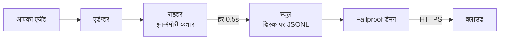

एक एजेंट के लिए जिसे आपने स्वयं लिखा है, या एक फ्रेमवर्क जिसके लिए Failproof AI के पास कोई एडेप्टर नहीं है। इंस्ट्रूमेंट करने के लिए कुछ नहीं है: आप ईवेंट उत्सर्जित करते हैं।

यह वही API है जिसे चारों फ्रेमवर्क एडेप्टर अंदर से कॉल करते हैं। वे इसके ऊपर अनुवाद तालिकाएं हैं।

## इंस्टॉल करें

```bash
pip install failproofai-sdk
```

कोई अतिरिक्त नहीं, और कोई निर्भरता नहीं।

## इंस्ट्रूमेंट करें

```python
import failproofai_sdk

failproofai_sdk.configure(environment="production")

with failproofai_sdk.session():                 # एक रन
    with failproofai_sdk.agent("planner"):      # काम की एक यूनिट
        with failproofai_sdk.tool_call("search", input={"q": q}) as t:
            t.output = search(q)                # एक टूल कॉल
```

इसे ऊपर से नीचे पढ़ें और यह कहता है कि इसका मतलब क्या है:

| इसे लपेटें | कहने के लिए |
| --- | --- |
| `session()` | ये ईवेंट एक ही रन से संबंधित हैं |
| `agent()` | कुछ काम कर रहा है — इसे एक नाम दें जिसे आप सूची में पहचान सकें |
| `tool_call()` | यह एक टूल है, और यहां यह क्या लौटाया है |

और प्रत्येक वास्तव में क्या उत्सर्जित करता है:

| स्कोप | उत्सर्जन | उद्देश्य |
| --- | --- | --- |
| `session()` | कुछ नहीं | एक सेशन id बांधता है, एक रन को समूहीकृत करता है |
| `agent()` | `agent_start`, `agent_end` | काम की एक यूनिट को ब्रैकेट करता है |
| `tool_call()` | `tool_use`, `tool_result` | एक टूल को ब्रैकेट करता है और इसे मापता है |

अंदर सब कुछ `session_id` और `agent_id` को छोड़ सकता है। स्कोप संदर्भ चर पर पहचान बांधते हैं और हर ईवेंट कॉल इसे वापस पढ़ता है, इसलिए आप अपने फ़ंक्शन के माध्यम से कभी id का धागा नहीं डालते।

तीनों `async with` और `with` दोनों के तहत काम करते हैं।

एजेंट को नेस्ट करने से पेड़ बनता है। `parent_id` और गहराई को स्टैक से गणना की जाती है:

```python
with failproofai_sdk.session():
    with failproofai_sdk.agent("supervisor"):
        with failproofai_sdk.agent("researcher"):    # parent_id = "supervisor"
            ...
```

## एक स्कोप कैसे बंद होता है

`agent()` आपके लिए अपवाद संभालता है:

| क्या हुआ | ईवेंट | परिणाम |
| --- | --- | --- |
| कुछ नहीं उठा | `agent_end` | `success` |
| `Exception` | `error`, फिर `agent_end` | `failed` |
| `KeyboardInterrupt`, `SystemExit` | `error`, फिर `agent_end` | `failed` |
| `CancelledError`, `GeneratorExit` | केवल `agent_end` | `cancelled` |

त्रुटि `agent_end` से पहले उत्सर्जित होती है, क्योंकि डैशबोर्ड `agent_end` पर स्पान को बंद करता है और इसके बाद कुछ भी कुछ भी में जिम्मेदार नहीं है। एक रद्दीकरण एक विफलता नहीं है, इसलिए रद्द किए गए रन त्रुटि सतह को प्रदूषित नहीं करते। अपवाद हमेशा फिर से उठाया जाता है: एक स्कोप कभी निगल नहीं लेता।

## ईवेंट विधियां

छह परिवारों में पंद्रह विधियां। अधिकतर जोड़े में आते हैं — आप ओपनर उत्सर्जित करते हैं, फिर क्लोजर, और SDK उनके बीच का स्पान मापता है।

| परिवार | खुलता है | बंद होता है | स्टैंडअलोन |
| --- | --- | --- | --- |
| **एजेंट** | `agent_start` | `agent_end` | — |
| | `agent_pause` | `agent_resume` | — |
| **मॉडल** | `model_request` | `model_response` | — |
| **टूल** | `tool_use` | `tool_result` | — |
| **हुक** | `hook_triggered` | `hook_completed` | — |
| **मनुष्य** | `human_wait` | `human_input` | `human_pause`, `human_interrupt` |
| **विफलताएं** | — | — | `error` |

<Tip>
  स्कोप को प्राथमिकता दें — `agent()` और `tool_call()` — जहां वे फिट हों। वे बंद होने वाली ईवेंट की गारंटी देते हैं यहां तक कि जब बॉडी उठे। इन विधियों को सीधे तब पकड़ें जब आपका नियंत्रण प्रवाह नेस्ट न हो, जैसे कि एक हेल्पर के अंदर एक मॉडल कॉल।
</Tip>

<CodeGroup>
```python एजेंट
failproofai_sdk.event.agent_start(agent_id="planner", goal="find the cheapest flight")
failproofai_sdk.event.agent_end(agent_id="planner", outcome="success", summary="...")
failproofai_sdk.event.agent_pause(pause_id="p1", reason="awaiting approval")
failproofai_sdk.event.agent_resume(pause_id="p1")
```

```python मॉडल
failproofai_sdk.event.model_request(
    model="gpt-4o-mini",
    messages=[{"role": "user", "content": "..."}],
    request_id="req-1",
)
failproofai_sdk.event.model_response(
    model="gpt-4o-mini",
    content="...",
    input_tokens=139,
    output_tokens=21,
    request_id="req-1",
    duration_ms=5202,
)
```

```python टूल
failproofai_sdk.event.tool_use(tool_name="search", tool_call_id="c1", input={"q": "..."})
failproofai_sdk.event.tool_result(tool_name="search", tool_call_id="c1", output="...")
```

```python हुक
failproofai_sdk.event.hook_triggered(hook_name="retrieve", hook_id="h1", trigger_event="node")
failproofai_sdk.event.hook_completed(hook_name="retrieve", hook_id="h1", outcome="success")
```

```python मनुष्य
failproofai_sdk.event.human_wait(input_id="i1", prompt="Approve?", options=["yes", "no"])
failproofai_sdk.event.human_input(input_id="i1", response="yes")
failproofai_sdk.event.human_pause(reason="operator paused the run", user_id="dana")
failproofai_sdk.event.human_interrupt(reason="operator stopped the run", at_step="step_3")
```

```python विफलताएं
failproofai_sdk.event.error(
    error_type="TimeoutError",
    message="provider timed out after 30s",
    traceback="...",
)
```
</CodeGroup>

<Note>
  **दो मानव परिवार विपरीत दिशा में इंगित करते हैं।**

  | विधियां | अर्थ |
  | --- | --- |
  | `human_wait` / `human_input` | **एजेंट ने एक व्यक्ति से पूछा** — एक अनुमोदन गेट, एक स्पष्ट प्रश्न |
  | `human_pause` / `human_interrupt` | **किसी व्यक्ति ने एजेंट पर कार्य किया** — एक स्टॉप बटन, एक ऑपरेटर पॉज़ |

  कोई फ्रेमवर्क दूसरी जोड़ी का संकेत नहीं देता, इसलिए यह हमेशा आपकी है कि उत्सर्जन करें।
</Note>

<Warning>
  **जब मॉडल कॉल समवर्ती रूप से चलते हैं तो `request_id` पास करें।** इसके बिना, अनुरोध और प्रतिक्रियाएं प्रति एजेंट आगमन क्रम में जोड़ी होती हैं — और समवर्ती कॉल गलत जोड़ी बनाते हैं, प्रत्येक प्रतिक्रिया को गलत अनुरोध से जोड़ते हैं।
</Warning>

## उदाहरण

OpenAI API के विरुद्ध एक टूल-कॉलिंग लूप, कोई एजेंट फ्रेमवर्क के बिना:

```python
import json

import failproofai_sdk
from openai import OpenAI

failproofai_sdk.configure(environment="production")
client = OpenAI()
MODEL = "gpt-4o-mini"


def turn(messages: list):
    """एक मॉडल कॉल, जोड़ी द्वारा ब्रैकेट किया गया।"""
    failproofai_sdk.event.model_request(model=MODEL, messages=messages)
    reply = client.chat.completions.create(model=MODEL, messages=messages, tools=TOOLS)
    usage = reply.usage
    failproofai_sdk.event.model_response(
        model=MODEL,
        content=reply.choices[0].message.content or "",
        input_tokens=usage.prompt_tokens,
        output_tokens=usage.completion_tokens,
    )
    return reply.choices[0].message


with failproofai_sdk.session():
    with failproofai_sdk.agent("inventory", goal="price report"):
        for _ in range(4):          # सीमाबद्ध; एक असीमित एजेंट लूप इसका अपना बग है
            message = turn(messages)
            if not message.tool_calls:
                break
            messages.append(message.model_dump(exclude_none=True))
            for call in message.tool_calls:
                args = json.loads(call.function.arguments or "{}")
                with failproofai_sdk.tool_call(
                    call.function.name, tool_call_id=call.id, input=args
                ) as handle:
                    handle.output = run_tool(call.function.name, args)
                messages.append({
                    "role": "tool",
                    "tool_call_id": call.id,
                    "content": str(handle.output),
                })
```

यह छह ईवेंट प्रकार का उत्पादन करता है जो एक एडेप्टर आपको देगा। पूर्ण चलने योग्य संस्करण, टूल परिभाषाओं के साथ, SDK रिपोजिटरी में `docs/manual/examples/` के तहत शिप होता है।

## थ्रेड्स और async

संदर्भ चर asyncio कार्यों में स्वचालित रूप से प्रसारित होते हैं। वे नए थ्रेड में प्रसारित नहीं होते, क्योंकि एक थ्रेड एक खाली संदर्भ के साथ शुरू होता है।

```python
# asyncio: कुछ भी नहीं करना है
async with failproofai_sdk.session():
    await asyncio.gather(worker(1), worker(2))

# थ्रेड्स: कॉलेबल को लपेटें
pool.submit(failproofai_sdk.propagate(work), x)
threading.Thread(target=failproofai_sdk.propagate(work)).start()
loop.run_in_executor(None, failproofai_sdk.propagate(work), x)
```

`propagate()` के बिना, वर्कर की ईवेंट एक `TypeError` उठाती हैं जो सुधार का नाम देते हैं बजाय किसी सेशन पर उतरने के। यह जानबूझकर है: कोई सेशन के साथ एक ईवेंट को ingest द्वारा छोड़ दिया जाता है और `200` उत्तर दिया जाता है, जो मूक विफलता है जिसे पहचान परत रोकने के लिए मौजूद है।

## एडेप्टर के बिना एक फ्रेमवर्क इंस्ट्रूमेंट करें

हर एजेंट फ्रेमवर्क आपको एक ही तीन सीम देता है। उन्हें मैप करें और आपके पास एक पूर्ण ट्रेस है — चारों शिप किए गए एडेप्टर इससे अधिक कुछ नहीं करते।

| सीम | आप क्या लिखते हैं | क्या उतरता है |
| --- | --- | --- |
| रन | `session()` + `agent()` | `agent_start`, `agent_end` |
| प्रत्येक टूल | `tool_call()` | `tool_use`, `tool_result` |
| प्रत्येक मॉडल कॉल | `model_*` जोड़ी | `model_request`, `model_response` |

<Steps>
  <Step title="रन को ब्रैकेट करें">
    ```python
    with failproofai_sdk.session():
        with failproofai_sdk.agent(agent_name, goal=task):
            result = framework.run(task)
    ```
  </Step>
  <Step title="प्रत्येक टूल को ब्रैकेट करें">
    जो कुछ भी फ्रेमवर्क एक टूल रैपर या मिडलवेयर कहता है उसमें।

    ```python
    with failproofai_sdk.tool_call(name, input=args) as call:
        call.output = original(**args)
    ```
  </Step>
  <Step title="प्रत्येक मॉडल कॉल को जोड़ी करें">
    ```python
    failproofai_sdk.event.model_request(model=model, messages=messages)
    reply = provider.complete(...)
    failproofai_sdk.event.model_response(
        model=model,
        content=text,
        input_tokens=usage.prompt_tokens,
        output_tokens=usage.completion_tokens,
    )
    ```
  </Step>
</Steps>

<Tip>
  **एक नोड, स्टेप या मिडलवेयर सीमा देखने योग्य है?** इसे एक हुक जोड़ी में लपेटें — `hook_triggered` / `hook_completed` — एक नेस्ट किए गए `agent()` में नहीं। `agent_id` कम-कार्डिनलिटी पहलू है, और प्रति नोड एक प्रविष्टि इसे डुबो देती है। हुक स्पान एक ही तरह से प्रस्तुत होते हैं और आपको प्रति-नोड विलंबता देते हैं।
</Tip>

<Note>
  **मैनुअल और स्वचालित मिश्रित होते हैं।** एक एडेप्टर एक हाथ से लिखे गए स्कोप के अंदर चल रहा है उस सेशन से जुड़ता है और उस एजेंट का माता-पिता बनता है, इसलिए आपको एक पेड़ मिलता है दो के बजाय — उपयोगी जब आप एक फ्रेमवर्क को स्वयं एक समर्थित के साथ इंस्ट्रूमेंट करते हैं।
</Note>

<Accordion title="AutoGen एडेप्टर क्यों नहीं है">
  दो कारण, और ऊपर दिए गए तीन सीम दोनों का उत्तर हैं:

  - `autogen-core` सितंबर 2025 के बाद से अरक्षित है।
  - AG2 अन्य फ्रेमवर्क के हुक के समकक्ष कोई प्रक्रिया-व्यापी पंजीकरण बिंदु नहीं उजागर करता है, इसलिए इसे इंस्ट्रूमेंट करने का अर्थ हर निर्माण साइट पर हर एजेंट को लपेटना है।

  सीम को हाथ से मैप करना एक ही ईवेंट को एक ही निष्ठा पर रिकॉर्ड करता है जो एक शिप किया गया एडेप्टर होगा।
</Accordion>

## गहराई में जाना

रिकॉर्डिंग वास्तव में कैसे काम करती है। शुरुआत करने के लिए इसमें से कोई भी आवश्यक नहीं है।

<AccordionGroup>

<Accordion title="एक रिकॉर्डिंग क्या दिखती है, प्रति फ्रेमवर्क" icon="eye">

हर रिकॉर्डिंग का एक ही आकार है: एक स्पान खुलता है, काम इसके अंदर नेस्ट होता है, और हर ओपनिंग ईवेंट को एक क्लोजिंग ईवेंट मिलता है।


**जोड़ी** यूनिट है। प्रत्येक क्लोजिंग ईवेंट एक अवधि ले जाता है जो SDK इसके ओपनिंग वाले से मापता है।

नीचे एक वास्तविक रन प्रति फ्रेमवर्क है — SDK के साथ शिप किए गए उदाहरणों से कैप्चर किया गया, मॉडल नाम सामान्यीकृत। ध्यान दें कि एक एकल कॉल से कितना वापस आता है।

<Tabs>
  <Tab title="LangGraph">
    ```text 14 ईवेंट
     1  +0.000s  agent_start       LangGraph
     2  +0.001s    hook_triggered  agent
     3  +0.002s      model_request   gpt-4o-mini
     4  +3.023s      model_response  gpt-4o-mini · 21 आउट-टोक
     5  +3.024s    hook_completed  agent
     6  +3.024s    hook_triggered  tools
     7  +3.025s      tool_use      word_count
     8  +3.025s      tool_result   word_count · ok
     9  +3.025s    hook_completed  tools
    10  +3.026s    hook_triggered  agent
    11  +3.027s      model_request   gpt-4o-mini
    12  +5.717s      model_response  gpt-4o-mini · 5 आउट-टोक
    13  +5.720s    hook_completed  agent
    14  +5.721s  agent_end         LangGraph · success
    ```

    नोड्स हुक जोड़ी बन जाते हैं, इसलिए आप प्रति-नोड विलंबता प्राप्त करते हैं बिना उन्हें एजेंट सूची में भीड़ किए।
  </Tab>

  <Tab title="CrewAI">
    ```text 10 ईवेंट
     1  +0.000s  agent_start       crew
     2  +0.050s    agent_start     analyst · crew के तहत
     3  +0.057s      model_request   gpt-4o-mini
     4  +3.475s      model_response  gpt-4o-mini · 19 आउट-टोक
     5  +3.478s      tool_use      lookup_metric
     6  +3.478s      tool_result   lookup_metric · ok
     7  +3.486s      model_request   gpt-4o-mini
     8  +5.694s      model_response  gpt-4o-mini · 9 आउट-टोक
     9  +5.727s    agent_end       analyst · success
    10  +5.739s  agent_end         crew · success
    ```

    प्रत्येक एजेंट का `role` इसका स्पान नाम बनता है, इसलिए विलंबता और टोकन खर्च प्रति भूमिका में विभाजित होते हैं।
  </Tab>

  <Tab title="LlamaIndex">
    ```text 26 ईवेंट
     1  +0.000s  agent_start       Agent
     2  +0.001s    hook_triggered  init_run
     4  +0.501s    hook_triggered  setup_agent
     6  +0.503s    hook_triggered  run_agent_step
     7  +0.505s      model_request   gpt-4o-mini
     8  +3.083s      model_response  gpt-4o-mini · 18 आउट-टोक
    10  +3.197s    hook_triggered  parse_agent_output
    12  +3.355s    hook_triggered  call_tool
    13  +3.355s      tool_use      city_population
    14  +3.355s      tool_result   city_population · ok
    16  +3.356s    hook_triggered  aggregate_tool_results
       ...                        दूसरा पुनरावृत्ति
    26  +7.038s  agent_end         Agent · success
    ```

    एजेंट लूप स्वयं दृश्यमान है, केवल इसके मॉडल कॉल नहीं।
  </Tab>

  <Tab title="Pydantic AI">
    ```text 8 ईवेंट
    1  +0.000s  agent_start       agent
    2  +0.001s    model_request   gpt-4o-mini
    3  +4.413s    model_response  gpt-4o-mini · 17 आउट-टोक
    4  +4.415s    tool_use        population
    5  +4.415s    tool_result     population · ok
    6  +4.416s    model_request   gpt-4o-mini
    7  +8.118s    model_response  gpt-4o-mini · 6 आउट-टोक
    8  +8.119s  agent_end         agent · success
    ```

    कोई हुक जोड़ी नहीं: Pydantic AI के पास कोई नोड या स्टेप सीमा नहीं है कि ब्रैकेट करने के लिए।
  </Tab>

  <Tab title="कस्टम एजेंट">
    ```text 6 ईवेंट
    1  +0.000s  agent_start       main
    2  +0.000s    tool_use        population
    3  +0.000s    tool_result     population · ok
    4  +0.000s    model_request   gpt-4o-mini
    5  +0.000s    model_response  gpt-4o-mini · 3 आउट-टोक
    6  +0.000s  agent_end         main · success
    ```

    आप स्वयं इन्हें उत्सर्जित करते हैं। एक ही ईवेंट प्रकार, एक ही निष्ठा — इसका मतलब कॉल साइट है।
  </Tab>
</Tabs>

</Accordion>

<Accordion title="एक सेशन कैसे शुरू और समाप्त होता है" icon="circle-play">

**कोई सेशन-अंत ईवेंट नहीं है।** एक सेशन कुछ ऐसा नहीं है जिसे आप बंद करते हैं — यह एक `session_id` साझा करने वाली ईवेंट का एक समूह है।

स्थिति ट्रेस के आकार से प्राप्त की जाती है:

| स्थिति | कब |
| --- | --- |
| `ongoing` | कम से कम एक स्पान अभी भी खुला है |
| `paused` | एक `agent_pause` का कोई मिलान `agent_resume` नहीं है |
| `error` | कुछ नहीं खुला है, और कम से कम एक ईवेंट विफल रहा |
| `done` | कुछ नहीं खुला है, और कुछ भी विफल नहीं रहा |

तो एक सेशन तब समाप्त होता है जब हर जोड़ी बंद हो जाती है। एडेप्टर आपके लिए `agent_end` उत्सर्जित करते हैं, और टियरडाउन पर वे कुछ भी अभी भी खुला बंद करते हैं और इसे अधूरा चिह्नित करते हैं — एक क्रैश किया गया रन `done` बैठता है एक दृश्यमान अंतराल के साथ बजाय हैंगिंग के।

<Note>
  यह है कि एक सेशन दो कॉल पर फैल सकता है। एक LangGraph `interrupt()` रन को रोकता है, रूट स्पान जानबूझकर खुला रहता है, और पुनरारंभ करने वाली कॉल इसे बंद करती है। दोनों कॉल एक सेशन हैं।
</Note>

</Accordion>

<Accordion title="पहचान: session_id, agent_id, और कौन उन्हें बनाता है" icon="fingerprint">

`session_id` और `agent_id` हर ईवेंट विधि पर वैकल्पिक हैं। छोड़ा गया, वे एनक्लोजिंग स्कोप से समाधान करते हैं:

```python
with failproofai_sdk.session():
    with failproofai_sdk.agent("planner"):
        failproofai_sdk.event.tool_use(tool_name="search", tool_call_id="c1")
```

उन्हें स्पष्ट रूप से पास करने से अभी भी काम करता है और प्राथमिकता लेता है। कुछ भी बांधा नहीं और कुछ भी पारित नहीं, कॉल एक `TypeError` उठाता है जो सुधार का नाम देता है बजाय कोई सेशन के साथ एक ईवेंट उत्सर्जित करने के, जिसे ingest `200` का उत्तर देते हुए छोड़ देगा।

स्कोप संदर्भ चर पर पहचान बांधते हैं। वे asyncio कार्यों में स्वचालित रूप से प्रसारित होते हैं लेकिन नए थ्रेड में नहीं — `failproofai_sdk.propagate()` में एक वर्कर लपेटें।

#### कौन कौन सी id बनाता है

| Id | द्वारा बनाई गई | नोट्स |
| --- | --- | --- |
| `session_id` | आप, या SDK | `session("chat-42")` को शब्दशः उपयोग किया जाता है; छोड़ा गया, SDK एक `uuid4().hex` उत्पन्न करता है |
| `agent_id` | आप, या फ्रेमवर्क | `agent("analyst")` से, एक CrewAI `role`, एक `FunctionAgent.name` से। UUID जैसा मान अस्वीकार और प्रतिस्थापित है |
| `tool_call_id`, `hook_id`, `request_id` | आप, या फ्रेमवर्क | एडेप्टर फ्रेमवर्क के अपने रन id को पुनः उपयोग करते हैं, जिसके कारण जोड़ी थ्रेड हॉप के बाद जीवित रहती हैं |
| **ईवेंट id** | **क्लाउड, ingest पर** | SDK कोई उत्सर्जित नहीं करता है |
| **`dedup_key`** | **क्लाउड, ingest पर** | Org, सेशन, टाइमस्टैम्प, प्रकार और पेलोड का एक हैश। यह असली पहचान है — यह एक पुनः प्रयास की गई बैच को डुप्लिकेट करने के बजाय ढहा देता है |

#### एडेप्टर `session_id` कैसे समाधान करते हैं

पहला मैच जीता:

1. एक स्पष्ट `session_id` विकल्प
2. प्रति-कॉल मेटाडेटा
3. एनक्लोजिंग `session()` स्कोप
4. फ्रेमवर्क मेटाडेटा
5. फ्रेमवर्क का अपना रन id

इसे कभी आविष्कार नहीं किया जाता है जबकि इनमें से एक मौजूद है — एक संश्लेषित id एक रन को कई सेशन में विभाजित करेगा।

#### `agent_id` को कम कार्डिनलिटी रखें

यह हर डैशबोर्ड सतह पर प्राथमिक पहलू है, और एक `LowCardinality(String)` कॉलम। एक प्रति-रन मान कॉलम को खराब करता है और फ़िल्टर ड्रॉपडाउन को प्रति रन एक प्रविष्टि से भरता है।

एडेप्टर उस कॉलम की रक्षा करते हैं:

| फ्रेमवर्क सौंपता है | रिकॉर्ड किया गया | क्यों |
| --- | --- | --- |
| `3f9a1c2b-…` (एक UUID) | `main` | कुछ पठनीय नहीं रखने के लिए |
| एक लंबी नंगी हेक्स स्ट्रिंग | `main` | वही |
| `agent-3f9a1c2b-…` | `agent` | प्रति-रन id छीन लिया गया, पठनीय भाग रखा गया |
| `agent-v2` | `agent-v2` | छोटे सेगमेंट अकेले छोड़ दिए जाते हैं |
| `step-3` | `step-3` | वही |

असली id `fw_agent_id` / `fw_run_id` पर रखा जाता है, जहां यह एक पहलू बने बिना पूछताछ योग्य रहता है।

<Warning>
  **यह गार्ड केवल *फ्रेमवर्क* द्वारा चुने गए लेबल को छूता है।** एक `agent_id` जिसे आप स्वयं पास करते हैं — `event.*`, या `failproofai_sdk.agent(...)` के लिए — ठीक जैसे दिया गया रिकॉर्ड किया जाता है। एक स्पष्ट तर्क को मूक रूप से फिर से लिखना उस कार्डिनलिटी से बदतर होगा जिसे यह रोकता है, इसलिए अपने स्वयं के स्पान का नाम तदनुसार रखें।
</Warning>

</Accordion>

<Accordion title="ईवेंट प्रकार, समूहीकृत — और कौन सा फ्रेमवर्क क्या रिकॉर्ड करता है" icon="table">

| समूह | ईवेंट |
| --- | --- |
| एजेंट | `agent_start`, `agent_end`, `agent_pause`, `agent_resume` |
| मॉडल | `model_request`, `model_response` |
| टूल | `tool_use`, `tool_result` |
| हुक | `hook_triggered`, `hook_completed` |
| मनुष्य | `human_wait`, `human_input`, `human_pause`, `human_interrupt` |
| विफलताएं | `error` |

कौन सा फ्रेमवर्क क्या रिकॉर्ड करता है, ऊपर से रन से मापा गया:

| ईवेंट | LangGraph | CrewAI | LlamaIndex | Pydantic AI | कस्टम |
| --- | :--: | :--: | :--: | :--: | :--: |
| एजेंट शुरु और अंत | हां | हां | हां | हां | आप |
| मॉडल अनुरोध और प्रतिक्रिया | हां | हां | हां | हां | आप |
| टूल उपयोग और परिणाम | हां | हां | हां | हां | आप |
| हुक ट्रिगर और पूर्ण | नोड | कार्य | स्टेप | — | आप |
| त्रुटि | हां | हां | हां | हां | स्वचालित |
| मानव प्रतीक्षा और इनपुट | हां | हां | हां | — | आप |
| एजेंट पॉज़ और पुनरारंभ | हां | हां | हां | — | आप |

एक डैश का मतलब फ्रेमवर्क के पास कोई ऐसी अवधारणा नहीं है। `human_pause` और `human_interrupt` एक *व्यक्ति* द्वारा एजेंट पर कार्य करने का वर्णन करते हैं, जिसका कोई फ्रेमवर्क संकेत नहीं देता — स्वयं उत्सर्जन करें।

</Accordion>

<Accordion title="जोड़ी, सहसंबंध और अवधि" icon="link">

एक ईवेंट कभी अकेले नहीं आता। एक स्पान खुलता है, एक बंद होता है, और क्लोजिंग ईवेंट एक अवधि ले जाता है जो SDK इसके ओपनिंग वाले से मापता है।

| खुलता है | बंद होता है | क्लोजिंग ईवेंट ले जाता है |
| --- | --- | --- |
| `agent_start` | `agent_end` | `outcome`, `summary` |
| `model_request` | `model_response` | टोकन, `stop_reason`, विलंबता |
| `tool_use` | `tool_result` | `output` या `error`, अवधि |
| `hook_triggered` | `hook_completed` | `outcome`, अवधि |
| `agent_pause` | `agent_resume` | पॉज़ कितने समय तक चला |
| `human_wait` | `human_input` | उत्तर, और व्यक्ति को कितना समय लगा |

<Warning>
  कोई क्लोजिंग के साथ एक ओपनिंग ईवेंट कभी खत्म नहीं होने वाला एक स्पान है। सेशन हमेशा चल रहे के रूप में प्रस्तुत होता है, हमेशा के लिए, और इसकी सक्रिय अवधि बढ़ती रहती है। यह वह विफलता मोड है जिसे हाथ से इंस्ट्रूमेंट करते समय देखने के लिए है।
</Warning>

#### सहसंबंध नियम

- मिलान पूर्णता ईवेंट के लिए एक ही `tool_call_id`, `hook_id`, `pause_id`, या `input_id` का पुनः उपयोग करें।
- SDK `tool_result`, `hook_completed`, `agent_resume`, और `human_input` के लिए `duration_ms` की गणना करता है। इसे उन विधियों में पास करने से `ValueError` उठता है।
- `duration_ms` **स्वीकार किया जाता है** `model_response` पर, क्योंकि केवल कॉलर असली प्रदाता विलंबता जानता है। यह एक पूर्णांक होना चाहिए — एक फ्लोट कॉल साइट पर `ValueError` उठाता है, क्योंकि सर्वर कॉलम को एक अहस्ताक्षरित 32-बिट पूर्णांक के रूप में पढ़ता है और कुछ और के लिए NULL संग्रहीत करेगा।
- सहसंबंध कुंजियां तरह और सेशन द्वारा स्कोप की जाती हैं, इसलिए एक टूल कॉल और एक हुक सुरक्षित रूप से एक id साझा कर सकते हैं, और दो समवर्ती सेशन टकराए बिना समान id का पुनः उपयोग कर सकते हैं। वे एजेंट द्वारा स्कोप नहीं किए जाते हैं: एक जोड़ी एक एजेंट के तहत खुली और दूसरे के तहत बंद अभी भी सहसंबंधित होती है, जो बहु-एजेंट फ्रेमवर्क में सामान्य मामला है।
- `request_id` `model_request` को `model_response` के साथ जोड़ी करता है। इसके बिना, मॉडल ईवेंट प्रति एजेंट क्रम में जोड़ी होती हैं, इसलिए समवर्ती कॉल गलत जोड़ी बनाती हैं।
- प्रक्रियाओं में विभाजित एक जोड़ी अभी भी डाउनस्ट्रीम में सहसंबंधित होती है, लेकिन SDK इसकी प्रक्रिया में-अवधि की गणना नहीं कर सकता है।
- लंबित मानचित्र अधिकतम 10,000 स्टार्ट पकड़ता है और पूर्ण होने पर सबसे पुरानी प्रविष्टि को निष्कासित करता है।

</Accordion>

<Accordion title="पैकेज में क्या है, और यह कैसे आपका फ्रेमवर्क खोजता है instrument()" icon="box">

`failproofai-sdk` इंस्टॉल करने से सब कुछ इंस्टॉल होता है, सभी चार एडेप्टर शामिल हैं। अतिरिक्त एडेप्टर नहीं, **फ्रेमवर्क** खींचते हैं।

```python
import failproofai_sdk        # मानक पुस्तकालय के बाहर कुछ भी लोड नहीं करता है
failproofai_sdk.instrument()  # केवल एडेप्टर आयात करता है जिसकी आपको वास्तव में आवश्यकता है
```

`import failproofai_sdk` अनुबंध शून्य-निर्भरता है, एक परीक्षण द्वारा प्रवर्तित जो निर्मित व्हील को `--no-deps` के साथ इंस्टॉल करता है और एक और जो साबित करता है कि कोई फ्रेमवर्क `sys.modules` तक नहीं पहुंचता है।

<Warning>
  कोई `failproofai_sdk.crewai` विशेषता नहीं है। एडेप्टर जानबूझकर शीर्ष-स्तरीय पैकेज पर प्रदर्शित नहीं होते हैं: एक को छूना एक विशेषता पहुंच के दुष्प्रभाव के रूप में फ्रेमवर्क आयात करेगा, शून्य-निर्भरता प्रतिश्रुति को तोड़ते हुए। `instrument()` का उपयोग करें।
</Warning>

```python
failproofai_sdk.instrument()              # हर फ्रेमवर्क पहले से ही आयात किया गया है
failproofai_sdk.instrument("crewai")      # बिल्कुल एक, नाम से
failproofai_sdk.uninstrument("crewai")    # इसे वापस रखो
```

| नाम | यह भी स्वीकार करता है |
| --- | --- |
| `langchain` | `langgraph`, `langchain_core` |
| `crewai` | — |
| `llama_index` | `llamaindex`, `llama-index` |
| `pydantic_ai` | `pydantic-ai`, `pydanticai` |

ऑटो-डिटेक्शन `sys.modules` को पढ़ता है, न कि इंस्टॉल किए गए पैकेज सूची को, इसलिए एक फ्रेमवर्क जिसे आपने इंस्टॉल किया है लेकिन कभी आयात नहीं किया वह इंस्ट्रूमेंट नहीं है और आपकी ओर से कभी आयात नहीं किया जाता है। यह देखने के लिए कि क्या वायर्ड है:

```python
from failproofai_sdk.integrations import active, available

available()   # ('crewai', 'langchain', 'llama_index', 'pydantic_ai')
active()      # ('langchain',)
```

<Note>
  **बिना CrewAI वाली मशीन पर `instrument("crewai")` नहीं उठाता।** यह एक चेतावनी लॉग करता है और `()` लौटाता है, इसलिए एक लापता फ्रेमवर्क कभी एक प्रक्रिया को नीचे नहीं लाता है जो अन्य को भी इंस्ट्रूमेंट करता है।

  चेतावनी अंतर्निहित `ImportError` ले जाती है, और वह संदेश सटीक install कमांड का नाम देता है — इसलिए सुधार आपके लॉग में है, छिपा नहीं।

  ```text
  ImportError: failproofai_sdk: cannot instrument 'crewai' because 'crewai.events'
  is not importable. Install it with:  pip install 'failproofai_sdk[crewai]'
  ```

  इसके बजाय उठाने के लिए `FAILPROOFAI_SDK_STRICT=1` सेट करें। वह झंडा **एक बार पढ़ा जाता है और कैश किया जाता है**, इसलिए मध्य-रन सेट करने के बजाय अपनी प्रक्रिया शुरू होने से पहले निर्यात करें।
</Note>

<Warning>
  **`instrument()` *आपके फ्रेमवर्क आयात के बाद* आना चाहिए।** ऑटो-डिटेक्शन `sys.modules` को पढ़ता है, इसलिए आयात के ऊपर एक नंगा कॉल कुछ भी नहीं खोजता है, कुछ भी इंस्टॉल नहीं करता है, और `()` लौटाता है।
</Warning>

<CodeGroup>
```python गलत
import failproofai_sdk
failproofai_sdk.instrument()   # sys.modules के पास अभी तक कोई langchain नहीं है -> ()

import langchain               # बहुत देर हो गई, कुछ भी वायर्ड नहीं है
```

```python सही
import langchain               # पहले फ्रेमवर्क आयात करें
import failproofai_sdk

failproofai_sdk.instrument()   # इसे खोजता है -> ('langchain',)
```

```python सही, क्रम-प्रूफ
import failproofai_sdk

# इसका नाम देने से एडेप्टर अनुरोध पर आयात होता है, इसलिए यह कहीं से भी काम करता है।
failproofai_sdk.instrument("langchain")
```
</CodeGroup>

यह गलत प्राप्त करें और प्रक्रिया SDK आयातित, एडेप्टर स्पष्ट रूप से इंस्टॉल, और **कोई भी ईवेंट उत्सर्जित नहीं** के साथ चलता है। यह एक चेतावनी लॉग करता है जो बिल्कुल ऐसा कहता है — इसलिए एक रन रिकॉर्ड नहीं करते समय पहले अपने लॉग जांचें।

</Accordion>

<Accordion title="ईवेंट कैसे क्लाउड तक पहुंचते हैं" icon="cloud-upload">



| चरण | काम | में चलता है |
| --- | --- | --- |
| एडेप्टर | एक फ्रेमवर्क कॉलबैक को 15 ईवेंट प्रकारों में से एक में अनुवाद करता है | आपकी प्रक्रिया |
| राइटर | कतार, बैच, JSONL परमाणु रूप से लिखता है | आपकी प्रक्रिया, पृष्ठभूमि थ्रेड |
| स्पूल | टिकाऊ हस्तांतरण, आपकी प्रक्रिया से बचता है | स्थानीय डिस्क |
| डेमन | स्पूल देखता है, बैच भेजता है, जो भेजा गया है उसे हटाता है | आपकी मशीन |
| Ingest | एक पंक्ति id और dedup कुंजी असाइन करता है, पूछताछ योग्य कॉलम को बढ़ावा देता है | क्लाउड |

स्पूल वह है जो इसे सुरक्षित बनाता है: आपका एजेंट कभी नेटवर्क पर ब्लॉक नहीं होता है, और एक क्लाउड आउटेज एक बढ़ती डायरेक्टरी का मतलब है खोई हुई ईवेंट के बजाय।

प्रत्येक फ्लश एक बैच फाइल लिखता है, पहले `.tmp`, फिर `fsync`, फिर एक परमाणु नाम बदलना:

```text
~/.failproofai/custom-agents/events/
  event-2026-08-20T10-15-00-123Z-48213-0.jsonl
```

डेमन केवल `.jsonl` उठाता है, इसलिए यह कभी आधी-लिखी गई फाइल नहीं पढ़ सकता। स्टेम एक टाइमस्टैम्प, प्रक्रिया id और अनुक्रम संख्या ले जाता है, इसलिए दो प्रक्रियाएं एक ही मिलीसेकंड में फ्लश करना संघर्ष नहीं कर सकती हैं। कतार 10,000 ईवेंट पर capped है; इसके बाद यह सबसे पुरानी को बंद करता है और लॉग करता है।

<Warning>
  **`collector.redact` आपकी SDK ईवेंट पर लागू नहीं होता है।** यह कभी उन्हें नहीं देखता है।
</Warning>

डेमन आपकी बैच **भेजता है**। वह उन्हें खोलता या फिर से लिखता नहीं है।

| ईवेंट | द्वारा लिखा गया | `collector.redact` से संरक्षित? |
| --- | --- | --- |
| CLI सेशन प्रतिलेख | डेमन | हां |
| हुक गतिविधि | डेमन | हां |
| **SDK जो कुछ भी उत्सर्जित करता है** | **आपकी प्रक्रिया** | **नहीं** |

संपादन जहां डेमन अपनी स्वयं की ईवेंट **लिखता है** — जहां बैच **भेजे जाते हैं** नहीं। इसलिए एक प्रॉम्प्ट या एक टूल तर्क जिसमें एक API कुंजी होती है अभी भी आगमन पर रखती है।

यह जानबूझकर है। ये आपके स्वयं के इंस्ट्रूमेंटेशन कॉल हैं, और पारगमन में उन्हें फिर से लिखने का अर्थ होगा कि आप जो ईवेंट प्राप्त करते हैं वे ईवेंट नहीं हैं जो आपने उत्सर्जित किए हैं।

<Tip>
  **आप स्रोत पर पेलोड को नियंत्रित करते हैं, दो जगहों में:**

  - एडेप्टर पर सामग्री कैप्चर बंद करें। **विकल्प नाम भिन्न होता है, और एक एडेप्टर के पास कोई नहीं है** — यह एक एकल सार्वभौमिक स्विच नहीं है:
    - LangChain / LangGraph, Pydantic AI — `capture_content=False`
    - LlamaIndex — `capture_messages=False`
    - CrewAI — **कोई सामग्री स्विच नहीं**; `session_id` एकमात्र विकल्प है यह पढ़ता है, इसलिए प्रॉम्प्ट और पूर्ति हमेशा रिकॉर्ड किए जाते हैं।

    `instrument()` एडेप्टर द्वारा पढ़ी जाने वाली विकल्प को छोड़ता है, इसलिए गलत नाम पास करने से कुछ नहीं उठाया जाता है और कुछ भी नहीं बदलता है।
  - पहली जगह में रहस्य को `input=` को हाथ न सौंपें।

  `collector.redact` किसी के लिए विकल्प नहीं है।
</Tip>

<Warning>
  **एक खाली स्पूल डायरेक्टरी स्वस्थ स्थिति है।** इसे डिलीवरी की जांच करने के लिए न बनाएं।
</Warning>

डेमन इसे भेजने के मिलीसेकंड के भीतर प्रत्येक बैच को हटा देता है, इसलिए एक `ls` रेस एकत्रकर्ता और आपने जो उत्सर्जित किया उसका एक अंश दिखाता है — एक SDK से अप्रभेद्य जो कुछ भी रिकॉर्ड नहीं करता है।

ईवेंट वास्तव में उतरे हैं यह पुष्टि करने के लिए, डैशबोर्ड की जांच करें। स्पूल को भरते हुए देखने के लिए, पहले डेमन को रोकें।

</Accordion>

<Accordion title="जब इंस्ट्रूमेंटेशन विफल हो" icon="triangle-alert">

हर कॉलबैक एक रैपर के अंदर चलता है जिसका एकमात्र काम पुनः उठाना है, इसलिए आपकी कॉल ठीक एक `try` में बैठता है और सब कुछ SDK करता है इसके बाहर होता है।

| क्या होता है | परिणाम |
| --- | --- |
| एक हुक उठाता है | अपने ट्रेसबैक के साथ एक बार लॉग किया गया। आपकी कॉल अप्रभावित है |
| एक ही हुक तीन बार उठाता है | वह एक हुक बाकी के लिए अक्षम हो जाता है, एक त्रुटि पंक्ति के साथ |
| `FAILPROOFAI_SDK_STRICT=1` सेट है | अपवाद के बजाय फिर से उठाया जाता है |
| एक फ्रेमवर्क संस्करण परीक्षित सीमा के बाहर है | एक बार चेतावनी, किसी भी तरह इंस्ट्रूमेंट |
| एक एकल क्षमता लापता है | वह एक हुक अक्षम है, संपूर्ण एडेप्टर कभी नहीं |

डिफ़ॉल्ट उत्पादन में सही है और डीबग करते समय गलत है, क्योंकि यह केवल यह साबित कर सकता है कि यह क्रैश नहीं हुआ। डीबग करते समय इसे जोर देने के लिए `FAILPROOFAI_SDK_STRICT=1` सेट करें।

</Accordion>

</AccordionGroup>

## सामान्य समस्याएं

<AccordionGroup>
  <Accordion title="एक स्पान कभी खत्म नहीं होता">
    एक ओपनिंग ईवेंट का कोई क्लोजिंग नहीं है: एक `model_request` के बिना `model_response`, या एक `tool_use` के बिना `tool_result`। स्कोप का उपयोग करें, जो शरीर उठाए जाने पर भी जोड़ी की गारंटी देते हैं। यदि आप ईवेंट विधियों को सीधे कॉल करते हैं, तो `try` और `finally` का उपयोग करें।
  </Accordion>

  <Accordion title="duration_ms पास करने से ValueError उठाता है">
    यह मिलान ओपनिंग ईवेंट से मापा जाता है, इसलिए यह `tool_result`, `hook_completed`, `agent_resume`, और `human_input` पर अस्वीकार किया जाता है। यह `model_response` पर स्वीकार किया जाता है, क्योंकि केवल आप असली प्रदाता विलंबता जानते हैं, और यह एक पूर्णांक होना चाहिए।
  </Accordion>

  <Accordion title="वर्कर थ्रेड से ईवेंट TypeError उठाते हैं">
    थ्रेड ने कभी संदर्भ को विरासत में नहीं दिया। कॉलेबल को `failproofai_sdk.propagate()` में लपेटें। [थ्रेड्स और async](#threads-and-async) देखें।
  </Accordion>

  <Accordion title="एक अतिरिक्त फील्ड गायब हो गई या कुछ अधिलेखित">
    अतिरिक्त फील्ड आखिरी में मर्ज होते हैं, इसलिए `model` या `outcome` जैसे वास्तविक फील्ड का नाम इसे अधिलेखित करेगा और एक संग्रहीत कॉलम बदल देगा। अपना नामस्थान; एडेप्टर एक `fw_` उपसर्ग का उपयोग करते हैं।
  </Accordion>

  <Accordion title="एजेंट फ़िल्टर के हजार प्रविष्टियां हैं">
    `agent_id` कम-कार्डिनलिटी पहलू है और आपने एक रन id में डाल दिया। एक भूमिका या नोड नाम का उपयोग करें और असली id को एक पेलोड फील्ड में डालें।
  </Accordion>
</AccordionGroup>

## अगला

<Columns cols={3}>
  <Card title="यह कैसे काम करता है" icon="workflow" href="/hi/reference/custom-agents">
    जोड़ी, id, सेशन जीवनचक्र, और डिलीवरी।
  </Card>
  <Card title="एक ट्रेस पढ़ें" icon="route" href="/hi/sessions/read-a-trace">
    आपके द्वारा अभी कैप्चर किए गए सेशन के माध्यम से कारणात्मकता का पालन करें।
  </Card>
  <Card title="फ्रेमवर्क एडेप्टर" icon="plug" href="/hi/start/integrations">
    LangGraph, CrewAI, LlamaIndex, और Pydantic AI।
  </Card>
</Columns>