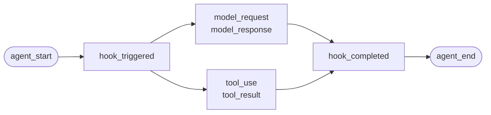
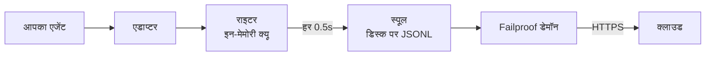

एजेंट जो आपने अपने आप लिखा हो, या कोई ऐसा फ्रेमवर्क जिसके लिए Failproof AI के पास एडाप्टर नहीं है। इंस्ट्रूमेंट करने के लिए कुछ नहीं है: आप ही इवेंट्स को एमिट करते हैं।

यह वही API है जिसे चारों फ्रेमवर्क एडाप्टर अंदर से कॉल करते हैं। वे इसके ऊपर ट्रांसलेशन टेबल हैं।

## इंस्टॉल करें

```bash
pip install failproofai-sdk
```

कोई एक्सट्रास नहीं, और कोई डिपेंडेंसीज नहीं।

## इंस्ट्रूमेंट करें

```python
import failproofai_sdk

failproofai_sdk.configure(environment="production")

with failproofai_sdk.session():                 # एक रन
    with failproofai_sdk.agent("planner"):      # काम की एक यूनिट
        with failproofai_sdk.tool_call("search", input={"q": q}) as t:
            t.output = search(q)                # एक टूल कॉल
```

इसे ऊपर से नीचे पढ़ें और यह कहता है कि इसका क्या मतलब है:

| इसमें रखें | यह कहने के लिए |
| --- | --- |
| `session()` | ये इवेंट्स एक ही रन से संबंधित हैं |
| `agent()` | कोई काम कर रहा है — इसे एक नाम दें जिसे आप किसी लिस्ट में पहचान सकें |
| `tool_call()` | यह एक टूल है, और इसने यह वापस किया |

और हर एक वास्तव में क्या एमिट करता है:

| स्कोप | एमिट करता है | उद्देश्य |
| --- | --- | --- |
| `session()` | कुछ नहीं | एक सेशन आईडी को बांधता है, एक रन को ग्रुप करता है |
| `agent()` | `agent_start`, `agent_end` | काम की एक यूनिट को ब्रैकेट करता है |
| `tool_call()` | `tool_use`, `tool_result` | एक टूल को ब्रैकेट करता है और इसे मापता है |

इसके अंदर कुछ भी `session_id` और `agent_id` को छोड़ सकता है। स्कोप्स कॉन्टेक्स्ट वेरिएबल्स पर आइडेंटिटी को बांधते हैं और हर इवेंट कॉल इसे वापस पढ़ता है, इसलिए आप कभी आईडीज को अपने फंक्शन्स के माध्यम से थ्रेड नहीं करते।

तीनों `with` के साथ-साथ `async with` के तहत भी काम करते हैं।

एजेंट्स को नेस्ट करना ट्री बनाता है। `parent_id` और डेप्थ को स्टैक से कंप्यूट किया जाता है:

```python
with failproofai_sdk.session():
    with failproofai_sdk.agent("supervisor"):
        with failproofai_sdk.agent("researcher"):    # parent_id = "supervisor"
            ...
```

## एक स्कोप कैसे बंद होता है

`agent()` आपके लिए एक्सेप्शन्स को हैंडल करता है:

| क्या हुआ | इवेंट्स | परिणाम |
| --- | --- | --- |
| कुछ नहीं उठा | `agent_end` | `success` |
| `Exception` | `error`, फिर `agent_end` | `failed` |
| `KeyboardInterrupt`, `SystemExit` | `error`, फिर `agent_end` | `failed` |
| `CancelledError`, `GeneratorExit` | केवल `agent_end` | `cancelled` |

एरर को `agent_end` से पहले एमिट किया जाता है, क्योंकि डैशबोर्ड `agent_end` पर स्पैन को बंद करता है और इसके बाद कुछ भी कुछ नहीं के लिए एट्रिब्यूट किया जाता है। कैंसलेशन एक विफलता नहीं है, इसलिए कैंसल किए गए रन एरर्स सर्फेस को प्रदूषित नहीं करते। एक्सेप्शन को हमेशा फिर से उठाया जाता है: एक स्कोप कभी निगल नहीं जाता।

## इवेंट मेथड्स

छः परिवारों में पंद्रह मेथड्स। अधिकांश जोड़े में आते हैं — आप ओपनर को एमिट करते हैं, फिर क्लोजर को, और SDK उनके बीच के स्पैन को मापता है।

| परिवार | खोलता है | बंद करता है | स्टैंडअलोन |
| --- | --- | --- | --- |
| **एजेंट्स** | `agent_start` | `agent_end` | — |
| | `agent_pause` | `agent_resume` | — |
| **मॉडल्स** | `model_request` | `model_response` | — |
| **टूल्स** | `tool_use` | `tool_result` | — |
| **हुक्स** | `hook_triggered` | `hook_completed` | — |
| **ह्यूमन्स** | `human_wait` | `human_input` | `human_pause`, `human_interrupt` |
| **विफलताएं** | — | — | `error` |

<Tip>
  स्कोप्स को प्राथमिकता दें — `agent()` और `tool_call()` — जहां कहीं वे फिट हों। वे क्लोजिंग इवेंट को गारंटी देते हैं भले ही बॉडी उठे। इन मेथड्स को सीधे तब तक के लिए रीच करें जब तक आपके कंट्रोल फ्लो नेस्ट न हों, जैसे किसी हेल्पर के अंदर एक मॉडल कॉल।
</Tip>

<CodeGroup>
```python एजेंट्स
failproofai_sdk.event.agent_start(agent_id="planner", goal="find the cheapest flight")
failproofai_sdk.event.agent_end(agent_id="planner", outcome="success", summary="...")
failproofai_sdk.event.agent_pause(pause_id="p1", reason="awaiting approval")
failproofai_sdk.event.agent_resume(pause_id="p1")
```

```python मॉडल्स
failproofai_sdk.event.model_request(
    model="gpt-4o-mini",
    messages=[{"role": "user", "content": "..."}],
    request_id="req-1",
)
failproofai_sdk.event.model_response(
    model="gpt-4o-mini",
    content="...",
    input_tokens=139,
    output_tokens=21,
    request_id="req-1",
    duration_ms=5202,
)
```

```python टूल्स
failproofai_sdk.event.tool_use(tool_name="search", tool_call_id="c1", input={"q": "..."})
failproofai_sdk.event.tool_result(tool_name="search", tool_call_id="c1", output="...")
```

```python हुक्स
failproofai_sdk.event.hook_triggered(hook_name="retrieve", hook_id="h1", trigger_event="node")
failproofai_sdk.event.hook_completed(hook_name="retrieve", hook_id="h1", outcome="success")
```

```python ह्यूमन्स
failproofai_sdk.event.human_wait(input_id="i1", prompt="Approve?", options=["yes", "no"])
failproofai_sdk.event.human_input(input_id="i1", response="yes")
failproofai_sdk.event.human_pause(reason="operator paused the run", user_id="dana")
failproofai_sdk.event.human_interrupt(reason="operator stopped the run", at_step="step_3")
```

```python विफलताएं
failproofai_sdk.event.error(
    error_type="TimeoutError",
    message="provider timed out after 30s",
    traceback="...",
)
```
</CodeGroup>

<Note>
  **दोनों ह्यूमन परिवार विपरीत दिशाओं में इशारा करते हैं।**

  | मेथड्स | मतलब |
  | --- | --- |
  | `human_wait` / `human_input` | **एजेंट ने किसी व्यक्ति से पूछा** — एक अनुमोदन गेट, एक स्पष्टीकरण प्रश्न |
  | `human_pause` / `human_interrupt` | **किसी व्यक्ति ने एजेंट पर काम किया** — एक स्टॉप बटन, एक ऑपरेटर पॉज़ |

  कोई भी फ्रेमवर्क दूसरी जोड़ी को सिग्नल नहीं करता, इसलिए यह हमेशा आपका है।
</Note>

<Warning>
  **जब मॉडल कॉल्स एक साथ चलते हैं तो `request_id` पास करें।** इसके बिना, रिक्वेस्ट्स और रिस्पांसेस प्रति एजेंट एरिवल ऑर्डर में जोड़े जाते हैं — और एक साथ कॉल्स मिस्पेयर होते हैं, हर रिस्पांस को गलत रिक्वेस्ट से जोड़ते हैं।
</Warning>

## उदाहरण

OpenAI API के खिलाफ एक टूल-कॉलिंग लूप, कोई एजेंट फ्रेमवर्क के बिना:

```python
import json

import failproofai_sdk
from openai import OpenAI

failproofai_sdk.configure(environment="production")
client = OpenAI()
MODEL = "gpt-4o-mini"


def turn(messages: list):
    """एक मॉडल कॉल, जोड़ी द्वारा ब्रैकेट किया गया।"""
    failproofai_sdk.event.model_request(model=MODEL, messages=messages)
    reply = client.chat.completions.create(model=MODEL, messages=messages, tools=TOOLS)
    usage = reply.usage
    failproofai_sdk.event.model_response(
        model=MODEL,
        content=reply.choices[0].message.content or "",
        input_tokens=usage.prompt_tokens,
        output_tokens=usage.completion_tokens,
    )
    return reply.choices[0].message


with failproofai_sdk.session():
    with failproofai_sdk.agent("inventory", goal="price report"):
        for _ in range(4):          # bounded; an unbounded agent loop is its own bug
            message = turn(messages)
            if not message.tool_calls:
                break
            messages.append(message.model_dump(exclude_none=True))
            for call in message.tool_calls:
                args = json.loads(call.function.arguments or "{}")
                with failproofai_sdk.tool_call(
                    call.function.name, tool_call_id=call.id, input=args
                ) as handle:
                    handle.output = run_tool(call.function.name, args)
                messages.append({
                    "role": "tool",
                    "tool_call_id": call.id,
                    "content": str(handle.output),
                })
```

यह छः इवेंट टाइप्स को प्रोड्यूस करता है जो एक एडाप्टर आपको देगा। संपूर्ण रनेबल वर्जन, टूल डेफिनिशन्स के साथ, SDK रिपॉजिटरी में `docs/manual/examples/` के तहत शिप होता है।

## थ्रेड्स और async

कॉन्टेक्स्ट वेरिएबल्स asyncio टास्क्स में स्वचालित रूप से प्रोपेगेट होते हैं। वे नए थ्रेड्स में प्रोपेगेट नहीं होते, क्योंकि एक थ्रेड खाली कॉन्टेक्स्ट के साथ शुरू होता है।

```python
# asyncio: कुछ नहीं करना है
async with failproofai_sdk.session():
    await asyncio.gather(worker(1), worker(2))

# threads: कॉलेबल को रैप करें
pool.submit(failproofai_sdk.propagate(work), x)
threading.Thread(target=failproofai_sdk.propagate(work)).start()
loop.run_in_executor(None, failproofai_sdk.propagate(work), x)
```

`propagate()` के बिना, वर्कर की इवेंट्स एक `TypeError` को उठाती हैं जो फिक्स को नाम देता है उसके बजाय कि कोई सेशन न हो। यह जानबूझकर है: कोई इवेंट कोई सेशन के साथ इनजेस्ट द्वारा स्किप किया जाता है और `200` का जवाब दिया जाता है, जो साइलेंट विफलता है जो आइडेंटिटी लेयर मौजूद होने के लिए है।

## एक फ्रेमवर्क को इंस्ट्रूमेंट करें जिसके पास एडाप्टर नहीं है

हर एजेंट फ्रेमवर्क आपको तीन समान सीम देता है। उन्हें मैप करें और आपके पास एक संपूर्ण ट्रेस है — चारों शिप किए गए एडाप्टर इससे ज्यादा कुछ नहीं करते।

| सीम | आप क्या लिखते हैं | क्या लैंड होता है |
| --- | --- | --- |
| रन | `session()` + `agent()` | `agent_start`, `agent_end` |
| हर टूल | `tool_call()` | `tool_use`, `tool_result` |
| हर मॉडल कॉल | `model_*` जोड़ी | `model_request`, `model_response` |

<Steps>
  <Step title="रन को ब्रैकेट करें">
    ```python
    with failproofai_sdk.session():
        with failproofai_sdk.agent(agent_name, goal=task):
            result = framework.run(task)
    ```
  </Step>
  <Step title="हर टूल को ब्रैकेट करें">
    जो कुछ भी फ्रेमवर्क एक टूल रैपर या मिडलवेयर कहता है।

    ```python
    with failproofai_sdk.tool_call(name, input=args) as call:
        call.output = original(**args)
    ```
  </Step>
  <Step title="हर मॉडल कॉल को जोड़ी करें">
    ```python
    failproofai_sdk.event.model_request(model=model, messages=messages)
    reply = provider.complete(...)
    failproofai_sdk.event.model_response(
        model=model,
        content=text,
        input_tokens=usage.prompt_tokens,
        output_tokens=usage.completion_tokens,
    )
    ```
  </Step>
</Steps>

<Tip>
  **क्या आपके पास कोई नोड, स्टेप या मिडलवेयर बाउंड्री है जो देखने लायक है?** इसे एक हुक जोड़ी में रैप करें — `hook_triggered` / `hook_completed` — एक नेस्टेड `agent()` नहीं। `agent_id` एक लो-कार्डिनैलिटी फैसेट है, और प्रति नोड एक प्रविष्टि इसे डूब देती है। हुक स्पैन्स एक जैसे रेंडर होते हैं और आपको प्रति-नोड लेटेंसी देते हैं।
</Tip>

<Note>
  **मैनुअल और ऑटोमैटिक कम्पोज़ होते हैं।** एक एडाप्टर एक हाथ से लिखे गए स्कोप के अंदर चलता है जो उस सेशन को जॉइन करता है और उस एजेंट को पेरेंट करता है, इसलिए आप एक ट्री प्राप्त करते हैं न कि दो — उपयोगी जब आप एक फ्रेमवर्क को अपने आप से इंस्ट्रूमेंट करते हैं किसी समर्थित के साथ।
</Note>

<Accordion title="AutoGen एडाप्टर क्यों नहीं है">
  दो कारण हैं, और उपरोक्त तीन सीम दोनों के लिए जवाब हैं:

  - `autogen-core` सितंबर 2025 के बाद से अनमेन्टेन्ड है।
  - AG2 कोई प्रोसेस-वाइड रजिस्ट्रेशन पॉइंट नहीं देता है अन्य फ्रेमवर्क्स के हुक्स के बराबर, इसलिए इसे इंस्ट्रूमेंट करने का मतलब हर निर्माण साइट पर हर एजेंट को रैप करना है।

  सीम्स को हाथ से मैप करना वही इवेंट्स रिकॉर्ड करता है, एक शिप किए गए एडाप्टर की तरह ही फिडेलिटी पर।
</Accordion>

## गहराई में जाएं

रिकॉर्डिंग वास्तव में कैसे काम करती है। शुरुआत करने के लिए इसमें से कोई भी जरूरी नहीं है।

<AccordionGroup>

<Accordion title="एक रिकॉर्डिंग क्या दिखती है, प्रति फ्रेमवर्क" icon="eye">

हर रिकॉर्डिंग का एक जैसा आकार है: एक स्पैन खुलता है, काम इसके अंदर नेस्ट होता है, और हर ओपनिंग इवेंट को क्लोजिंग इवेंट मिलता है।



**जोड़ी** यूनिट है। हर क्लोजिंग इवेंट एक डेशन लेकर आती है जिसे SDK इसके ओपनिंग वन से मापता है।

नीचे एक रियल रन प्रति फ्रेमवर्क है — SDK के साथ शिप किए गए उदाहरणों से कैप्चर किया गया, मॉडल नाम नॉर्मलाइज़्ड। ध्यान दें कि एक एकल कॉल से कितना वापस आता है।

<Tabs>
  <Tab title="LangGraph">
    ```text 14 events
     1  +0.000s  agent_start       LangGraph
     2  +0.001s    hook_triggered  agent
     3  +0.002s      model_request   gpt-4o-mini
     4  +3.023s      model_response  gpt-4o-mini · 21 out-tok
     5  +3.024s    hook_completed  agent
     6  +3.024s    hook_triggered  tools
     7  +3.025s      tool_use      word_count
     8  +3.025s      tool_result   word_count · ok
     9  +3.025s    hook_completed  tools
    10  +3.026s    hook_triggered  agent
    11  +3.027s      model_request   gpt-4o-mini
    12  +5.717s      model_response  gpt-4o-mini · 5 out-tok
    13  +5.720s    hook_completed  agent
    14  +5.721s  agent_end         LangGraph · success
    ```

    नोड्स हुक जोड़े बन जाते हैं, इसलिए आप प्रति-नोड लेटेंसी प्राप्त करते हैं बिना इसके कि वे एजेंट लिस्ट को भीड़ में ले जाएं।
  </Tab>

  <Tab title="CrewAI">
    ```text 10 events
     1  +0.000s  agent_start       crew
     2  +0.050s    agent_start     analyst · under crew
     3  +0.057s      model_request   gpt-4o-mini
     4  +3.475s      model_response  gpt-4o-mini · 19 out-tok
     5  +3.478s      tool_use      lookup_metric
     6  +3.478s      tool_result   lookup_metric · ok
     7  +3.486s      model_request   gpt-4o-mini
     8  +5.694s      model_response  gpt-4o-mini · 9 out-tok
     9  +5.727s    agent_end       analyst · success
    10  +5.739s  agent_end         crew · success
    ```

    हर एजेंट की `role` इसका स्पैन नाम बन जाती है, इसलिए लेटेंसी और टोकन स्पेंड प्रति रोल को तोड़ते हैं।
  </Tab>

  <Tab title="LlamaIndex">
    ```text 26 events
     1  +0.000s  agent_start       Agent
     2  +0.001s    hook_triggered  init_run
     4  +0.501s    hook_triggered  setup_agent
     6  +0.503s    hook_triggered  run_agent_step
     7  +0.505s      model_request   gpt-4o-mini
     8  +3.083s      model_response  gpt-4o-mini · 18 out-tok
    10  +3.197s    hook_triggered  parse_agent_output
    12  +3.355s    hook_triggered  call_tool
    13  +3.355s      tool_use      city_population
    14  +3.355s      tool_result   city_population · ok
    16  +3.356s    hook_triggered  aggregate_tool_results
       ...                        दूसरा इटरेशन
    26  +7.038s  agent_end         Agent · success
    ```

    एजेंट लूप ही दिखाई देता है, केवल इसकी मॉडल कॉल्स नहीं।
  </Tab>

  <Tab title="Pydantic AI">
    ```text 8 events
    1  +0.000s  agent_start       agent
    2  +0.001s    model_request   gpt-4o-mini
    3  +4.413s    model_response  gpt-4o-mini · 17 out-tok
    4  +4.415s    tool_use        population
    5  +4.415s    tool_result     population · ok
    6  +4.416s    model_request   gpt-4o-mini
    7  +8.118s    model_response  gpt-4o-mini · 6 out-tok
    8  +8.119s  agent_end         agent · success
    ```

    कोई हुक जोड़ी नहीं: Pydantic AI के पास कोई नोड या स्टेप बाउंड्री नहीं है।
  </Tab>

  <Tab title="कस्टम एजेंट्स">
    ```text 6 events
    1  +0.000s  agent_start       main
    2  +0.000s    tool_use        population
    3  +0.000s    tool_result     population · ok
    4  +0.000s    model_request   gpt-4o-mini
    5  +0.000s    model_response  gpt-4o-mini · 3 out-tok
    6  +0.000s  agent_end         main · success
    ```

    आप इन्हें अपने आप एमिट करते हैं। एक ही इवेंट टाइप्स, एक ही फिडेलिटी — यह आपको कॉल साइट्स खर्च करता है।
  </Tab>
</Tabs>

</Accordion>

<Accordion title="एक सेशन कैसे शुरू और समाप्त होता है" icon="circle-play">

**कोई सेशन-एंड इवेंट नहीं है।** एक सेशन कुछ नहीं है जिसे आप बंद करते हैं — यह एक `session_id` साझा करने वाली इवेंट्स का एक समूह है।

स्टेटस ट्रेस के आकार से निकाला गया है:

| स्टेटस | कब |
| --- | --- |
| `ongoing` | कम से कम एक स्पैन अभी भी खुला है |
| `paused` | एक `agent_pause` का कोई मेल खाता `agent_resume` नहीं है |
| `error` | कुछ नहीं खुला है, और कम से कम एक इवेंट विफल हुई |
| `done` | कुछ नहीं खुला है, और कुछ विफल नहीं हुआ |

तो एक सेशन तब समाप्त होता है जब हर जोड़ी बंद हो जाती है। एडाप्टर आपके लिए `agent_end` एमिट करते हैं, और टियरडाउन पर वे कुछ भी अभी भी खुला छोड़ देते हैं और इसे अधूरा चिह्नित करते हैं — एक क्रैश किया रन `done` के रूप में एक दृश्य अंतराल के साथ सेट हो जाता है हैंगिंग की बजाय।

<Note>
  यह है कि क्यों एक सेशन दो कॉल्स को स्पैन कर सकता है। एक LangGraph `interrupt()` रन को रोकता है, रूट स्पैन जानबूझकर खुला रहता है, और रेज़्यूमिंग कॉल इसे बंद करता है। दोनों कॉल्स एक सेशन हैं।
</Note>

</Accordion>

<Accordion title="आइडेंटिटी: session_id, agent_id, और कौन उन्हें मिंट करता है" icon="fingerprint">

`session_id` और `agent_id` हर इवेंट मेथड पर वैकल्पिक हैं। छोड़े गए, वे एनक्लोजिंग स्कोप से रिज़ॉल्व होते हैं:

```python
with failproofai_sdk.session():
    with failproofai_sdk.agent("planner"):
        failproofai_sdk.event.tool_use(tool_name="search", tool_call_id="c1")
```

उन्हें स्पष्ट रूप से पास करना अभी भी काम करता है और प्राथमिकता लेता है। कुछ भी बाउंड न हो और कुछ पास न हो, कॉल एक `TypeError` को उठाती है जो फिक्स को नाम देता है न कि कोई सेशन के साथ एक इवेंट एमिट करने के बजाय, जिसे इनजेस्ट स्किप करेगा `200` का जवाब देते हुए।

स्कोप्स कॉन्टेक्स्ट वेरिएबल्स पर आइडेंटिटी को बांधते हैं। वे asyncio टास्क्स में स्वचालित रूप से प्रोपेगेट होते हैं लेकिन नए थ्रेड्स में नहीं — `failproofai_sdk.propagate()` में एक वर्कर को रैप करें।

#### कौन कौन सी आईडी मिंट करता है

| आईडी | मिंट किया गया है | नोट्स |
| --- | --- | --- |
| `session_id` | आप, या SDK | `session("chat-42")` वर्बैटिम है; छोड़े गए, SDK एक `uuid4().hex` जेनरेट करता है |
| `agent_id` | आप, या फ्रेमवर्क | `agent("analyst")` से, एक CrewAI `role`, एक `FunctionAgent.name`। UUID-लुकिंग वैल्यू को अस्वीकार किया जाता है और बदला जाता है |
| `tool_call_id`, `hook_id`, `request_id` | आप, या फ्रेमवर्क | एडाप्टर फ्रेमवर्क की अपनी रन आईडीज को दोबारा उपयोग करते हैं, जो है क्यों जोड़े थ्रेड हॉप्स को सर्वाइव करते हैं |
| **इवेंट आईडी** | **क्लाउड, इनजेस्ट पर** | SDK कोई एमिट नहीं करता है |
| **`dedup_key`** | **क्लाउड, इनजेस्ट पर** | org, session, timestamp, type और payload का एक हैश। यह असली आइडेंटिटी है — यह एक रिट्राइड बैच को डुप्लीकेट होने की बजाय कोलैप्स करता है |

#### एडाप्टर `session_id` को कैसे रिज़ॉल्व करते हैं

पहला मैच जीतता है:

1. एक स्पष्ट `session_id` विकल्प
2. प्रति-कॉल मेटाडेटा
3. एनक्लोजिंग `session()` स्कोप
4. फ्रेमवर्क मेटाडेटा
5. फ्रेमवर्क की अपनी रन आईडी

यह कभी भी तब तक इन्वेंट नहीं किया जाता जब तक उनमें से एक मौजूद है — एक सिंथेसाइज़्ड आईडी एक रन को कई सेशन्स में स्प्लिट करेगी।

#### `agent_id` को लो कार्डिनैलिटी रखें

यह हर डैशबोर्ड सर्फेस पर प्राथमिक फैसेट है, और एक `LowCardinality(String)` कॉलम है। एक प्रति-रन वैल्यू कॉलम को डिग्रेड करती है और फिल्टर ड्रॉपडाउन को प्रति रन एक प्रविष्टि से भर देती है।

एडाप्टर आपके लिए उस कॉलम की रक्षा करते हैं:

| फ्रेमवर्क हाथ ओवर करता है | रिकॉर्ड किया गया है | क्यों |
| --- | --- | --- |
| `3f9a1c2b-…` (एक UUID) | `main` | रखने के लिए कुछ भी पठनीय नहीं |
| एक लंबी खाली हेक्स स्ट्रिंग | `main` | वही |
| `agent-3f9a1c2b-…` | `agent` | प्रति-रन आईडी स्ट्रिप, पठनीय भाग रखा |
| `agent-v2` | `agent-v2` | शॉर्ट सेगमेंट्स अकेला छोड़ दिया गया |
| `step-3` | `step-3` | वही |

असली आईडी को `fw_agent_id` / `fw_run_id` पर रखा जाता है, जहां यह एक फैसेट होने के बिना क्वेरीएबल रहता है।

<Warning>
  **यह गार्ड केवल लेबल को छूता है जो *फ्रेमवर्क* ने चुना।** एक `agent_id` जो आप खुद पास करते हैं — `event.*` को, या `failproofai_sdk.agent(...)` को — बिल्कुल जैसे दिया गया है रिकॉर्ड किया जाता है। एक स्पष्ट तर्क को साइलेंटली दोबारा लिखना इसे रोकने वाली कार्डिनैलिटी से बदतर होगा, इसलिए अपने स्वयं के स्पैन्स को तदनुसार नाम दें।
</Warning>

</Accordion>

<Accordion title="इवेंट टाइप्स, ग्रुप किए गए — और कौन सा फ्रेमवर्क क्या रिकॉर्ड करता है" icon="table">

| ग्रुप | इवेंट्स |
| --- | --- |
| एजेंट्स | `agent_start`, `agent_end`, `agent_pause`, `agent_resume` |
| मॉडल्स | `model_request`, `model_response` |
| टूल्स | `tool_use`, `tool_result` |
| हुक्स | `hook_triggered`, `hook_completed` |
| ह्यूमन्स | `human_wait`, `human_input`, `human_pause`, `human_interrupt` |
| विफलताएं | `error` |

कौन सा फ्रेमवर्क क्या रिकॉर्ड करता है, उपरोक्त रन से मापा गया:

| इवेंट | LangGraph | CrewAI | LlamaIndex | Pydantic AI | कस्टम |
| --- | :--: | :--: | :--: | :--: | :--: |
| एजेंट स्टार्ट और एंड | हाँ | हाँ | हाँ | हाँ | आप |
| मॉडल रिक्वेस्ट और रिस्पांस | हाँ | हाँ | हाँ | हाँ | आप |
| टूल यूज़ और रिजल्ट | हाँ | हाँ | हाँ | हाँ | आप |
| हुक ट्रिगर्ड और कम्पलीटेड | नोड | टास्क | स्टेप | — | आप |
| एरर | हाँ | हाँ | हाँ | हाँ | ऑटोमैटिक |
| ह्यूमन वेट और इनपुट | हाँ | हाँ | हाँ | — | आप |
| एजेंट पॉज़ और रेज़्यूम | हाँ | हाँ | हाँ | — | आप |

एक डैश का मतलब है कि फ्रेमवर्क के पास ऐसी कोई कॉन्सेप्ट नहीं है। `human_pause` और `human_interrupt` एक *व्यक्ति* को एजेंट पर काम करने का वर्णन करते हैं, जिसे कोई फ्रेमवर्क सिग्नल नहीं करता — इन्हें अपने आप एमिट करें।

</Accordion>

<Accordion title="जोड़े, कोरिलेशन और डेशन" icon="link">

एक इवेंट कभी भी अकेली नहीं आती। एक स्पैन को खोलता है, एक इसे बंद करता है, और क्लोजिंग इवेंट एक डेशन लेकर आती है जिसे SDK ओपनिंग वन से मापता है।

| खोलता है | बंद करता है | क्लोजिंग इवेंट लेकर आती है |
| --- | --- | --- |
| `agent_start` | `agent_end` | `outcome`, `summary` |
| `model_request` | `model_response` | टोकन्स, `stop_reason`, लेटेंसी |
| `tool_use` | `tool_result` | `output` या `error`, डेशन |
| `hook_triggered` | `hook_completed` | `outcome`, डेशन |
| `agent_pause` | `agent_resume` | पॉज़ कितना लंबा रहा |
| `human_wait` | `human_input` | जवाब, और व्यक्ति को कितना समय लगा |

<Warning>
  कोई क्लोजिंग इवेंट के साथ एक ओपनिंग इवेंट एक स्पैन है जो कभी ख़त्म नहीं होता है। सेशन हमेशा चल रहा दिखाई देता है, हमेशा के लिए, और इसकी एक्टिव डेशन बढ़ती रहती है। यह विफलता मोड है जब आप हाथ से इंस्ट्रूमेंट करते हैं तो देखने के लिए है।
</Warning>

#### कोरिलेशन नियम

- मेल खाती कम्पलीशन इवेंट के लिए एक ही `tool_call_id`, `hook_id`, `pause_id`, या `input_id` को दोबारा यूज़ करें।
- SDK `tool_result`, `hook_completed`, `agent_resume`, और `human_input` के लिए `duration_ms` को कंप्यूट करता है। इसे उन मेथड्स को पास करना `ValueError` को उठाता है।
- `duration_ms` **को स्वीकार किया जाता है** `model_response` पर, क्योंकि केवल कॉलर असली प्रोवाइडर लेटेंसी को जानता है। यह एक इंटीजर होना चाहिए — एक फ्लोट कॉल साइट पर `ValueError` को उठाता है, क्योंकि सर्वर कॉलम को एक अनसाइन्ड 32-बिट इंटीजर के रूप में पढ़ता है और कुछ भी और के लिए NULL स्टोर करेगा।
- कोरिलेशन कीज़ को kind और session द्वारा स्कोप किया जाता है, इसलिए एक टूल कॉल और एक हुक सुरक्षित रूप से एक आईडी साझा कर सकते हैं, और दो एक साथ सेशन्स बिना कोलाइड किए एक ही आईडीज को दोबारा उपयोग कर सकते हैं। वे एजेंट द्वारा स्कोप नहीं किए जाते: एक जोड़ी एक एजेंट के तहत खुली और दूसरे के तहत बंद अभी भी डाउनस्ट्रीम में कोरिलेट होती है, जो मल्टी-एजेंट फ्रेमवर्क्स में सामान्य केस है।
- `request_id` `model_request` को `model_response` से जोड़ता है। इसके बिना, मॉडल इवेंट्स प्रति एजेंट ऑर्डर में जोड़े जाते हैं, इसलिए एक साथ कॉल्स मिस्पेयर होती हैं।
- एक जोड़ी प्रोसेस्स में स्प्लिट डाउनस्ट्रीम में अभी भी कोरिलेट होती है, लेकिन SDK इसकी इन-प्रोसेस डेशन को कंप्यूट नहीं कर सकता है।
- पेंडिंग मैप सर्वाधिक 10,000 स्टार्ट्स रखता है और पूर्ण होने पर सबसे पुरानी प्रविष्टि को निष्कासित करता है।

</Accordion>

<Accordion title="पैकेज में क्या है, और कैसे instrument() आपके फ्रेमवर्क को ढूंढता है" icon="box">

`failproofai-sdk` को इंस्टॉल करने से सब कुछ इंस्टॉल होता है, सभी चारों एडाप्टर शामिल। एक्सट्रास **फ्रेमवर्क** को पुल इन करते हैं, एडाप्टर को नहीं।

```python
import failproofai_sdk        # स्टैंडर्ड लाइब्रेरी के बाहर कुछ नहीं लोड करता है
failproofai_sdk.instrument()  # केवल एडाप्टर्स को इंपोर्ट करता है जिन्हें आप वास्तव में चाहते हैं
```

`import failproofai_sdk` संविदात्मक रूप से शून्य-निर्भरता है, एक टेस्ट द्वारा लागू किया गया है जो `--no-deps` के साथ बिल्ट व्हील को इंस्टॉल करता है और एक अन्य जो साबित करता है कि कोई फ्रेमवर्क `sys.modules` तक नहीं पहुंचता है।

<Warning>
  कोई `failproofai_sdk.crewai` एट्रिब्यूट नहीं है। एडाप्टर्स को जानबूझकर टॉप-लेवल पैकेज पर एक्सपोज़ नहीं किया जाता है: एक को छूना एक एट्रिब्यूट एक्सेस के साइड इफेक्ट के रूप में फ्रेमवर्क को इंपोर्ट करेगा, शून्य-निर्भरता प्रॉमिस को तोड़ देगा। `instrument()` का यूज़ करें।
</Warning>

```python
failproofai_sdk.instrument()              # हर फ्रेमवर्क पहले से ही इंपोर्ट किया गया
failproofai_sdk.instrument("crewai")      # बिल्कुल एक, नाम से
failproofai_sdk.uninstrument("crewai")    # इसे वापस रखें
```

| नाम | यह भी स्वीकार करता है |
| --- | --- |
| `langchain` | `langgraph`, `langchain_core` |
| `crewai` | — |
| `llama_index` | `llamaindex`, `llama-index` |
| `pydantic_ai` | `pydantic-ai`, `pydanticai` |

ऑटो-डिटेक्शन `sys.modules` को पढ़ता है, इंस्टॉल किए गए पैकेज लिस्ट को नहीं, इसलिए एक फ्रेमवर्क जो आपके पास इंस्टॉल है लेकिन कभी इंपोर्ट नहीं किया गया इंस्ट्रूमेंट नहीं है और आपकी ओर से कभी इंपोर्ट नहीं होता है। क्या है यह देखने के लिए वायर्ड अप:

```python
from failproofai_sdk.integrations import active, available

available()   # ('crewai', 'langchain', 'llama_index', 'pydantic_ai')
active()      # ('langchain',)
```

<Note>
  **`instrument("crewai")` एक मशीन पर CrewAI के बिना उठाता नहीं है।** यह एक चेतावनी लॉग करता है और `()` रिटर्न करता है, इसलिए एक गायब फ्रेमवर्क कभी भी एक प्रोसेस को नीचे नहीं ले जाता जो अन्य लोगों को भी इंस्ट्रूमेंट करता है।

  चेतावनी अंतर्निहित `ImportError` को लेकर आती है, और वह संदेश सटीक इंस्टॉल कमांड को नाम देता है — इसलिए फिक्स आपके लॉग्स में है, छिपा नहीं है।

  ```text
  ImportError: failproofai_sdk: cannot instrument 'crewai' because 'crewai.events'
  is not importable. Install it with:  pip install 'failproofai_sdk[crewai]'
  ```

  इसे उठाने के लिए `FAILPROOFAI_SDK_STRICT=1` सेट करें। वह फ्लैग **एक बार पढ़ा जाता है और कैश किया जाता है**, इसलिए इसे अपनी प्रोसेस शुरू होने से पहले एक्सपोर्ट करें न कि मिड-रन सेट करें।
</Note>

<Warning>
  **`instrument()` आपके फ्रेमवर्क इंपोर्ट के *बाद* आना चाहिए।** ऑटो-डिटेक्शन `sys.modules` को पढ़ता है, इसलिए इंपोर्ट के ऊपर एक खाली कॉल कुछ नहीं खोजता है, कुछ नहीं इंस्टॉल करता है, और `()` रिटर्न करता है।
</Warning>

<CodeGroup>
```python गलत
import failproofai_sdk
failproofai_sdk.instrument()   # sys.modules के पास अभी langchain नहीं है -> ()

import langchain               # बहुत देर, कुछ नहीं वायर्ड है
```

```python सही
import langchain               # पहले फ्रेमवर्क को इंपोर्ट करें
import failproofai_sdk

failproofai_sdk.instrument()   # इसे खोजता है -> ('langchain',)
```

```python सही, ऑर्डर-प्रूफ
import failproofai_sdk

# इसे नाम देने से एडाप्टर को अनुरोध पर इंपोर्ट करता है, इसलिए यह कहीं से भी काम करता है।
failproofai_sdk.instrument("langchain")
```
</CodeGroup>

यह गलत प्राप्त करें और प्रोसेस SDK इंपोर्ट के साथ चलता है, एडाप्टर स्पष्ट रूप से इंस्टॉल किया गया, और **एक भी इवेंट एमिट नहीं।** यह यह कह रही एक चेतावनी लॉग करता है — इसलिए जब एक रन कुछ भी रिकॉर्ड नहीं करता है तो पहले अपने लॉग्स को चेक करें।

</Accordion>

<Accordion title="कैसे इवेंट्स क्लाउड तक पहुंचते हैं" icon="cloud-upload">



| स्टेज | जॉब | रन में |
| --- | --- | --- |
| एडाप्टर | एक फ्रेमवर्क कॉलबैक को 15 इवेंट टाइप्स में से एक में ट्रांसलेट करता है | आपकी प्रोसेस |
| राइटर | क्यू करता है, बैच करता है, JSONL को परमाणु रूप से लिखता है | आपकी प्रोसेस, बैकग्राउंड थ्रेड |
| स्पूल | टिकाऊ हैंडऑफ, आपकी प्रोसेस से बाहर निकलना सर्वाइव करता है | स्थानीय डिस्क |
| डेमॉन | स्पूल को देखता है, बैच को शिप करता है, जो शिप करता है उसे डिलीट करता है | आपकी मशीन |
| इनजेस्ट | एक पंक्ति आईडी और डीडुप की असाइन करता है, क्वेरीएबल कॉलम्स को प्रमोट करता है | क्लाउड |

स्पूल यह है जो यह सुरक्षित बनाता है: आपका एजेंट कभी भी नेटवर्क पर ब्लॉक नहीं करता है, और एक क्लाउड आउटेज का मतलब एक बढ़ती हुई डायरेक्टरी है खोई हुई इवेंट्स की बजाय।

हर फ्लश एक बैच फ़ाइल लिखता है, `.tmp` पहले, फिर `fsync`, फिर एक परमाणु रीनेम:

```text
~/.failproofai/custom-agents/events/
  event-2026-08-20T10-15-00-123Z-48213-0.jsonl
```

डेमॉन केवल `.jsonl` को पिक अप करता है, इसलिए यह कभी भी एक आधी-लिखी गई फ़ाइल को नहीं पढ़ सकता है। स्टेम एक टाইमस्टैम्प, प्रोसेस आईडी और सीक्वेंस नंबर को लेकर आती है, इसलिए दो प्रोसेस्स एक ही मिलीसेकंड में फ्लश होने से कोलाइड नहीं कर सकते हैं। क्यू को 10,000 इवेंट्स पर कैप किया गया है; उसके आगे यह सबसे पुरानी को ड्रॉप करता है और लॉग करता है।

<Warning>
  **`collector.redact` SDK इवेंट्स के लिए भी `minimal` को डिफ़ॉल्ट करता है।** SDK बैच को डिस्क में लिखने से पहले स्क्रब करता है, और डेमॉन अपलोड से पहले एक ही नियतिवादी पास को दोहराता है इसलिए पुराने SDKs से बैच संरक्षित हैं।
</Warning>

डेमॉन हर बैच को पढ़ता है और अपलोड से पहले इन-मेमोरी में रीडेक्शन को लागू करता है। यह पढ़ी गई स्पूल फ़ाइल को दोबारा लिखता नहीं है।

| इवेंट्स | लिखा गया है | जहां न्यूनतम रीडेक्शन चलता है |
| --- | --- | --- |
| CLI सेशन ट्रांसक्रिप्ट्स | डेमॉन | डेमॉन बैच लिखने से पहले |
| हुक एक्टिविटी | डेमॉन | डेमॉन बैच लिखने से पहले |
| **सब कुछ SDK एमिट करता है** | **आपकी प्रोसेस** | **SDK बैच लिखने से पहले और डेमॉन अपलोड से पहले** |

`collector.redact` को `off` पर केवल तब सेट करें जब वर्बैटिम पेलोड्स एक स्पष्ट आवश्यकता हों; SDK और डेमॉन दोनों उस सेटिंग को सम्मानित करते हैं। न्यूनतम रीडेक्शन सामान्य API की, बेयरर टोकन्स, JWTs, और सीक्रेट असाइनमेंट्स को पकड़ता है। यह मनमाना संवेदनशील गद्य को आइडेंटिफाई नहीं कर सकता है।

<Tip>
  **आप पेलोड्स को स्रोत पर नियंत्रित करते हैं, दो जगहों में:**

  - एडाप्टर पर कॉन्टेंट कैप्चर को बंद करें। **विकल्प नाम भिन्न होता है, और एक एडाप्टर के पास कोई नहीं है** — यह एक एकल सार्वभौमिक स्विच नहीं है:
    - LangChain / LangGraph, Pydantic AI — `capture_content=False`
    - LlamaIndex — `capture_messages=False`
    - CrewAI — **कोई कॉन्टेंट स्विच नहीं**; `session_id` एकमात्र विकल्प है जो यह पढ़ता है, इसलिए प्रॉम्प्ट्स और कम्पलीशन्स हमेशा रिकॉर्ड होते हैं।

    `instrument()` ऐसे विकल्पों को ड्रॉप करता है जो एक एडाप्टर पढ़ता नहीं है, इसलिए गलत नाम को पास करना कुछ भी उठाता नहीं और कुछ भी नहीं बदलता है।
  - सीक्रेट को `input=` में पहली जगह पर हाथ न दें।

  `collector.redact` डिफेंस इन डेप्थ है, किसी भी का विकल्प नहीं।
</Tip>

<Warning>
  **एक खाली स्पूल डायरेक्टरी स्वस्थ स्टेट है।** डिलीवरी को चेक करने के लिए इसका यूज़ न करें।
</Warning>

डेमॉन इसे शिप करने के एक मिलीसेकंड के अंदर हर बैच को डिलीट करता है, इसलिए एक `ls` कलेक्टर को रेस करता है और आपने जो एमिट किया उसका एक अंश दिखाता है — एक SDK से अलग नहीं जिसने कुछ भी रिकॉर्ड नहीं किया।

इवेंट्स वास्तव में लैंड किए गए हैं यह कन्फर्म करने के लिए, डैशबोर्ड को चेक करें। स्पूल को भरते हुए देखने के लिए, पहले डेमॉन को स्टॉप करें।

</Accordion>

<Accordion title="जब इंस्ट्रूमेंटेशन विफल होता है" icon="triangle-alert">

हर कॉलबैक एक रैपर के अंदर चलता है जिसका एकमात्र जॉब फिर से उठाना है, इसलिए आपकी कॉल बिल्कुल एक `try` में बैठती है और सब कुछ SDK करता है इसके बाहर होता है।

| क्या होता है | परिणाम |
| --- | --- |
| एक हुक उठाता है | अपनी ट्रेसबैक के साथ एक बार लॉग किया गया। आपकी कॉल अप्रभावित है |
| एक ही हुक तीन बार उठाता है | वह हुक बाकी प्रोसेस के लिए डिसेबल्ड है, एक एरर लाइन के साथ |
| `FAILPROOFAI_SDK_STRICT=1` सेट है | एक्सेप्शन को फिर से उठाया जाता है |
| एक फ्रेमवर्क वर्जन टेस्ट्ड रेंज के बाहर है | एक बार चेतावनी, अभी भी इंस्ट्रूमेंट करता है |
| एक एकल क्षमता गायब है | वह हुक डिसेबल्ड है, कभी पूरा एडाप्टर नहीं |

डिफ़ॉल्ट प्रोडक्शन में सही है और डीबग करते समय गलत है, क्योंकि यह केवल यह साबित कर सकता है कि यह क्रैश नहीं हुआ। `FAILPROOFAI_SDK_STRICT=1` सेट करें एक निगली हुई विफलता को जोर दे करने के लिए।

</Accordion>

</AccordionGroup>

## सामान्य समस्याएं

<AccordionGroup>
  <Accordion title="एक स्पैन कभी ख़त्म नहीं होता है">
    एक ओपनिंग इवेंट का कोई क्लोजिंग नहीं है: एक `model_request` कोई `model_response` के बिना, या एक `tool_use` कोई `tool_result` के बिना। स्कोप्स का यूज़ करें, जो भले ही बॉडी उठे तब भी जोड़ी को गारंटी देते हैं। यदि आप इवेंट मेथड्स को सीधे कॉल करते हैं, तो `try` और `finally` का यूज़ करें।
  </Accordion>

  <Accordion title="duration_ms को पास करना एक ValueError को उठाता है">
    यह मेल खाती ओपनिंग इवेंट से मापा जाता है, इसलिए यह `tool_result`, `hook_completed`, `agent_resume`, और `human_input` पर अस्वीकार किया जाता है। यह `model_response` पर स्वीकार किया जाता है, क्योंकि केवल आप असली प्रोवाइडर लेटेंसी को जानते हैं, और यह एक इंटीजर होना चाहिए।
  </Accordion>

  <Accordion title="एक वर्कर थ्रेड से इवेंट्स एक TypeError को उठाती हैं">
    थ्रेड ने कभी कॉन्टेक्स्ट को इन्हेरिट नहीं किया। कॉलेबल को `failproofai_sdk.propagate()` में रैप करें। [थ्रेड्स और async](#threads-and-async) को देखें।
  </Accordion>

  <Accordion title="एक एक्सट्रा फ़ील्ड गायब हुई या किसी चीज़ को ओवरराइट किया">
    एक्सट्रा फ़ील्ड्स आखिरी में मर्ज होती हैं, इसलिए `model` या `outcome` जैसी असली फ़ील्ड की तरह एक का नाम इसे ओवरराइट करेगा और एक स्टोर किए गए कॉलम को बदलेगा। अपने को नेमस्पेस दें; एडाप्टर्स एक `fw_` प्रीफिक्स का यूज़ करते हैं।
  </Accordion>

  <Accordion title="एजेंट फिल्टर के हजारों प्रविष्टियां हैं">
    `agent_id` एक लो-कार्डिनैलिटी फैसेट है और आपने एक रन आईडी को इसमें डाल दिया। एक रोल या नोड नाम का यूज़ करें और असली आईडी को एक पेलोड फ़ील्ड में डालें।
  </Accordion>
</AccordionGroup>

## अगला

<Columns cols={3}>
  <Card title="यह कैसे काम करता है" icon="workflow" href="/hi/reference/custom-agents">
    जोड़े, आईडीज, सेशन लाइफसाइकल, और डिलीवरी।
  </Card>
  <Card title="एक ट्रेस को पढ़ें" icon="route" href="/hi/sessions/read-a-trace">
    सेशन के माध्यम से कारण को फॉलो करें जिसे आपने अभी कैप्चर किया है।
  </Card>
  <Card title="फ्रेमवर्क एडाप्टर्स" icon="plug" href="/hi/start/integrations">
    LangGraph, CrewAI, LlamaIndex, और Pydantic AI।
  </Card>
</Columns>