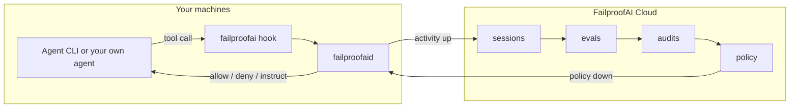

You can use FailproofAI without reading this page. Read it when you want to know *why* a
decision came back the way it did, what happens when something in the chain is down, or
what exactly is on the wire between a machine and the cloud.

---

## The one-paragraph version

Your agents' activity flows **in** — either read off a supported harness by a background
service on each machine, or emitted by your own code through the Python SDK. FailproofAI
Cloud turns that into sessions, scores them with your evaluator, and runs recurring audits
that hunt for failure patterns across runs. When you turn a finding into a policy, it flows
back **out**: every connected machine pulls the deployment, verifies it, and evaluates it
inside the agent's own loop, answering **allow**, **deny**, or **instruct** on every tool
call. The next audit tells you whether it worked.



---

## Part 1 — How activity gets in

Two paths, and they are complementary rather than alternatives.

### Supported harnesses — nothing to instrument

Agent CLIs write their own session transcripts, in their own formats and locations.
FailproofAI **reads** them — never modifies, moves, or deletes them. A collector inside
`failproofaid` tails those files (or their SQLite stores) as they are written, batches what
it finds, and uploads it.

That is why connecting a machine takes one command and no code change: the data was already
on disk. It also means a machine picks up **subagents, headless runs, and IDE sessions**
without per-surface setup, because they all write to the same store.

Coverage is not uniform, and [the support matrix](/agent-support) states it per CLI rather
than leaving you to discover a gap. [Session capture →](/cloud/capture)

### Custom agents — the Python SDK

For agents you wrote, the SDK emits events from inside your code:
`agent_start`, `model_request`/`model_response`, `tool_use`/`tool_result`, `agent_end`, and
the rest. It writes structured JSONL to `~/.agenteye/events/`, flushed every 500 ms, and the
collector ships those files the same way it ships harness transcripts.

Pair every start with its end and reuse the same correlation id on both — that pairing is
what turns a flat event list into an execution graph. [Python SDK →](/cloud/sdk)

### Either way, delivery is durable

Events spool to disk before they are sent. A watcher uploads within milliseconds; a sweeper
rescans on an interval to recover anything written while the daemon was stopped. If the
network is down the spool grows and drains later — nothing is dropped on the floor. Run
`failproofai flush --wait` when you do not want to wait for the sweep.

---

## Part 2 — What the cloud does with it

| Stage | What happens |
|---|---|
| **Sessions** | Events are rolled into one row per run and drawn as a git-style execution graph — parallel branches in their own lanes, with tools, models, hooks, and token spend broken out. [Sessions →](/cloud/sessions) |
| **Evals** | Your own scoring service is handed each finished run and returns scores with reasoning. Nothing is scored by a model you did not choose. [Online evals →](/cloud/evaluations) |
| **Audits** | On a fixed schedule, an investigation reads *across* sessions for error clusters, drift, goal failure, tool misuse, cost trade-offs, and coverage gaps. Every finding cites its evidence, and the server **discards any recommendation whose cited sessions do not resolve** — so the audit investigates but never invents. [Audits →](/cloud/audits) |
| **Issues** | A finding, an alert breach, or a person opens an issue: a shared inbox row with a state, an owner, and an append-only attributed timeline. [Issues →](/cloud/issues) |

---

## Part 3 — How a policy gets back onto every machine

You publish an **immutable version** in the policy editor and pin it to a machine. From
there it is the daemon's job:

<Steps>
  <Step title="Poll">
    The daemon asks the cloud for this machine's desired state, every 30 seconds by default.
  </Step>
  <Step title="Fetch">
    It downloads any policy artifact it does not already have, content-addressed.
  </Step>
  <Step title="Verify">
    Every artifact's SHA-256 is checked. A digest that does not match means the **whole
    deployment is refused**, not partially applied.
  </Step>
  <Step title="Activate atomically">
    The complete verified set switches in at once. A machine never runs half of a rollout.
  </Step>
</Steps>

Two consequences worth relying on: **a machine that goes offline keeps enforcing the last
deployment it successfully fetched**, and **policy evaluation never makes a network
request** — hooks read only the last verified local state, so the cloud being slow can never
be on the critical path of a tool call.

Roll a new rule out in **observe** mode first. It is evaluated exactly like any other policy
and then has its verdict discarded, which is how you measure a rule against real traffic
before it can block anyone's work. The risk is rarely that a rule is wrong in theory; it is
that a rule that looks obviously correct blocks something forty engineers do all day.
[Deploy policies →](/cloud/deploy-policies)

---

## Part 4 — How a decision is made, inside the agent loop

### The agent hands over the tool call

Each CLI has its own hook contract, and FailproofAI speaks all of them. Three shapes exist
in the wild:

| Shape | CLIs | How FailproofAI attaches |
|---|---|---|
| **External command** | Claude Code, Codex, Copilot, Cursor, Hermes, Factory Droid, Devin, Antigravity, Goose | A hook entry in the CLI's settings file runs `failproofai --hook <Event> --cli <name>` and passes the event as JSON on stdin. |
| **In-process plugin** | OpenCode, OpenClaw | A small generated plugin the CLI loads at startup; it calls the FailproofAI binary and translates the answer back into the plugin's own return shape. |
| **Extension package** | Pi | A bundled extension the CLI loads at startup, which shells out per event. |

The payload carries the session id, the working directory, the tool name, and the tool's
input:

```json
{
  "session_id": "abc123",
  "cwd": "/home/you/myproject",
  "hook_event_name": "PreToolUse",
  "tool_name": "Bash",
  "tool_input": { "command": "sudo apt install nodejs" }
}
```

One policy set works identically across all 12 CLIs, so a rule you write for Claude Code
also fires on Cursor.

<Accordion title="How that works, if you want the detail">
  Not every CLI spells those fields the same way. Copilot sends `path` where Claude sends
  `file_path`; Antigravity sends camelCase protojson; Goose sends `working_dir` instead of
  `cwd`. FailproofAI canonicalizes all of it — event names, tool names, and tool-input keys
  — before a single policy runs.

  Payloads are capped at 1 MB. Anything larger is discarded and every policy implicitly
  allows, rather than stalling the agent on a pathological input.
</Accordion>

### The machine decides who evaluates

`failproofaid` is a background service that stays warm. The hook connects to it over a Unix
socket in `~/.failproofai/run/`, hands over the event, and gets the decision back. Two
separate budgets apply, and the split matters:

- **~150 ms to connect.** The "is anything listening?" probe. A dead daemon must never add
  latency to a tool call.
- **30 s for the answer** once connected. A policy is allowed to do real work — shell out to
  `git`, call an API, ask an LLM — and a correct-but-slow evaluation must not be mistaken
  for a dead service.

**If the daemon cannot answer, the tool call is denied.** Not allowed — denied. There is no
in-process fallback on this path, and that is the entire point: a second policy engine
reachable by stopping the first is not a guarantee, and a machine where killing a service
silently disables every policy is not a guarded machine. A protocol-version mismatch denies
too, with a message naming the version and telling you to run `failproofai config`, because
the fix is different from "the daemon is down." [More on the daemon →](/daemon)

In-process evaluation exists, but exactly two situations reach it, and neither is a
configured user machine: a machine that is **not set up yet** (where no hooks are installed
either, so nothing evaluates anything), and **this repository's own development configs**.

### Policies run, in order

<Steps>
  <Step title="Built-in policies">
    In definition order, with each policy's parameters resolved from your config merged over
    its schema defaults.
  </Step>
  <Step title="Cloud-managed policies">
    Whatever your organization deployed to this machine, digest-verified immediately before
    loading.
  </Step>
  <Step title="Explicit custom policies">
    Files you named with `--custom`, in configured order.
  </Step>
  <Step title="Convention policies">
    `*policies.{js,mjs,ts}` from the project's `.failproofai/policies/`, then from
    `~/.failproofai/policies/`. Alphabetical within each directory.
  </Step>
</Steps>

Three rules govern the result:

- **The first `deny` short-circuits.** Nothing after it runs, and its reason is the answer.
- **`instruct` messages accumulate.** All of them are delivered together.
- **`allow` messages accumulate too.** A policy can permit an action *and* tell the model
  something useful ("all CI checks passed on this branch").

Custom policies are **fail-open by design**: a syntax error, a missing file, a thrown
exception, or a function that runs longer than 10 seconds is logged and treated as allow.
Your own broken rule never takes the built-ins down with it.

### The decision goes back in the CLI's own dialect

Each CLI honors a different channel, and getting this wrong is the difference between a real
block and a warning nobody reads. FailproofAI emits the right one per CLI and per event:

| Channel | Used by |
|---|---|
| `{hookSpecificOutput:{permissionDecision:"deny"}}` JSON | Claude Code, Copilot, Codex |
| `{decision:"block", reason}` JSON on stdout | Devin, Goose, Hermes, Factory Droid (turn-end only) |
| Exit code 2 + stderr | Factory Droid (tool events), Claude Code `Stop` |
| `{decision:"deny"}` / `{decision:"continue"}` | Antigravity |
| `{followup_message}` | Cursor turn-end |
| Plugin return values (`{block:true}`, `{action:"revise"}`, thrown errors) | OpenCode, OpenClaw, Pi |

The one that surprises people is the **turn-end gate**. Policies like
`require-commit-before-stop` do not block a tool — they refuse to let the agent *finish*.
Where a CLI supports it, a deny at turn end forces another turn with the reason as the
prompt, so the agent goes back and finishes the job. Where FailproofAI does not subscribe to
a turn-end event (Hermes, Goose), those policies simply do not apply —
[the support matrix](/agent-support) says exactly which is which.

### Everything is recorded

One line per evaluated decision — allows included — is appended to
`~/.failproofai/hook-activity/`:

```json
{
  "timestamp": 1786538096789,
  "sessionId": "abc123",
  "eventType": "PreToolUse",
  "toolName": "Bash",
  "policyName": "block-sudo",
  "decision": "deny",
  "reason": "sudo command blocked by failproofai",
  "durationMs": 12
}
```

An allow row is what distinguishes "a policy ran and permitted this" from "no policy covered
this event". This log is what the [local dashboard](/dashboard) reads, and what the daemon
ships to the cloud when a machine is connected.

---

## Configuration, and how it merges

Three files, evaluated in priority order:

```text
[1] {cwd}/.failproofai/policies-config.json        ← project  (committed)
[2] {cwd}/.failproofai/policies-config.local.json  ← local    (gitignored)
[3] ~/.failproofai/policies-config.json            ← global
```

- `enabledPolicies` — the **deduplicated union** of all three. A policy switched on anywhere
  is on.
- `policyParams` — **first file that defines a policy's params wins entirely.** There is no
  deep merge inside a policy's parameter block.
- `customPoliciesPaths`, `llm` — first file that defines it wins.
- `disabledCustomPolicies` — union across all scopes.

Changes take effect on the next hook event. Nothing to restart.
[Full configuration reference →](/configuration)

---

## Failure modes, in one table

The useful thing about a policy is knowing what it does when *it* breaks.

| What breaks | What happens |
|---|---|
| The daemon is down, on a configured machine | **Tool call denied.** Fail-closed by design. |
| Daemon and CLI versions disagree on the protocol | **Denied**, with a message naming the version and pointing at `failproofai config`. |
| A custom policy throws, times out, or fails to parse | Logged; treated as **allow**. Built-ins are unaffected. |
| The payload exceeds 1 MB | Discarded; every policy implicitly allows. |
| A cloud-managed artifact fails its digest check | The deployment is **refused** rather than partially applied. |
| The cloud is unreachable | Enforcement continues on the last deployment. Activity spools locally and uploads when the network returns. |
| An audit's analysis step fails | The window stays open for the next run, findings are not retired, and the audit's recipients are mailed. |
| FailproofAI does not subscribe to a turn-end event on that CLI | `require-*-before-stop` policies do not fire there. Stated per CLI in [the matrix](/agent-support). |

---

## Performance

The hook sits on the critical path of every tool call, so its cost is a product decision,
not an implementation detail:

- The daemon **pre-warms its evaluation worker** as soon as it starts, off the hook path, so
  the first real tool call of a session never pays a cold start.
- Typical evaluations with no external calls complete in well under 100 ms.
- Policies that shell out (`git`, `gh`) or call an LLM cost what those calls cost — which is
  why the response budget is 30 seconds and the connect probe is 150 ms.
- Pattern matching inside policies runs against **parsed command tokens**, not raw strings.
  An allowlist entry for `sudo systemctl status *` cannot be bypassed by appending
  `; rm -rf /`.

---

<Card title="Next — Concepts" icon="arrow-right" href="/concepts">
  Every term these docs use — session, evaluation, finding, issue, deployment — defined
  once, in loop order.
</Card>
