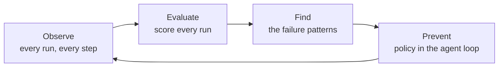

You deployed an agent. It works in the demo. Then it runs a thousand times a day against
real inputs, and some of those runs go wrong — it calls the wrong tool, loops, pastes a
credential into a prompt, finishes without doing the job, or quietly costs ten times what
it should.

Almost none of that raises an error. The run completes. The log looks fine. You hear about
it from a customer.

**FailproofAI closes that gap.** It watches every agent you run, scores what they did, finds
the failure patterns nobody wrote a rule for, and turns each one into a policy that stops it
happening again — enforced inside the agent's own loop, before the damage lands.

---

## Reliability is a loop, not a feature



<CardGroup cols={2}>

<Card title="Deep observability" icon="diagram-project" href="/cloud/sessions">
  Every run becomes a readable execution graph — what ran in parallel, which sub-agent
  stalled, where it went off course, and what it spent. Not a log file. A picture of the
  run.
</Card>

<Card title="Online evals" icon="chart-line" href="/cloud/evaluations">
  Your own scoring service grades every finished run as it lands, on the dimensions you
  define. A drop in helpfulness or a spike in hallucination surfaces on its own, before a
  customer feels it.
</Card>

<Card title="Failure identification" icon="magnifying-glass" href="/cloud/audits">
  Recurring audits mine your sessions across runs for error clusters, drift, tool misuse,
  and goal failures — then hand you ranked findings with the evidence attached.
</Card>

<Card title="Policy authoring" icon="shield-halved" href="/policies">
  Write the rule once, deploy it to every machine, and it runs on every tool call: allow,
  deny, or steer. **40 policies ship in the box**; write your own in JavaScript when the
  failure mode is yours.
</Card>

</CardGroup>

Observability alone tells you what broke. Guardrails alone stop what you already thought of.
The value is the handoff between them: a finding becomes a policy, the policy stops the
failure, and the next audit confirms it stopped. Each pass leaves the agent measurably more
reliable than the last.

---

## Two ways to plug in

Whichever you use, everything above works the same way afterwards. Most teams end up running
both.

<CardGroup cols={2}>

<Card title="Agents on a supported harness" icon="plug">
  Claude Code, Codex, Copilot, Cursor, OpenCode, Pi, Hermes, OpenClaw, Factory Droid, Devin,
  Antigravity, and Goose. **One command, no code changes** — FailproofAI reads what they
  already write.

  ```bash
  failproofai config --connect <url> --token <key>
  ```

  [Supported agents →](/agent-support)
</Card>

<Card title="Custom agents you wrote" icon="code">
  Emit events from inside your own agent with the Python SDK — one call at the start of a
  run, one per tool use, one at the end.

  ```python
  agenteye.event.agent_start(session_id="run-001", ...)
  ```

  [Python SDK →](/cloud/sdk)
</Card>

</CardGroup>

---

## What it costs, and what stays yours

Policies are **open source and free forever**. FailproofAI Cloud is what a team buys when
one machine becomes twenty and "did everyone install the new rule?" stops being a question
you can answer by asking.

Nothing leaves a machine until you connect it, and when you do, the CLI tells you exactly
what starts leaving before it does. Policy evaluation itself never makes a network request —
even connected, decisions are made locally from the last verified deployment.
[What gets sent →](/cloud/connect#what-leaves-this-machine)

---

## Start here

<Card title="Create your workspace" icon="rocket" href="/start/sign-up" horizontal>
  Five steps, about ten minutes: account and key → first session → load your history → first
  audit → first policy deployed.
</Card>

Rather try it with no account? `npx -y failproofai audit` scores the agent transcripts
already on this machine and tells you which failure modes they show.
[Run it locally →](/quickstart)

<CardGroup cols={2}>

<Card title="How it works" icon="sitemap" href="/how-it-works">
  The whole path — from a tool call, through a decision, to your dashboard.
</Card>

<Card title="Concepts" icon="book" href="/concepts">
  Every term these docs use, defined once.
</Card>

</CardGroup>
