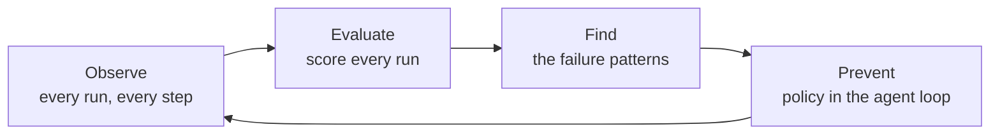

## Get started

Create a [workspace and machine key](/start/sign-up), then follow these steps.

<CardGroup cols={2}>

<Card title="First trace" icon="signal-stream" href="/start/first-trace">
  Send a session and backfill earlier runs.
</Card>

<Card title="First audit" icon="magnifying-glass" href="/start/first-audit">
  Analyze sessions and review findings.
</Card>

<Card title="Author policy" icon="code" href="/start/first-policy">
  Turn a finding into a policy.
</Card>

<Card title="Deploy policy" icon="cloud-arrow-down" href="/start/deploy-policy">
  Test the policy in observe mode, then enforce it.
</Card>

</CardGroup>

Agents can complete a run while using the wrong tool, leaking a secret, looping, or missing
the goal. FailproofAI records each run, scores it, finds recurring failures, and enforces
policies inside the agent loop.

## Reliability loop



<CardGroup cols={2}>

<Card title="Observe runs" icon="diagram-project" href="/cloud/sessions">
  View each run as an execution graph with parallel work, errors, tools, and cost.
</Card>

<Card title="Online evals" icon="chart-line" href="/cloud/evaluations">
  Score completed runs on dimensions you define, such as correctness or helpfulness.
</Card>

<Card title="Find failures" icon="magnifying-glass" href="/cloud/audits">
  Find error clusters, drift, tool misuse, and goal failures across sessions.
</Card>

<Card title="Prevent failures" icon="shield-halved" href="/policies">
  Allow, deny, or guide tool calls. Use a built-in policy or write one in JavaScript.
</Card>

</CardGroup>

Turn an audit finding into a policy, then use the next audit to verify the fix.

---

## Agent support

FailproofAI supports major agent harnesses without application code changes.

<div style={{ display: "flex", gap: "1.5rem", alignItems: "center", flexWrap: "wrap", margin: "1rem 0 1.5rem" }}>
  
  
  
  
</div>

<CardGroup cols={2}>

<Card title="Supported agents" icon="plug" href="/agent-support">
  Connect Claude Code, Codex, Copilot, Cursor, OpenCode, Pi, Hermes, OpenClaw, Factory
  Droid, Devin, Antigravity, or Goose.

  ```bash
  failproofai config --connect <url> --token <key>
  ```
</Card>

<Card title="Custom agents" icon="code" href="/cloud/sdk">
  Emit run and tool events from your agent with the Python SDK.

  ```python
  agenteye.event.agent_start(session_id="run-001", ...)
  ```
</Card>

</CardGroup>
