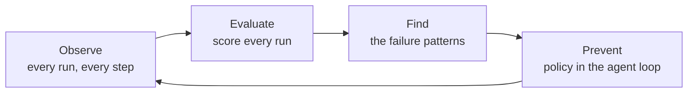

Agents can complete a run while using the wrong tool, leaking a secret, looping, or missing
the goal. FailproofAI records each run, scores it, finds recurring failures, and enforces
policies inside the agent loop.

---

## The reliability loop



<CardGroup cols={2}>

<Card title="Deep observability" icon="diagram-project" href="/cloud/sessions">
  View each run as an execution graph with parallel work, errors, tools, and cost.
</Card>

<Card title="Online evals" icon="chart-line" href="/cloud/evaluations">
  Score completed runs on dimensions you define, such as correctness or helpfulness.
</Card>

<Card title="Failure identification" icon="magnifying-glass" href="/cloud/audits">
  Find error clusters, drift, tool misuse, and goal failures across sessions.
</Card>

<Card title="Policy authoring" icon="shield-halved" href="/policies">
  Allow, deny, or guide tool calls. Use a built-in policy or write one in JavaScript.
</Card>

</CardGroup>

Turn an audit finding into a policy, then use the next audit to verify the fix.

---

## Two ways to plug in

Choose based on where the agent runs. You can use both methods in one organization.

<CardGroup cols={2}>

<Card title="Agents on a supported harness" icon="plug">
  Connect a supported CLI with one command. No application code changes are required.

  ```bash
  failproofai config --connect <url> --token <key>
  ```

  [Supported agents →](/agent-support)
</Card>

<Card title="Custom agents you wrote" icon="code">
  Emit run and tool events from your agent with the Python SDK.

  ```python
  agenteye.event.agent_start(session_id="run-001", ...)
  ```

  [Python SDK →](/cloud/sdk)
</Card>

</CardGroup>

---

## Open source and Cloud

Local policies are open source. FailproofAI Cloud adds fleet deployment, centralized
sessions, evaluations, audits, and alerts.

Nothing leaves a machine until you connect it. Policy decisions remain local and use the
last verified deployment.
[What gets sent →](/cloud/connect#what-leaves-this-machine)

---

## Start here

<Card title="Create your workspace" icon="rocket" href="/start/sign-up" horizontal>
  Create a key, send a session, load history, run an audit, and deploy a policy.
</Card>

For a local trial with no account, audit the transcripts already on this machine.
[Run it locally →](/quickstart)

<CardGroup cols={2}>

<Card title="How it works" icon="sitemap" href="/how-it-works">
  Follow a tool call from policy evaluation to the dashboard.
</Card>

<Card title="Concepts" icon="book" href="/concepts">
  Definitions for the terms used in these docs.
</Card>

</CardGroup>
