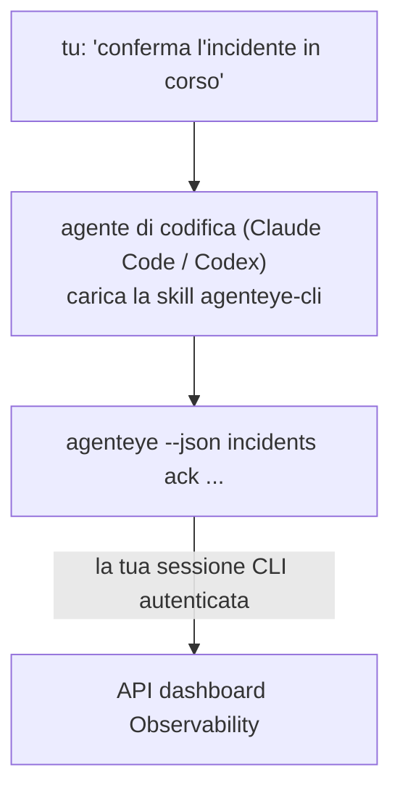

Chiedi al tuo agente di codifica *"c'è qualcosa rotto oggi?"* e lascia che risponda dai tuoi dati live di Failproof AI Observability, senza comandi da memorizzare. La **Failproof AI Observability CLI skill** (`agenteye-cli`) è un *Agent Skill*: una piccola cartella di istruzioni che un agente di codifica come Claude Code o Codex carica su richiesta. Insegna all'agente a operare il tuo deployment di Observability attraverso il [`agenteye` CLI](/it/agenteye/cli) da richieste in inglese semplice come *"dai a CI una chiave che può solo spingere eventi"* o *"conferma l'incidente in corso e assegnalo a me."*

**Non** è un servizio o un binario separato; non c'è nulla da distribuire. Funziona sopra il CLI che hai già installato: l'agente chiama `agenteye --json …`, analizza il JSON pulito e ti risponde in prosa. Tutto ciò che può fare, potresti farlo tu stesso digitando gli stessi comandi.

---

## Come si relaziona alle altre interfacce di Failproof AI Observability

Failproof AI Observability ti dà quattro modi per raggiungere gli stessi dati e controlli. Si completano a vicenda:

| Interfaccia | Che cos'è | Dove gira | Usala quando |
|---|---|---|---|
| **[CLI](/it/agenteye/cli)** | Il riferimento comando/flag per `agenteye` | Il tuo terminale | Vuoi eseguire o scriptare un comando specifico |
| **[CLI recipes](/it/agenteye/cli-recipes)** | Pattern copia-incolla di `jq`/pipeline | Il tuo terminale / script | Stai integrando il CLI nell'automazione |
| **CLI skill** (questo doc) | Una porta naturale in linguaggio plain sul CLI | Il tuo agente di codifica, sulla tua workstation | Vuoi semplicemente chiedere e lasciare che l'agente scelga il comando |
| **[Evaluator skill](/it/agenteye/evaluator-skill)** | Una skill gemella che progetta e costruisce il tuo servizio di scoring | Il tuo agente di codifica, sulla tua workstation | Vuoi produrre punteggi eval invece di leggerli |
| **[Python SDK skill](/it/agenteye/python-sdk-skill)** | Una skill gemella che strumenta il tuo agente in modo che emetta telemetria | Il tuo agente di codifica, sulla tua workstation | Vuoi che il tuo agente produca gli eventi che questa skill legge |
| **[In-dashboard AI assistant](/it/agenteye/assistant)** | Una chat incorporata nel dashboard | Lato server (nel dashboard) | Vuoi domande e risposte nel dashboard sui tuoi dati |

La skill stessa non ha privilegi propri; trasforma semplicemente le tue parole in chiamate CLI che girano come te:



### vs. l'assistente AI nel dashboard: una distinzione importante

Questi sono due strumenti diversi con raggi di impatto molto diversi:

- L'**assistente AI nel dashboard** ([AI assistant](/it/agenteye/assistant)) è una chat incorporata nel dashboard, supportata dal servizio agente. È **sola lettura più authoring con approvazione**: può abbozzare query salvate e dashboard, ma ogni scrittura si pausa per la tua approvazione esplicita, e non elimina mai. È protetto dal permesso `agent:use` e vede solo i dati per l'org che stai visualizzando.
- La **CLI skill** gira sulla *tua* workstation dentro il *tuo* agente di codifica e guida il `agenteye` CLI come **te**. Può eseguire la **superficie completa del CLI, incluse le mutazioni** (create/rotate/disable chiavi API, cambiare impostazioni org, risolvere incidenti, eliminare query salvate), limitato solo dai permessi del tuo login CLI. Trattalo esattamente come tratteresti l'esecuzione di quei comandi a mano.

---

## Prerequisiti

1. Il **`agenteye` CLI installato** e su `PATH` (vedi il riferimento [CLI](/it/agenteye/cli): `pipx install agenteye`).
2. L'**URL del tuo dashboard** impostato (`AGENTEYE_DASHBOARD_URL`, o l'agente passa `--base-url`).
3. Una **sessione connessa**: esegui `agenteye login` tu stesso per primo. La skill **non può** completare il login con codice monouso inviato per email; ti dirà di eseguire `agenteye login` se la sessione manca o è scaduta (codice di uscita CLI `4`).

---

## Dove ottenerla

La skill è pubblicata nella collezione di skills pubblica di Failproof AI:

**[github.com/FailproofAI/skills](https://github.com/FailproofAI/skills)** → [`skills/agenteye-cli/`](https://github.com/FailproofAI/skills/tree/main/skills/agenteye-cli)

Nulla è protetto — il repository è pubblico e la skill non ha bisogno di credenziali proprie, perché guida solo il `agenteye` CLI **pubblico** contro il *tuo* dashboard, usando la sessione *tu* con cui hai effettuato l'accesso. Non devi chiedere a nessuno.

Nota che viene fornita come propria cartella e **non** è dentro il pacchetto `pipx install agenteye`, quindi non cercarla lì.

## Installare la skill

Il percorso più veloce è il CLI [`skills`](https://skills.sh), che recupera la cartella e la posiziona dove il tuo agente guarda:

```bash
# Claude Code, solo questo progetto
npx skills add FailproofAI/skills --skill agenteye-cli -a claude-code

# ogni progetto (installa in ~/.claude/skills/)
npx skills add FailproofAI/skills --skill agenteye-cli -a claude-code -g --copy

# Codex invece
npx skills add FailproofAI/skills --skill agenteye-cli -a codex
```

Quindi gestiscila come qualsiasi altra skill:

```bash
npx skills list -a claude-code      # cosa è installato
npx skills update agenteye-cli      # scarica la versione più recente
npx skills remove agenteye-cli      # rimuovila
```

Preferisci installarla a mano? Un Agent Skill è solo una cartella contenente un `SKILL.md` (più riferimenti opzionali), quindi copiarla funziona:

- **Claude Code**: metti la cartella `agenteye-cli/` in `~/.claude/skills/` (ogni progetto) o `<tuo-repo>/.claude/skills/` (solo quel repo). Claude Code la scopre automaticamente — verifica con la lista `/skills`, o semplicemente fai una domanda che corrisponda alla sua descrizione.
- **Codex (OpenAI)**: Codex legge lo stesso `SKILL.md`. Il `agents/openai.yaml` fornito imposta `allow_implicit_invocation: true`, quindi Codex seleziona automaticamente la skill quando un compito corrisponde; altrimenti invocala esplicitamente come `$agenteye-cli`.

---

## Sicurezza: le mutazioni NON richiedono conferma quando un agente esegue il CLI

> **Avviso:** Leggi questo prima di lasciare che un agente faccia cambiamenti.

Il `agenteye` CLI normalmente chiede *"sei sicuro?"* prima di un'azione distruttiva. Lo **salta automaticamente ogni volta che non è collegato a un terminale (che è esattamente come un agente di codifica lo esegue), e `--json` lo salta anche.** Quindi il prompt di sicurezza **non** si attiverà per l'agente.

La skill è scritta per compensare: è istruita a enunciare il comando esatto che eseguirà e ottenere il tuo **OK esplicito prima di qualsiasi cambiamento di stato**. Mantieni questa disciplina. Quando guidi Failproof AI Observability attraverso un agente, *tu* sei il passo di conferma. I comandi che cambiano stato da tenere d'occhio:

- `keys create` / `update` / `disable` / `regenerate`
- `users create` / `update` / `disable` / `enable`
- `settings set`
- `alerts create` / `update` / `delete` / `test`
- i sottocomandi di scrittura di `incidents`: `ack` / `assign` / `resolve` / `open` / `comment-add` / `comment-delete` / `subscribe` / `unsubscribe`
- `query create` / `update` / `delete`
- `agent rename` / `delete`
- `orgs switch`

Tutto sotto **Observe** (`events`, `sessions`, `evals`, `errors`, `list`, `whoami`, `orgs list/current/perms`) è sola lettura e non cambia nulla.

Poiché l'agente agisce come **te**, può fare solo ciò che il tuo login è autorizzato a fare; i permessi sono risolti **per org** (vedi [API keys](/it/agenteye/api-keys)). Un comando per il quale manca il permesso restituisce il codice di uscita `5` con il permesso esatto indicato, quindi l'agente può dirti precisamente cosa chiedere a un amministratore piuttosto che fallire in modo opaco.

---

## Ciò che puoi chiederle

Ecco come appare un vero andata-ritorno, una lettura, poi un cambiamento che attende il tuo OK:

```text
tu    ▸ C'è qualcosa di rotto nell'ultimo giorno?

agente ▸ Esecuzione: agenteye --json errors --since 24h --aggregate
        3 tipi di errore nelle ultime 24h. Il più grande è TimeoutError
        (18 colpi, tutti su checkout-agent), poi RateLimited (5).
        Vuoi le sessioni fallite per TimeoutError?

tu    ▸ Dai a CI una chiave che può solo spingere eventi.

agente ▸ Questo crea una chiave API. Eseguirò:
          agenteye keys create ci --add events:add
        OK per procedere?

tu    ▸ sì

agente ▸ Fatto. Chiave "ci" creata con solo events:add.
        Il secret viene mostrato una sola volta, quindi archivialo ora. Non posso ristamparlo.
```

La skill mappa ogni intento in linguaggio semplice al comando `agenteye` giusto, scoprendo i valori validi per primo (`list <kind>`, `whoami`) in modo da non indovinare, e enunciando il comando esatto prima di qualsiasi cambiamento. Più esempi:

- *"C'è qualcosa di rotto / fallito nelle ultime 24 ore?"* → `errors --since 24h --aggregate`, poi un breakdown.
- *"Perché la sessione `run-001` ha fallito?"* → `events --session-id run-001 --all` + `evals --session-id run-001`.
- *"Come tende la qualità questa settimana?"* → `evals --aggregate --since 7d`, quindi approfondisci nelle esecuzioni con punteggio basso.
- *"Dai a CI una chiave che può solo spingere eventi."* → `keys create ci --add events:add` (enuncia il comando, poi lo crea e cattura il secret monouso).
- *"Chi ha accesso? Rendi Dana sola lettura."* → `users list` → `users update dana@… --permission-set read-only` (dopo aver confermato con te).
- *"Conferma l'incidente in corso e assegnalo a me."* → `incidents list --state firing` → `incidents ack <id>` / `incidents assign <id> te@…`.

Per i comandi esatti, i flag e le forme JSON dietro questi, vedi il riferimento [CLI](/it/agenteye/cli) e [CLI recipes per agenti](/it/agenteye/cli-recipes).

---

## Prossimi passi

- **[CLI](/it/agenteye/cli)**: riferimento completo di comando e flag per `agenteye`.
- **[CLI recipes per agenti](/it/agenteye/cli-recipes)**: pattern `jq` copia-incolla e gestione dei codici di uscita.
- **[Evaluator agent skill](/it/agenteye/evaluator-skill)**: la skill gemella, per costruire l'evaluator i cui punteggi `agenteye evals` legge.
- **[Python SDK agent skill](/it/agenteye/python-sdk-skill)**: la skill gemella, per strumentare un agente in modo che emetta la telemetria `agenteye` legge.
- **[AI assistant](/it/agenteye/assistant)**: l'assistente nel dashboard (da non confondere con questa skill di terminale).
- **[API keys](/it/agenteye/api-keys)**: il modello di permesso per org che limita ciò che la skill può fare.