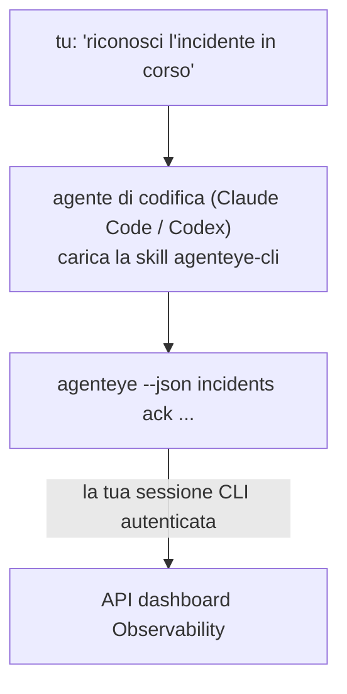

Chiedi al tuo agente di codifica *"c'è qualcosa di rotto oggi?"* e lascia che risponda dai tuoi dati Failproof AI Observability in tempo reale, senza comandi da memorizzare. La **Failproof AI Observability CLI skill** (`agenteye-cli`) è un *Agent Skill*: una piccola cartella di istruzioni che un agente di codifica come Claude Code o Codex carica su richiesta. Insegna all'agente come controllare la tua distribuzione Observability attraverso la [`agenteye` CLI](/it/agenteye/cli) da richieste in linguaggio naturale come *"dai a CI una chiave che può solo inviare eventi"* oppure *"riconosci l'incidente in corso e assegnalo a me."*

**Non** è un servizio o un binario separato; non c'è nulla da distribuire. Si appoggia sulla CLI che hai già installato: l'agente esegue il comando `agenteye --json …`, analizza il JSON pulito e ti risponde in prosa. Tutto quello che può fare, potresti farlo tu stesso digitando gli stessi comandi.

---

## Come si relaziona con le altre interfacce Failproof AI Observability

Failproof AI Observability ti offre quattro modi per accedere agli stessi dati e controlli. Si completano a vicenda:

| Interfaccia | Che cosa è | Dove gira | Usala quando |
|---|---|---|---|
| **[CLI](/it/agenteye/cli)** | Il riferimento comandi/flag per `agenteye` | Il tuo terminale | Vuoi eseguire o scrivere script per un comando specifico |
| **[CLI recipes](/it/agenteye/cli-recipes)** | Pattern `jq`/pipeline da copiare e incollare | Il tuo terminale / script | Stai integrando la CLI nell'automazione |
| **CLI skill** (questo doc) | Una porta d'accesso in linguaggio naturale alla CLI | Il tuo agente di codifica, sulla tua workstation | Vuoi semplicemente chiedere e lasciare che l'agente scelga il comando |
| **[Evaluator skill](/it/agenteye/evaluator-skill)** | Una skill gemella che progetta e costruisce il tuo servizio di scoring | Il tuo agente di codifica, sulla tua workstation | Vuoi produrre punteggi di valutazione piuttosto che leggerli |
| **[Python SDK skill](/it/agenteye/python-sdk-skill)** | Una skill gemella che strumenta il tuo agente in modo che emetta telemetria | Il tuo agente di codifica, sulla tua workstation | Vuoi che il tuo agente produca gli eventi che questa skill legge |
| **[In-dashboard AI assistant](/it/agenteye/assistant)** | Una chat integrata nel dashboard | Lato server (nel dashboard) | Vuoi Q&A nel dashboard sui tuoi dati |

La skill stessa non ha privilegi propri; trasforma semplicemente le tue parole in chiamate CLI che vengono eseguite come te:



### vs. l'in-dashboard AI assistant: una distinzione importante

Questi sono due strumenti diversi con raggi d'azione molto diversi:

- L'**in-dashboard AI assistant** ([AI assistant](/it/agenteye/assistant)) è una chat integrata nel dashboard, supportata dal servizio agente. È **solo lettura più creazione con gate di approvazione**: può elaborare query salvate e dashboard, ma ogni scrittura si ferma per il tuo clic di approvazione esplicita, e non cancella mai. È gated dal permesso `agent:use` e vede solo i dati dell'organizzazione che stai visualizzando.
- La **CLI skill** gira sulla *tua* workstation dentro il *tuo* agente di codifica e guida la CLI `agenteye` come **te**. Può eseguire l'**intera superficie della CLI, incluse le mutazioni** (creare/ruotare/disabilitare chiavi API, modificare le impostazioni dell'organizzazione, risolvere incidenti, eliminare query salvate), limitata solo dai permessi del tuo accesso CLI. Trattala esattamente come tratteresti l'esecuzione di questi comandi a mano.

---

## Prerequisiti

1. La **`agenteye` CLI installata** e su `PATH` (vedi il riferimento [CLI](/it/agenteye/cli): `pipx install agenteye`).
2. L'**URL del tuo dashboard** impostato (`AGENTEYE_DASHBOARD_URL`, oppure l'agente passa `--base-url`).
3. Una **sessione autenticata**: esegui prima `agenteye login` tu stesso. La skill **non può** completare l'accesso con codice monouso inviato via email per te; ti dirà di eseguire `agenteye login` se la sessione manca o è scaduta (exit code della CLI `4`).

---

## Dove ottenerla

La skill è pubblicata nella collezione di skill pubblica di Failproof AI:

**[github.com/FailproofAI/skills](https://github.com/FailproofAI/skills)** → [`skills/agenteye-cli/`](https://github.com/FailproofAI/skills/tree/main/skills/agenteye-cli)

Nulla è gated — il repository è pubblico e la skill non ha bisogno di credenziali proprie, perché guida solo la CLI `agenteye` **pubblica** contro il *tuo* dashboard, usando la sessione *che tu* hai utilizzato per accedere. Non devi chiedere il permesso a nessuno.

Nota che viene fornita come propria cartella e **non** è dentro il pacchetto `pipx install agenteye`, quindi non cercarla lì.

## Installazione della skill

Il percorso più veloce è la CLI [`skills`](https://skills.sh), che recupera la cartella e la mette dove il tuo agente la cerca:

```bash
# Claude Code, solo questo progetto
npx skills add FailproofAI/skills --skill agenteye-cli -a claude-code

# ogni progetto (installa in ~/.claude/skills/)
npx skills add FailproofAI/skills --skill agenteye-cli -a claude-code -g --copy

# Codex invece
npx skills add FailproofAI/skills --skill agenteye-cli -a codex
```

Poi gestiscila come qualsiasi altra skill:

```bash
npx skills list -a claude-code      # cosa è installato
npx skills update agenteye-cli      # scarica l'ultima versione
npx skills remove agenteye-cli      # rimuovila
```

Preferisci installarla a mano? Un Agent Skill è solo una cartella contenente un `SKILL.md` (più eventuali riferimenti), quindi anche copiarla funziona:

- **Claude Code**: metti la cartella `agenteye-cli/` in `~/.claude/skills/` (ogni progetto) o `<tuo-repo>/.claude/skills/` (solo quel repo). Claude Code la scopre automaticamente — verifica con la lista `/skills`, oppure semplicemente fai una domanda che corrisponde alla sua descrizione.
- **Codex (OpenAI)**: Codex legge lo stesso `SKILL.md`. Il `agents/openai.yaml` fornito imposta `allow_implicit_invocation: true`, quindi Codex seleziona automaticamente la skill quando un compito corrisponde; altrimenti invocala esplicitamente come `$agenteye-cli`.

---

## Sicurezza: le mutazioni NON chiedono conferma quando un agente esegue la CLI

> **Avvertenza:** Leggi questo prima di lasciare che un agente faccia cambiamenti.

La CLI `agenteye` normalmente chiede *"sei sicuro?"* prima di un'azione distruttiva. **Lo salta automaticamente ogni volta che non è collegato a un terminale (che è esattamente come un agente di codifica la esegue), e `--json` lo salta anche.** Quindi il prompt di sicurezza **non** si attiva per l'agente.

La skill è scritta per compensare: le è istruito di dichiarare il comando esatto che eseguirà e ottenere il tuo **OK esplicito prima di qualsiasi cambio di stato**. Mantieni quella disciplina. Quando guidi Failproof AI Observability attraverso un agente, *tu* sei il passo di conferma. I comandi che cambiano lo stato da tenere d'occhio:

- `keys create` / `update` / `disable` / `regenerate`
- `users create` / `update` / `disable` / `enable`
- `settings set`
- `alerts create` / `update` / `delete` / `test`
- i sottocomandi di scrittura `incidents`: `ack` / `assign` / `resolve` / `open` / `comment-add` / `comment-delete` / `subscribe` / `unsubscribe`
- `query create` / `update` / `delete`
- `agent rename` / `delete`
- `orgs switch`

Tutto sotto **Observe** (`events`, `sessions`, `evals`, `errors`, `list`, `whoami`, `orgs list/current/perms`) è di sola lettura e non cambia nulla.

Poiché l'agente agisce come **te**, può solo fare ciò che il tuo accesso è autorizzato a fare; i permessi vengono risolti **per organizzazione** (vedi [API keys](/it/agenteye/api-keys)). Un comando per il quale mancano permessi restituisce il codice di uscita `5` con il permesso esatto indicato, quindi l'agente può dirti precisamente cosa chiedere a un amministratore piuttosto che fallire in modo opaco.

---

## Che cosa puoi chiedere

Ecco come appare un vero scambio completo, una lettura, poi un cambio che attende il tuo OK:

```text
tu    ▸ C'è qualcosa di rotto nell'ultimo giorno?

agent ▸ Esecuzione: agenteye --json errors --since 24h --aggregate
        3 tipi di errore nelle ultime 24h. Il più grande è TimeoutError
        (18 volte, tutti su checkout-agent), poi RateLimited (5).
        Vuoi le sessioni che falliscono per TimeoutError?

tu    ▸ Dai a CI una chiave che può solo inviare eventi.

agent ▸ Questo crea una chiave API. Eseguirò:
          agenteye keys create ci --add events:add
        OK per procedere?

tu    ▸ sì

agent ▸ Fatto. Chiave "ci" creata con solo events:add.
        Il segreto è mostrato solo una volta, quindi salvalo ora. Non posso ristamparlo.
```

La skill mappa ogni intento in linguaggio naturale al comando `agenteye` corretto, scoprendo prima i valori validi (`list <kind>`, `whoami`) in modo da non indovinare, e dichiarando il comando esatto prima di qualsiasi cambio. Altri esempi:

- *"C'è qualcosa di rotto / in errore nelle ultime 24 ore?"* → `errors --since 24h --aggregate`, poi un'analisi.
- *"Perché la sessione `run-001` ha fallito?"* → `events --session-id run-001 --all` + `evals --session-id run-001`.
- *"Come sta andando la qualità questa settimana?"* → `evals --aggregate --since 7d`, poi analizza gli esecuzioni con punteggio basso.
- *"Dai a CI una chiave che può solo inviare eventi."* → `keys create ci --add events:add` (dichiara il comando, poi lo crea e cattura il segreto monouso).
- *"Chi ha accesso? Rendi Dana di sola lettura."* → `users list` → `users update dana@… --permission-set read-only` (dopo la conferma con te).
- *"Riconosci l'incidente in corso e assegnalo a me."* → `incidents list --state firing` → `incidents ack <id>` / `incidents assign <id> you@…`.

Per i comandi esatti, i flag e le forme JSON dietro questi, vedi il riferimento [CLI](/it/agenteye/cli) e [CLI recipes for agents](/it/agenteye/cli-recipes).

---

## Prossimi passi

- **[CLI](/it/agenteye/cli)**: riferimento completo di comando e flag per `agenteye`.
- **[CLI recipes for agents](/it/agenteye/cli-recipes)**: pattern `jq` da copiare e incollare e gestione del codice di uscita.
- **[Evaluator agent skill](/it/agenteye/evaluator-skill)**: la skill gemella, per costruire l'evaluator i cui punteggi `agenteye evals` legge.
- **[Python SDK agent skill](/it/agenteye/python-sdk-skill)**: la skill gemella, per strumentare un agente in modo che emetta la telemetria che `agenteye` legge.
- **[AI assistant](/it/agenteye/assistant)**: l'assistente nel dashboard (da non confondere con questa skill di terminale).
- **[API keys](/it/agenteye/api-keys)**: il modello di permessi per organizzazione che limita ciò che la skill può fare.