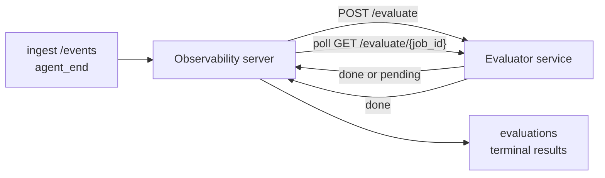

Failproof AI Observability può valutare automaticamente ogni esecuzione di agent completata per la qualità: tu fornisci un piccolo servizio di scoring, e Observability gestisce il resto. Usalo per tracciare le dimensioni che ti interessano (utilità, efficienza degli strumenti, fattualità, sicurezza; scegli tu), individuare regressioni in anticipo e confrontare agent o ambienti a colpo d'occhio. Lo scoring è facoltativo: la pipeline non fa nulla fino a quando non configuri `EVALUATOR_ENDPOINT` sul server.

> **Nota:** Definisci tu le dimensioni di scoring. Il tuo valutatore può restituire qualsiasi chiave numerica desideri; Observability memorizza, tende al grafico e visualizza tutto ciò che invii.

## A colpo d'occhio

1. **Scrivi uno scorer.** Configura un piccolo servizio HTTP che legge una trascrizione di sessione e restituisce punteggi. Observability fornisce un riferimento funzionante che puoi copiare. Vedi [Scrivere un valutatore con l'SDK](#writing-an-evaluator-with-the-sdk).
2. **Punta Observability su di esso.** Configura `EVALUATOR_ENDPOINT` (e un `EVALUATOR_TOKEN` condiviso) nel processo server.
3. **Guarda i punteggi arrivare.** Ogni sessione completata viene valutata automaticamente; i risultati appaiono sulla pagina dei dettagli della sessione, nella griglia delle sessioni e nei dashboard salvati.


*Una volta configurato un valutatore, ogni esecuzione completata viene valutata e i risultati appaiono nella barra laterale destra della sessione: il riepilogo in alto, seguito da barre di punteggio per dimensione con ragionamento.*

---

## Come funziona



Quando l'SDK di Observability emette un evento `agent_end` per una sessione, il server pianifica una valutazione. Quindi invia tramite POST l'intera trascrizione degli eventi al tuo servizio di valutazione, che può:

- **Restituire il risultato inline** con `{"status":"done", "scores":{...}, "reasoning":{...}, "summary":"..."}`. Il risultato viene aggiunto alla timeline di valutazione della sessione. `reasoning` e `summary` sono facoltativi.
- **Rimandare** con `{"status":"pending", "job_id":"abc-123"}`. Observability quindi chiama `GET {EVALUATOR_ENDPOINT}/evaluate/abc-123` fino a quando il tuo valutatore restituisce `{"status":"done", ...}` o `{"status":"error", "error":"..."}`.

  La cadenza di polling è per job: una risposta `pending` può includere `next_poll_secs` per eseguire l'override; altrimenti Observability usa il valore `default_poll_interval_secs` da `GET /config`; altrimenti il server ricade su `EVALUATOR_POLLING_INTERVAL_SECS` (predefinito 10s). Tutti i valori sono limitati a [1s, 1h].

Le sessioni che non emettono mai `agent_end` (ad esempio, un processo agent interrotto) possono anche essere riprese: il `GET /config` del valutatore può restituire `{"inactivity_timeout_secs": 1800}`, e Observability valuterà qualsiasi sessione rimasta inattiva per quel periodo. Imposta il campo a `null` o omettilo per disabilitare questo fallback.

La pipeline è completamente inert quando `EVALUATOR_ENDPOINT` non è impostato.

Una sessione può accumulare **più valutazioni terminali nel tempo**: ogni evento `agent_end` (e ogni rivalutazione manuale dal dashboard) aggiunge una nuova riga di valutazione. Questo è il modo supportato per valutare una conversazione ripresa: un utente termina un agent, torna più tardi, invia altri eventi, termina nuovamente l'agent, e viene eseguita una seconda valutazione contro l'intera trascrizione aggiornata. Il dashboard esegue il rendering della valutazione più recente come titolo principale e le valutazioni precedenti come timeline richiudibile. Mentre una valutazione è in esecuzione per una sessione, i nuovi eventi `agent_end` per quella sessione vengono ignorati; il successivo dopo il completamento della valutazione in esecuzione metterà in coda una nuova valutazione come al solito.

Il fallback di inattività si riattiva anche nelle sessioni riprese: se arrivano nuovi eventi dopo una precedente valutazione terminale e la sessione rimane inattiva oltre `inactivity_timeout_secs`, viene messa in coda una nuova valutazione.

Gli errori transitori (5xx, 429, timeout, errori di rete) vengono ritentati con backoff esponenziale fino a `EVALUATOR_MAX_ATTEMPTS`; le risposte 4xx sono terminali. Observability è sicuro da eseguire con più istanze server a scalabilità orizzontale; il lavoro è partizionato in modo che la stessa sessione non venga mai spedita due volte contemporaneamente.

---

## Contratto HTTP

Ogni route autenticato usa **autenticazione bearer token**. Lo stesso valore deve essere configurato su entrambi i lati:

- Server Observability: variabile di ambiente `EVALUATOR_TOKEN`
- Servizio valutatore: configurato allo stesso modo (l'SDK `agenteye-evaluator` legge `EVALUATOR_TOKEN` per convenzione)

Se `EVALUATOR_TOKEN` non è impostato, il server non invia intestazione `Authorization`; il valutatore può quindi accettare richieste anonime, che va bene per una rete solo interna ma è sconsigliato su internet pubblico.

### Route che il valutatore deve servire

| Route | Body / parametri | Risposta |
|---|---|---|
| `GET /health` | nessuno | `{"status":"ok"}` (aperto, senza autenticazione) |
| `GET /config` | nessuno | `{"inactivity_timeout_secs": <int> \| null, "default_poll_interval_secs": <int> \| omesso}` |
| `POST /evaluate` | JSON `EvalRequest` | `{"status":"done", ...}` o `{"status":"pending", "job_id":"..."}` |
| `GET /evaluate/{id}` | nessuno | stessa forma di risposta di `/evaluate` |

### Corpo `EvalRequest` inviato dal server

```json
{
  "schema_version": "1",
  "session_id":     "session-abc123",
  "agent_id":       "planner",
  "environment":    "production",
  "started_at":     "2026-05-10T12:00:00Z",
  "ended_at":       "2026-05-10T12:05:00Z",
  "events": [
    { "id": 1234, "ts": "...", "event_type": "agent_start", "payload": { ... } },
    ...
  ]
}
```

### Forme di risposta

**Sincrona (done):**

```json
{
  "status": "done",
  "scores": { "helpfulness": 0.85, "tool_efficiency": 0.6 },
  "reasoning": {
    "helpfulness": "answered the question directly with citations",
    "tool_efficiency": "called list_files three times when one would have done"
  },
  "summary": "strong answer quality, weak tool selection"
}
```

`reasoning` (una mappa di giustificazione per punteggio) e `summary` (una narrazione complessiva di un paragrafo) sono entrambi facoltativi. Le chiavi in `reasoning` dovrebbero rispecchiare le chiavi in `scores`; il dashboard esegue il rendering di ogni voce inline sotto la sua barra di punteggio. I valutatori più vecchi che restituiscono solo `scores` continuano a funzionare senza modifiche; `reasoning` e `summary` semplicemente leggono come null e le corrispondenti affordance UI sono omesse.

**Asincrona (rimossa):**

```json
{ "status": "pending", "job_id": "abc-123", "next_poll_secs": 30 }
```

`next_poll_secs` è facoltativo; se omesso il server ricade su `default_poll_interval_secs` del valutatore da `/config`, poi sulla sua variabile di ambiente `EVALUATOR_POLLING_INTERVAL_SECS`.

**Errore terminale lato valutatore:**

```json
{ "status": "error", "error": "model service unavailable" }
```

Il server tratta qualsiasi altro corpo 2xx come errore di protocollo e registra un `error` terminale per la sessione.

---

## Scrivere un valutatore con l'SDK

Non devi implementare il contratto HTTP a mano. Il pacchetto Python `agenteye-evaluator` ti fornisce un wrapper FastAPI tipizzato che gestisce autenticazione, routing e le forme di richiesta/risposta per te.

Failproof AI Observability fornisce anche un **valutatore di riferimento funzionante** che valuta `helpfulness`, `tool_efficiency` e `factuality` dalla forma della trascrizione. Copialo come punto di partenza e sostituisci con la tua logica: un giudice LLM, un motore di regole, qualunque cosa si adatti al tuo standard di qualità.

Valutatore minimo valido:

```python
import os
from agenteye_evaluator import Evaluator, EvalRequest, EvalResponse

app = Evaluator(token=os.environ["EVALUATOR_TOKEN"])

@app.evaluator
def run(req: EvalRequest) -> EvalResponse:
    # Inspect req.events (the full session transcript) and return scores.
    tool_calls = sum(1 for e in req.events if e.event_type == "tool_use")
    return EvalResponse(
        scores={"tool_calls": float(tool_calls)},
        reasoning={"tool_calls": f"{tool_calls} tool invocations in the transcript"},
        summary="tight tool loop" if tool_calls < 5 else "agent looped on tools",
    )
```

L'istanza `app` viene eseguita sotto qualsiasi server ASGI, quindi `uvicorn module:app` lo avvia.

Per valutatori che devono rimandare lavoro costoso, restituisci `JobPending` invece e registra un gestore `@app.job_lookup`; il server di Observability esegue il polling di `GET /evaluate/{job_id}` fino a quando non restituisci uno stato terminale o il limite `EVALUATOR_MAX_POLL_DURATION_SECS` (predefinito 1 h) scade.

Il riferimento API completo, il pattern asincrono e lo schema degli eventi sono documentati nel README dell'SDK `agenteye-evaluator`.

---

## Eseguire il tuo valutatore

Il valutatore è **il tuo servizio** — Failproof AI Observability non fornisce un valutatore predefinito, quindi lo costruisci ed esegui dove esegui i tuoi servizi. Viene eseguito sotto qualsiasi server ASGI (ad esempio `uvicorn my_evaluator:app`); servi le route `/health`, `/config` e `/evaluate` dal [contratto HTTP](#http-contract), quindi punta il server su di esso (vedi [Configurazione del server](#configuring-the-server)).

Una volta che il valutatore è raggiungibile, `GET /health` restituisce `{"status":"ok"}`. Dopo che un agent è stato eseguito da capo a capo, `GET /evaluations` sul server restituisce una riga con `status: "done"` e i punteggi che il tuo valutatore ha prodotto.

---

## Configurazione del server

Configura nel processo server:

| Variabile di ambiente | Significato |
|---|---|
| `EVALUATOR_ENDPOINT` | URL di base del tuo valutatore (`http://evaluator:9000`). Non impostato = pipeline disabilitata. |
| `EVALUATOR_TOKEN` | Bearer token. Deve corrispondere al valore con cui è configurato il servizio di valutazione. |
| `EVALUATOR_WORKERS` | Attività worker per istanza server (predefinito 2). |
| `EVALUATOR_CLAIM_BATCH` | Righe rivendicate per tick worker (predefinito 4). I batch vengono elaborati **concorrentemente**; la concorrenza effettiva sul tuo endpoint valutatore è `EVALUATOR_WORKERS × EVALUATOR_CLAIM_BATCH`. |
| `EVALUATOR_POLL_IDLE_SECS` | Quanto tempo un worker dorme tra i tentativi di spedizione quando nessuna valutazione è dovuta (predefinito 2s). |
| `EVALUATOR_POLLING_INTERVAL_SECS` | Fallback finale per la cadenza di `GET /evaluate/{id}` quando né il `next_poll_secs` per risposta né il `default_poll_interval_secs` del valutatore sono impostati (predefinito 10s). |
| `EVALUATOR_REQUEST_TIMEOUT_MS` | Timeout per richiesta (predefinito 30000). |
| `EVALUATOR_MAX_ATTEMPTS` | Dopo questo numero di errori transitori il risultato viene registrato come `error` terminale (predefinito 5). |
| `EVALUATOR_CONFIG_REFRESH_SECS` | Cadenza di `GET /config` (predefinito 300). |
| `EVALUATOR_MAX_POLL_DURATION_SECS` | Tempo massimo wall-clock che una sessione può rimanere nella coda di polling prima di essere terminata come `timeout` (predefinito 3600s). Protegge contro un valutatore che continua a restituire `pending` per sempre. |

Per attivare lo scoring automatico, configura sia `EVALUATOR_ENDPOINT` che `EVALUATOR_TOKEN` sul server, quindi riavvialo per raccogliere il cambiamento. Con `EVALUATOR_ENDPOINT` non impostato la pipeline rimane inert.

Le manopole di ottimizzazione sopra sono facoltative; configura le corrispondenti variabili di ambiente sul server solo se hai bisogno di eseguire l'override dei valori predefiniti.

---

## Riferimento API

| Metodo | Percorso | Permesso richiesto | Scopo |
|---|---|---|---|
| `GET` | `/evaluations` | `evaluations:read` | Interroga i risultati terminali. Supporta `session_id`, `agent_id`, `environment`, `status` (`done`/`error`/`timeout`), `ts_from`, `ts_to`, `cursor`, `limit`, `score_filters`, `latest_per_session`. `limit` ha valore predefinito di 50 ed è limitato a 200 (nota che questo differisce da `/events`, che limita a 1000). `environment` accetta un elenco separato da virgole (ad es. `environment=prod,staging`); i valori singoli continuano a funzionare. Con `latest_per_session=true` la risposta contiene al massimo una riga per `session_id` (la più recente per `completed_at`) utilizzata dalla pagina dell'elenco delle sessioni per comprimere la timeline di valutazione di una sessione al suo titolo attuale. Il valore predefinito è false (restituisce la cronologia completa). |
| `GET` | `/evaluations/aggregate` | `evaluations:read` | Valutazione dell'integrità valutativa riepilogata per una sezione filtrata: conteggio totale, scomposizione done/error/timeout, statistiche per chiave di punteggio (count/avg/min/max/p50 su chiavi `scores` arbitrarie) e una timeline con bucket temporale. Accetta i **stessi parametri di filtro di `/evaluations`** più `featured_keys` (CSV delle chiavi di punteggio da tendere) e `latest_per_session`. Alimenta la funzione Dashboards; le metriche sono esatte sull'intero set corrispondente, non campionate. |
| `GET` | `/evaluations/environments` | `evaluations:read` | Valori di ambiente distinti dalla tabella `evaluations`. Usato per compilare i menu a discesa di filtro con ambito ai dati leggibili di valutazione. |
| `GET` | `/evaluation-jobs` | `evaluations:read` | Visibilità nelle valutazioni in corso. Filtra per `status` (`pending`/`polling`). |
| `GET` | `/events` | `events:read` | Trasmetti gli eventi grezzi di una sessione. Supporta `session_id`, `agent_id`, `event_type` (CSV), `environment` (CSV), `ts_from`, `ts_to`, `cursor`, `limit` e `order`. `order` è `desc` (più recente prima, il predefinito) o `asc` (più vecchio prima); un valore non riconosciuto ricade su `desc`. Esegui la paginazione del cursore tramite `next_cursor` della risposta (un id evento): passalo di nuovo come `cursor` per ottenere la pagina successiva; con `asc` la pagina successiva sono gli eventi dopo quell'id, con `desc` gli eventi prima di esso. `limit` ha valore predefinito di 50 ed è limitato a 1000. |
| `GET` | `/sessions/:session_id/export` | `events:read` | Restituisce il corpo JSON esatto che il valutatore riceverebbe per questa sessione, servito come allegato scaricabile denominato `session-<id>.json`. Utile per riprodurre sessioni di produzione tramite `agenteye-evaluator` per i test offline. I byte sono byte-identici a ciò che invia la pipeline di valutazione. |
| `POST` | `/sessions/:session_id/re-evaluate` | `evaluations:trigger` | Metti in coda una nuova valutazione per una sessione; viene eseguita indipendentemente dall'existenza di una valutazione precedente. Il nuovo risultato viene **aggiunto** alla timeline di valutazione della sessione piuttosto che sovrascrivere il precedente, quindi i punteggi precedenti rimangono visibili come cronologia. Restituisce `202` in coda, `404` per una sessione sconosciuta, `409` se una valutazione è già in corso. Usa questo dopo aver distribuito un nuovo valutatore, o per sessioni che non hanno mai emesso `agent_end`. |

### Filtrazione per intervallo di punteggio: `score_filters`

`GET /evaluations` accetta un parametro facoltativo `score_filters` che restringe i risultati per valori numerici all'interno dell'oggetto `scores`. Il parametro è un elenco separato da virgole di voci `key:min..max`; entrambi i limiti possono essere omessi. Più voci si combinano con AND logico. Le righe in cui la chiave denominata è assente o non numerica sono escluse. Una richiesta può contenere al massimo 20 voci di filtro; il superamento restituisce HTTP 400.

Esempi:
```text
# helpfulness in [0.5, 0.8]
GET /evaluations?score_filters=helpfulness:0.5..0.8

# tool_efficiency at most 0.3 (no lower bound)
GET /evaluations?score_filters=tool_efficiency:..0.3

# helpfulness >= 0.5 AND factuality >= 0.9
GET /evaluations?score_filters=helpfulness:0.5..,factuality:0.9..
```

Ogni oggetto della risposta `/evaluations` ha questi campi:

| Campo | Tipo | Note |
|---|---|---|
| `evaluation_id` | stringa (UUID) | L'identificatore canonico per questa valutazione terminale. Ogni valutazione terminale riceve un nuovo UUID; una singola sessione può contenerne multiple. |
| `id` | stringa (UUID) | Alias di compatibilità all'indietro che porta lo stesso valore di `evaluation_id`. |
| `session_id` | stringa | La sessione contro la quale è stata eseguita questa valutazione. Una sessione può avere multiple valutazioni nella timeline. |
| `agent_id` | stringa | Identifica l'agent che ha prodotto la sessione. |
| `environment` | stringa | Etichetta di ambiente copiata dalla sessione. |
| `status` | enum | Uno di `"done"`, `"error"`, `"timeout"`. |
| `scores` | oggetto \| null | Punteggi restituiti dal tuo valutatore. |
| `reasoning` | oggetto \| null | Mappa facoltativa di giustificazione per punteggio restituita dal tuo valutatore. Le chiavi tipicamente rispecchiano quelle in `scores`. Il dashboard esegue il rendering di ogni voce sotto la sua barra di punteggio. |
| `summary` | stringa \| null | Narrazione complessiva facoltativa di un paragrafo restituita dal tuo valutatore. Il dashboard esegue il rendering sopra la scomposizione per punteggio come titolo della valutazione. |
| `error` | stringa \| null | Compilato solo su `"error"` / `"timeout"`. |
| `attempt_count` | intero | Numero di tentativi di spedizione (≥ 1). |
| `duration_ms` | intero \| null | Durata del tentativo finale. |
| `completed_at` | stringa (ISO 8601 UTC) | Quando è stato registrato il risultato terminale. I risultati sono ordinati per `completed_at` (più recente prima). |
| `created_at` | stringa (ISO 8601 UTC) | Porta lo stesso timestamp di `completed_at` (semantica write-once). |

---

## Permessi

| Permesso | Concede |
|---|---|
| `evaluations:read` | Elenca i risultati di valutazione, visualizza i punteggi nel dashboard e carica le metriche di integrità del dashboard. |
| `evaluations:trigger` | Metti manualmente in coda una valutazione per una sessione tramite `POST /sessions/:session_id/re-evaluate` o il pulsante di rivalutazione del dashboard. |
| `dashboards:read` | Visualizza i dashboard salvati (ha anche bisogno di `evaluations:read` per caricare le loro metriche). |
| `dashboards:write` | Crea e modifica dashboard. |
| `dashboards:delete` | Elimina dashboard. |

L'admin bootstrap (`ADMIN_KEY`, `ADMIN_EMAIL`) riceve automaticamente questi.

---

## Visualizzazione dei risultati

- **`/sessions/<id>`**: timeline degli eventi + una barra laterale destra che mostra i punteggi della sessione e qualsiasi errore dal tentativo di spedizione. Se la tua chiave ha `evaluations:trigger`, appare un pulsante **re-evaluate** accanto al pulsante di esportazione, utile per sessioni che non hanno mai emesso `agent_end`, o per aggiornare i punteggi dopo aver distribuito un nuovo valutatore. Il dashboard esegue il polling del nuovo risultato e aggiorna la barra laterale destra quando arriva.
- **`/sessions`**: griglia di sessione filtrabile; la colonna del punteggio mostra lo stato di valutazione e i punteggi di ogni sessione a colpo d'occhio.
- **`/dashboards`**: visualizzazioni di integrità eval salvate (vedi [Dashboards](#dashboards) di seguito).


*La griglia delle sessioni mostra lo stato di valutazione e i punteggi di ogni esecuzione a colpo d'occhio; i badge rossi/ambra/verdi fanno saltare i punteggi bassi.*

---

## Dashboard

La pagina **Dashboards** (`/dashboards`) ti consente di salvare una combinazione di filtri di valutazione come visualizzazione denominata e riutilizzabile e guardare come sta procedendo quella sezione di valutazioni a colpo d'occhio. I dashboard sono **condivisi in tutta l'organizzazione**; tutti quelli con `dashboards:read` vedono lo stesso set.

Ogni dashboard fissa:

- **Filtri**: i stessi controlli della pagina delle sessioni: ambiente, stato, agent, una finestra temporale mobile e filtri di intervallo di punteggio (`key:min..max`).
- **Una configurazione di visualizzazione**: quali chiavi di punteggio mettere in primo piano, le soglie di integrità verde/ambra/rosso, quali pannelli mostrare e se comprimere alla valutazione più recente per sessione.

Ogni scheda mostra il numero di sessioni corrispondenti, una scomposizione done/error/timeout, la media di ogni punteggio in primo piano e un piccolo sparkline di tendenza. L'apertura di un dashboard mostra i pannelli a dimensione intera; **"apri in sessioni"** ti porta direttamente alla pagina delle sessioni prefiltrante a esattamente quella sezione. Le metriche vengono calcolate lato server sull'intero set corrispondente (via `GET /evaluations/aggregate`), quindi i numeri sono esatti piuttosto che campionati.


**Permessi:** la visualizzazione richiede sia `dashboards:read` che `evaluations:read`; la creazione e modifica richiedono `dashboards:write`; l'eliminazione richiede `dashboards:delete`. L'admin bootstrap riceve automaticamente tutti questi.

---

## Risoluzione dei problemi

**Le sessioni esistono ma non vengono create valutazioni.** Conferma che `EVALUATOR_ENDPOINT` è configurato nel processo server, che il server e il valutatore condividono lo stesso valore `EVALUATOR_TOKEN` e che l'endpoint `/health` del valutatore è raggiungibile dal server. Con `EVALUATOR_ENDPOINT` non impostato la pipeline è inert.

**Le valutazioni in corso si accumulano.** Interroga `GET /evaluation-jobs` per vedere la coda in corso. Ispeziona `attempt_count`, `next_attempt_at` e `last_error` su ogni riga. Cause comuni: servizio di valutazione irraggiungibile o che restituisce 5xx (ritentato con backoff), `EVALUATOR_TOKEN` errato (401 è terminale), o un valutatore asincrono che restituisce `pending` indefinitamente (vedi di seguito).

**Le sessioni sono completate ma nessuna valutazione terminale.** Interroga `GET /evaluation-jobs?status=polling`; il risultato potrebbe ancora essere in corso. Se un job è bloccato in `pending`, il server ha difficoltà a raggiungere il valutatore; verifica che il valutatore sia attivo e che `EVALUATOR_TOKEN` corrisponda.

**`HTTP 401 from evaluator: invalid bearer token`.** Il `EVALUATOR_TOKEN` sul server non corrisponde al valore con cui è configurato il servizio di valutazione. Devono essere identici.

**Il valutatore asincrono restituisce `pending` per sempre.** Il server esegue il polling di `GET /evaluate/{job_id}` fino a quando il valutatore restituisce `done` o `error`, o fino a quando il limite `EVALUATOR_MAX_POLL_DURATION_SECS` (predefinito 1 h) scade. Dopo il limite la valutazione viene registrata come `timeout` e rimossa dalla coda in corso. Aumenta `EVALUATOR_MAX_POLL_DURATION_SECS` se il tuo valutatore ha legittimamente bisogno di più tempo del predefinito.

---

## Passi successivi

- [Skill agent valutatore](/it/agenteye/evaluator-skill): fai progettare a un agent di codifica le tue dimensioni rispetto a sessioni reali e costruisci questo servizio per te.
- [SDK Python](/it/agenteye/python-sdk): emetti gli eventi `agent_end` che attivano lo scoring.
- [Chiavi API](/it/agenteye/api-keys): i permessi `evaluations:read` e `evaluations:trigger`.
- [Audit](/it/agenteye/audits): l'altra funzione di qualità automatizzata di Observability, per la revisione basata su criteri.