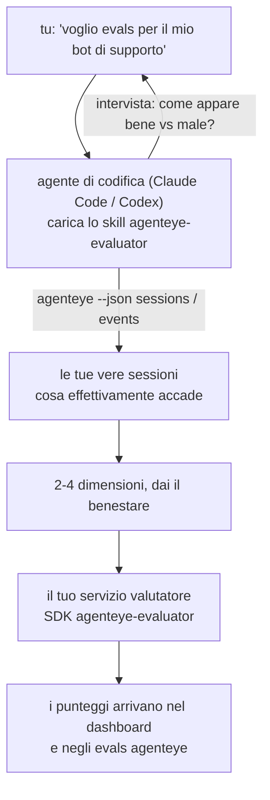

Da *"penso che il nostro agente a volte non funzioni bene"* a un servizio di scoring distribuito, con il tuo agente che decide e costruisce tutto. Lo **skill di valutazione dell'osservabilità Failproof AI** (`agenteye-evaluator`) è uno *Agent Skill*: una piccola cartella di istruzioni che un agente di codifica come Claude Code o Codex carica on demand. Insegna all'agente a individuare quali dimensioni di qualità vale la pena tracciare per *il tuo* agente, quindi a scrivere, testare e distribuire il [servizio valutatore](/it/agenteye/evaluation-suite) che le punteggia.

**Non** è uno scorer ospitato, un registro dove caricare dati, o un sistema di plugin. Il tuo valutatore rimane un servizio HTTP tuo sulla tua infrastruttura, esattamente come descritto nella guida [Suite di valutazione](/it/agenteye/evaluation-suite). Lo skill insegna solo al tuo agente a costruirlo bene, quindi tutto ciò che fa, potresti farlo tu stesso scrivendo lo stesso codice.

---

## La parte difficile è decidere cosa punteggiare

La superficie dell'SDK è piccola — un decoratore e due modelli — e un agente può scriverla dalla [specifica](/it/agenteye/evaluation-suite#http-contract) da solo. Non è lì che i valutatori falliscono. Falliscono perché punteggiano la cosa sbagliata, e un valutatore che punteggia la cosa sbagliata è peggio di niente: produce una dashboard che tutti imparano a ignorare.

Quindi la maggior parte dello skill è la parte prima che esista il codice. Fa in modo che l'agente ti intervisti (*"descrivi un'esecuzione che è andata bene; ora una che è andata male"*), quindi recupera le tue vere sessioni attraverso la [`CLI agenteye`](/it/agenteye/cli) e le legge da cima a fondo. Queste due metà di solito non concordano, e il divario è il punto: quello che intendi misurare rispetto a quello che i tuoi trascritti possono effettivamente supportare. Una dimensione sopravvive solo se è **calcolabile** dagli eventi e **discriminante** — se punteggia 0,9 sia sulla tua esecuzione buona che su quella cattiva, non insegna nulla e viene eliminata.

Quello che ne esce è una proposta di 2-4 dimensioni con il ragionamento allegato, per darti il benestare prima che venga scritto una riga di codice.



---

## Come si relaziona agli altri pezzi di valutazione

Quattro documenti coprono il punteggio e si passano il testimone in ordine:

| Pagina | Cos'è | Usalo quando |
|---|---|---|
| **[Valutazioni](/it/agenteye/evaluations)** | La feature: punteggi sulla griglia delle sessioni, dashboard, rivaluta | Vuoi sapere cosa ottieni con il punteggio automatico |
| **[Suite di valutazione](/it/agenteye/evaluation-suite)** | Il contratto HTTP, l'SDK, le variabili d'ambiente del server | Stai implementando o debuggando il valutatore da solo |
| **Skill del valutatore** (questo documento) | Una porta d'accesso in linguaggio naturale per progettare *e* costruire il punteggiatore | Vuoi andare da "voglio evals" a un servizio in esecuzione |
| **[Skill della CLI](/it/agenteye/cli-skill)** | Una porta d'accesso in linguaggio naturale sulla `CLI agenteye` | Vuoi *leggere* i punteggi che già hai |
| **[Skill dell'SDK Python](/it/agenteye/python-sdk-skill)** | Una porta d'accesso in linguaggio naturale sull'instrumentazione del tuo agente | Il tuo agente non sta ancora emettendo sessioni — non c'è nulla da punteggiare |

### vs. lo skill della CLI: costruire rispetto leggere

I due skill sono deliberatamente non sovrapposti, e installare entrambi è la configurazione normale — l'agente sceglie tra loro in base a cosa chiedi:

- **`agenteye-evaluator`** (questo documento) costruisce la cosa che *produce* punteggi. Il suo lavoro finisce quando i punteggi arrivano per la prima volta.
- **[`agenteye-cli`](/it/agenteye/cli-skill)** legge punteggi che già esistono (`agenteye evals`). *"La qualità è scesa questa settimana?"* è la sua domanda, non quella di questo skill.

---

## Prerequisiti

1. **`CLI agenteye` installata e loggata** (`pipx install agenteye`, poi `agenteye login`). Lo skill la sfrutta due volte: per recuperare le vere sessioni su cui progetta, e per confermare che i tuoi punteggi sono arrivati alla fine. Il tuo login ha bisogno di `events:read`, più `evaluations:read` per quel controllo finale. Come con lo skill della CLI, **non può** completare per te il login con codice usa e getta inviato per email.
2. **Un posto dove il valutatore vivrà.** Viene costruito in un'immagine ed eseguito come servizio a lungo termine, quindi ha bisogno di un vero repo, non di un file temporaneo. I valutatori spesso vivono nel loro repo, separato dall'agente che sta punteggiando — lo skill cerca uno esistente e chiede prima di generare uno nuovo.
3. **La wheel dell'SDK `agenteye-evaluator`** — leggi la prossima sezione prima che il tuo agente inizi a digitare comandi `pip`.

---

## Dove ottenerla

Lo skill è pubblicato nella collezione di skill pubblici di Failproof AI:

**[github.com/FailproofAI/skills](https://github.com/FailproofAI/skills)** → [`skills/agenteye-evaluator/`](https://github.com/FailproofAI/skills/tree/main/skills/agenteye-evaluator)

Il repository è pubblico e lo skill non ha bisogno di credenziali proprie — guida solo la `CLI agenteye` con la sessione con cui *tu* hai fatto il login, e scrive codice nel *tuo* repo. Nota che viene spedito come sua cartella e **non** è dentro il pacchetto `pipx install agenteye`, quindi non cercarlo lì.

## Installazione dello skill

Il percorso più veloce è la [CLI `skills`](https://skills.sh), che recupera la cartella e la mette dove il tuo agente guarda:

```bash
# Claude Code, solo questo progetto
npx skills add FailproofAI/skills --skill agenteye-evaluator -a claude-code

# ogni progetto (installa in ~/.claude/skills/)
npx skills add FailproofAI/skills --skill agenteye-evaluator -a claude-code -g --copy

# Codex al posto di questo
npx skills add FailproofAI/skills --skill agenteye-evaluator -a codex
```

Poi gestiscilo come qualsiasi altro skill:

```bash
npx skills list -a claude-code           # cosa è installato
npx skills update agenteye-evaluator     # tira la versione più recente
npx skills remove agenteye-evaluator     # rimuovilo
```

Preferisci installare manualmente? Uno Agent Skill è solo una cartella contenente un `SKILL.md` (più riferimenti opzionali), quindi copiarla funziona:

- **Claude Code**: metti la cartella `agenteye-evaluator/` in `~/.claude/skills/` (ogni progetto) o `<your-repo>/.claude/skills/` (solo quel repo). Claude Code la scopre automaticamente — verifica con la lista `/skills`, o semplicemente chiedi evals.
- **Codex (OpenAI)**: Codex legge lo stesso `SKILL.md`. Lo `agents/openai.yaml` in bundle imposta `allow_implicit_invocation: true`, così Codex auto-seleziona lo skill quando un compito corrisponde; altrimenti invocalo esplicitamente come `$agenteye-evaluator`.

---

## L'SDK non è su PyPI pubblico

> **Avviso:** Leggi questo prima di permettere a un agente di installare l'SDK.

Lo skill è pubblico; l'SDK che guida non lo è. `agenteye-evaluator` viene spedito solo come artefatto di release privato, e a differenza di `agenteye`, il nome è **non reclamato su PyPI pubblico** — quindi un semplice `pip install agenteye-evaluator` potrebbe tirare il pacchetto di uno sconosciuto nel servizio che legge i tuoi trascritti di produzione. Questo è un problema di catena di approvvigionamento, non un refuso.

Lo skill conosce questo e funziona su una scala di installazione, fermandosi al primo gradino che si applica: il sorgente del monorepo se sei dentro il repo AgentEye, altrimenti la wheel di release privata da GitHub Releases (ha bisogno di accesso), e se nessuno dei due è raggiungibile **si ferma e ti dice di chiedere al tuo contatto Failproof AI la wheel** piuttosto che improvvisare.

Quindi se il tuo agente propone un semplice `pip install agenteye-evaluator` da PyPI pubblico, questo è il segnale che lo skill non è mai stato caricato. Fermati lì e controlla che sia installato.

---

## Cosa puoi chiedergli

Un vero percorso round-trip inizia con una richiesta vaga e termina con una progettazione firmata, non con il codice:

```text
tu    ▸ Voglio evals per il nostro bot di supporto. Penso che a volte
        non funzioni bene.

agente ▸ Prima di scrivere nulla: descrivi un'esecuzione che è andata
        bene, e una che è andata male.

tu    ▸ Bene: risponde dalla documentazione. Male: inventa cose,
        o rinuncia e dice "contatta il supporto".

agente ▸ In esecuzione: agenteye --json sessions --status error --since 7d
        Leggo 5 sessioni, incluse due che chiameresti cattive.

        Le tue parole dicono fattualità e rinuncia. I trascritti
        concordano sulla rinuncia (2 di 5 terminano con un passaggio
        al supporto, ed è evidente in model_response.content), ma la
        fattualità ha bisogno di una verità terrena che i tuoi eventi
        non contengono.

        Quindi punteggierei tre cose:
          - deflection      regole, economico, separa i tuoi due run
          - tool_efficiency regole, cattura il loop di retry in run-004
          - groundedness    giudice LLM: ogni affermazione è nei docs
                            che ha recuperato?

        "fattualità" avrebbe bisogno di verità che non abbiamo;
        groundedness è la cosa più vicina che i tuoi trascritti
        possono effettivamente supportare. OK con questi tre nomi?
        Rinominare dopo divide la cronologia.

tu    ▸ sì

agente ▸ Nessun valutatore in questo repo. Dovrei generarne uno qui,
        o ne hai uno altrove?
```

Da lì scrive prima le dimensioni basate su regole (gratis, istantaneo, deterministico), le testa su una vera sessione catturata incluso quelle vuote e mai terminate che fanno crashare valutatori ingenui, e raggiunge solo per un giudice LLM sulla dimensione soggettiva. Conosce i [limiti del dispatcher](/it/agenteye/evaluation-suite#configuring-the-server) — un timeout di richiesta di 30s e 8 chiamate concorrenti a livello di distribuzione — quindi se il giudice non si adatta in modo affidabile, va asincrono con `JobPending` piuttosto che lasciare che il tuo giudice venga cancellato e ritentato cinque volte a cinque volte il costo.

Poi distribuisce, imposta le due variabili d'ambiente del server, e conferma con `agenteye --json evals --session-id <id>` che i punteggi sono effettivamente arrivati. I punteggi che arrivano sono l'unica prova.

---

## Cosa guardare

- **I nomi delle dimensioni sono quasi permanenti.** Le chiavi dei punteggi sono stringhe arbitrarie e la piattaforma traccia quello che invii, il che significa che nulla a valle corregge una scelta sbagliata. Rinomina dopo e la cronologia si divide: le sessioni vecchie mantengono la vecchia chiave e la tendenza si rompe. Questo è il motivo per cui lo skill richiede un benestare esplicito prima di scrivere codice — prendi quel prompt sul serio.
- **I fixture sono veri trascritti di produzione.** Progettare su vere sessioni significa tirarle su disco, e possono contenere dati dei clienti. Lo skill chiede prima di commitarli su git; se sei in dubbio, tieni `fixtures/` fuori dal repo e fai in modo che ogni sviluppatore tiri i suoi.
- **L'agente scrive e distribuisce un servizio che legge ogni trascritto.** Agisce come te, limitato dai permessi del login della tua CLI, ma revisionare il valutatore come qualsiasi altro codice che tocca i dati di produzione.

---

## Prossimi passi

- **[Suite di valutazione](/it/agenteye/evaluation-suite)**: il contratto HTTP, l'SDK, e le variabili d'ambiente del server che lo skill configura.
- **[Valutazioni](/it/agenteye/evaluations)**: dove i punteggi appaiono una volta arrivati.
- **[Skill della CLI](/it/agenteye/cli-skill)**: lo skill fratello, per leggere i risultati piuttosto che costruire il punteggiatore.
- **[CLI](/it/agenteye/cli)**: il riferimento di comando dietro i dati di sessione su cui lo skill progetta.