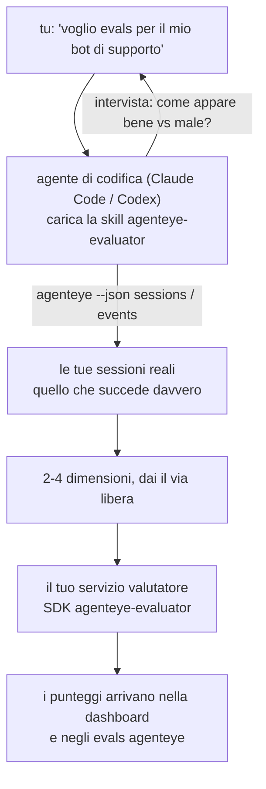

Passa da *"penso che il nostro agent a volte funzioni male"* a un servizio di scoring distribuito, con il tuo agente di codifica che decide e costruisce tutto. La **competenza valutatore osservabilità Failproof AI** (`agenteye-evaluator`) è un'*Agent Skill*: una piccola cartella di istruzioni che un agente di codifica come Claude Code o Codex carica su richiesta. Insegna all'agente a individuare quali dimensioni di qualità vale la pena tracciare per il *tuo* agente, quindi scrive, testa e distribuisce il [servizio valutatore](/it/agenteye/evaluation-suite) che le valuta.

**Non** è uno scorer ospitato, un registro dove caricare, o un sistema di plugin. Il tuo valutatore rimane un tuo servizio HTTP sulla tua infrastruttura, esattamente come descritto nella guida [Evaluation suite](/it/agenteye/evaluation-suite). La skill insegna solo al tuo agente a costruirlo bene, quindi tutto ciò che fa, potresti farlo tu stesso scrivendo lo stesso codice.

---

## La parte difficile è decidere cosa valutare

La superficie dell'SDK è piccola — un decorator e due modelli — e un agente può scrivere quello dal [contratto](/it/agenteye/evaluation-suite#http-contract) da solo. Non è lì che i valutatori falliscono. Falliscono perché valutano la cosa sbagliata, e un valutatore che valuta la cosa sbagliata è peggio di niente: produce una dashboard che tutti imparano a ignorare.

Quindi gran parte della skill è la parte prima che esista codice. Ha l'agente che ti intervista (*"descrivi un'esecuzione che è andata bene; ora una che è andata male"*), quindi estrae le tue sessioni reali attraverso il [`agenteye` CLI](/it/agenteye/cli) e le legge da cima a fondo. Queste due metà solitamente non concordano, e il divario è il punto: quello che intendi misurare rispetto a quello che i tuoi transcript possono effettivamente supportare. Una dimensione sopravvive solo se è **calcolabile** dagli eventi e **discriminante** — se ottiene 0.9 sia nella tua esecuzione buona che in quella cattiva, non insegna nulla e viene eliminata.

Quello che torna è una proposta di 2-4 dimensioni con il ragionamento allegato, per te per darti il via libera prima che venga scritta una riga.



---

## Come si relaziona con gli altri pezzi di valutazione

Quattro documenti coprono lo scoring e si passano il testimone in ordine:

| Pagina | Cos'è | Usala quando |
|---|---|---|
| **[Evaluations](/it/agenteye/evaluations)** | La funzione: punteggi sulla griglia delle sessioni, dashboard, rivaluta | Vuoi sapere cosa ottieni dal scoring automatico |
| **[Evaluation suite](/it/agenteye/evaluation-suite)** | Il contratto HTTP, l'SDK, le variabili d'ambiente del server | Stai implementando o debuggando il valutatore tu stesso |
| **Evaluator skill** (questo doc) | Una porta d'ingresso in linguaggio naturale sulla progettazione *e* costruzione dello scorer | Vuoi passare da "voglio evals" a un servizio in esecuzione |
| **[CLI skill](/it/agenteye/cli-skill)** | Una porta d'ingresso in linguaggio naturale sul CLI `agenteye` | Vuoi *leggere* i punteggi che hai già |
| **[Python SDK skill](/it/agenteye/python-sdk-skill)** | Una porta d'ingresso in linguaggio naturale sulla strumentazione del tuo agente | Il tuo agente non emette ancora sessioni — non c'è nulla da valutare |

### vs. la CLI skill: costruire versus leggere

Le due skill sono deliberatamente non sovrapposte, e installare entrambe è la configurazione normale — l'agente sceglie tra loro in base a quello che chiedi:

- **`agenteye-evaluator`** (questo doc) costruisce la cosa che *produce* punteggi. Il suo lavoro finisce quando i punteggi arrivano per la prima volta.
- **[`agenteye-cli`](/it/agenteye/cli-skill)** legge punteggi che già esistono (`agenteye evals`). *"La qualità è diminuita questa settimana?"* è la sua domanda, non quella di questa skill.

---

## Prerequisiti

1. **`agenteye` CLI installato e collegato** (`pipx install agenteye`, quindi `agenteye login`). La skill lo utilizza due volte: per estrarre le sessioni reali su cui progetta, e per confermare che i tuoi punteggi siano arrivati alla fine. Il tuo login ha bisogno di `events:read`, più `evaluations:read` per quel controllo finale. Come con la CLI skill, **non** può completare per te il login con codice monouso via email.
2. **Un posto dove il valutatore possa vivere.** Viene costruito in un'immagine ed eseguito come servizio a lunga durata, quindi ha bisogno di un vero repository, non di un file temporaneo. I valutatori spesso vivono nel loro proprio repository, separati dall'agente valutato — la skill cerca uno esistente e chiede prima di costruirne uno nuovo.
3. **La wheel dell'SDK `agenteye-evaluator`** — leggi la prossima sezione prima che il tuo agente cominci a digitare comandi `pip`.

---

## Dove trovarla

La skill è pubblicata nella collezione di skill pubblica di Failproof AI:

**[github.com/FailproofAI/skills](https://github.com/FailproofAI/skills)** → [`skills/agenteye-evaluator/`](https://github.com/FailproofAI/skills/tree/main/skills/agenteye-evaluator)

Il repository è pubblico e la skill non ha bisogno di nessuna credenziale sua — guida solo il CLI `agenteye` con la sessione con cui *tu* ti sei collegato, e scrive codice nel *tuo* repository. Nota che viene fornita come sua propria cartella e **non** è all'interno del pacchetto `pipx install agenteye`, quindi non cercarla lì.

## Installazione della skill

Il percorso più veloce è il CLI [`skills`](https://skills.sh), che recupera la cartella e la mette dove il tuo agente guarda:

```bash
# Claude Code, solo questo progetto
npx skills add FailproofAI/skills --skill agenteye-evaluator -a claude-code

# ogni progetto (installa in ~/.claude/skills/)
npx skills add FailproofAI/skills --skill agenteye-evaluator -a claude-code -g --copy

# Codex invece
npx skills add FailproofAI/skills --skill agenteye-evaluator -a codex
```

Quindi gestiscila come qualsiasi altra skill:

```bash
npx skills list -a claude-code           # cosa è installato
npx skills update agenteye-evaluator     # estrai l'ultima versione
npx skills remove agenteye-evaluator     # rimuovila
```

Preferisci installarla manualmente? Un'Agent Skill è solo una cartella contenente un `SKILL.md` (più riferimenti opzionali), quindi copiarla funziona anche:

- **Claude Code**: metti la cartella `agenteye-evaluator/` in `~/.claude/skills/` (ogni progetto) o `<your-repo>/.claude/skills/` (solo quel repository). Claude Code la scopre automaticamente — verifica con l'elenco `/skills`, o chiedi semplicemente gli evals.
- **Codex (OpenAI)**: Codex legge lo stesso `SKILL.md`. Il `agents/openai.yaml` incluso imposta `allow_implicit_invocation: true`, quindi Codex seleziona automaticamente la skill quando un'attività corrisponde; altrimenti invocala esplicitamente come `$agenteye-evaluator`.

---

## L'SDK non è su PyPI pubblico

> **Avvertenza:** Leggi questo prima di permettere a un agente di installare l'SDK.

La skill è pubblica; l'SDK che guida non lo è. `agenteye-evaluator` viene fornito solo come artefatto di rilascio privato, e a differenza di `agenteye`, il nome è **non rivendicato su PyPI pubblico** — quindi un semplice `pip install agenteye-evaluator` potrebbe estrarre il pacchetto di uno sconosciuto nel servizio che legge i tuoi transcript di produzione. Questo è un problema della catena di approvvigionamento, non un typo.

La skill lo sa e funziona lungo una scala di installazione invece, fermandosi al primo gradino che si applica: la fonte del monorepo se sei dentro il repository AgentEye, altrimenti la wheel di rilascio privata da GitHub Releases (ha bisogno di accesso), e se nessuno dei due è raggiungibile si **ferma e ti dice di chiedere al tuo contatto Failproof AI la wheel** piuttosto che improvvisare.

Quindi se il tuo agente propone un semplice `pip install agenteye-evaluator` da PyPI pubblico, questo è il segnale che la skill non ha mai caricato. Fermati lì e controlla che sia installata.

---

## Cosa puoi chiedere

Un vero percorso completo inizia con una richiesta vaga e finisce con un design firmato, non con codice:

```text
tu    ▸ Voglio evals per il nostro bot di supporto. Penso che a volte sia male.

agente ▸ Prima di scrivere qualcosa: descrivi un'esecuzione che è andata bene,
         e una che è andata male.

tu    ▸ Buona: risponde dalla documentazione. Cattiva: inventa cose,
        o si arrende e dice "contatta il supporto".

agente ▸ In esecuzione: agenteye --json sessions --status error --since 7d
         Lettura di 5 sessioni, incluse due che chiameresti cattive.

         Le tue parole dicono fattualità e deflazione. I transcript
         concordano sulla deflazione (2 su 5 finiscono con un trasferimento di supporto,
         ed è chiaro in model_response.content), ma la fattualità
         ha bisogno di una verità di base che i tuoi eventi non trasportano.

         Quindi valuterò tre cose:
           - deflation        regole, economico, separa i tuoi due run
           - tool_efficiency  regole, cattura il ciclo di ritentativi in run-004
           - groundedness     giudice LLM: ogni affermazione è nella documentazione che ha recuperato?

         "factuality" avrebbe bisogno di verità di base che non abbiamo; groundedness
         è la cosa più vicina che i tuoi transcript possono effettivamente supportare.
         Va bene con questi tre nomi? Rinominare dopo divide la cronologia.

tu    ▸ sì

agente ▸ Nessun valutatore in questo repository. Devo costruirne uno qui, o
         ne hai uno altrove?
```

Da lì scrive prima le dimensioni basate su regole (gratuite, istantanee, deterministiche), le testa rispetto a una sessione reale catturata incluse quelle vuote e mai terminate che bloccano i valutatori ingenui, e raggiunge un giudice LLM solo sulla dimensione soggettiva. Conosce i [limiti del dispatcher](/it/agenteye/evaluation-suite#configuring-the-server) — un timeout di 30 secondi e 8 chiamate concorrenti in tutto il deployment — quindi se il giudice non si adatterà in modo affidabile, va asincrono con `JobPending` piuttosto che lasciare che il tuo giudice venga cancellato e ritentato cinque volte a cinque volte il costo.

Quindi distribuisce, imposta le due variabili d'ambiente del server, e conferma con `agenteye --json evals --session-id <id>` che i punteggi siano effettivamente arrivati. I punteggi che arrivano sono l'unica prova.

---

## Cosa guardare

- **I nomi delle dimensioni sono quasi permanenti.** Le chiavi di punteggio sono stringhe arbitrarie e la piattaforma tende quello che invii, il che significa che nulla a valle corregge una scelta sbagliata. Rinominare dopo e la cronologia si divide: le sessioni vecchie mantengono la chiave vecchia e il trend si interrompe. Questo è il motivo per cui la skill ottiene l'approvazione esplicita prima di scrivere codice — prendi seriamente quel prompt.
- **Gli fixture sono veri transcript di produzione.** Progettare rispetto a sessioni reali significa estrarle su disco, e possono contenere dati dei clienti. La skill chiede prima di eseguirne il commit su git; se hai dubbi, mantieni `fixtures/` fuori dal repository e fai sì che ogni sviluppatore estragga i propri.
- **L'agente scrive e distribuisce un servizio che legge ogni transcript.** Agisce come te, delimitato dalle autorizzazioni del tuo login CLI, ma rivedi il valutatore come qualsiasi altro codice che tocca dati di produzione.

---

## Passaggi successivi

- **[Evaluation suite](/it/agenteye/evaluation-suite)**: il contratto HTTP, l'SDK e le variabili d'ambiente del server che la skill configura.
- **[Evaluations](/it/agenteye/evaluations)**: dove appaiono i punteggi una volta che arrivano.
- **[CLI skill](/it/agenteye/cli-skill)**: la skill gemella, per leggere i risultati piuttosto che costruire lo scorer.
- **[CLI](/it/agenteye/cli)**: il riferimento di comando dietro i dati di sessione su cui la skill progetta.