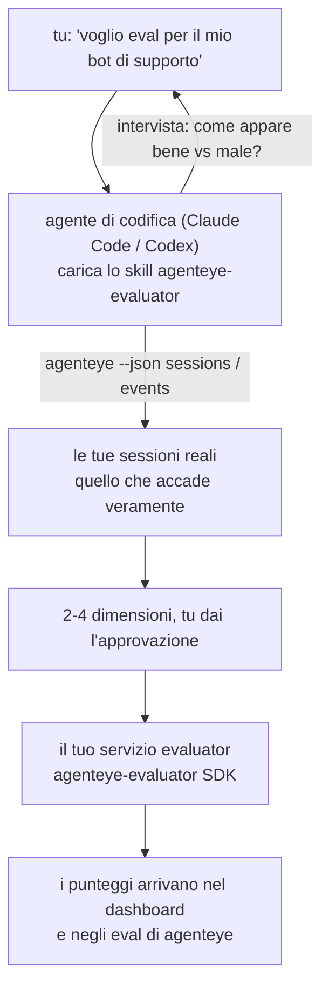

Passa da *"penso che il nostro agente sia a volte difettoso"* a un servizio di scoring distribuito, con il tuo agente di codifica che gestisce sia la decisione che la realizzazione. La **Failproof AI Observability evaluator skill** (`agenteye-evaluator`) è un *Agent Skill*: una piccola cartella di istruzioni che un agente di codifica come Claude Code o Codex carica on demand. Insegna all'agente a capire quali dimensioni di qualità vale la pena tracciare per il *tuo* agente, e quindi a scrivere, testare e distribuire il [servizio di valutazione](/it/agenteye/evaluation-suite) che li valuta.

**Non** è uno scorer ospitato, un registro in cui caricare dati, o un sistema di plugin. Il tuo evaluator rimane un tuo servizio HTTP sulla tua infrastruttura, esattamente come descritto nella guida [Evaluation suite](/it/agenteye/evaluation-suite). Lo skill insegna solo al tuo agente come costruirlo bene, perciò tutto quello che fa, potresti farlo tu stesso scrivendo lo stesso codice.

---

## La parte difficile è decidere cosa valutare

La superficie dell'SDK è piccola — un decoratore e due modelli — e un agente potrebbe scriverla dal [contratto](/it/agenteye/evaluation-suite#http-contract) da solo. Questo non è il punto in cui gli evaluator falliscono. Falliscono perché valutano la cosa sbagliata, e un evaluator che valuta la cosa sbagliata è peggio di nessuno: produce una dashboard che tutti imparano a ignorare.

Quindi la maggior parte dello skill è la parte prima che esista codice. Fa l'agente intervistarti (*"descrivi un'esecuzione che è andata bene; ora una che è andata male"*), quindi estrae le tue sessioni reali tramite la [`agenteye` CLI](/it/agenteye/cli) e le legge da capo a fondo. Questi due elementi di solito non concordano, e il gap è il punto: quello che intendi misurare versus quello che i tuoi transcript possono effettivamente supportare. Una dimensione sopravvive solo se è **calcolabile** dagli eventi e **discriminante** — se ottiene 0.9 sia sulla tua esecuzione buona che su quella cattiva, non insegna nulla e viene tagliata.

Quello che torna è una proposta di 2-4 dimensioni con il ragionamento allegato, per cui tu dai il tuo approvazione prima che venga scritta una sola riga.



---

## Come si relaziona agli altri pezzi di valutazione

Quattro documenti coprono il scoring, e si passano il testimone l'uno all'altro in ordine:

| Pagina | Che cosa è | Usalo quando |
|---|---|---|
| **[Evaluations](/it/agenteye/evaluations)** | La feature: punteggi sulla griglia delle sessioni, dashboard, rivalutazione | Vuoi sapere cosa ottieni dal scoring automatico |
| **[Evaluation suite](/it/agenteye/evaluation-suite)** | Il contratto HTTP, l'SDK, le variabili env del server | Stai implementando o debuggando l'evaluator tu stesso |
| **Evaluator skill** (questo documento) | Una porta d'ingresso in linguaggio naturale per progettare *e* costruire lo scorer | Vuoi andare da "voglio eval" a un servizio in esecuzione |
| **[CLI skill](/it/agenteye/cli-skill)** | Una porta d'ingresso in linguaggio naturale sulla `agenteye` CLI | Vuoi *leggere* i punteggi che hai già |
| **[Python SDK skill](/it/agenteye/python-sdk-skill)** | Una porta d'ingresso in linguaggio naturale sul strumento del tuo agente | Il tuo agente non sta ancora emettendo sessioni — non c'è nulla da valutare |

### vs. lo skill CLI: costruire versus leggere

I due skill sono deliberatamente non sovrapposti, e installare entrambi è la configurazione normale — l'agente sceglie tra loro in base a quello che chiedi:

- **`agenteye-evaluator`** (questo documento) costruisce la cosa che *produce* punteggi. Il suo compito finisce quando i punteggi arrivano per la prima volta.
- **[`agenteye-cli`](/it/agenteye/cli-skill)** legge i punteggi che già esistono (`agenteye evals`). *"La qualità è scesa questa settimana?"* è la sua domanda, non quella di questo skill.

---

## Prerequisiti

1. La **`agenteye` CLI installata e registrata** (`pipx install agenteye`, poi `agenteye login`). Lo skill si affida a essa due volte: per estrarre le sessioni reali su cui progetta, e per confermare che i tuoi punteggi sono arrivati alla fine. Il tuo login ha bisogno di `events:read`, più `evaluations:read` per quel controllo finale. Come per lo skill CLI, **non può** completare per te il login con codice monouso via email.
2. **Un posto dove vivere l'evaluator.** Viene costruito in un'immagine e eseguito come un servizio a lunga esecuzione, perciò ha bisogno di un vero repo, non di un file scratch. Gli evaluator spesso vivono nel proprio repo, separato dall'agente che viene valutato — lo skill cerca uno esistente e chiede prima di scaffolding uno nuovo.
3. **La wheel dell'`agenteye-evaluator` SDK** — leggi la sezione successiva prima che il tuo agente cominci a digitare comandi `pip`.

---

## Dove ottenerlo

Lo skill è pubblicato nella collezione di skill pubblici di Failproof AI:

**[github.com/FailproofAI/skills](https://github.com/FailproofAI/skills)** → [`skills/agenteye-evaluator/`](https://github.com/FailproofAI/skills/tree/main/skills/agenteye-evaluator)

Il repository è pubblico e lo skill non ha bisogno di credenziali proprie — guida solo la `agenteye` CLI con la sessione *che tu* hai registrato, e scrive codice nel *tuo* repo. Nota che viene fornito come sua propria cartella e **non** è dentro il pacchetto `pipx install agenteye`, quindi non cercarla lì.

## Installare lo skill

Il percorso più veloce è la CLI [`skills`](https://skills.sh), che recupera la cartella e la mette dove il tuo agente guarda:

```bash
# Claude Code, solo questo progetto
npx skills add FailproofAI/skills --skill agenteye-evaluator -a claude-code

# ogni progetto (installa in ~/.claude/skills/)
npx skills add FailproofAI/skills --skill agenteye-evaluator -a claude-code -g --copy

# Codex invece
npx skills add FailproofAI/skills --skill agenteye-evaluator -a codex
```

Poi gestiscilo come qualsiasi altro skill:

```bash
npx skills list -a claude-code           # cosa è installato
npx skills update agenteye-evaluator     # estrai l'ultima versione
npx skills remove agenteye-evaluator     # rimuovilo
```

Preferisci installarlo manualmente? Un Agent Skill è solo una cartella contenente un `SKILL.md` (più riferimenti opzionali), quindi copiarlo funziona anche:

- **Claude Code**: metti la cartella `agenteye-evaluator/` in `~/.claude/skills/` (ogni progetto) o `<your-repo>/.claude/skills/` (solo quel repo). Claude Code la scopre automaticamente — verifica con la lista `/skills`, o chiedi semplicemente eval.
- **Codex (OpenAI)**: Codex legge lo stesso `SKILL.md`. Lo `agents/openai.yaml` allegato imposta `allow_implicit_invocation: true`, quindi Codex auto-seleziona lo skill quando un compito corrisponde; altrimenti invocalo esplicitamente come `$agenteye-evaluator`.

---

## L'SDK non è su public PyPI

> **Avviso:** Leggi questo prima di lasciare che un agente installi l'SDK.

Lo skill è pubblico; l'SDK che guida non lo è. `agenteye-evaluator` viene fornito solo come artefatto di rilascio privato, e a differenza di `agenteye`, il nome è **non reclamato su public PyPI** — quindi un bare `pip install agenteye-evaluator` potrebbe estrarre il pacchetto di uno sconosciuto nel servizio che legge i tuoi transcript di produzione. Questo è un problema di supply-chain, non un errore di battitura.

Lo skill conosce questo e lavora su una scala di installazione invece, fermandosi al primo gradino che si applica: la fonte del monorepo se sei dentro il repo AgentEye, altrimenti la wheel di rilascio privato da GitHub Releases (ha bisogno di accesso), e se nessuno dei due è raggiungibile **si ferma e ti dice di chiedere al tuo contatto Failproof AI la wheel** piuttosto che improvvisare.

Quindi se il tuo agente propone un bare `pip install agenteye-evaluator` da public PyPI, questo è il segnale che lo skill non è mai stato caricato. Fermati lì e controlla che sia installato.

---

## Cosa puoi chiedergli

Un vero viaggio di andata e ritorno inizia con una richiesta vaga e finisce con una progettazione approvata, non con codice:

```text
tu    ▸ Voglio eval per il nostro bot di supporto. Penso che sia 
         a volte difettoso.

agente ▸ Prima di scrivere qualcosa: descrivi un'esecuzione che è 
         andata bene, e una che è andata male.

tu    ▸ Bene: risponde dalla documentazione. Male: inventa cose,
         o rinuncia e dice "contatta il supporto".

agente ▸ Esecuzione: agenteye --json sessions --status error --since 7d
         Leggendo 5 sessioni, comprese due che chiameresti cattive.

         Le tue parole dicono fattualità e deflession. I transcript
         concordano sulla deflession (2 di 5 terminano con un
         passaggio al supporto, ed è chiaro in model_response.content),
         ma la fattualità ha bisogno di una verità di base che i tuoi
         eventi non portano.

         Quindi valuterei tre cose:
           - deflection      regole, economico, separa i tuoi due run
           - tool_efficiency regole, cattura il retry loop in run-004
           - groundedness    giudice LLM: ogni affermazione è nella 
                             doc che ha recuperato?

         "factuality" avrebbe bisogno di verità di base che non 
         abbiamo; groundedness è la cosa più vicina che i tuoi 
         transcript possono effettivamente supportare.
         OK con questi tre nomi? La rinomina successiva spezza la 
         cronologia.

tu    ▸ sì

agente ▸ Nessun evaluator in questo repo. Dovrei scaffolding uno qui,
         o ne hai uno altrove?
```

Da lì scrive le dimensioni basate su regole per prime (gratis, istantanee, deterministiche), le testa su una sessione catturata reale incluse quelle vuote e mai finite che rompono gli evaluator ingenui, e raggiunge un giudice LLM solo sulla dimensione soggettiva. Conosce i [limiti del dispatcher](/it/agenteye/evaluation-suite#configuring-the-server) — un timeout di richiesta di 30s e 8 chiamate simultanee deployment-wide — quindi se il giudice non si adatta in modo affidabile, va asincrono con `JobPending` piuttosto che lasciare che il tuo giudice venga cancellato e ritentato cinque volte a cinque volte il costo.

Poi distribuisce, imposta le due variabili env del server, e conferma con `agenteye --json evals --session-id <id>` che i punteggi sono effettivamente arrivati. I punteggi che arrivano sono l'unica prova.

---

## A cosa stare attenti

- **I nomi delle dimensioni sono quasi permanenti.** Le chiavi di punteggio sono stringhe arbitrarie e la piattaforma tende quello che invii, il che significa che nulla a valle corregge una scelta sbagliata. Rinomina più tardi e la cronologia si spezza: le sessioni vecchie mantengono la vecchia chiave e la tendenza si rompe. Questo è il motivo per cui lo skill ottiene l'approvazione esplicita prima di scrivere codice — prendi quel prompt sul serio.
- **Le fixture sono veri transcript di produzione.** Progettare su sessioni reali significa estrarle su disco, e possono contenere dati dei clienti. Lo skill chiede prima di commitarle su git; se in dubbio, tieni `fixtures/` fuori dal repo e fai in modo che ogni sviluppatore estragga il suo.
- **L'agente scrive e distribuisce un servizio che legge ogni transcript.** Agisce come te, limitato dalle autorizzazioni del login della tua CLI, ma esamina l'evaluator come qualsiasi altro codice che tocca dati di produzione.

---

## Prossimi passi

- **[Evaluation suite](/it/agenteye/evaluation-suite)**: il contratto HTTP, l'SDK, e le variabili env del server che lo skill configura.
- **[Evaluations](/it/agenteye/evaluations)**: dove appaiono i punteggi una volta che arrivano.
- **[CLI skill](/it/agenteye/cli-skill)**: lo skill gemello, per leggere i risultati piuttosto che costruire lo scorer.
- **[CLI](/it/agenteye/cli)**: il riferimento dei comandi dietro i dati di sessione su cui lo skill progetta.