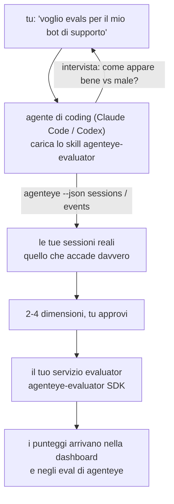

Da *"penso che il nostro agente a volte fallisca"* a un servizio di scoring deployato, con il tuo agente di coding che decide e costruisce entrambi. La **Failproof AI Observability evaluator skill** (`agenteye-evaluator`) è un *Agent Skill*: una piccola cartella di istruzioni che un agente di coding come Claude Code o Codex carica su richiesta. Insegna all'agente a capire quali dimensioni di qualità vale la pena tracciare per *il tuo* agente, quindi scrivere, testare e deployare il [servizio di evaluator](/it/agenteye/evaluation-suite) che le punteggia.

**Non** è uno scorer ospitato, un registro a cui caricare, o un sistema di plugin. Il tuo evaluator rimane tuo, un servizio HTTP sulla tua infrastruttura, esattamente come descritto nella guida [Evaluation suite](/it/agenteye/evaluation-suite). Lo skill insegna solo al tuo agente come costruirlo bene, quindi tutto ciò che fa, potresti farlo tu stesso scrivendo lo stesso codice.

---

## La parte difficile è decidere cosa punteggiare

La superficie dell'SDK è piccola — un decorator e due modelli — e un agente può scriverla dal [contratto](/it/agenteye/evaluation-suite#http-contract) da solo. Non è lì che gli evaluator falliscono. Falliscono perché punteggiano la cosa sbagliata, e un evaluator che punteggia la cosa sbagliata è peggio di niente: produce una dashboard che tutti imparano a ignorare.

Quindi la maggior parte dello skill è la parte prima che esista qualsiasi codice. Ha l'agente che ti intervista (*"descrivi un'esecuzione che è andata bene; ora una che è andata male"*), quindi estrae le tue sessioni reali attraverso la [`agenteye` CLI](/it/agenteye/cli) e le legge da cima a fondo. Queste due metà solitamente non concordano, e il divario è il punto: quello che intendi misurare rispetto a quello che i tuoi transcript possono effettivamente supportare. Una dimensione sopravvive solo se è **calcolabile** dagli eventi e **discriminante** — se punteggia 0.9 sia sulla tua esecuzione buona che su quella cattiva, non insegna nulla e viene eliminata.

Quello che ritorna è una proposta di 2-4 dimensioni con il ragionamento allegato, da approvarti prima che venga scritta una riga di codice.



---

## Come si collega agli altri pezzi di evaluation

Quattro documenti coprono lo scoring, e si passano il testimone in ordine:

| Pagina | Che cosa è | Usalo quando |
|---|---|---|
| **[Evaluations](/it/agenteye/evaluations)** | La feature: punteggi sulla griglia delle sessioni, dashboard, rivaluta | Vuoi sapere cosa ottenere dallo scoring automatico |
| **[Evaluation suite](/it/agenteye/evaluation-suite)** | Il contratto HTTP, l'SDK, le variabili di env del server | Stai implementando o debuggando l'evaluator tu stesso |
| **Evaluator skill** (questo doc) | Una porta in linguaggio naturale sulla progettazione *e* la costruzione dello scorer | Vuoi passare da "voglio evals" a un servizio in esecuzione |
| **[CLI skill](/it/agenteye/cli-skill)** | Una porta in linguaggio naturale sulla `agenteye` CLI | Vuoi *leggere* i punteggi che hai già |
| **[Python SDK skill](/it/agenteye/python-sdk-skill)** | Una porta in linguaggio naturale sulla strumentazione del tuo agente | Il tuo agente non sta ancora emettendo sessioni — non c'è nulla da punteggiare |

### vs. lo skill CLI: costruire versus leggere

I due skill sono deliberatamente non sovrapposti, e installare entrambi è la configurazione normale — l'agente sceglie tra loro in base a quello che chiedi:

- **`agenteye-evaluator`** (questo doc) costruisce la cosa che *produce* punteggi. Il suo lavoro finisce quando i punteggi arrivano per la prima volta.
- **[`agenteye-cli`](/it/agenteye/cli-skill)** legge punteggi che già esistono (`agenteye evals`). *"La qualità è scesa questa settimana?"* è la sua domanda, non quella di questo skill.

---

## Prerequisiti

1. **La `agenteye` CLI installata e loggata** (`pipx install agenteye`, quindi `agenteye login`). Lo skill si affida a essa due volte: per estrarre le sessioni reali su cui progetta, e per confermare che i tuoi punteggi sono arrivati alla fine. Il tuo login ha bisogno di `events:read`, più `evaluations:read` per quella verifica finale. Come con lo skill CLI, **non può** completare per te il login con codice monouso via email.
2. **Un posto per l'evaluator.** Viene costruito in un'immagine ed eseguito come servizio a lunga esecuzione, quindi ha bisogno di un repo reale, non di un file temporaneo. Gli evaluator spesso vivono nel loro repo, separato dall'agente che viene punteggiato — lo skill cerca uno esistente e chiede prima di eseguire lo scaffolding di uno nuovo.
3. **La wheel dell'SDK `agenteye-evaluator`** — leggi la sezione successiva prima che il tuo agente inizi a digitare comandi `pip`.

---

## Dove trovarla

Lo skill è pubblicato nella collezione di skill pubblici di Failproof AI:

**[github.com/FailproofAI/skills](https://github.com/FailproofAI/skills)** → [`skills/agenteye-evaluator/`](https://github.com/FailproofAI/skills/tree/main/skills/agenteye-evaluator)

Il repository è pubblico e lo skill non ha bisogno di credenziali proprie — guida solo la `agenteye` CLI con la sessione con cui *tu* ti sei loggato, e scrive codice nel *tuo* repo. Nota che è distribuito come sua propria cartella ed è **non** all'interno del pacchetto `pipx install agenteye`, quindi non cercarlo lì.

## Installare lo skill

Il percorso più veloce è la CLI [`skills`](https://skills.sh), che scarica la cartella e la mette dove il tuo agente cerca:

```bash
# Claude Code, solo questo progetto
npx skills add FailproofAI/skills --skill agenteye-evaluator -a claude-code

# ogni progetto (installa in ~/.claude/skills/)
npx skills add FailproofAI/skills --skill agenteye-evaluator -a claude-code -g --copy

# Codex invece
npx skills add FailproofAI/skills --skill agenteye-evaluator -a codex
```

Quindi gestiscilo come qualsiasi altro skill:

```bash
npx skills list -a claude-code           # cosa è installato
npx skills update agenteye-evaluator     # scarica l'ultima versione
npx skills remove agenteye-evaluator     # rimuovilo
```

Preferisci installare manualmente? Un Agent Skill è solo una cartella contenente un `SKILL.md` (più riferimenti opzionali), quindi copiarla funziona:

- **Claude Code**: metti la cartella `agenteye-evaluator/` in `~/.claude/skills/` (ogni progetto) o `<your-repo>/.claude/skills/` (solo quel repo). Claude Code la scopre automaticamente — verifica con la lista `/skills`, o chiedi semplicemente gli evals.
- **Codex (OpenAI)**: Codex legge lo stesso `SKILL.md`. L'`agents/openai.yaml` incluso imposta `allow_implicit_invocation: true`, quindi Codex seleziona automaticamente lo skill quando un compito corrisponde; altrimenti invocalo esplicitamente come `$agenteye-evaluator`.

---

## L'SDK non è su PyPI pubblico

> **Avvertenza:** leggi questo prima di permettere a un agente di installare l'SDK.

Lo skill è pubblico; l'SDK che guida non lo è. `agenteye-evaluator` è distribuito solo come artefatto di rilascio privato, e a differenza di `agenteye`, il nome è **non rivendicato su PyPI pubblico** — quindi un `pip install agenteye-evaluator` nudo potrebbe tirare il pacchetto di uno sconosciuto nel servizio che legge i tuoi transcript di produzione. È un problema di supply-chain, non un errore di digitazione.

Lo skill sa questo e scende invece una scala di installazione, fermandosi al primo gradino che si applica: il sorgente del monorepo se sei dentro il repo di AgentEye, altrimenti la wheel di rilascio privato da GitHub Releases (ha bisogno di accesso), e se nessuno dei due è raggiungibile **si ferma e ti dice di chiedere al tuo contatto di Failproof AI la wheel** piuttosto che improvvisare.

Quindi se il tuo agente propone un `pip install agenteye-evaluator` nudo da PyPI pubblico, questo è il segnale che lo skill non è mai stato caricato. Fermati lì e verifica che sia installato.

---

## Quello che puoi chiedergli

Un vero round-trip inizia con una richiesta vaga e termina con una progettazione approvata, non con il codice:

```text
tu    ▸ Voglio evals per il nostro bot di supporto. Penso che a volte fallisca.

agente ▸ Prima di scrivere anything: descrivi un'esecuzione che è andata bene,
        e una che è andata male.

tu    ▸ Buona: risponde dai documenti. Cattiva: inventa cose,
        o rinuncia e dice "contatta il supporto".

agente ▸ In esecuzione: agenteye --json sessions --status error --since 7d
        Leggo 5 sessioni, incluse due che chiameresti cattive.

        Le tue parole dicono fattualità e deflazione. I transcript
        concordano sulla deflazione (2 di 5 terminano con un passaggio al supporto,
        ed è evidente in model_response.content), ma la fattualità
        ha bisogno di una ground truth che i tuoi eventi non portano.

        Quindi punteggierei tre cose:
          - deflazione      regole, economica, separa i tuoi due run
          - efficienza_strumenti regole, cattura il loop di retry in run-004
          - grounding        giudice LLM: ogni affermazione è nei documenti che ha recuperato?

        "fattualità" avrebbe bisogno di ground truth che non abbiamo; grounding
        è la cosa più vicina che i tuoi transcript possono effettivamente supportare.
        OK con questi tre nomi? Rinominare dopo spezza la cronologia.

tu    ▸ sì

agente ▸ Nessun evaluator in questo repo. Dovrei eseguire lo scaffolding di uno qui, o ne
        hai uno altrove?
```

Da lì scrive prima le dimensioni basate su regole (gratuite, istantanee, deterministiche), le testa contro una sessione catturata reale incluse quelle vuote e mai finite che fanno crashare gli evaluator ingenui, e raggiunge un giudice LLM solo sulla dimensione soggettiva. Conosce i [limiti del dispatcher](/it/agenteye/evaluation-suite#configuring-the-server) — un timeout di richiesta di 30s e 8 chiamate simultanee a livello di deployment — quindi se il giudice non si adatterà in modo affidabile, va asincrono con `JobPending` piuttosto che lasciare che il tuo giudice venga cancellato e ritentato cinque volte a cinque volte il costo.

Quindi deploya, imposta le due variabili di env del server, e conferma con `agenteye --json evals --session-id <id>` che i punteggi sono effettivamente arrivati. I punteggi che arrivano sono l'unica prova.

---

## Cosa osservare

- **I nomi delle dimensioni sono quasi permanenti.** Le chiavi di punteggio sono stringhe arbitrarie e la piattaforma tende a quello che invii, il che significa che nulla downstream corregge una scelta sbagliata. Rinomina dopo e la cronologia si spezza: le sessioni vecchie mantengono la chiave vecchia e la tendenza si rompe. Per questo lo skill ottiene l'approvazione esplicita prima di scrivere codice — prendi quel prompt sul serio.
- **I fixture sono veri transcript di produzione.** Progettare contro sessioni reali significa estrarle su disco, e possono contenere dati dei clienti. Lo skill chiede prima di eseguirne il commit in git; se in dubbio, mantieni `fixtures/` fuori dal repo e fai estrarre a ogni sviluppatore il suo.
- **L'agente scrive e deploya un servizio che legge ogni transcript.** Agisce come te, limitato dalle permessi del tuo login CLI, ma esamina l'evaluator come qualsiasi altro codice che tocca i dati di produzione.

---

## Prossimi passi

- **[Evaluation suite](/it/agenteye/evaluation-suite)**: il contratto HTTP, l'SDK, e le variabili di env del server che lo skill configura.
- **[Evaluations](/it/agenteye/evaluations)**: dove i punteggi appaiono una volta che arrivano.
- **[CLI skill](/it/agenteye/cli-skill)**: lo skill gemello, per leggere i risultati piuttosto che costruire lo scorer.
- **[CLI](/it/agenteye/cli)**: il riferimento dei comandi dietro i dati della sessione su cui lo skill progetta.