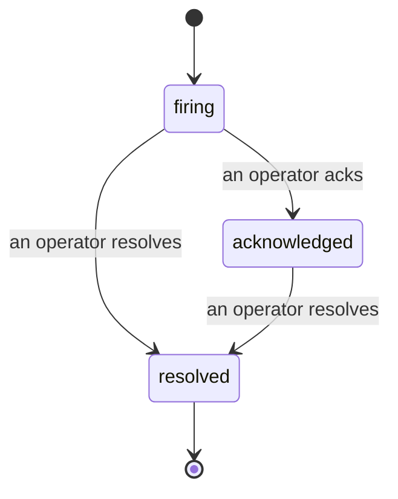

Quando un avviso si attiva, la prima domanda è sempre "chi se ne occupa?" Gli incident rispondono: nel momento in cui qualcosa viene violato, tutti possono vedere che l'incident è aperto, chi lo possiede e esattamente cosa è successo finora, con un registro pulito e attribuito che puoi passare direttamente a un post-mortem.

*L'inbox raggruppa gli incident aperti per stato e filtra per gravità e assegnatario, così vedi cosa necessita un intervento umano ora.*

## Sappi chi lo gestisce, a prima vista

Niente più "qualcuno sta guardando?" in un thread di chat. Una violazione apre automaticamente un incident e lo inserisce in un'inbox condivisa, raggruppato per stato. Confermalo e il tuo nome è su di esso, così il resto del team sa che è gestito. La conferma è condivisa: più operatori possono confermare lo stesso incident e ognuno è registrato separatamente, così un'intera sala guerra appare per nome invece di sovrapporsi. Assegna un proprietario per il triage e filtra l'inbox per gravità o assegnatario per ridurla a quello che è tuo.

## L'intera storia, in una sola timeline

Quando l'incident è finito, hai già il resoconto. Apri qualsiasi incident e ottieni l'evidenza della violazione, i suoi assegnatari e i sottoscritti, un thread di commenti per coordinare il tutto, e una timeline dell'attività in sola aggiunta.

*Tutto quello che è successo, in ordine, ogni riga firmata da chi l'ha fatto.*

Ogni azione (aperto, confermato, risolto, e così via) è scritta su quella timeline e mai modificata. Ogni voce è attribuita: all'operatore che l'ha intrapresa, per email, o a **automated** per qualsiasi cosa Failproof AI Observability abbia fatto da solo, come aprire l'incident sulla violazione. Niente è anonimo e niente è perso, così il post-mortem più o meno si scrive da solo.

## Come si muove un incident

- **Aperto (firing):** la violazione apre l'incident e notifica i tuoi canali una sola volta. Le violazioni ripetute si ripiegano nello stesso incident e aggiornano la sua evidenza invece di notificarti ancora e ancora.
- **Confermato:** un operatore se ne occupa. Rimane aperto e le violazioni successive aggiornano l'evidenza silenziosamente.
- **Risolto:** un operatore lo chiude. La risoluzione automatica quando la condizione si cancella è pianificata ma non ancora abilitata, quindi un incident rimane aperto finché un umano non lo risolve, il che mantiene tutti onesti su cosa sia stato effettivamente risolto. Un nuovo incident può aprirsi sullo stesso avviso in seguito.

Un avviso contiene al massimo un incident aperto alla volta, quindi una regola che oscillano non può sotterrarti di duplicati. Puoi anche aprire un incident manualmente: uno standalone per qualcosa che nessun avviso ha catturato, o uno collegato a un avviso esistente, se hai `incidents:write`.

## Dove trovarlo

Gli incident si trovano a `/<org-slug>/incidents`. La visualizzazione richiede **`incidents:read`**; aprire un incident manuale richiede **`incidents:write`**; confermare, assegnare, commentare e risolvere richiedono **`incidents:ack`**. Le chiavi più vecchie che hanno concesso il `alerts:ack` ritirato continuano a funzionare, poiché è onorato come `incidents:ack`, quindi il tuo turno on-call non ha bisogno di essere nuovamente emesso.

## Correlati

- [Avvisi](/it/agenteye/alerts): le regole che aprono questi incident quando una soglia viene violata.
- [Tracciamento errori](/it/agenteye/error-tracking): vedi ogni errore in un unico posto e promuovine uno a un avviso.
- [Audit](/it/agenteye/audits): l'analista pianificato che trova gli errori che nessuna regola stava osservando.