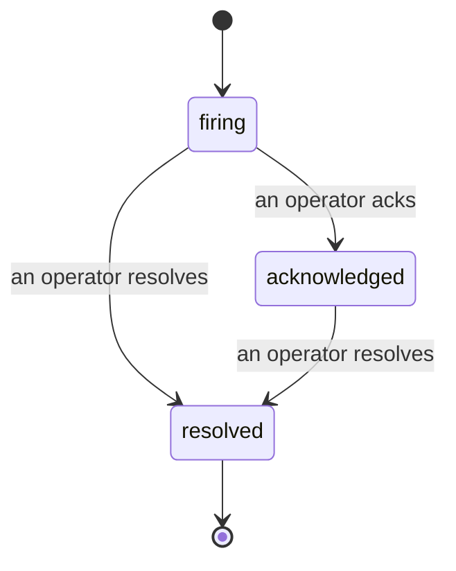

Quando un avviso si attiva, la prima domanda è sempre "chi se ne sta occupando?" Gli Incidents rispondono: nel momento in cui qualcosa viene rilevato, tutti possono vedere che l'incident è aperto, chi lo gestisce e esattamente cosa è successo finora, con un registro pulito e tracciato che puoi usare direttamente per la post-mortem.

*La inbox raggruppa gli incident aperti per stato e filtra per severità e assegnatario, così vedi cosa ha bisogno di attenzione umana subito.*

## Sapere chi se ne sta occupando, a colpo d'occhio

Niente più "qualcuno sta guardando questo?" in un thread di chat. Una violazione apre un incident automaticamente e lo inserisce in una inbox condivisa, raggruppato per stato. Riconoscilo e il tuo nome è su di esso, così il resto del team sa che è gestito. Il riconoscimento è condiviso: più operatori possono riconoscere lo stesso incident e ognuno viene registrato separatamente, così una sala di crisi completa appare per nome invece di sovrapporsi l'uno all'altro. Assegna un proprietario per il triage e filtra la inbox per severità o assegnatario per restringere a quello che è tuo.

## L'intera storia, in una timeline

Quando l'incident è finito, hai già il rapporto. Apri qualsiasi incident e ottieni le prove della violazione, i suoi assegnatari e sottoscrittori, un thread di commenti per coordinare direttamente e una timeline di attività in sola scrittura.

*Tutto quello che è successo, in ordine, ogni riga firmata da chi l'ha fatto.*

Ogni azione (aperto, riconosciuto, risolto e così via) viene scritta in quella timeline e mai modificata. Ogni voce è tracciata: all'operatore che l'ha eseguita, per email, o a **automated** per qualsiasi cosa Failproof AI Observability ha fatto da solo, come aprire l'incident sulla violazione. Niente è anonimo e niente è perso, così la post-mortem più o meno si scrive da sola.

## Come si muove un incident

- **Open (firing):** la violazione apre l'incident e pagina i tuoi canali una sola volta. Le violazioni ripetute si ripiegano nello stesso incident e aggiornano le prove invece di paginarti ancora e ancora.
- **Acknowledged:** un operatore se ne occupa. Rimane aperto e le violazioni successive aggiornano le prove silenziosamente.
- **Resolved:** un operatore lo chiude. La risoluzione automatica quando la condizione si cancella è pianificata ma non ancora abilitata, quindi un incident rimane aperto finché un umano non lo risolve, il che mantiene tutti onesti su cosa è effettivamente stato risolto. Un incident nuovo può aprirsi sullo stesso avviso più tardi.

Un avviso contiene al massimo un incident aperto alla volta, così una regola oscillante non può sommergerti di duplicati. Puoi anche aprire un incident a mano: uno standalone per qualcosa che nessun avviso ha catturato, o uno allegato a un avviso esistente, se hai `incidents:write`.

## Dove trovarlo

Gli Incidents si trovano a `/<org-slug>/incidents`. Visualizzare ha bisogno di **`incidents:read`**; aprire un incident manuale ha bisogno di **`incidents:write`**; riconoscere, assegnare, commentare e risolvere hanno bisogno di **`incidents:ack`**. Le chiavi più vecchie che hanno concesso il ritirato `alerts:ack` continuano a funzionare, poiché è riconosciuto come `incidents:ack`, così la tua rotazione on-call non ha bisogno di essere ristabilita.

## Correlati

- [Alerts](/it/agenteye/alerts): le regole che aprono questi incident quando una soglia viene superata.
- [Error tracking](/it/agenteye/error-tracking): vedi ogni errore in un unico posto e promuovi uno a avviso.
- [Audits](/it/agenteye/audits): l'analista programmato che trova gli errori che nessuna regola stava osservando.