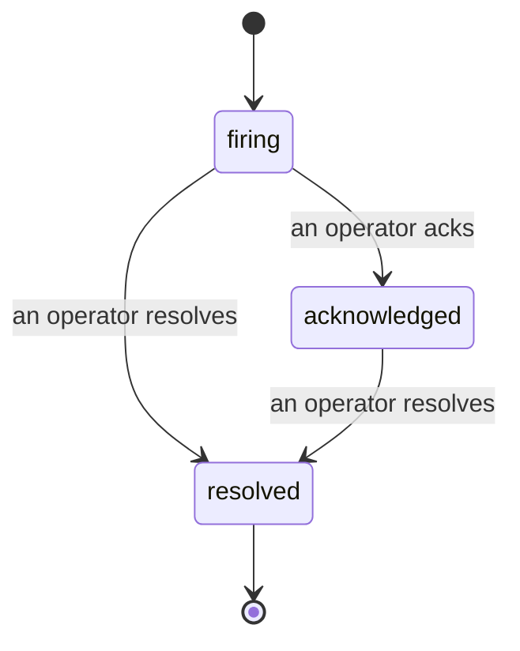

---
---
title: "Incidenti"
description: "Quando un avviso scatta, tutti possono vedere che l'incidente è aperto, chi lo gestisce e cosa è accaduto finora — su un'unica timeline attribuita."
---

Quando un avviso scatta, la prima domanda è sempre "chi se ne sta occupando?". Gli incidenti rispondono a questa domanda: nel momento in cui qualcosa viene rilevato, tutti possono vedere che l'incidente è aperto, chi lo gestisce e esattamente cosa è accaduto finora, con un registro pulito e attribuito che puoi consegnare direttamente a una riunione post-mortem.

*La inbox raggruppa gli incidenti aperti per stato e filtra per severità e assegnatario, in modo che tu veda cosa ha bisogno di un intervento umano ora.*

## Sapere chi la sta gestendo, a colpo d'occhio

Niente più "qualcuno sta guardando questo?" in un thread di chat. Una violazione apre automaticamente un incidente e lo inserisce in una inbox condivisa, raggruppata per stato. Riconoscilo e il tuo nome sarà su di esso, così il resto del team saprà che è gestito. Il riconoscimento è condiviso: più operatori possono riconoscere lo stesso incidente e ognuno viene registrato separatamente, così una vera guerra in sala riunioni appare con i nomi invece di calpestarsi a vicenda. Assegna un proprietario per il triage e filtra la inbox per severità o assegnatario per ridurla a quello che ti riguarda.

## L'intera storia, in una sola timeline

Quando l'incidente è finito, hai già il rapporto. Apri qualsiasi incidente e ottieni l'evidenza della violazione, i suoi assegnatari e sottoscrittori, un thread di commenti per coordinare sul posto e una timeline di attività di sola aggiunta.

*Tutto quello che è accaduto, in ordine, ogni riga firmata da chi l'ha fatto.*

Ogni azione (aperta, riconosciuta, risolta, ecc.) viene scritta su quella timeline e non viene mai modificata. Ogni voce è attribuita: all'operatore che l'ha eseguita, per email, o a **automated** per qualsiasi cosa abbia fatto Failproof AI Observability da solo, come aprire l'incidente sulla violazione. Niente è anonimo e niente va perso, quindi il post-mortem più o meno si scrive da solo.

## Come si muove un incidente

- **Open (firing):** la violazione apre l'incidente e invia una notifica ai tuoi canali una sola volta. Le violazioni ripetute si ripiegano nello stesso incidente e aggiornano la sua evidenza invece di inviarti notifiche più e più volte.
- **Acknowledged:** un operatore se ne occupa. Rimane aperto e i successivi avvisi aggiornano l'evidenza silenziosamente.
- **Resolved:** un operatore lo chiude. La risoluzione automatica quando la condizione si cancella è pianificata ma non ancora abilitata, quindi un incidente rimane aperto finché un umano non lo risolve, il che mantiene tutti onesti su ciò che è effettivamente stato risolto. Un nuovo incidente può aprirsi sullo stesso avviso in seguito.

Un avviso contiene al massimo un incidente aperto alla volta, quindi una regola oscillante non può sommergerti di duplicati. Puoi anche aprire un incidente manualmente: uno autonomo per qualcosa che nessun avviso ha catturato, o uno collegato a un avviso esistente, se hai `incidents:write`.

## Dove trovarlo

Gli incidenti si trovano su `/<org-slug>/incidents`. La visualizzazione richiede **`incidents:read`**; aprire un incidente manuale richiede **`incidents:write`**; riconoscere, assegnare, commentare e risolvere richiedono **`incidents:ack`**. Le chiavi precedenti che hanno concesso il `alerts:ack` ritirato continuano a funzionare, poiché viene onorato come `incidents:ack`, quindi la tua rotazione on-call non ha bisogno di essere riemessa.

## Correlati

- [Alerts](/it/agenteye/alerts): le regole che aprono questi incidenti quando una soglia viene violata.
- [Error tracking](/it/agenteye/error-tracking): vedi ogni errore in un unico posto e promuovine uno a un avviso.
- [Audits](/it/agenteye/audits): l'analista programmato che trova gli errori su cui nessuna regola stava guardando.