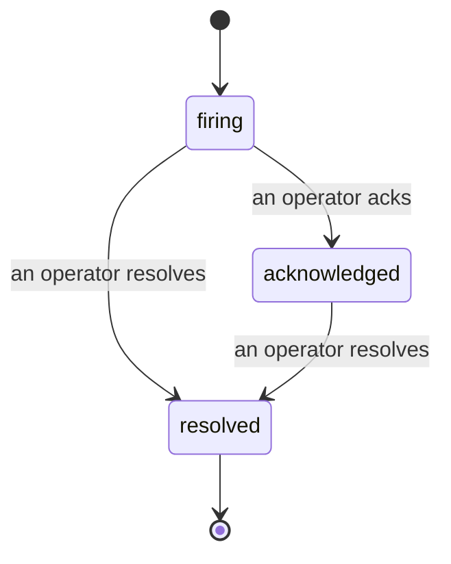

Quando un avviso si attiva, la prima domanda è sempre "chi se ne sta occupando?" Gli incidenti rispondono a questa domanda: nel momento in cui qualcosa viene rilevato, tutti possono vedere che l'incidente è aperto, chi ne è responsabile e esattamente cosa è accaduto finora, con un registro pulito e attribuito che puoi consegnare direttamente a un post-mortem.

*La casella di posta raggruppa gli incidenti aperti per stato e filtra per gravità e assegnatario, così vedi cosa necessita l'intervento umano adesso.*

## Sapere chi se ne sta occupando, a colpo d'occhio

Niente più "qualcuno sta guardando questo?" in un thread di chat. Una violazione apre automaticamente un incidente e lo inserisce in una casella di posta condivisa, raggruppato per stato. Riconoscilo e il tuo nome è su di esso, così il resto del team sa che è gestito. Il riconoscimento è condiviso: più operatori possono riconoscere lo stesso incidente e ciascuno viene registrato separatamente, quindi un'intera war room appare nominativamente invece di sovrapporsi. Assegna un proprietario per il triage e filtra la casella di posta per gravità o assegnatario per ridurla a quello che è tuo.

## L'intera storia, su una timeline

Quando l'incidente è finito, hai già la documentazione. Apri un qualsiasi incidente e ottieni la prova della violazione, i suoi assegnatari e sottoscrittori, un thread di commenti per coordinare sul posto, e una timeline di attività in sola aggiunta.

*Tutto ciò che è accaduto, in ordine, ogni riga firmata da chi l'ha fatto.*

Ogni azione (aperto, riconosciuto, risolto, e così via) viene scritta su quella timeline e non viene mai modificata. Ogni voce è attribuita: all'operatore che l'ha eseguita, tramite email, o ad **automated** per qualsiasi cosa abbia fatto Failproof AI Observability autonomamente, come aprire l'incidente sulla violazione. Nulla è anonimo e nulla è perso, quindi il post-mortem più o meno si scrive da solo.

## Come si muove un incidente

- **Open (firing):** la violazione apre l'incidente e avvisa i tuoi canali una volta. Le violazioni ripetute si uniscono nello stesso incidente e aggiornano la sua prova invece di avvisarti ancora e ancora.
- **Acknowledged:** un operatore se ne occupa. Rimane aperto, e le violazioni successive aggiornano la prova silenziosamente.
- **Resolved:** un operatore lo chiude. La risoluzione automatica quando la condizione si cancella è pianificata ma non ancora abilitata, quindi un incidente rimane aperto finché un umano non lo risolve, il che mantiene tutti onesti su cosa sia effettivamente stato risolto. Un incidente nuovo può aprirsi sullo stesso avviso in seguito.

Un avviso contiene al massimo un incidente aperto alla volta, quindi una regola instabile non può sommergerti di duplicati. Puoi anche aprire un incidente manualmente: uno autonomo per qualcosa che nessun avviso ha rilevato, oppure uno collegato a un avviso esistente, se hai `incidents:write`.

## Dove trovarlo

Gli incidenti si trovano in `/<org-slug>/incidents`. Visualizzare richiede **`incidents:read`**; aprire un incidente manuale richiede **`incidents:write`**; riconoscere, assegnare, commentare e risolvere richiedono **`incidents:ack`**. Le chiavi precedenti che concedevano il ritirato `alerts:ack` continuano a funzionare, poiché viene riconosciuto come `incidents:ack`, quindi la tua rotazione on-call non ha bisogno di essere riemessa.

## Correlati

- [Avvisi](/it/agenteye/alerts): le regole che aprono questi incidenti quando una soglia viene superata.
- [Error tracking](/it/agenteye/error-tracking): vedi ogni errore in un posto e promuovine uno a avviso.
- [Audits](/it/agenteye/audits): l'analista pianificato che trova gli errori che nessuna regola stava controllando.