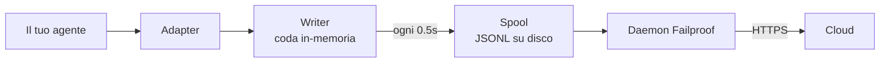

Per un agente che hai scritto tu stesso, o un framework per il quale Failproof AI non ha un adapter. Non c'è nulla da strumentare: tu emetti gli eventi.

Questa è la stessa API che i quattro adapter di framework chiamano internamente. Sono tabelle di traduzione su di essa.

## Installa

```bash
pip install failproofai-sdk
```

Nessun extra, nessuna dipendenza.

## Strumenta

```python
import failproofai_sdk

failproofai_sdk.configure(environment="production")

with failproofai_sdk.session():                 # una esecuzione
    with failproofai_sdk.agent("planner"):      # un'unità di lavoro
        with failproofai_sdk.tool_call("search", input={"q": q}) as t:
            t.output = search(q)                # una chiamata dello strumento
```

Leggi da cima a fondo e dice quello che significa:

| Avvolgi con | Per dire |
| --- | --- |
| `session()` | Questi eventi appartengono alla stessa esecuzione |
| `agent()` | Qualcosa sta svolgendo un lavoro — assegnale un nome che riconosceresti in un elenco |
| `tool_call()` | Questo è uno strumento, e ecco cosa ha restituito |

E cosa emette effettivamente ciascuno:

| Ambito | Emette | Scopo |
| --- | --- | --- |
| `session()` | Nulla | Associa un session id, raggruppando un'esecuzione |
| `agent()` | `agent_start`, `agent_end` | Racchiude un'unità di lavoro |
| `tool_call()` | `tool_use`, `tool_result` | Racchiude uno strumento e lo misura |

Tutto ciò che è contenuto può omettere `session_id` e `agent_id`. Gli ambiti vincolano l'identità su variabili di contesto e ogni chiamata di evento la legge di nuovo, quindi non devi mai passare gli id attraverso le tue funzioni.

Tutti e tre funzionano sia con `async with` che con `with`.

L'annidamento di agenti costruisce l'albero. `parent_id` e profondità sono calcolati dalla stack:

```python
with failproofai_sdk.session():
    with failproofai_sdk.agent("supervisor"):
        with failproofai_sdk.agent("researcher"):    # parent_id = "supervisor"
            ...
```

## Come un ambito si chiude

`agent()` gestisce le eccezioni per te:

| Cosa è successo | Eventi | Risultato |
| --- | --- | --- |
| Nulla lanciato | `agent_end` | `success` |
| `Exception` | `error`, poi `agent_end` | `failed` |
| `KeyboardInterrupt`, `SystemExit` | `error`, poi `agent_end` | `failed` |
| `CancelledError`, `GeneratorExit` | solo `agent_end` | `cancelled` |

L'errore è emesso prima di `agent_end`, perché il dashboard chiude lo span a `agent_end` e qualsiasi cosa dopo è attribuita a nulla. Una cancellazione non è un fallimento, quindi le esecuzioni cancellate non inquinano la superficie degli errori. L'eccezione è sempre lanciata di nuovo: un ambito non inghiotte mai.

## I metodi evento

Quindici metodi in sei famiglie. La maggior parte viene in coppia — emetti l'apertura, poi la chiusura, e l'SDK misura l'intervallo tra loro.

| Famiglia | Apre | Chiude | Indipendente |
| --- | --- | --- | --- |
| **Agenti** | `agent_start` | `agent_end` | — |
| | `agent_pause` | `agent_resume` | — |
| **Modelli** | `model_request` | `model_response` | — |
| **Strumenti** | `tool_use` | `tool_result` | — |
| **Hook** | `hook_triggered` | `hook_completed` | — |
| **Umani** | `human_wait` | `human_input` | `human_pause`, `human_interrupt` |
| **Fallimenti** | — | — | `error` |

<Tip>
  Preferisci gli ambiti — `agent()` e `tool_call()` — ovunque si adattino. Garantiscono l'evento di chiusura anche quando il corpo genera un'eccezione. Raggiungi questi metodi direttamente quando il tuo flusso di controllo non si annida, ad esempio una chiamata di modello dentro un helper.
</Tip>

<CodeGroup>
```python Agenti
failproofai_sdk.event.agent_start(agent_id="planner", goal="find the cheapest flight")
failproofai_sdk.event.agent_end(agent_id="planner", outcome="success", summary="...")
failproofai_sdk.event.agent_pause(pause_id="p1", reason="awaiting approval")
failproofai_sdk.event.agent_resume(pause_id="p1")
```

```python Modelli
failproofai_sdk.event.model_request(
    model="gpt-4o-mini",
    messages=[{"role": "user", "content": "..."}],
    request_id="req-1",
)
failproofai_sdk.event.model_response(
    model="gpt-4o-mini",
    content="...",
    input_tokens=139,
    output_tokens=21,
    request_id="req-1",
    duration_ms=5202,
)
```

```python Strumenti
failproofai_sdk.event.tool_use(tool_name="search", tool_call_id="c1", input={"q": "..."})
failproofai_sdk.event.tool_result(tool_name="search", tool_call_id="c1", output="...")
```

```python Hook
failproofai_sdk.event.hook_triggered(hook_name="retrieve", hook_id="h1", trigger_event="node")
failproofai_sdk.event.hook_completed(hook_name="retrieve", hook_id="h1", outcome="success")
```

```python Umani
failproofai_sdk.event.human_wait(input_id="i1", prompt="Approve?", options=["yes", "no"])
failproofai_sdk.event.human_input(input_id="i1", response="yes")
failproofai_sdk.event.human_pause(reason="operator paused the run", user_id="dana")
failproofai_sdk.event.human_interrupt(reason="operator stopped the run", at_step="step_3")
```

```python Fallimenti
failproofai_sdk.event.error(
    error_type="TimeoutError",
    message="provider timed out after 30s",
    traceback="...",
)
```
</CodeGroup>

<Note>
  **Le due famiglie umane puntano in direzioni opposte.**

  | Metodi | Significato |
  | --- | --- |
  | `human_wait` / `human_input` | L'**agente ha chiesto a una persona** — un gate di approvazione, una domanda di chiarimento |
  | `human_pause` / `human_interrupt` | Una **persona ha agito sull'agente** — un pulsante di arresto, una pausa dell'operatore |

  Nessun framework segnala la seconda coppia, quindi è sempre tuo compito emetterla.
</Note>

<Warning>
  **Passa `request_id` quando le chiamate di modello vengono eseguite contemporaneamente.** Senza di esso, le richieste e le risposte si abbinano in ordine di arrivo per agente — e le chiamate contemporanee si abbinano male, allegando ogni risposta alla richiesta sbagliata.
</Warning>

## Esempio

Un ciclo di chiamata di strumenti contro l'API di OpenAI, senza framework di agenti:

```python
import json

import failproofai_sdk
from openai import OpenAI

failproofai_sdk.configure(environment="production")
client = OpenAI()
MODEL = "gpt-4o-mini"


def turn(messages: list):
    """Una chiamata di modello, racchiusa dalla coppia."""
    failproofai_sdk.event.model_request(model=MODEL, messages=messages)
    reply = client.chat.completions.create(model=MODEL, messages=messages, tools=TOOLS)
    usage = reply.usage
    failproofai_sdk.event.model_response(
        model=MODEL,
        content=reply.choices[0].message.content or "",
        input_tokens=usage.prompt_tokens,
        output_tokens=usage.completion_tokens,
    )
    return reply.choices[0].message


with failproofai_sdk.session():
    with failproofai_sdk.agent("inventory", goal="price report"):
        for _ in range(4):          # limitato; un ciclo di agente illimitato è un suo bug
            message = turn(messages)
            if not message.tool_calls:
                break
            messages.append(message.model_dump(exclude_none=True))
            for call in message.tool_calls:
                args = json.loads(call.function.arguments or "{}")
                with failproofai_sdk.tool_call(
                    call.function.name, tool_call_id=call.id, input=args
                ) as handle:
                    handle.output = run_tool(call.function.name, args)
                messages.append({
                    "role": "tool",
                    "tool_call_id": call.id,
                    "content": str(handle.output),
                })
```

Questo produce gli stessi sei tipi di evento che un adapter ti darebbe. La versione completamente eseguibile, con le definizioni degli strumenti, è fornita nel repository SDK under `docs/manual/examples/`.

## Thread e async

Le variabili di contesto si propagano nei task asyncio automaticamente. Non si propagano nei nuovi thread, perché un thread inizia con un contesto vuoto.

```python
# asyncio: nulla da fare
async with failproofai_sdk.session():
    await asyncio.gather(worker(1), worker(2))

# thread: avvolgi il callable
pool.submit(failproofai_sdk.propagate(work), x)
threading.Thread(target=failproofai_sdk.propagate(work)).start()
loop.run_in_executor(None, failproofai_sdk.propagate(work), x)
```

Senza `propagate()`, gli eventi del worker generano un `TypeError` che nomina la correzione anziché atterrare su nessuna sessione. È intenzionale: un evento senza sessione è saltato dall'ingest e restituito `200`, che è il fallimento silenzioso che il livello di identità esiste per prevenire.

## Strumenta un framework senza un adapter

Ogni framework di agenti ti dà le stesse tre giunzioni. Mappale e hai una traccia completa — i quattro adapter forniti non fanno nulla di più che questo.

| La giunzione | Quello che scrivi | Quello che atterra |
| --- | --- | --- |
| L'esecuzione | `session()` + `agent()` | `agent_start`, `agent_end` |
| Ogni strumento | `tool_call()` | `tool_use`, `tool_result` |
| Ogni chiamata di modello | La coppia `model_*` | `model_request`, `model_response` |

<Steps>
  <Step title="Racchiudi l'esecuzione">
    ```python
    with failproofai_sdk.session():
        with failproofai_sdk.agent(agent_name, goal=task):
            result = framework.run(task)
    ```
  </Step>
  <Step title="Racchiudi ogni strumento">
    In qualsiasi cosa il framework chiami wrapper di strumento o middleware.

    ```python
    with failproofai_sdk.tool_call(name, input=args) as call:
        call.output = original(**args)
    ```
  </Step>
  <Step title="Accoppia ogni chiamata di modello">
    ```python
    failproofai_sdk.event.model_request(model=model, messages=messages)
    reply = provider.complete(...)
    failproofai_sdk.event.model_response(
        model=model,
        content=text,
        input_tokens=usage.prompt_tokens,
        output_tokens=usage.completion_tokens,
    )
    ```
  </Step>
</Steps>

<Tip>
  **Hai un confine di nodo, passo o middleware che vale la pena vedere?** Avvolgilo in una coppia di hook — `hook_triggered` / `hook_completed` — non in un `agent()` annidato. `agent_id` è una sfaccettatura a bassa cardinalità, e un'entry per nodo lo annega. Gli span hook si rendono allo stesso modo e ti danno latenza per nodo.
</Tip>

<Note>
  **Manuale e automatico si compongono.** Un adapter in esecuzione dentro un ambito scritto a mano si unisce a quella sessione e si aggancia a quell'agente, quindi ottieni un albero anziché due — utile quando strumenti un framework da solo insieme a uno supportato.
</Note>

<Accordion title="Perché non c'è un adapter AutoGen">
  Due motivi, e le tre giunzioni sopra sono la risposta ad entrambi:

  - `autogen-core` non è stata mantenuta dal settembre 2025.
  - AG2 non espone un punto di registrazione a livello di processo equivalente agli hook degli altri framework, quindi strumentarlo significa avvolgere ogni agente ad ogni sito di costruzione.

  Mappare le giunzioni a mano registra gli stessi eventi, con la stessa fedeltà, che un adapter fornito darebbe.
</Accordion>

## Approfondisci

Come la registrazione funziona effettivamente. Niente di tutto ciò è necessario per iniziare.

<AccordionGroup>

<Accordion title="Che aspetto ha una registrazione, per framework" icon="eye">

Ogni registrazione ha la stessa forma: uno span si apre, il lavoro si annida dentro, e ogni evento di apertura ne ottiene uno di chiusura.


La **coppia** è l'unità. Ogni evento di chiusura porta una durata che l'SDK misura dal suo evento di apertura.

Di seguito è una vera esecuzione per framework — catturata dagli esempi forniti con l'SDK, nome del modello normalizzato. Nota quanto ritorna da una singola chiamata.

<Tabs>
  <Tab title="LangGraph">
    ```text 14 eventi
     1  +0.000s  agent_start       LangGraph
     2  +0.001s    hook_triggered  agent
     3  +0.002s      model_request   gpt-4o-mini
     4  +3.023s      model_response  gpt-4o-mini · 21 token-out
     5  +3.024s    hook_completed  agent
     6  +3.024s    hook_triggered  tools
     7  +3.025s      tool_use      word_count
     8  +3.025s      tool_result   word_count · ok
     9  +3.025s    hook_completed  tools
    10  +3.026s    hook_triggered  agent
    11  +3.027s      model_request   gpt-4o-mini
    12  +5.717s      model_response  gpt-4o-mini · 5 token-out
    13  +5.720s    hook_completed  agent
    14  +5.721s  agent_end         LangGraph · success
    ```

    I nodi diventano coppie di hook, quindi ottieni la latenza per nodo senza che affollino l'elenco degli agenti.
  </Tab>

  <Tab title="CrewAI">
    ```text 10 eventi
     1  +0.000s  agent_start       crew
     2  +0.050s    agent_start     analyst · under crew
     3  +0.057s      model_request   gpt-4o-mini
     4  +3.475s      model_response  gpt-4o-mini · 19 token-out
     5  +3.478s      tool_use      lookup_metric
     6  +3.478s      tool_result   lookup_metric · ok
     7  +3.486s      model_request   gpt-4o-mini
     8  +5.694s      model_response  gpt-4o-mini · 9 token-out
     9  +5.727s    agent_end       analyst · success
    10  +5.739s  agent_end         crew · success
    ```

    Il `role` di ogni agente diventa il nome del suo span, quindi la latenza e la spesa di token si dividono per ruolo.
  </Tab>

  <Tab title="LlamaIndex">
    ```text 26 eventi
     1  +0.000s  agent_start       Agent
     2  +0.001s    hook_triggered  init_run
     4  +0.501s    hook_triggered  setup_agent
     6  +0.503s    hook_triggered  run_agent_step
     7  +0.505s      model_request   gpt-4o-mini
     8  +3.083s      model_response  gpt-4o-mini · 18 token-out
    10  +3.197s    hook_triggered  parse_agent_output
    12  +3.355s    hook_triggered  call_tool
    13  +3.355s      tool_use      city_population
    14  +3.355s      tool_result   city_population · ok
    16  +3.356s    hook_triggered  aggregate_tool_results
       ...                        seconda iterazione
    26  +7.038s  agent_end         Agent · success
    ```

    Il ciclo dell'agente stesso è visibile, non solo le sue chiamate di modello.
  </Tab>

  <Tab title="Pydantic AI">
    ```text 8 eventi
    1  +0.000s  agent_start       agent
    2  +0.001s    model_request   gpt-4o-mini
    3  +4.413s    model_response  gpt-4o-mini · 17 token-out
    4  +4.415s    tool_use        population
    5  +4.415s    tool_result     population · ok
    6  +4.416s    model_request   gpt-4o-mini
    7  +8.118s    model_response  gpt-4o-mini · 6 token-out
    8  +8.119s  agent_end         agent · success
    ```

    Nessuna coppia di hook: Pydantic AI non ha un confine di nodo o passo da racchiudere.
  </Tab>

  <Tab title="Agenti personalizzati">
    ```text 6 eventi
    1  +0.000s  agent_start       main
    2  +0.000s    tool_use        population
    3  +0.000s    tool_result     population · ok
    4  +0.000s    model_request   gpt-4o-mini
    5  +0.000s    model_response  gpt-4o-mini · 3 token-out
    6  +0.000s  agent_end         main · success
    ```

    Tu emetti questi. Stessi tipi di evento, stessa fedeltà — ti costa i siti di chiamata.
  </Tab>
</Tabs>

</Accordion>

<Accordion title="Come una sessione inizia e termina" icon="circle-play">

**Non c'è evento di chiusura sessione.** Una sessione non è qualcosa che chiudi — è un gruppo di eventi che condividono un `session_id`.

Lo stato è derivato dalla forma della traccia:

| Stato | Quando |
| --- | --- |
| `ongoing` | Almeno uno span è ancora aperto |
| `paused` | Un `agent_pause` non ha un corrispondente `agent_resume` |
| `error` | Nulla è aperto, e almeno un evento ha fallito |
| `done` | Nulla è aperto, e nulla ha fallito |

Quindi una sessione termina quando ogni coppia è chiusa. Gli adapter emettono `agent_end` per te, e in fase di teardown chiudono qualsiasi cosa ancora aperta e la contrassegnano come incompleta — un'esecuzione arrestata si assesta come `done` con un gap visibile anziché stare sospesa.

<Note>
  Questo è il motivo per cui una sessione può coprire due chiamate. Un `interrupt()` di LangGraph mette in pausa l'esecuzione, lo span radice rimane deliberatamente aperto, e la chiamata ripresa lo chiude. Entrambe le chiamate sono una sessione.
</Note>

</Accordion>

<Accordion title="Identità: session_id, agent_id, e chi li conia" icon="fingerprint">

`session_id` e `agent_id` sono opzionali in ogni metodo evento. Omessi, si risolvono dall'ambito che li racchiude:

```python
with failproofai_sdk.session():
    with failproofai_sdk.agent("planner"):
        failproofai_sdk.event.tool_use(tool_name="search", tool_call_id="c1")
```

Pasarli esplicitamente funziona ancora e ha precedenza. Senza nulla vincolato e nulla passato, la chiamata genera un `TypeError` che nomina la correzione anziché emettere un evento senza sessione, che l'ingest salterebbe mentre restituisce `200`.

Gli ambiti vincolano l'identità su variabili di contesto. Queste si propagano nei task asyncio automaticamente ma non nei nuovi thread — avvolgi un worker in `failproofai_sdk.propagate()`.

#### Chi conia quale id

| Id | Coniato da | Note |
| --- | --- | --- |
| `session_id` | Tu, o l'SDK | `session("chat-42")` è usato verbatim; omesso, l'SDK genera un `uuid4().hex` |
| `agent_id` | Tu, o il framework | Da `agent("analyst")`, un `role` di CrewAI, un `FunctionAgent.name`. Un valore che somiglia a UUID è rifiutato e sostituito |
| `tool_call_id`, `hook_id`, `request_id` | Tu, o il framework | Gli adapter riutilizzano gli id di esecuzione propri del framework, motivo per cui le coppie sopravvivono ai salti di thread |
| **Id evento** | **Cloud, in ingest** | L'SDK non ne emette alcuno |
| **`dedup_key`** | **Cloud, in ingest** | Un hash di org, sessione, timestamp, tipo e payload. Questa è l'identità reale — rende un batch ritentato collassato anziché duplicato |

#### Come gli adapter risolvono `session_id`

La prima corrispondenza vince:

1. Un `session_id` esplicito
2. Metadati per-chiamata
3. L'ambito `session()` che lo racchiude
4. Metadati del framework
5. L'id di esecuzione proprio del framework

Non è mai inventato mentre uno di questi esiste — un id sintetizzato dividerebbe un'esecuzione su più sessioni.

#### Mantieni `agent_id` a bassa cardinalità

È la sfaccettatura primaria su ogni superficie del dashboard, e una colonna `LowCardinality(String)`. Un valore per-esecuzione degrada la colonna e riempie il dropdown del filtro con un'entry per esecuzione.

Gli adapter difendono quella colonna per te:

| Il framework consegna | Registrato come | Perché |
| --- | --- | --- |
| `3f9a1c2b-…` (un UUID) | `main` | Nulla di leggibile da conservare |
| Una lunga stringa hex nuda | `main` | Uguale |
| `agent-3f9a1c2b-…` | `agent` | Id per-esecuzione rimosso, parte leggibile conservata |
| `agent-v2` | `agent-v2` | Brevi segmenti sono lasciati soli |
| `step-3` | `step-3` | Uguale |

L'id reale è conservato su `fw_agent_id` / `fw_run_id`, dove rimane interrogabile senza essere una sfaccettatura.

<Warning>
  **Questa guardia tocca solo etichette che il *framework* ha scelto.** Un `agent_id` che passi tu stesso — a `event.*`, o a `failproofai_sdk.agent(...)` — è registrato esattamente come dato. Riscrivere silenziosamente un argomento esplicito sarebbe peggio della cardinalità che previene, quindi nomina i tuoi span di conseguenza.
</Warning>

</Accordion>

<Accordion title="Tipi di evento, raggruppati — e quale framework registra cosa" icon="table">

| Gruppo | Eventi |
| --- | --- |
| Agenti | `agent_start`, `agent_end`, `agent_pause`, `agent_resume` |
| Modelli | `model_request`, `model_response` |
| Strumenti | `tool_use`, `tool_result` |
| Hook | `hook_triggered`, `hook_completed` |
| Umani | `human_wait`, `human_input`, `human_pause`, `human_interrupt` |
| Fallimenti | `error` |

Quale framework registra cosa, misurato dalle esecuzioni sopra:

| Evento | LangGraph | CrewAI | LlamaIndex | Pydantic AI | Personalizzato |
| --- | :--: | :--: | :--: | :--: | :--: |
| Inizio e fine dell'agente | Sì | Sì | Sì | Sì | Tu |
| Richiesta e risposta del modello | Sì | Sì | Sì | Sì | Tu |
| Uso e risultato dello strumento | Sì | Sì | Sì | Sì | Tu |
| Hook attivato e completato | Nodo | Attività | Passo | — | Tu |
| Errore | Sì | Sì | Sì | Sì | Automatico |
| Attesa umana e input | Sì | Sì | Sì | — | Tu |
| Pausa e ripresa dell'agente | Sì | Sì | Sì | — | Tu |

Un trattino significa che il framework non ha un tale concetto. `human_pause` e `human_interrupt` descrivono una *persona* che agisce sull'agente, che nessun framework segnala — emettili tu stesso.

</Accordion>

<Accordion title="Coppie, correlazione e durata" icon="link">

Un evento non arriva mai solo. Uno apre uno span, uno lo chiude, e l'evento di chiusura porta una durata che l'SDK misura dal suo evento di apertura.

| Apre | Chiude | L'evento di chiusura porta |
| --- | --- | --- |
| `agent_start` | `agent_end` | `outcome`, `summary` |
| `model_request` | `model_response` | token, `stop_reason`, latenza |
| `tool_use` | `tool_result` | `output` o `error`, durata |
| `hook_triggered` | `hook_completed` | `outcome`, durata |
| `agent_pause` | `agent_resume` | quanto è durata la pausa |
| `human_wait` | `human_input` | la risposta, e quanto tempo la persona ha impiegato |

<Warning>
  Un evento di apertura senza uno di chiusura è uno span che non finisce mai. La sessione si rende come ancora in esecuzione, per sempre, e la sua durata attiva continua a crescere. Questo è il modo di fallimento da osservare quando strumenti a mano.
</Warning>

#### Regole di correlazione

- Riutilizza lo stesso `tool_call_id`, `hook_id`, `pause_id`, o `input_id` per l'evento di completamento corrispondente.
- L'SDK calcola `duration_ms` per `tool_result`, `hook_completed`, `agent_resume`, e `human_input`. Passarlo a questi metodi genera `ValueError`.
- `duration_ms` **è** accettato su `model_response`, perché solo il chiamante conosce la vera latenza del provider. Deve essere un intero — un float genera `ValueError` al sito di chiamata, perché il server legge la colonna come un intero senza segno a 32 bit e memorizzerebbe NULL per qualsiasi cosa diversa.
- Le chiavi di correlazione sono scoped per genere e sessione, quindi una chiamata di strumento e un hook possono condividere un id in sicurezza, e due sessioni contemporanee possono riutilizzare gli stessi id senza collisioni. Non sono scoped per agente: una coppia aperta sotto un agente e chiusa sotto un altro ancora si correla, che è il caso ordinario nei framework multi-agente.
- `request_id` accoppia `model_request` con `model_response`. Senza di esso, gli eventi di modello si abbinano in ordine per agente, quindi le chiamate contemporanee si abbinano male.
- Una coppia divisa tra processi ancora si correla a valle, ma l'SDK non può calcolarne la durata in-processo.
- La mappa in sospeso contiene al massimo 10.000 avviamenti e elimina l'entry più vecchia quando è piena.

</Accordion>

<Accordion title="Cosa c'è nel pacchetto, e come instrument() trova il tuo framework" icon="box">

Installare `failproofai-sdk` installa tutto, tutti e quattro gli adapter inclusi. Gli extra tirano il **framework**, non l'adapter.

```python
import failproofai_sdk        # non carica nulla fuori dalla libreria standard
failproofai_sdk.instrument()  # importa solo gli adapter che effettivamente usi
```

`import failproofai_sdk` è contrattualmente zero-dipendenza, applicato da un test che installa la wheel costruita con `--no-deps` e un altro che prova che nessun framework raggiunge `sys.modules`.

<Warning>
  Non c'è un attributo `failproofai_sdk.crewai`. Gli adapter sono deliberatamente non esposti sul package di livello superiore: toccare uno importerebbe il framework come effetto collaterale di un accesso agli attributi, rompendo la promessa di zero-dipendenza. Usa `instrument()`.
</Warning>

```python
failproofai_sdk.instrument()              # ogni framework già importato
failproofai_sdk.instrument("crewai")      # esattamente uno, per nome
failproofai_sdk.uninstrument("crewai")    # rimettilo come era
```

| Nome | Accetta anche |
| --- | --- |
| `langchain` | `langgraph`, `langchain_core` |
| `crewai` | — |
| `llama_index` | `llamaindex`, `llama-index` |
| `pydantic_ai` | `pydantic-ai`, `pydanticai` |

L'auto-rilevamento legge `sys.modules`, non l'elenco dei pacchetti installati, quindi un framework che hai installato ma mai importato non è strumentato e non è mai importato per tuo conto. Per vedere cosa è collegato:

```python
from failproofai_sdk.integrations import active, available

available()   # ('crewai', 'langchain', 'llama_index', 'pydantic_ai')
active()      # ('langchain',)
```

<Note>
  **`instrument("crewai")` su una macchina senza CrewAI non genera.** Registra un avviso e restituisce `()`, quindi un framework mancante non fa mai cadere un processo che strumenta anche altri.

  L'avviso porta il sottostante `ImportError`, e quel messaggio nomina il comando di installazione esatto — così la correzione è nei tuoi log, non nascosta.

  ```text
  ImportError: failproofai_sdk: cannot instrument 'crewai' because 'crewai.events'
  is not importable. Install it with:  pip install 'failproofai_sdk[crewai]'
  ```

  Imposta `FAILPROOFAI_SDK_STRICT=1` affinché generi al contrario. Quel flag è letto **una sola volta e cachato**, quindi esportalo prima che il tuo processo inizi anziché impostarlo mid-run.
</Note>

<Warning>
  **`instrument()` deve venire *dopo* il tuo import del framework.** L'auto-rilevamento legge `sys.modules`, quindi una chiamata nuda sopra l'import trova nulla, installa nulla, e restituisce `()`.
</Warning>

<CodeGroup>
```python Sbagliato
import failproofai_sdk
failproofai_sdk.instrument()   # sys.modules non ha langchain ancora -> ()

import langchain               # troppo tardi, nulla è cablato
```

```python Giusto
import langchain               # importa il framework per primo
import failproofai_sdk

failproofai_sdk.instrument()   # lo trova -> ('langchain',)
```

```python Giusto, order-proof
import failproofai_sdk

# Nominarlo importa l'adapter su richiesta, quindi questo funziona da qualsiasi parte.
failproofai_sdk.instrument("langchain")
```
</CodeGroup>

Fai male e il processo viene eseguito con l'SDK importato, l'adapter apparentemente installato, e **nemmeno un evento emesso**. Registra un avviso dicendo esattamente quello — quindi controlla i tuoi log per primo quando un'esecuzione non registra nulla.

</Accordion>

<Accordion title="Come gli eventi raggiungono Cloud" icon="cloud-upload">



| Fase | Compito | Eseguita in |
| --- | --- | --- |
| Adapter | Traduce un callback del framework in uno dei 15 tipi di evento | Il tuo processo |
| Writer | Accoda, raggruppa, scrive JSONL atomicamente | Il tuo processo, thread di background |
| Spool | Consegna duratura, sopravvive all'uscita del tuo processo | Disco locale |
| Daemon | Guarda lo spool, spedisce batch, cancella quello che ha spedito | La tua macchina |
| Ingest | Assegna un id riga e dedup key, promuove colonne interrogabili | Cloud |

Lo spool è quello che rende questo sicuro: il tuo agente non si blocca mai sulla rete, e un'interruzione di Cloud significa una directory in crescita anziché eventi persi.

Ogni flush scrive un file batch, `.tmp` per primo, poi `fsync`, poi un rename atomico:

```text
~/.failproofai/custom-agents/events/
  event-2026-08-20T10-15-00-123Z-48213-0.jsonl
```

Il daemon raccoglie solo `.jsonl`, quindi non può mai leggere un file scritto a metà. Lo stem porta un timestamp, id processo e numero di sequenza, quindi due processi che flushano nello stesso millisecondo non possono collisioni. La coda è limitata a 10.000 eventi; passato questo i più vecchi sono scartati e registrati.

<Warning>
  **`collector.redact` non si applica ai tuoi eventi SDK.** Non li vede mai.
</Warning>

Il daemon **spedisce** i tuoi batch. Non li apre o li riscrive.

| Eventi | Scritti da | Redatti da `collector.redact`? |
| --- | --- | --- |
| Trascritti di sessione CLI | Il daemon | Sì |
| Attività hook | Il daemon | Sì |
| **Tutto ciò che l'SDK emette** | **Il tuo processo** | **No** |

La redazione viene eseguita dove il daemon *scrive* i suoi propri eventi — non dove i batch sono *spediti*. Quindi un prompt o un argomento di strumento che tiene una chiave API ancora la tiene all'arrivo.

È deliberato. Queste sono le tue stesse chiamate di strumentazione, e riscriverle in transito significherebbe che gli eventi che ricevi non sono gli eventi che hai emesso.

<Tip>
  **Controlli i payload alla sorgente, in due posti:**

  - Spegni la cattura di contenuto sull'adapter. **Il nome dell'opzione differisce, e un adapter non ne ha alcuno** — non è un singolo interruttore universale:
    - LangChain / LangGraph, Pydantic AI — `capture_content=False`
    - LlamaIndex — `capture_messages=False`
    - CrewAI — **nessuno switch di contenuto**; `session_id` è l'unica opzione che legge, quindi i prompt e i completamenti sono sempre registrati.

    `instrument()` scarta le opzioni che un adapter non legge, quindi passare il nome sbagliato non genera nulla e non cambia nulla.
  - Non consegnare il segreto a `input=` in primo luogo.

  `collector.redact` non è un sostituto per nessuno dei due.
</Tip>

<Warning>
  **Una directory spool vuota è lo stato salutistico.** Non usarla per controllare la consegna.
</Warning>

Il daemon cancella ogni batch entro millisecondi dalla sua spedizione, quindi un `ls` corre il collector e mostra una frazione di ciò che hai emesso — indistinguibile da un SDK che non ha registrato nulla.

Per confermare che gli eventi effettivamente atterrano, controlla il dashboard. Per osservare lo spool riempirsi, ferma prima il daemon.

</Accordion>

<Accordion title="Quando la strumentazione fallisce" icon="triangle-alert">

Ogni callback viene eseguito dentro un wrapper il cui unico compito è lanciare di nuovo, quindi la tua chiamata sta esattamente in un `try` e tutto ciò che l'SDK fa accade al di fuori di esso.

| Cosa succede | Risultato |
| --- | --- |
| Un hook genera | Registrato una volta con il suo traceback. La tua chiamata non è interessata |
| Lo stesso hook genera tre volte | Quell'hook è disabilitato per il resto del processo, con una riga di errore |
| `FAILPROOFAI_SDK_STRICT=1` è impostato | L'eccezione è lanciata di nuovo al contrario |
| Una versione di framework è fuori dall'intervallo testato | Avvisa una volta, strumenta comunque |
| Una singola capacità è mancante | Quell'hook è disabilitato, mai l'intero adapter |

Il default è giusto in produzione e sbagliato mentre esegui il debug, perché può solo mai provare "non è crashato". Imposta `FAILPROOFAI_SDK_STRICT=1` per rendere un fallimento ingoiato rumoroso.

</Accordion>

</AccordionGroup>

## Problemi comuni

<AccordionGroup>
  <Accordion title="Uno span non finisce mai">
    Un evento di apertura non ha uno di chiusura: un `model_request` senza `model_response`, o un `tool_use` senza `tool_result`. Usa gli ambiti, che garantiscono la coppia anche quando il corpo genera. Se chiami i metodi evento direttamente, usa `try` e `finally`.
  </Accordion>

  <Accordion title="Passare duration_ms genera ValueError">
    È misurato dall'evento di apertura corrispondente, quindi è rifiutato su `tool_result`, `hook_completed`, `agent_resume`, e `human_input`. È accettato su `model_response`, perché solo tu conosci la vera latenza del provider, e deve essere un intero.
  </Accordion>

  <Accordion title="Gli eventi da un thread di worker generano TypeError">
    Il thread non ha mai ereditato il contesto. Avvolgi il callable in `failproofai_sdk.propagate()`. Vedi [Thread e async](#thread-e-async).
  </Accordion>

  <Accordion title="Un campo extra è scomparso o ha sovrascritto qualcosa">
    I campi extra si fondono ultimi, quindi uno denominato come un campo reale come `model` o `outcome` lo sovrascriverebbe e cambierebbe una colonna memorizzata. Spazianomina i tuoi; gli adapter usano un prefisso `fw_`.
  </Accordion>

  <Accordion title="Il filtro dell'agente ha migliaia di entry">
    `agent_id` è una sfaccettatura a bassa cardinalità e ci hai messo un id di esecuzione. Usa un nome di ruolo o nodo e metti l'id reale in un campo di payload.
  </Accordion>
</AccordionGroup>

## Avanti

<Columns cols={3}>
  <Card title="Come funziona" icon="workflow" href="/it/reference/custom-agents">
    Coppie, id, ciclo di vita della sessione, e consegna.
  </Card>
  <Card title="Leggi una traccia" icon="route" href="/it/sessions/read-a-trace">
    Segui la causalità attraverso la sessione che hai appena catturato.
  </Card>
  <Card title="Adapter di framework" icon="plug" href="/it/start/integrations">
    LangGraph, CrewAI, LlamaIndex, e Pydantic AI.
  </Card>
</Columns>