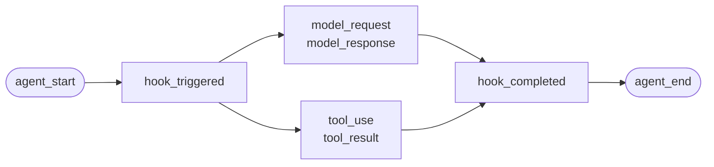
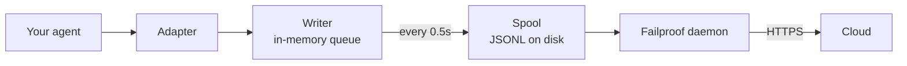

Per un agente che hai scritto tu stesso, o un framework per il quale Failproof AI non ha un adapter. Non c'è nulla da strumentare: tu emetti gli eventi.

Questa è la stessa API che i quattro adapter del framework chiamano internamente. Sono tabelle di traduzione su di essa.

## Installa

```bash
pip install failproofai-sdk
```

Nessun extra, e nessuna dipendenza.

## Strumenta

```python
import failproofai_sdk

failproofai_sdk.configure(environment="production")

with failproofai_sdk.session():                 # one run
    with failproofai_sdk.agent("planner"):      # one unit of work
        with failproofai_sdk.tool_call("search", input={"q": q}) as t:
            t.output = search(q)                # one tool call
```

Leggilo dall'alto al basso e dice quello che significa:

| Avvolgilo in | Per dire |
| --- | --- |
| `session()` | Questi eventi appartengono alla stessa esecuzione |
| `agent()` | Qualcosa sta facendo lavoro — dagli un nome che riconosceresti in una lista |
| `tool_call()` | Questo è uno strumento, e ecco cosa ha restituito |

E quello che ognuno effettivamente emette:

| Ambito | Emette | Scopo |
| --- | --- | --- |
| `session()` | Niente | Associa un session id, raggruppando un'esecuzione |
| `agent()` | `agent_start`, `agent_end` | Racchiude un'unità di lavoro |
| `tool_call()` | `tool_use`, `tool_result` | Racchiude uno strumento e lo misura |

Tutto ciò che è dentro può omettere `session_id` e `agent_id`. Gli ambiti associano l'identità su variabili di contesto e ogni chiamata di evento la legge di nuovo, quindi non devi mai passare gli id attraverso le tue funzioni.

Tutti e tre funzionano con `async with` così come con `with`.

Annidare gli agenti costruisce l'albero. `parent_id` e la profondità vengono calcolati dallo stack:

```python
with failproofai_sdk.session():
    with failproofai_sdk.agent("supervisor"):
        with failproofai_sdk.agent("researcher"):    # parent_id = "supervisor"
            ...
```

## Come si chiude un ambito

`agent()` gestisce le eccezioni per te:

| Cosa è successo | Eventi | Risultato |
| --- | --- | --- |
| Niente sollevato | `agent_end` | `success` |
| `Exception` | `error`, poi `agent_end` | `failed` |
| `KeyboardInterrupt`, `SystemExit` | `error`, poi `agent_end` | `failed` |
| `CancelledError`, `GeneratorExit` | solo `agent_end` | `cancelled` |

L'errore viene emesso prima di `agent_end`, perché la dashboard chiude lo span a `agent_end` e qualsiasi cosa dopo viene attribuita al nulla. Un'annullamento non è un fallimento, quindi le esecuzioni annullate non inquinano la superficie degli errori. L'eccezione viene sempre sollevata di nuovo: un ambito non la inghiotte mai.

## I metodi degli eventi

Quindici metodi in sei famiglie. La maggior parte viene in coppie — tu emetti l'apertura, poi la chiusura, e l'SDK misura lo span tra loro.

| Famiglia | Apre | Chiude | Autonomo |
| --- | --- | --- | --- |
| **Agenti** | `agent_start` | `agent_end` | — |
| | `agent_pause` | `agent_resume` | — |
| **Modelli** | `model_request` | `model_response` | — |
| **Strumenti** | `tool_use` | `tool_result` | — |
| **Hook** | `hook_triggered` | `hook_completed` | — |
| **Umani** | `human_wait` | `human_input` | `human_pause`, `human_interrupt` |
| **Fallimenti** | — | — | `error` |

<Tip>
  Preferisci gli ambiti — `agent()` e `tool_call()` — ovunque si adattino. Garantiscono l'evento di chiusura anche quando il corpo solleva. Raggiungi questi metodi direttamente quando il flusso di controllo non si annida, come una chiamata di modello all'interno di un helper.
</Tip>

<CodeGroup>
```python Agenti
failproofai_sdk.event.agent_start(agent_id="planner", goal="find the cheapest flight")
failproofai_sdk.event.agent_end(agent_id="planner", outcome="success", summary="...")
failproofai_sdk.event.agent_pause(pause_id="p1", reason="awaiting approval")
failproofai_sdk.event.agent_resume(pause_id="p1")
```

```python Modelli
failproofai_sdk.event.model_request(
    model="gpt-4o-mini",
    messages=[{"role": "user", "content": "..."}],
    request_id="req-1",
)
failproofai_sdk.event.model_response(
    model="gpt-4o-mini",
    content="...",
    input_tokens=139,
    output_tokens=21,
    request_id="req-1",
    duration_ms=5202,
)
```

```python Strumenti
failproofai_sdk.event.tool_use(tool_name="search", tool_call_id="c1", input={"q": "..."})
failproofai_sdk.event.tool_result(tool_name="search", tool_call_id="c1", output="...")
```

```python Hook
failproofai_sdk.event.hook_triggered(hook_name="retrieve", hook_id="h1", trigger_event="node")
failproofai_sdk.event.hook_completed(hook_name="retrieve", hook_id="h1", outcome="success")
```

```python Umani
failproofai_sdk.event.human_wait(input_id="i1", prompt="Approve?", options=["yes", "no"])
failproofai_sdk.event.human_input(input_id="i1", response="yes")
failproofai_sdk.event.human_pause(reason="operator paused the run", user_id="dana")
failproofai_sdk.event.human_interrupt(reason="operator stopped the run", at_step="step_3")
```

```python Fallimenti
failproofai_sdk.event.error(
    error_type="TimeoutError",
    message="provider timed out after 30s",
    traceback="...",
)
```
</CodeGroup>

<Note>
  **Le due famiglie umane puntano in direzioni opposte.**

  | Metodi | Significato |
  | --- | --- |
  | `human_wait` / `human_input` | L'**agente ha chiesto a una persona** — un gate di approvazione, una domanda di chiarimento |
  | `human_pause` / `human_interrupt` | Una **persona ha agito sull'agente** — un pulsante di arresto, una pausa dell'operatore |

  Nessun framework segnala la seconda coppia, quindi spetta sempre a te emetterla.
</Note>

<Warning>
  **Passa `request_id` quando le chiamate di modello vengono eseguite contemporaneamente.** Senza di esso, le richieste e le risposte si associano in ordine di arrivo per agente — e le chiamate contemporanee si accopiano male, allegando ogni risposta alla richiesta sbagliata.
</Warning>

## Esempio

Un ciclo di tool-calling rispetto all'API OpenAI, senza framework di agenti:

```python
import json

import failproofai_sdk
from openai import OpenAI

failproofai_sdk.configure(environment="production")
client = OpenAI()
MODEL = "gpt-4o-mini"


def turn(messages: list):
    """Una chiamata di modello, racchiusa dalla coppia."""
    failproofai_sdk.event.model_request(model=MODEL, messages=messages)
    reply = client.chat.completions.create(model=MODEL, messages=messages, tools=TOOLS)
    usage = reply.usage
    failproofai_sdk.event.model_response(
        model=MODEL,
        content=reply.choices[0].message.content or "",
        input_tokens=usage.prompt_tokens,
        output_tokens=usage.completion_tokens,
    )
    return reply.choices[0].message


with failproofai_sdk.session():
    with failproofai_sdk.agent("inventory", goal="price report"):
        for _ in range(4):          # bounded; an unbounded agent loop is its own bug
            message = turn(messages)
            if not message.tool_calls:
                break
            messages.append(message.model_dump(exclude_none=True))
            for call in message.tool_calls:
                args = json.loads(call.function.arguments or "{}")
                with failproofai_sdk.tool_call(
                    call.function.name, tool_call_id=call.id, input=args
                ) as handle:
                    handle.output = run_tool(call.function.name, args)
                messages.append({
                    "role": "tool",
                    "tool_call_id": call.id,
                    "content": str(handle.output),
                })
```

Questo produce gli stessi sei tipi di evento che darebbe un adapter. La versione completamente eseguibile, con le definizioni degli strumenti, è spedita nel repository dell'SDK sotto `docs/manual/examples/`.

## Thread e async

Le variabili di contesto si propagano nei compiti asyncio automaticamente. Non si propagano nei nuovi thread, perché un thread inizia con un contesto vuoto.

```python
# asyncio: nothing to do
async with failproofai_sdk.session():
    await asyncio.gather(worker(1), worker(2))

# threads: wrap the callable
pool.submit(failproofai_sdk.propagate(work), x)
threading.Thread(target=failproofai_sdk.propagate(work)).start()
loop.run_in_executor(None, failproofai_sdk.propagate(work), x)
```

Senza `propagate()`, gli eventi del worker sollevano un `TypeError` nominando la correzione piuttosto che arrivare a nessuna sessione. È intenzionale: un evento senza sessione viene saltato dall'ingest e riceve `200`, che è il fallimento silenzioso che il livello di identità esiste per prevenire.

## Strumenta un framework senza un adapter

Ogni framework di agenti ti dà le stesse tre giunture. Mappale e hai una traccia completa — i quattro adapter spediti non fanno niente di più che questo.

| La giuntura | Quello che scrivi | Quello che arriva |
| --- | --- | --- |
| L'esecuzione | `session()` + `agent()` | `agent_start`, `agent_end` |
| Ogni strumento | `tool_call()` | `tool_use`, `tool_result` |
| Ogni chiamata di modello | La coppia `model_*` | `model_request`, `model_response` |

<Steps>
  <Step title="Racchiudi l'esecuzione">
    ```python
    with failproofai_sdk.session():
        with failproofai_sdk.agent(agent_name, goal=task):
            result = framework.run(task)
    ```
  </Step>
  <Step title="Racchiudi ogni strumento">
    In qualunque cosa il framework chiami un wrapper di strumento o middleware.

    ```python
    with failproofai_sdk.tool_call(name, input=args) as call:
        call.output = original(**args)
    ```
  </Step>
  <Step title="Accoppia ogni chiamata di modello">
    ```python
    failproofai_sdk.event.model_request(model=model, messages=messages)
    reply = provider.complete(...)
    failproofai_sdk.event.model_response(
        model=model,
        content=text,
        input_tokens=usage.prompt_tokens,
        output_tokens=usage.completion_tokens,
    )
    ```
  </Step>
</Steps>

<Tip>
  **Hai un confine di nodo, step o middleware che vale la pena vedere?** Avvolgilo in una coppia di hook — `hook_triggered` / `hook_completed` — non un `agent()` annidato. `agent_id` è una facet a bassa cardinalità, e un'entry per nodo l'annega. Gli span Hook si rendono nello stesso modo e ti danno una latenza per nodo.
</Tip>

<Note>
  **Manuale e automatico si compongono.** Un adapter in esecuzione all'interno di un ambito scritto a mano si unisce a quella sessione e ha come padre quell'agente, quindi ottieni un albero piuttosto che due — utile quando strumenti un framework tu stesso insieme a uno supportato.
</Note>

<Accordion title="Perché non c'è un adapter AutoGen">
  Due ragioni, e le tre giunture sopra sono la risposta a entrambe:

  - `autogen-core` non è stato mantenuto da settembre 2025.
  - AG2 non espone un punto di registrazione a livello di processo equivalente agli hook dei framework altri, quindi strumentarlo significa avvolgere ogni agente in ogni sito di costruzione.

  Mappare le giunture a mano registra gli stessi eventi, con la stessa fedeltà, di un adapter spedito.
</Accordion>

## Approfondisci

Come funziona effettivamente la registrazione. Niente di questo è necessario per iniziare.

<AccordionGroup>

<Accordion title="Che aspetto ha una registrazione, per framework" icon="eye">

Ogni registrazione ha la stessa forma: uno span si apre, il lavoro si annida dentro, e ogni evento di apertura riceve uno di chiusura.



La **coppia** è l'unità. Ogni evento di chiusura porta una durata che l'SDK misura dal suo evento di apertura.

Di seguito è una vera esecuzione per framework — catturata dagli esempi spediti con l'SDK, il nome del modello normalizzato. Nota quanto ritorna da una singola chiamata.

<Tabs>
  <Tab title="LangGraph">
    ```text 14 events
     1  +0.000s  agent_start       LangGraph
     2  +0.001s    hook_triggered  agent
     3  +0.002s      model_request   gpt-4o-mini
     4  +3.023s      model_response  gpt-4o-mini · 21 out-tok
     5  +3.024s    hook_completed  agent
     6  +3.024s    hook_triggered  tools
     7  +3.025s      tool_use      word_count
     8  +3.025s      tool_result   word_count · ok
     9  +3.025s    hook_completed  tools
    10  +3.026s    hook_triggered  agent
    11  +3.027s      model_request   gpt-4o-mini
    12  +5.717s      model_response  gpt-4o-mini · 5 out-tok
    13  +5.720s    hook_completed  agent
    14  +5.721s  agent_end         LangGraph · success
    ```

    I nodi diventano coppie di hook, quindi ottieni la latenza per nodo senza che affollino la lista degli agenti.
  </Tab>

  <Tab title="CrewAI">
    ```text 10 events
     1  +0.000s  agent_start       crew
     2  +0.050s    agent_start     analyst · under crew
     3  +0.057s      model_request   gpt-4o-mini
     4  +3.475s      model_response  gpt-4o-mini · 19 out-tok
     5  +3.478s      tool_use      lookup_metric
     6  +3.478s      tool_result   lookup_metric · ok
     7  +3.486s      model_request   gpt-4o-mini
     8  +5.694s      model_response  gpt-4o-mini · 9 out-tok
     9  +5.727s    agent_end       analyst · success
    10  +5.739s  agent_end         crew · success
    ```

    Il `role` di ogni agente diventa il nome del suo span, quindi la latenza e la spesa di token si dividono per ruolo.
  </Tab>

  <Tab title="LlamaIndex">
    ```text 26 events
     1  +0.000s  agent_start       Agent
     2  +0.001s    hook_triggered  init_run
     4  +0.501s    hook_triggered  setup_agent
     6  +0.503s    hook_triggered  run_agent_step
     7  +0.505s      model_request   gpt-4o-mini
     8  +3.083s      model_response  gpt-4o-mini · 18 out-tok
    10  +3.197s    hook_triggered  parse_agent_output
    12  +3.355s    hook_triggered  call_tool
    13  +3.355s      tool_use      city_population
    14  +3.355s      tool_result   city_population · ok
    16  +3.356s    hook_triggered  aggregate_tool_results
       ...                        second iteration
    26  +7.038s  agent_end         Agent · success
    ```

    Il ciclo dell'agente stesso è visibile, non solo le sue chiamate di modello.
  </Tab>

  <Tab title="Pydantic AI">
    ```text 8 events
    1  +0.000s  agent_start       agent
    2  +0.001s    model_request   gpt-4o-mini
    3  +4.413s    model_response  gpt-4o-mini · 17 out-tok
    4  +4.415s    tool_use        population
    5  +4.415s    tool_result     population · ok
    6  +4.416s    model_request   gpt-4o-mini
    7  +8.118s    model_response  gpt-4o-mini · 6 out-tok
    8  +8.119s  agent_end         agent · success
    ```

    Nessuna coppia di hook: Pydantic AI non ha un confine di nodo o step da racchiudere.
  </Tab>

  <Tab title="Agenti personalizzati">
    ```text 6 events
    1  +0.000s  agent_start       main
    2  +0.000s    tool_use        population
    3  +0.000s    tool_result     population · ok
    4  +0.000s    model_request   gpt-4o-mini
    5  +0.000s    model_response  gpt-4o-mini · 3 out-tok
    6  +0.000s  agent_end         main · success
    ```

    Tu emetti questi tu stesso. Stessi tipi di evento, stessa fedeltà — ti costa i siti di chiamata.
  </Tab>
</Tabs>

</Accordion>

<Accordion title="Come inizia e finisce una sessione" icon="circle-play">

**Non esiste un evento session-end.** Una sessione non è qualcosa che chiudi — è un gruppo di eventi che condividono un `session_id`.

Lo stato è derivato dalla forma della traccia:

| Stato | Quando |
| --- | --- |
| `ongoing` | Almeno uno span è ancora aperto |
| `paused` | Un `agent_pause` non ha un `agent_resume` corrispondente |
| `error` | Niente è aperto, e almeno un evento ha fallito |
| `done` | Niente è aperto, e niente ha fallito |

Quindi una sessione finisce quando ogni coppia è chiusa. Gli adapter emettono `agent_end` per te, e allo smontaggio chiudono tutto ciò che è ancora aperto e lo contrassegnano come incompleto — un'esecuzione in crash si risolve come `done` con un vuoto visibile piuttosto che rimanendo sospesa.

<Note>
  Ecco perché una sessione può durare due chiamate. Un `interrupt()` LangGraph mette in pausa l'esecuzione, lo span radice rimane volutamente aperto, e la chiamata riprendente lo chiude. Entrambe le chiamate sono una sessione.
</Note>

</Accordion>

<Accordion title="Identità: session_id, agent_id, e chi li crea" icon="fingerprint">

`session_id` e `agent_id` sono opzionali su ogni metodo di evento. Omessi, si risolvono dall'ambito che li racchiude:

```python
with failproofai_sdk.session():
    with failproofai_sdk.agent("planner"):
        failproofai_sdk.event.tool_use(tool_name="search", tool_call_id="c1")
```

Passarli esplicitamente funziona ancora e ha la precedenza. Senza niente associato e niente passato, la chiamata solleva un `TypeError` nominando la correzione piuttosto che emettendo un evento senza sessione, che ingest salterebbe rispondendo `200`.

Gli ambiti associano l'identità su variabili di contesto. Queste si propagano nei compiti asyncio automaticamente ma non nei nuovi thread — avvolgi un worker in `failproofai_sdk.propagate()`.

#### Chi crea quale id

| Id | Creato da | Note |
| --- | --- | --- |
| `session_id` | Tu, o l'SDK | `session("chat-42")` viene usato verbatim; omesso, l'SDK genera un `uuid4().hex` |
| `agent_id` | Tu, o il framework | Da `agent("analyst")`, un `role` di CrewAI, un `FunctionAgent.name`. Un valore simile a UUID viene rifiutato e sostituito |
| `tool_call_id`, `hook_id`, `request_id` | Tu, o il framework | Gli adapter riutilizzano gli id di esecuzione del framework stesso, ecco perché le coppie sopravvivono ai salti di thread |
| **Event id** | **Cloud, all'ingest** | L'SDK non ne emette nessuno |
| **`dedup_key`** | **Cloud, all'ingest** | Un hash di org, sessione, timestamp, tipo e payload. Questa è l'identità reale — fa collassare un batch ritentato invece di duplicarlo |

#### Come gli adapter risolvono `session_id`

La prima corrispondenza vince:

1. Un `session_id` esplicito
2. Metadati per-call
3. L'ambito `session()` che racchiude
4. Metadati del framework
5. L'id di esecuzione del framework stesso

Non viene mai inventato mentre uno di quelli esiste — un id sintetizzato dividerebbe un'esecuzione su più sessioni.

#### Mantieni `agent_id` a bassa cardinalità

È la facet primaria su ogni superficie della dashboard, e una colonna `LowCardinality(String)`. Un valore per-esecuzione degrada la colonna e riempie il menu filtro con un'entry per esecuzione.

Gli adapter difendono quella colonna per te:

| Il framework consegna | Registrato come | Perché |
| --- | --- | --- |
| `3f9a1c2b-…` (un UUID) | `main` | Niente di leggibile da mantenere |
| Una lunga stringa di hex nuda | `main` | Stesso |
| `agent-3f9a1c2b-…` | `agent` | Id per-esecuzione strappato, parte leggibile mantenuta |
| `agent-v2` | `agent-v2` | Segmenti brevi vengono lasciati soli |
| `step-3` | `step-3` | Stesso |

L'id reale viene mantenuto su `fw_agent_id` / `fw_run_id`, dove rimane interrogabile senza essere una facet.

<Warning>
  **Questo guard tocca solo le etichette che il *framework* ha scelto.** Un `agent_id` che passi tu stesso — a `event.*`, o a `failproofai_sdk.agent(...)` — viene registrato esattamente come dato. Riscrivere silenziosamente un argomento esplicito sarebbe peggio della cardinalità che previene, quindi nomina i tuoi span di conseguenza.
</Warning>

</Accordion>

<Accordion title="Tipi di evento, raggruppati — e quale framework registra cosa" icon="table">

| Gruppo | Eventi |
| --- | --- |
| Agenti | `agent_start`, `agent_end`, `agent_pause`, `agent_resume` |
| Modelli | `model_request`, `model_response` |
| Strumenti | `tool_use`, `tool_result` |
| Hook | `hook_triggered`, `hook_completed` |
| Umani | `human_wait`, `human_input`, `human_pause`, `human_interrupt` |
| Fallimenti | `error` |

Quale framework registra cosa, misurato dalle esecuzioni sopra:

| Evento | LangGraph | CrewAI | LlamaIndex | Pydantic AI | Personalizzato |
| --- | :--: | :--: | :--: | :--: | :--: |
| Inizio e fine dell'agente | Sì | Sì | Sì | Sì | Tu |
| Richiesta e risposta del modello | Sì | Sì | Sì | Sì | Tu |
| Uso e risultato dello strumento | Sì | Sì | Sì | Sì | Tu |
| Hook attivato e completato | Nodo | Compito | Step | — | Tu |
| Errore | Sì | Sì | Sì | Sì | Automatico |
| Attesa e input umano | Sì | Sì | Sì | — | Tu |
| Pausa e ripresa dell'agente | Sì | Sì | Sì | — | Tu |

Un trattino significa che il framework non ha un tale concetto. `human_pause` e `human_interrupt` descrivono una *persona* che agisce sull'agente, che nessun framework segnala — emetti quelli tu stesso.

</Accordion>

<Accordion title="Coppie, correlazione e durata" icon="link">

Un evento non arriva mai da solo. Uno apre uno span, uno lo chiude, e l'evento di chiusura porta una durata che l'SDK misura dal suo evento di apertura.

| Apre | Chiude | L'evento di chiusura porta |
| --- | --- | --- |
| `agent_start` | `agent_end` | `outcome`, `summary` |
| `model_request` | `model_response` | token, `stop_reason`, latenza |
| `tool_use` | `tool_result` | `output` o `error`, durata |
| `hook_triggered` | `hook_completed` | `outcome`, durata |
| `agent_pause` | `agent_resume` | quanto è durata la pausa |
| `human_wait` | `human_input` | la risposta, e quanto tempo ha impiegato la persona |

<Warning>
  Un evento di apertura senza uno di chiusura è uno span che non finisce mai. La sessione si mostra come ancora in esecuzione, per sempre, e la sua durata attiva continua a crescere. Questo è il modo di fallimento da guardare quando strumenti a mano.
</Warning>

#### Regole di correlazione

- Riutilizza lo stesso `tool_call_id`, `hook_id`, `pause_id`, o `input_id` per l'evento di completamento corrispondente.
- L'SDK calcola `duration_ms` per `tool_result`, `hook_completed`, `agent_resume`, e `human_input`. Passarlo a quei metodi solleva `ValueError`.
- `duration_ms` **è** accettato su `model_response`, perché solo il chiamante conosce la vera latenza del provider. Deve essere un intero — un float solleva `ValueError` al sito di chiamata, perché il server legge la colonna come un intero senza segno a 32 bit e memorizzerebbe NULL per qualsiasi cosa.
- Le chiavi di correlazione sono scoped per genere e sessione, quindi una chiamata di strumento e un hook possono tranquillamente condividere un id, e due sessioni contemporanee possono riutilizzare gli stessi id senza collidere. Non sono scoped per agente: una coppia aperta sotto un agente e chiusa sotto un altro correla ancora, che è il caso ordinario nei framework multi-agente.
- `request_id` accoppia `model_request` con `model_response`. Senza di esso, gli eventi di modello si accopiano in ordine per agente, quindi le chiamate contemporanee si accopiano male.
- Una coppia divisa tra processi correla ancora downstream, ma l'SDK non può calcolarne la durata in-process.
- La mappa in sospeso contiene al massimo 10.000 avvii ed estrae l'entry più vecchia quando è piena.

</Accordion>

<Accordion title="Cosa è nel pacchetto, e come instrument() trova il tuo framework" icon="box">

L'installazione di `failproofai-sdk` installa tutto, tutti e quattro gli adapter inclusi. Gli extra tirano il **framework**, non l'adapter.

```python
import failproofai_sdk        # loads nothing outside the standard library
failproofai_sdk.instrument()  # imports only the adapters you actually need
```

`import failproofai_sdk` è contrattualmente zero-dipendenza, applicato da un test che installa la wheel costruita con `--no-deps` e un altro che prova che nessun framework raggiunge `sys.modules`.

<Warning>
  Non esiste un attributo `failproofai_sdk.crewai`. Gli adapter sono deliberatamente non esposti sul pacchetto di primo livello: toccarne uno importerebbe il framework come effetto collaterale di un accesso dell'attributo, rompendo la promessa zero-dipendenza. Usa `instrument()`.
</Warning>

```python
failproofai_sdk.instrument()              # every framework already imported
failproofai_sdk.instrument("crewai")      # exactly one, by name
failproofai_sdk.uninstrument("crewai")    # put it back
```

| Nome | Accetta anche |
| --- | --- |
| `langchain` | `langgraph`, `langchain_core` |
| `crewai` | — |
| `llama_index` | `llamaindex`, `llama-index` |
| `pydantic_ai` | `pydantic-ai`, `pydanticai` |

L'auto-rilevamento legge `sys.modules`, non l'elenco dei pacchetti installati, quindi un framework che hai installato ma mai importato non viene strumentato e non viene mai importato per tuo conto. Per vedere cosa è cablato:

```python
from failproofai_sdk.integrations import active, available

available()   # ('crewai', 'langchain', 'llama_index', 'pydantic_ai')
active()      # ('langchain',)
```

<Note>
  **`instrument("crewai")` su una macchina senza CrewAI non solleva.** Registra un avviso e restituisce `()`, quindi un framework mancante non porta mai giù un processo che strumenta anche altri.

  L'avviso porta l'`ImportError` sottostante, e quel messaggio nomina il comando di installazione esatto — quindi la correzione è nei tuoi log, non nascosta.

  ```text
  ImportError: failproofai_sdk: cannot instrument 'crewai' because 'crewai.events'
  is not importable. Install it with:  pip install 'failproofai_sdk[crewai]'
  ```

  Imposta `FAILPROOFAI_SDK_STRICT=1` per farlo sollevare invece. Quel flag viene letto **una volta e cachato**, quindi esportalo prima che il tuo processo inizi piuttosto che impostarlo a metà esecuzione.
</Note>

<Warning>
  **`instrument()` deve venire *dopo* l'importazione del tuo framework.** L'auto-rilevamento legge `sys.modules`, quindi una chiamata nuda sopra l'importazione non trova niente, non installa niente, e restituisce `()`.
</Warning>

<CodeGroup>
```python Sbagliato
import failproofai_sdk
failproofai_sdk.instrument()   # sys.modules has no langchain yet -> ()

import langchain               # too late, nothing is wired
```

```python Giusto
import langchain               # import the framework first
import failproofai_sdk

failproofai_sdk.instrument()   # finds it -> ('langchain',)
```

```python Giusto, a prova di ordine
import failproofai_sdk

# Naming it imports the adapter on request, so this works from anywhere.
failproofai_sdk.instrument("langchain")
```
</CodeGroup>

Sbaglialo e il processo gira con l'SDK importato, l'adapter apparentemente installato, e **non un evento emesso**. Registra un avviso dicendo esattamente questo — quindi controlla prima i tuoi log quando un'esecuzione non registra niente.

</Accordion>

<Accordion title="Come gli eventi raggiungono Cloud" icon="cloud-upload">



| Fase | Lavoro | Gira in |
| --- | --- | --- |
| Adapter | Traduce un callback del framework in uno dei 15 tipi di evento | Il tuo processo |
| Writer | Coda, batch, scrive JSONL atomicamente | Il tuo processo, thread di background |
| Spool | Consegna durabile, sopravvive all'uscita del tuo processo | Disco locale |
| Daemon | Osserva lo spool, spedisce i batch, cancella quello che ha spedito | La tua macchina |
| Ingest | Assegna un id di riga e chiave dedup, promuove colonne interrogabili | Cloud |

Lo spool è quello che rende questo sicuro: il tuo agente non blocca mai sulla rete, e un'interruzione di Cloud significa una directory in crescita piuttosto che eventi persi.

Ogni flush scrive un file batch, `.tmp` prima, poi `fsync`, poi una ridenominazione atomica:

```text
~/.failproofai/custom-agents/events/
  event-2026-08-20T10-15-00-123Z-48213-0.jsonl
```

Il daemon raccoglie solo `.jsonl`, quindi non può mai leggere un file mezzo scritto. Lo stem porta un timestamp, id processo e numero di sequenza, quindi due processi che fanno flush nello stesso millisecondo non possono collidere. La coda è limitata a 10.000 eventi; oltre quello cancella il più vecchio e registra.

<Warning>
  **`collector.redact` predefinisce a `minimal` anche per gli eventi SDK.** L'SDK scrappa prima di scrivere un batch su disco, e il daemon ripete lo stesso passaggio deterministico prima dell'upload così i batch da SDK più vecchi sono protetti.
</Warning>

Il daemon legge ogni batch e applica la redazione in memoria prima dell'upload. Non riscrittore il file spool che ha letto.

| Eventi | Scritti da | Dove gira la redazione minima |
| --- | --- | --- |
| Trascritti di sessione CLI | Il daemon | Prima che il daemon scriva il batch |
| Attività hook | Il daemon | Prima che il daemon scriva il batch |
| **Tutto quello che emette l'SDK** | **Il tuo processo** | **Prima che l'SDK scriva il batch e di nuovo prima dell'upload del daemon** |

Imposta `collector.redact` su `off` solo quando i payload verbatim sono un requisito esplicito; sia l'SDK che il daemon onorano quell'impostazione. La redazione minima cattura chiavi API comuni, token bearer, JWT e assegnazioni segrete. Non può identificare prosa sensibile arbitraria.

<Tip>
  **Controlli i payload alla fonte, in due posti:**

  - Disattiva l'acquisizione di contenuti sull'adapter. **Il nome dell'opzione differisce, e un adapter non ne ha nessuno** — questo non è un singolo interruttore universale:
    - LangChain / LangGraph, Pydantic AI — `capture_content=False`
    - LlamaIndex — `capture_messages=False`
    - CrewAI — **nessuno switch di contenuto**; `session_id` è l'unica opzione che legge, quindi i prompt e i completamenti vengono sempre registrati.

    `instrument()` elimina le opzioni che un adapter non legge, quindi passare il nome sbagliato non solleva niente e non cambia niente.
  - Non consegnare il segreto a `input=` in primo luogo.

  `collector.redact` è difesa in profondità, non un sostituto per nessuno dei due.
</Tip>

<Warning>
  **Una directory spool vuota è lo stato sano.** Non usarla per controllare la consegna.
</Warning>

Il daemon cancella ogni batch entro millisecondi dal suo invio, quindi un `ls` gara il collettore e mostra una frazione di quello che hai emesso — indistinguibile da un SDK che non ha registrato niente.

Per confermare che gli eventi sono effettivamente arrivati, controlla la dashboard. Per guardare lo spool riempirsi, ferma il daemon prima.

</Accordion>

<Accordion title="Quando la strumentazione fallisce" icon="triangle-alert">

Ogni callback gira dentro un wrapper il cui unico lavoro è ri-sollevare, quindi la tua chiamata si trova in esattamente uno `try` e tutto quello che l'SDK fa accade fuori da esso.

| Cosa succede | Risultato |
| --- | --- |
| Un hook solleva | Registrato una volta con il suo traceback. La tua chiamata non è interessata |
| Lo stesso hook solleva tre volte | Quell'hook è disabilitato per il resto del processo, con una riga di errore |
| `FAILPROOFAI_SDK_STRICT=1` è impostato | L'eccezione viene ri-sollevata invece |
| Una versione del framework è fuori dall'intervallo testato | Avverte una volta, strumenta comunque |
| Una singola capacità è mancante | Quell'hook è disabilitato, mai l'intero adapter |

L'impostazione predefinita è giusta in produzione e sbagliata durante il debug, perché può solo mai provare il non-crash. Imposta `FAILPROOFAI_SDK_STRICT=1` per rendere forte un fallimento ingoiato.

</Accordion>

</AccordionGroup>

## Problemi comuni

<AccordionGroup>
  <Accordion title="Uno span non finisce mai">
    Un evento di apertura non ha uno di chiusura: un `model_request` senza `model_response`, o un `tool_use` senza `tool_result`. Usa gli ambiti, che garantiscono la coppia anche quando il corpo solleva. Se chiami i metodi di evento direttamente, usa `try` e `finally`.
  </Accordion>

  <Accordion title="Passare duration_ms solleva un ValueError">
    Viene misurato dal suo evento di apertura corrispondente, quindi viene rifiutato su `tool_result`, `hook_completed`, `agent_resume`, e `human_input`. Viene accettato su `model_response`, perché solo tu conosci la vera latenza del provider, e deve essere un intero.
  </Accordion>

  <Accordion title="Gli eventi di un thread worker sollevano un TypeError">
    Il thread non ha mai ereditato il contesto. Avvolgi il callable in `failproofai_sdk.propagate()`. Vedi [Thread e async](#threads-and-async).
  </Accordion>

  <Accordion title="Un campo extra è scomparso o ha sovrascritto qualcosa">
    I campi extra si uniscono per ultimo, quindi uno nominato come un campo reale come `model` o `outcome` lo sovrascrivererebbe e cambierebbe una colonna memorizzata. Usa uno spazio dei nomi; gli adapter usano un prefisso `fw_`.
  </Accordion>

  <Accordion title="Il filtro dell'agente ha migliaia di entry">
    `agent_id` è una facet a bassa cardinalità e tu hai messo un id di esecuzione in esso. Usa un ruolo o nome di nodo e metti l'id reale in un campo payload.
  </Accordion>
</AccordionGroup>

## Prossimo

<Columns cols={3}>
  <Card title="Come funziona" icon="workflow" href="/it/reference/custom-agents">
    Coppie, id, ciclo di vita della sessione, e consegna.
  </Card>
  <Card title="Leggi una traccia" icon="route" href="/it/sessions/read-a-trace">
    Segui la causalità attraverso la sessione che hai appena catturato.
  </Card>
  <Card title="Adapter del framework" icon="plug" href="/it/start/integrations">
    LangGraph, CrewAI, LlamaIndex, e Pydantic AI.
  </Card>
</Columns>