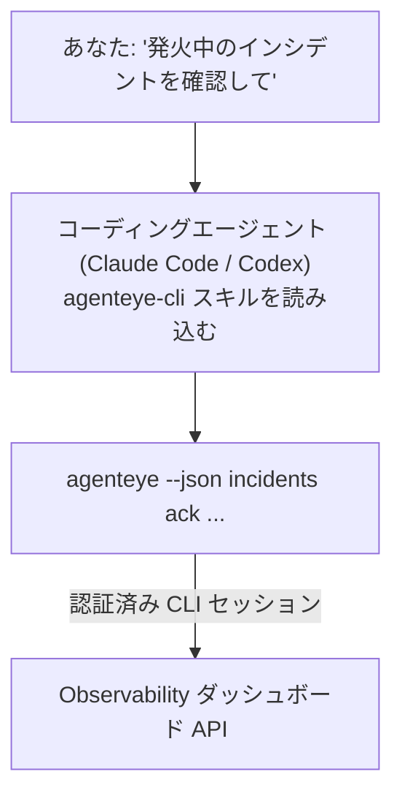

コーディングエージェントに *「今日、何か壊れているものはある？」* と聞くだけで、ライブの Failproof AI Observability データから答えを得られます。コマンドを覚える必要はありません。**Failproof AI Observability CLI スキル**（`agenteye-cli`）は *エージェントスキル* の一種です。Claude Code や Codex などのコーディングエージェントがオンデマンドで読み込む、小さな命令フォルダーです。このスキルにより、エージェントは *「CI にイベントのプッシュだけできるキーを作って」* や *「発火中のインシデントを確認して自分にアサインして」* といった自然言語のリクエストを通じて、[`agenteye` CLI](/ja/agenteye/cli) でお使いの Observability デプロイメントを操作できるようになります。

これはサービスでも独立したバイナリでも**ありません**。デプロイするものは何もありません。既にインストール済みの CLI の上で動作します。エージェントは `agenteye --json …` をシェルで実行し、クリーンな JSON を解析して、結果を文章で返します。エージェントができることはすべて、同じコマンドを自分でタイプしても実行できます。

---

## 他の Failproof AI Observability インターフェースとの関係

Failproof AI Observability では、同じデータやコントロールへアクセスする方法が 4 つあります。それぞれが互いを補完します。

| インターフェース | 概要 | 実行場所 | 使いどき |
|---|---|---|---|
| **[CLI](/ja/agenteye/cli)** | `agenteye` のコマンド・フラグリファレンス | ターミナル | 特定のコマンドを実行またはスクリプト化したいとき |
| **[CLI レシピ](/ja/agenteye/cli-recipes)** | コピペ可能な `jq`・パイプラインのパターン集 | ターミナル・スクリプト | CLI を自動化に組み込みたいとき |
| **CLI スキル**（本ドキュメント） | CLI への自然言語フロントエンド | 手元のワークステーション上のコーディングエージェント | 聞くだけでエージェントにコマンドを選ばせたいとき |
| **[Evaluator スキル](/ja/agenteye/evaluator-skill)** | スコアリングサービスを設計・構築するための兄弟スキル | 手元のワークステーション上のコーディングエージェント | eval スコアを読むのではなく*生成*したいとき |
| **[Python SDK スキル](/ja/agenteye/python-sdk-skill)** | エージェントにテレメトリを出力させるための兄弟スキル | 手元のワークステーション上のコーディングエージェント | このスキルが読むイベントをエージェントに*生成*させたいとき |
| **[ダッシュボード内 AI アシスタント](/ja/agenteye/assistant)** | ダッシュボードに埋め込まれたチャット | サーバーサイド（ダッシュボード内） | データに対してダッシュボード内で Q&A したいとき |

スキル自体には固有の権限はありません。あなたの言葉を CLI 呼び出しに変換し、あなたとして実行するだけです。



### ダッシュボード内 AI アシスタントとの違い：重要な区別

これらは 2 つの異なるツールであり、影響範囲が大きく異なります。

- **ダッシュボード内 AI アシスタント**（[AI アシスタント](/ja/agenteye/assistant)）は、エージェントサービスをバックエンドとするダッシュボード埋め込みチャットです。**読み取り専用＋承認制の作成**が可能です。保存済みクエリやダッシュボードの下書きはできますが、すべての書き込み操作はあなたの明示的なクリック承認で一時停止し、削除は行いません。`agent:use` 権限でゲートされており、閲覧中の org のデータしか参照しません。
- **CLI スキル**は*あなたの*ワークステーション上の*あなたの*コーディングエージェント内で動作し、`agenteye` CLI を**あなたとして**実行します。API キーの作成・ローテーション・無効化、org 設定の変更、インシデントの解決、保存済みクエリの削除など、**ミューテーションを含む CLI の全機能**を実行できます。実行できる範囲は CLI ログインの権限によってのみ制限されます。これらのコマンドを手動で実行する場合と同じ慎重さで扱ってください。

---

## 前提条件

1. **`agenteye` CLI がインストール済み**で `PATH` に追加されていること（[CLI](/ja/agenteye/cli) リファレンス参照：`pipx install agenteye`）。
2. **ダッシュボード URL** が設定されていること（`AGENTEYE_DASHBOARD_URL`、またはエージェントが `--base-url` を渡す）。
3. **ログイン済みセッション**：事前に `agenteye login` を自分で実行してください。スキルはメールで届くワンタイムコードによるログインを代行**できません**。セッションが存在しないか期限切れの場合（CLI 終了コード `4`）、`agenteye login` を実行するよう案内します。

---

## 入手方法

スキルは Failproof AI の公開スキルコレクションで公開されています。

**[github.com/FailproofAI/skills](https://github.com/FailproofAI/skills)** → [`skills/agenteye-cli/`](https://github.com/FailproofAI/skills/tree/main/skills/agenteye-cli)

このリポジトリは公開されており、スキル自体に独自のクレデンシャルも不要です。あなたがログインしたセッションを使って、**公開**の `agenteye` CLI であなたのダッシュボードを操作するだけだからです。誰かに許可を求める必要はありません。

なお、このスキルは独立したフォルダーとして提供されており、`pipx install agenteye` パッケージの**中には含まれていません**。パッケージの中を探さないでください。

## スキルのインストール

最も手早い方法は [`skills`](https://skills.sh) CLI を使うことです。フォルダーを取得してエージェントが参照する場所に配置します。

```bash
# Claude Code、このプロジェクトのみ
npx skills add FailproofAI/skills --skill agenteye-cli -a claude-code

# すべてのプロジェクト（~/.claude/skills/ にインストール）
npx skills add FailproofAI/skills --skill agenteye-cli -a claude-code -g --copy

# Codex の場合
npx skills add FailproofAI/skills --skill agenteye-cli -a codex
```

その後、他のスキルと同様に管理できます。

```bash
npx skills list -a claude-code      # インストール済みのスキルを確認
npx skills update agenteye-cli      # 最新バージョンに更新
npx skills remove agenteye-cli      # 削除
```

手動でインストールする場合は、エージェントスキルは `SKILL.md`（およびオプションの参照ファイル）を含むフォルダーにすぎないので、コピーする方法でも問題ありません。

- **Claude Code**：`agenteye-cli/` フォルダーを `~/.claude/skills/`（すべてのプロジェクト）または `<リポジトリ>/.claude/skills/`（そのリポジトリのみ）に配置します。Claude Code は自動的に検出します。`/skills` リストで確認するか、スキルの説明に一致する質問をしてみてください。
- **Codex（OpenAI）**：Codex も同じ `SKILL.md` を読み込みます。同梱の `agents/openai.yaml` に `allow_implicit_invocation: true` が設定されているため、タスクが一致すると Codex が自動的にスキルを選択します。それ以外の場合は `$agenteye-cli` として明示的に呼び出してください。

---

## 安全性：エージェントが CLI を実行する場合、ミューテーションは確認を求めません

> **警告：** エージェントに変更を加えさせる前に必ずお読みください。

`agenteye` CLI は通常、破壊的な操作の前に *「本当によろしいですか？」* と確認を求めます。しかし、**ターミナルに接続されていない場合（コーディングエージェントが実行する際がまさにこれに該当します）は確認を自動スキップし、`--json` も同様にスキップします。** つまり、エージェントでは安全確認プロンプトが**表示されません**。

スキルはこれを補うよう設計されています。実行するコマンドを明示し、**状態変更の前にあなたの明示的な OK を求める**よう指示されています。この規律を守ってください。エージェントを通じて Failproof AI Observability を操作する場合、*あなた自身*が確認ステップとなります。注意すべき状態変更コマンドは以下の通りです。

- `keys create` / `update` / `disable` / `regenerate`
- `users create` / `update` / `disable` / `enable`
- `settings set`
- `alerts create` / `update` / `delete` / `test`
- `incidents` の書き込みサブコマンド：`ack` / `assign` / `resolve` / `open` / `comment-add` / `comment-delete` / `subscribe` / `unsubscribe`
- `query create` / `update` / `delete`
- `agent rename` / `delete`
- `orgs switch`

**Observe** 配下（`events`、`sessions`、`evals`、`errors`、`list`、`whoami`、`orgs list/current/perms`）はすべて読み取り専用で、何も変更しません。

エージェントは**あなたとして**動作するため、あなたのログインで許可されたことしかできません。権限は **org ごと**に解決されます（[API キー](/ja/agenteye/api-keys)を参照）。権限がないコマンドは終了コード `5` と必要な権限名を返すので、エージェントは不透明なエラーでなく、管理者に何を依頼すればよいかを正確に伝えられます。

---

## 聞けること

読み取り操作、そしてあなたの OK を待つ変更操作の実際のやり取りの例です。

```text
あなた ▸ 昨日から何か壊れているものはある？

エージェント ▸ 実行中: agenteye --json errors --since 24h --aggregate
               過去 24 時間で 3 種類のエラーが見つかりました。最も多いのは
               TimeoutError（18 件、すべて checkout-agent で発生）、
               次が RateLimited（5 件）です。
               TimeoutError の失敗セッションも調べますか？

あなた ▸ CI にイベントのプッシュだけできるキーを作って。

エージェント ▸ API キーを作成します。実行するコマンド:
                 agenteye keys create ci --add events:add
               続行してよいですか？

あなた ▸ はい

エージェント ▸ 完了しました。「ci」キーが events:add のみの権限で作成されました。
               シークレットは一度しか表示されないので、今すぐ保存してください。
               再表示はできません。
```

スキルは各自然言語の意図を適切な `agenteye` コマンドにマッピングします。推測ではなく、まず有効な値を確認（`list <kind>`、`whoami`）し、変更前に正確なコマンドを提示します。その他の例：

- *「過去 24 時間で壊れているもの・失敗しているものはある？」* → `errors --since 24h --aggregate` で内訳を表示。
- *「セッション `run-001` が失敗した理由は？」* → `events --session-id run-001 --all` + `evals --session-id run-001`。
- *「今週の品質トレンドはどう？」* → `evals --aggregate --since 7d` でスコアの低い実行を詳しく調査。
- *「CI にイベントのプッシュだけできるキーを作って。」* → `keys create ci --add events:add`（コマンドを提示してから作成し、ワンタイムシークレットを取得）。
- *「誰がアクセスできる？Dana を読み取り専用にして。」* → `users list` → `users update dana@… --permission-set read-only`（あなたに確認後）。
- *「発火中のインシデントを確認して自分にアサインして。」* → `incidents list --state firing` → `incidents ack <id>` / `incidents assign <id> you@…`。

これらの背後にある正確なコマンド、フラグ、JSON の形式については、[CLI](/ja/agenteye/cli) リファレンスと[エージェント向け CLI レシピ](/ja/agenteye/cli-recipes)を参照してください。

---

## 次のステップ

- **[CLI](/ja/agenteye/cli)**：`agenteye` のコマンド・フラグの完全リファレンス。
- **[エージェント向け CLI レシピ](/ja/agenteye/cli-recipes)**：コピペ可能な `jq` パターンと終了コードの処理方法。
- **[Evaluator エージェントスキル](/ja/agenteye/evaluator-skill)**：`agenteye evals` が読み込むスコアを生成するエバリュエーターを構築するための兄弟スキル。
- **[Python SDK エージェントスキル](/ja/agenteye/python-sdk-skill)**：`agenteye` が読み込むテレメトリをエージェントに出力させるための兄弟スキル。
- **[AI アシスタント](/ja/agenteye/assistant)**：ダッシュボード内アシスタント（本ターミナルスキルとは異なります）。
- **[API キー](/ja/agenteye/api-keys)**：スキルの実行範囲を制限する org ごとの権限モデル。