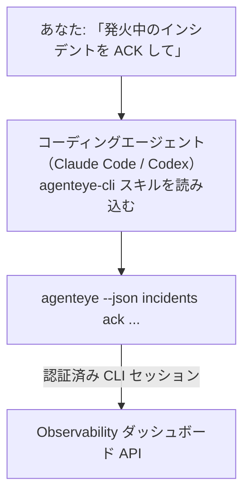

コーディングエージェントに *「今日、何か壊れていますか？」* と質問するだけで、ライブの Failproof AI Observability データから回答が得られます。コマンドを覚える必要はありません。**Failproof AI Observability CLI スキル**（`agenteye-cli`）は *エージェントスキル* です。これは、Claude Code や Codex などのコーディングエージェントがオンデマンドで読み込む小さなフォルダ形式の指示セットで、*「CI にイベントのプッシュだけができるキーを作成して」* や *「発火中のインシデントを ACK して自分にアサインして」* といった平易な英語のリクエストを通じて、Observability デプロイメントを [`agenteye` CLI](/ja/agenteye/cli) で操作できるようにエージェントを訓練します。

これはサービスでも独立したバイナリでも **ありません**。デプロイするものは何もありません。すでにインストール済みの CLI の上で動作します。エージェントは `agenteye --json …` をシェルから呼び出し、整形された JSON を解析して、散文形式で回答します。スキルにできることはすべて、同じコマンドを自分で入力することでも実現できます。

---

## 他の Failproof AI Observability インターフェースとの関係

Failproof AI Observability は、同じデータとコントロールにアクセスする 4 つの方法を提供しています。それぞれは互いを補完します。

| インターフェース | 概要 | 実行環境 | 使い所 |
|---|---|---|---|
| **[CLI](/ja/agenteye/cli)** | `agenteye` のコマンド・フラグリファレンス | ターミナル | 特定のコマンドを実行またはスクリプト化したいとき |
| **[CLI レシピ](/ja/agenteye/cli-recipes)** | コピペ用の `jq`/パイプラインパターン | ターミナル / スクリプト | CLI を自動化に組み込むとき |
| **CLI スキル**（このドキュメント） | CLI への自然言語フロントエンド | ワークステーション上のコーディングエージェント | 質問するだけでエージェントにコマンドを選ばせたいとき |
| **[Evaluator スキル](/ja/agenteye/evaluator-skill)** | スコアリングサービスを設計・構築する兄弟スキル | ワークステーション上のコーディングエージェント | eval スコアを読むのではなく *生成* したいとき |
| **[Python SDK スキル](/ja/agenteye/python-sdk-skill)** | エージェントにテレメトリを送信させるための兄弟スキル | ワークステーション上のコーディングエージェント | このスキルが読み取るイベントをエージェントに *生成* させたいとき |
| **[ダッシュボード内 AI アシスタント](/ja/agenteye/assistant)** | ダッシュボードに組み込まれたチャット | サーバーサイド（ダッシュボード内） | ダッシュボード上でデータに対して Q&A を行いたいとき |

スキル自体には独自の権限はなく、あなたの言葉を CLI 呼び出しに変換するだけで、あなたとして実行されます。



### ダッシュボード内 AI アシスタントとの違い：重要な区別

これらは影響範囲が大きく異なる 2 つの別々のツールです。

- **ダッシュボード内 AI アシスタント**（[AI アシスタント](/ja/agenteye/assistant)）はダッシュボードに組み込まれたチャットで、エージェントサービスが支えています。**読み取り専用 + 承認ゲート付きの編集**です。保存済みクエリやダッシュボードの下書きは作成できますが、書き込み操作はすべて明示的なクリック承認を求めて停止し、削除は行いません。`agent:use` 権限でゲートされており、閲覧中の組織のデータのみを扱います。
- **CLI スキル**はあなたのワークステーション上のコーディングエージェント内で動作し、`agenteye` CLI を **あなた** として駆動します。CLI の **全機能（API キーの作成・ローテーション・無効化、組織設定の変更、インシデントの解決、保存済みクエリの削除などのミューテーションを含む）** を実行できます。その範囲はあなたの CLI ログインの権限によってのみ制限されます。手動でコマンドを実行するのと全く同じ慎重さで扱ってください。

---

## 前提条件

1. **`agenteye` CLI がインストール済み**で `PATH` に含まれていること（[CLI](/ja/agenteye/cli) リファレンス参照：`pipx install agenteye`）。
2. **ダッシュボード URL** が設定されていること（`AGENTEYE_DASHBOARD_URL`、またはエージェントが `--base-url` を渡す）。
3. **ログイン済みセッション**：事前に `agenteye login` を自分で実行してください。スキルはメール送信されるワンタイムコードのログインを **代行できません**。セッションが存在しないか期限切れの場合（CLI 終了コード `4`）、`agenteye login` を実行するよう案内します。

---

## 入手方法

スキルは Failproof AI の公開スキルコレクションで公開されています。

**[github.com/FailproofAI/skills](https://github.com/FailproofAI/skills)** → [`skills/agenteye-cli/`](https://github.com/FailproofAI/skills/tree/main/skills/agenteye-cli)

アクセス制限は一切ありません。リポジトリは公開されており、スキル自体に認証情報は不要です。スキルは **公開** `agenteye` CLI を介してあなたのダッシュボードに、あなたがログインしたセッションを使って接続するだけです。誰かに依頼する必要はありません。

なお、スキルは独自のフォルダとして提供されており、`pipx install agenteye` パッケージには **含まれていません**。そちらで探さないでください。

## スキルのインストール

最も手軽な方法は [`skills`](https://skills.sh) CLI を使うことです。フォルダを取得してエージェントが参照する場所に配置します。

```bash
# Claude Code（このプロジェクトのみ）
npx skills add FailproofAI/skills --skill agenteye-cli -a claude-code

# すべてのプロジェクト（~/.claude/skills/ にインストール）
npx skills add FailproofAI/skills --skill agenteye-cli -a claude-code -g --copy

# Codex の場合
npx skills add FailproofAI/skills --skill agenteye-cli -a codex
```

その後、他のスキルと同様に管理できます。

```bash
npx skills list -a claude-code      # インストール済みスキルの確認
npx skills update agenteye-cli      # 最新バージョンに更新
npx skills remove agenteye-cli      # 削除
```

手動でインストールする場合は、エージェントスキルは `SKILL.md`（およびオプションのリファレンスファイル）を含むフォルダに過ぎないため、コピーするだけで動作します。

- **Claude Code**：`agenteye-cli/` フォルダを `~/.claude/skills/`（全プロジェクト）または `<your-repo>/.claude/skills/`（そのリポジトリのみ）に配置してください。Claude Code が自動的に検出します。`/skills` リストで確認するか、スキルの説明に合致する質問をしてみてください。
- **Codex (OpenAI)**：Codex は同じ `SKILL.md` を読み込みます。同梱の `agents/openai.yaml` に `allow_implicit_invocation: true` が設定されているため、タスクが合致するときは Codex が自動的にスキルを選択します。明示的に呼び出す場合は `$agenteye-cli` を使用してください。

---

## 安全性：エージェントが CLI を実行する際、ミューテーションは確認を求めません

> **警告：** エージェントに変更を実行させる前にお読みください。

`agenteye` CLI は通常、破壊的な操作の前に「本当によいですか？」と確認を求めます。ただし、**ターミナルに接続されていない場合（コーディングエージェントが実行する方法がまさにこれです）および `--json` を使用する場合は、この確認を自動的にスキップします**。そのため、エージェントには安全確認のプロンプトが **表示されません**。

スキルはこれを補うよう設計されています。実行するコマンドを正確に提示し、**状態変更の前にあなたの明示的な OK を求める**よう指示されています。このルールを守ってください。エージェントを通じて Failproof AI Observability を操作する場合、**あなた** が確認ステップです。注意が必要な状態変更コマンドは以下の通りです。

- `keys create` / `update` / `disable` / `regenerate`
- `users create` / `update` / `disable` / `enable`
- `settings set`
- `alerts create` / `update` / `delete` / `test`
- 書き込み系の `incidents` サブコマンド：`ack` / `assign` / `resolve` / `open` / `comment-add` / `comment-delete` / `subscribe` / `unsubscribe`
- `query create` / `update` / `delete`
- `agent rename` / `delete`
- `orgs switch`

**Observe** 配下（`events`、`sessions`、`evals`、`errors`、`list`、`whoami`、`orgs list/current/perms`）はすべて読み取り専用で、何も変更しません。

エージェントは **あなた** として動作するため、あなたのログインで許可されている操作しか実行できません。権限は **組織ごとに** 解決されます（[API キー](/ja/agenteye/api-keys)参照）。権限がないコマンドは終了コード `5` と対象の権限名を返すため、エージェントは曖昧なエラーではなく、管理者に何を依頼すべきかを正確に伝えられます。

---

## 利用例

実際のやりとりの例を示します。まず読み取り、次に確認を求める変更です。

```text
you   ▸ 昨日から何か壊れていますか？

agent ▸ 実行中: agenteye --json errors --since 24h --aggregate
        過去 24 時間で 3 種類のエラーがありました。最も多いのは TimeoutError
        （18 件、すべて checkout-agent）、次に RateLimited（5 件）です。
        TimeoutError の失敗セッションを確認しますか？

you   ▸ CI にイベントのプッシュだけができるキーを作成して。

agent ▸ API キーを作成します。以下を実行します：
          agenteye keys create ci --add events:add
        実行してよいですか？

you   ▸ はい

agent ▸ 完了しました。"ci" キーが events:add 権限のみで作成されました。
        シークレットは一度しか表示されないため、今すぐ保存してください。再表示はできません。
```

スキルは各自然言語の意図を適切な `agenteye` コマンドにマッピングします。まず有効な値を探索し（`list <kind>`、`whoami`）、推測を行わず、変更前に正確なコマンドを提示します。その他の例：

- *「過去 24 時間で壊れている/失敗しているものはありますか？」* → `errors --since 24h --aggregate`、その後内訳を表示。
- *「セッション `run-001` が失敗した原因は？」* → `events --session-id run-001 --all` + `evals --session-id run-001`。
- *「今週の品質トレンドは？」* → `evals --aggregate --since 7d`、その後スコアの低いセッションを深掘り。
- *「CI にイベントのプッシュだけができるキーを作成して。」* → `keys create ci --add events:add`（コマンドを提示してから作成し、ワンタイムシークレットを取得）。
- *「誰がアクセス権を持っていますか？Dana を読み取り専用にしてください。」* → `users list` → `users update dana@… --permission-set read-only`（確認後）。
- *「発火中のインシデントを ACK して自分にアサインして。」* → `incidents list --state firing` → `incidents ack <id>` / `incidents assign <id> you@…`。

これらの背後にある正確なコマンド、フラグ、JSON 形式については、[CLI](/ja/agenteye/cli) リファレンスと [エージェント向け CLI レシピ](/ja/agenteye/cli-recipes)を参照してください。

---

## 次のステップ

- **[CLI](/ja/agenteye/cli)**：`agenteye` の完全なコマンド・フラグリファレンス。
- **[エージェント向け CLI レシピ](/ja/agenteye/cli-recipes)**：コピペ用の `jq` パターンと終了コードのハンドリング。
- **[Evaluator エージェントスキル](/ja/agenteye/evaluator-skill)**：`agenteye evals` が読み取るスコアを生成する Evaluator を構築するための兄弟スキル。
- **[Python SDK エージェントスキル](/ja/agenteye/python-sdk-skill)**：`agenteye` が読み取るテレメトリを送信するエージェントの計装を行うための兄弟スキル。
- **[AI アシスタント](/ja/agenteye/assistant)**：ダッシュボード内アシスタント（このターミナルスキルとは別物です）。
- **[API キー](/ja/agenteye/api-keys)**：スキルの操作範囲を制限する組織ごとの権限モデル。