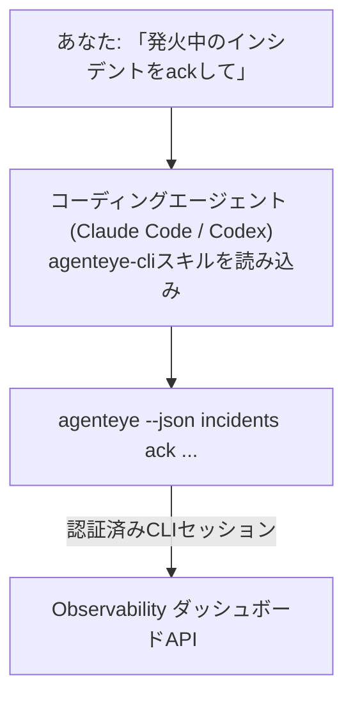

コーディングエージェントに *「今日、何か壊れているものはある?」* と聞くだけで、ライブのFailproof AI Observabilityデータから答えを得られます。コマンドを覚える必要はありません。**Failproof AI Observability CLIスキル**（`agenteye-cli`）は*エージェントスキル*です。Claude CodeやCodexのようなコーディングエージェントがオンデマンドで読み込む、小さな命令フォルダです。*「CIにイベントをプッシュするだけのキーを発行して」* や *「発火中のインシデントをackして自分にアサインして」* のような自然言語リクエストを通じて、エージェントが[`agenteye` CLI](/ja/agenteye/cli)でObservabilityデプロイメントを操作できるようになります。

これは**サービスでも独立したバイナリでもありません**。デプロイするものは何もありません。すでにインストール済みのCLI上で動作します。エージェントが `agenteye --json …` をシェルで呼び出し、クリーンなJSONをパースして、結果を文章で返します。スキルができることは、あなたが同じコマンドを手で打てば自分でもできることと同じです。

---

## 他のFailproof AI Observabilityインターフェースとの関係

Failproof AI Observabilityには、同じデータとコントロールにアクセスする4つの方法があります。それぞれが補完し合います：

| インターフェース | 概要 | 動作環境 | 使いどき |
|---|---|---|---|
| **[CLI](/ja/agenteye/cli)** | `agenteye` のコマンド/フラグリファレンス | ターミナル | 特定のコマンドを実行またはスクリプト化したいとき |
| **[CLIレシピ](/ja/agenteye/cli-recipes)** | コピペ用の `jq`/パイプラインパターン | ターミナル / スクリプト | CLIを自動化に組み込むとき |
| **CLIスキル**（このドキュメント） | CLIへの自然言語フロントドア | コーディングエージェント（ワークステーション上） | コマンドを選ばずに*ただ聞く*だけにしたいとき |
| **[Evaluatorスキル](/ja/agenteye/evaluator-skill)** | スコアリングサービスを設計・構築する兄弟スキル | コーディングエージェント（ワークステーション上） | evalスコアを*読む*のではなく*生成*したいとき |
| **[Python SDKスキル](/ja/agenteye/python-sdk-skill)** | エージェントにテレメトリ送信を実装する兄弟スキル | コーディングエージェント（ワークステーション上） | このスキルが読むイベントをエージェントに*生成*させたいとき |
| **[ダッシュボード内AIアシスタント](/ja/agenteye/assistant)** | ダッシュボードに組み込まれたチャット | サーバーサイド（ダッシュボード内） | ダッシュボード上でデータに対してQ&Aしたいとき |

スキル自体には権限がありません。あなたの言葉をCLI呼び出しに変換し、あなたとして実行するだけです：



### ダッシュボード内AIアシスタントとの違い：重要な区別

これらは影響範囲が大きく異なる2つの別ツールです：

- **ダッシュボード内AIアシスタント**（[AIアシスタント](/ja/agenteye/assistant)）はダッシュボードに組み込まれたチャットで、エージェントサービスが背後にあります。**読み取り専用＋承認ゲート付き編集**です。保存済みクエリやダッシュボードを下書きできますが、書き込みはすべてあなたの明示的なクリック承認で一時停止し、削除は行いません。`agent:use` 権限によってゲートされており、表示中のorgのデータしか参照しません。
- **CLIスキル**は*あなたの*ワークステーション上の*あなたの*コーディングエージェント内で動作し、`agenteye` CLIを**あなたとして**操作します。CLIの**全機能（ミューテーションを含む）**を実行できます（APIキーの作成/ローテート/無効化、org設定の変更、インシデントの解決、保存済みクエリの削除など）。制限はCLIログインの権限のみです。これらのコマンドを手で実行するのと同じ慎重さで扱ってください。

---

## 前提条件

1. **`agenteye` CLIがインストール済みで `PATH` に通っていること**（[CLI](/ja/agenteye/cli)リファレンス参照：`pipx install agenteye`）。
2. **ダッシュボードURLが設定されていること**（`AGENTEYE_DASHBOARD_URL`、またはエージェントが `--base-url` を渡す）。
3. **ログイン済みのセッションがあること**：先に自分で `agenteye login` を実行してください。スキルはメール送信されるワンタイムコードのログインを代わりに完了できません。セッションが存在しないか期限切れの場合（CLI終了コード `4`）、`agenteye login` を実行するよう通知します。

---

## 入手先

スキルはFailproof AIの公開スキルコレクションで公開されています：

**[github.com/FailproofAI/skills](https://github.com/FailproofAI/skills)** → [`skills/agenteye-cli/`](https://github.com/FailproofAI/skills/tree/main/skills/agenteye-cli)

ゲートは一切ありません。リポジトリは公開されており、スキル自体に認証情報は不要です。**公開**の `agenteye` CLIを*あなたの*ダッシュボードに対して、*あなたが*ログインしたセッションで操作するだけだからです。誰かに許可を求める必要はありません。

スキルは独立したフォルダとして提供されており、`pipx install agenteye` パッケージには**含まれていません**。そちらで探さないようにしてください。

## スキルのインストール

最も手軽な方法は [`skills`](https://skills.sh) CLIです。フォルダを取得し、エージェントが参照する場所に配置します：

```bash
# Claude Code、このプロジェクトのみ
npx skills add FailproofAI/skills --skill agenteye-cli -a claude-code

# 全プロジェクト（~/.claude/skills/ にインストール）
npx skills add FailproofAI/skills --skill agenteye-cli -a claude-code -g --copy

# Codexの場合
npx skills add FailproofAI/skills --skill agenteye-cli -a codex
```

他のスキルと同様に管理できます：

```bash
npx skills list -a claude-code      # インストール済みの確認
npx skills update agenteye-cli      # 最新バージョンに更新
npx skills remove agenteye-cli      # 削除
```

手動でインストールしたい場合も、エージェントスキルは `SKILL.md`（およびオプションの参照ファイル）を含むフォルダに過ぎないので、コピーするだけでも動作します：

- **Claude Code**: `agenteye-cli/` フォルダを `~/.claude/skills/`（全プロジェクト）または `<リポジトリ>/.claude/skills/`（そのリポジトリのみ）に配置します。Claude Codeが自動検出します。`/skills` リストで確認するか、説明に合った質問をしてみてください。
- **Codex（OpenAI）**: Codexも同じ `SKILL.md` を読み込みます。バンドルされた `agents/openai.yaml` に `allow_implicit_invocation: true` が設定されているため、タスクが一致するとCodexが自動的にスキルを選択します。明示的に呼び出す場合は `$agenteye-cli` を使用してください。

---

## 安全性：エージェントがCLIを実行する際、ミューテーションは確認プロンプトを表示しない

> **警告:** エージェントに変更を加えさせる前に必ずお読みください。

`agenteye` CLIは通常、破壊的な操作の前に *「本当によいですか？」* と確認します。しかし**ターミナルに接続されていない場合（コーディングエージェントが実行するのはまさにこの状況）は自動的にスキップされ、`--json` でもスキップされます。** つまり、エージェントに対して安全確認プロンプトは**表示されません**。

スキルはこれを補うよう設計されています。実行するコマンドを明示的に提示し、状態変更の前に**あなたの明示的なOKを得る**よう指示されています。この原則を守ってください。エージェントを通じてFailproof AI Observabilityを操作する場合、*あなた*が確認ステップになります。注意すべき状態変更コマンドは以下のとおりです：

- `keys create` / `update` / `disable` / `regenerate`
- `users create` / `update` / `disable` / `enable`
- `settings set`
- `alerts create` / `update` / `delete` / `test`
- 書き込み系の `incidents` サブコマンド：`ack` / `assign` / `resolve` / `open` / `comment-add` / `comment-delete` / `subscribe` / `unsubscribe`
- `query create` / `update` / `delete`
- `agent rename` / `delete`
- `orgs switch`

**Observe**配下（`events`、`sessions`、`evals`、`errors`、`list`、`whoami`、`orgs list/current/perms`）はすべて読み取り専用で、何も変更しません。

エージェントは**あなた**として動作するため、あなたのログインが許可している操作しか実行できません。権限は**orgごと**に解決されます（[APIキー](/ja/agenteye/api-keys)参照）。権限のないコマンドは終了コード `5` で返り、必要な権限名が明示されるため、エージェントは失敗の原因を曖昧にすることなく、管理者に何を依頼すべきかを正確に伝えられます。

---

## 何を頼めるか

実際のやり取りの例です。まず読み取り、次に確認待ちの変更：

```text
あなた ▸ 昨日から今日にかけて何か壊れているものはある?

エージェント ▸ 実行中: agenteye --json errors --since 24h --aggregate
              過去24時間で3種類のエラーがあります。最多はTimeoutError
              （18件、すべてcheckout-agent）、次いでRateLimited（5件）。
              TimeoutErrorの失敗セッションを確認しますか?

あなた ▸ CIにイベントをプッシュするだけのキーを発行して。

エージェント ▸ APIキーを作成します。実行するコマンド:
                agenteye keys create ci --add events:add
              実行してもよいですか?

あなた ▸ yes

エージェント ▸ 完了しました。キー「ci」がevents:addのみで作成されました。
              シークレットは一度しか表示されないので、今すぐ保存してください。再表示はできません。
```

スキルは各自然言語の意図を適切な `agenteye` コマンドにマッピングします。有効な値を先に確認し（`list <kind>`、`whoami`）、推測せず、変更前に正確なコマンドを提示します。その他の例：

- *「過去24時間で壊れているもの・失敗しているものはある?」* → `errors --since 24h --aggregate`、その後に内訳を表示。
- *「セッション `run-001` はなぜ失敗した?」* → `events --session-id run-001 --all` + `evals --session-id run-001`。
- *「今週の品質トレンドは?」* → `evals --aggregate --since 7d`、その後スコアの低いランにドリルダウン。
- *「CIにイベントをプッシュするだけのキーを発行して。」* → `keys create ci --add events:add`（コマンドを提示した上で作成し、ワンタイムシークレットを取得）。
- *「誰がアクセス権を持っている? Danaを読み取り専用にして。」* → `users list` → `users update dana@… --permission-set read-only`（確認後）。
- *「発火中のインシデントをackして自分にアサインして。」* → `incidents list --state firing` → `incidents ack <id>` / `incidents assign <id> you@…`。

これらの背後にある正確なコマンド、フラグ、JSONの形式については、[CLI](/ja/agenteye/cli)リファレンスと[エージェント向けCLIレシピ](/ja/agenteye/cli-recipes)を参照してください。

---

## 次のステップ

- **[CLI](/ja/agenteye/cli)**: `agenteye` のコマンドとフラグの完全リファレンス。
- **[エージェント向けCLIレシピ](/ja/agenteye/cli-recipes)**: コピペ用の `jq` パターンと終了コードの処理。
- **[Evaluatorエージェントスキル](/ja/agenteye/evaluator-skill)**: `agenteye evals` が読むスコアを生成するevaluatorを構築するための兄弟スキル。
- **[Python SDKエージェントスキル](/ja/agenteye/python-sdk-skill)**: `agenteye` が読むテレメトリを送信するようエージェントを計装するための兄弟スキル。
- **[AIアシスタント](/ja/agenteye/assistant)**: ダッシュボード内アシスタント（このターミナルスキルとは別物）。
- **[APIキー](/ja/agenteye/api-keys)**: スキルが実行できる範囲を制限するorgごとの権限モデル。