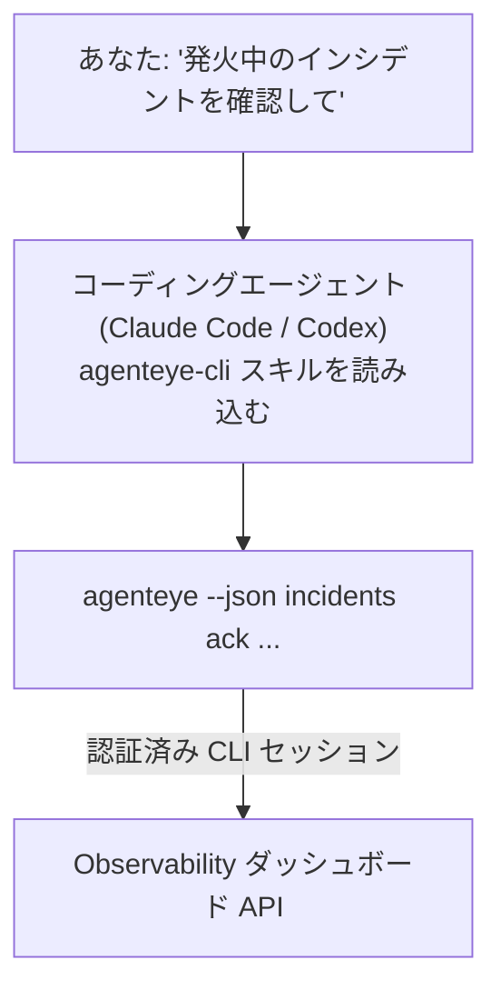

コーディングエージェントに *「今日、何か壊れているものはある?」* と聞くだけで、ライブの Failproof AI Observability データから答えてもらえます。コマンドを覚える必要は一切ありません。**Failproof AI Observability CLI スキル**（`agenteye-cli`）は *Agent Skill* です。Claude Code や Codex などのコーディングエージェントがオンデマンドで読み込む、小さな指示ファイルの集まりです。このスキルにより、エージェントは *「イベントしかプッシュできないキーを CI に渡して」* や *「発火中のインシデントを確認して自分にアサインして」* といった平易な英語のリクエストを通じて、[`agenteye` CLI](/ja/agenteye/cli) で Observability デプロイメントを操作できるようになります。

これは**サービスでも独立したバイナリでもありません**。デプロイするものは何もありません。すでにインストール済みの CLI の上で動作します。エージェントが `agenteye --json …` をシェル実行し、整形された JSON を解析して、結果を文章で返します。エージェントにできることは、同じコマンドを自分で入力すればすべて実行できます。

---

## 他の Failproof AI Observability インターフェースとの関係

Failproof AI Observability には、同じデータとコントロールにアクセスする 4 つの方法があります。それぞれが補完し合っています。

| インターフェース | 概要 | 実行場所 | 使うべきとき |
|---|---|---|---|
| **[CLI](/ja/agenteye/cli)** | `agenteye` のコマンド・フラグリファレンス | ターミナル | 特定のコマンドを実行・スクリプト化したいとき |
| **[CLI レシピ](/ja/agenteye/cli-recipes)** | コピペできる `jq`/パイプラインパターン | ターミナル / スクリプト | CLI を自動化に組み込むとき |
| **CLI スキル**（このドキュメント） | CLI への自然言語フロントエンド | ワークステーション上のコーディングエージェント | 質問するだけでエージェントにコマンドを選ばせたいとき |
| **[評価スキル](/ja/agenteye/evaluator-skill)** | スコアリングサービスを設計・構築するための兄弟スキル | ワークステーション上のコーディングエージェント | eval スコアを読むのではなく*生成*したいとき |
| **[Python SDK スキル](/ja/agenteye/python-sdk-skill)** | エージェントがテレメトリを出力できるようにする兄弟スキル | ワークステーション上のコーディングエージェント | このスキルが読むイベントをエージェントに*生成*させたいとき |
| **[ダッシュボード内 AI アシスタント](/ja/agenteye/assistant)** | ダッシュボードに埋め込まれたチャット | サーバーサイド（ダッシュボード内） | ダッシュボード内でデータに対して Q&A したいとき |

スキル自体は独自の権限を持ちません。あなたの言葉を CLI 呼び出しに変換し、あなたとして実行するだけです。



### ダッシュボード内 AI アシスタントとの違い：重要な区別

これらは影響範囲がまったく異なる、2 つの別ツールです。

- **ダッシュボード内 AI アシスタント**（[AI アシスタント](/ja/agenteye/assistant)）は、エージェントサービスをバックエンドとするダッシュボード埋め込みのチャットです。**読み取り専用＋承認ゲート付きの書き込み**が可能です。保存済みクエリやダッシュボードの下書き作成はできますが、すべての書き込みはあなたの明示的なクリック承認で一時停止され、削除は行いません。`agent:use` 権限によるゲートがあり、閲覧中の組織のデータのみにアクセスします。
- **CLI スキル**は*あなたの*ワークステーション上の*あなたの*コーディングエージェント内で動作し、`agenteye` CLI を**あなたとして**操作します。API キーの作成・ローテーション・無効化、組織設定の変更、インシデントの解決、保存済みクエリの削除など、CLI の**全機能（ミューテーションを含む）**を実行できます。その範囲は CLI ログインの権限によってのみ制限されます。これらのコマンドを自分で手入力する場合と同じくらい慎重に扱ってください。

---

## 前提条件

1. **`agenteye` CLI がインストール**されており、`PATH` に含まれていること（[CLI](/ja/agenteye/cli) リファレンス参照: `pipx install agenteye`）。
2. **ダッシュボード URL** が設定されていること（`AGENTEYE_DASHBOARD_URL`、またはエージェントが `--base-url` で渡す）。
3. **ログイン済みセッション**：先に自分で `agenteye login` を実行しておくこと。スキルはメール送信されるワンタイムコードのログインを代行**できません**。セッションが存在しないか期限切れの場合（CLI 終了コード `4`）、スキルは `agenteye login` を実行するよう指示します。

---

## 入手方法

このスキルは Failproof AI の公開スキルコレクションで公開されています。

**[github.com/FailproofAI/skills](https://github.com/FailproofAI/skills)** → [`skills/agenteye-cli/`](https://github.com/FailproofAI/skills/tree/main/skills/agenteye-cli)

アクセス制限は一切ありません。リポジトリは公開されており、スキルは独自の認証情報を必要としません。スキルは*あなた*がログインしたセッションを使って、**公開**`agenteye` CLI を*あなたの*ダッシュボードに対して操作するだけだからです。誰かに許可を求める必要はありません。

なお、スキルは独自のフォルダとして提供されており、`pipx install agenteye` パッケージには**含まれていません**。そこには存在しないのでご注意ください。

## スキルのインストール

最も手軽な方法は [`skills`](https://skills.sh) CLI です。フォルダを取得し、エージェントが参照する場所に配置します。

```bash
# Claude Code、このプロジェクトのみ
npx skills add FailproofAI/skills --skill agenteye-cli -a claude-code

# 全プロジェクト（~/.claude/skills/ にインストール）
npx skills add FailproofAI/skills --skill agenteye-cli -a claude-code -g --copy

# Codex を使う場合
npx skills add FailproofAI/skills --skill agenteye-cli -a codex
```

その後は他のスキルと同様に管理できます。

```bash
npx skills list -a claude-code      # インストール済み一覧
npx skills update agenteye-cli      # 最新版に更新
npx skills remove agenteye-cli      # 削除
```

手動インストールを好む場合、Agent Skill は `SKILL.md`（オプションの参照ファイル含む）を格納したフォルダに過ぎないため、コピーするだけでも動作します。

- **Claude Code**：`agenteye-cli/` フォルダを `~/.claude/skills/`（全プロジェクト）または `<your-repo>/.claude/skills/`（そのリポジトリのみ）に配置してください。Claude Code が自動検出します。`/skills` リストで確認するか、スキルの説明に合う質問を投げかけてみてください。
- **Codex（OpenAI）**：Codex は同じ `SKILL.md` を読み込みます。同梱の `agents/openai.yaml` で `allow_implicit_invocation: true` が設定されているため、タスクが合致する場合は Codex がスキルを自動選択します。それ以外の場合は `$agenteye-cli` として明示的に呼び出してください。

---

## 安全性：エージェントが CLI を実行する際、ミューテーションは確認を求めない

> **警告：** エージェントに変更を加えさせる前に必ずお読みください。

`agenteye` CLI は通常、破壊的な操作の前に *「本当によいですか?」* と確認を求めます。しかし、**ターミナルに接続されていない場合（コーディングエージェントが実行する際はまさにこの状態です）、および `--json` が指定されている場合、この確認は自動的にスキップされます。** そのため、エージェントに対して安全確認プロンプトは**表示されません**。

スキルはこれを補うように設計されています。スキルは実行するコマンドを明示し、状態変更の前に**あなたの明示的な OK を求める**よう指示されています。この規律を守ってください。エージェントを通じて Failproof AI Observability を操作する場合、*あなた*が確認ステップです。注意すべき状態変更コマンドは次のとおりです。

- `keys create` / `update` / `disable` / `regenerate`
- `users create` / `update` / `disable` / `enable`
- `settings set`
- `alerts create` / `update` / `delete` / `test`
- 書き込み系の `incidents` サブコマンド: `ack` / `assign` / `resolve` / `open` / `comment-add` / `comment-delete` / `subscribe` / `unsubscribe`
- `query create` / `update` / `delete`
- `agent rename` / `delete`
- `orgs switch`

**Observe** 配下（`events`、`sessions`、`evals`、`errors`、`list`、`whoami`、`orgs list/current/perms`）はすべて読み取り専用であり、何も変更しません。

エージェントは**あなたとして**動作するため、あなたのログインで許可されていることしか実行できません。権限は**組織ごと**に解決されます（[API キー](/ja/agenteye/api-keys)参照）。権限のないコマンドは、必要な権限名を明記した上で終了コード `5` を返すため、エージェントは曖昧なエラーではなく、管理者に何を依頼すべきかを正確に伝えられます。

---

## 聞けること

実際のやり取りの例を示します。読み取り操作と、OK を待つ変更操作です。

```text
あなた   ▸ 昨日から何か壊れているものはある?

エージェント ▸ 実行中: agenteye --json errors --since 24h --aggregate
              過去 24 時間で 3 種類のエラーがあります。最多は TimeoutError
              （18 件、すべて checkout-agent）、次いで RateLimited（5 件）です。
              TimeoutError の失敗セッションを確認しますか?

あなた   ▸ CI にイベントしかプッシュできないキーを渡して。

エージェント ▸ API キーを作成します。実行するコマンドは:
                agenteye keys create ci --add events:add
              進めてよいですか?

あなた   ▸ はい

エージェント ▸ 完了しました。"ci" キーが events:add 権限のみで作成されました。
              シークレットは一度しか表示されないので、今すぐ保存してください。再表示はできません。
```

スキルは各平易な意図を適切な `agenteye` コマンドにマッピングします。推測せず、まず有効な値を検出し（`list <kind>`、`whoami`）、変更前に正確なコマンドを明示します。その他の例：

- *「過去 24 時間で壊れている・失敗しているものはある?」* → `errors --since 24h --aggregate`、その後詳細を表示。
- *「セッション `run-001` はなぜ失敗した?」* → `events --session-id run-001 --all` + `evals --session-id run-001`。
- *「今週の品質トレンドは?」* → `evals --aggregate --since 7d`、その後スコアの低いランに深掘り。
- *「CI にイベントしかプッシュできないキーを渡して。」* → `keys create ci --add events:add`（コマンドを明示し、作成してワンタイムシークレットをキャプチャ）。
- *「誰がアクセス権を持っている? Dana を読み取り専用にして。」* → `users list` → `users update dana@… --permission-set read-only`（あなたへの確認後）。
- *「発火中のインシデントを確認して自分にアサインして。」* → `incidents list --state firing` → `incidents ack <id>` / `incidents assign <id> you@…`。

これらの背後にある正確なコマンド、フラグ、JSON の形式については、[CLI](/ja/agenteye/cli) リファレンスと[エージェント向け CLI レシピ](/ja/agenteye/cli-recipes)を参照してください。

---

## 次のステップ

- **[CLI](/ja/agenteye/cli)**：`agenteye` の全コマンド・フラグリファレンス。
- **[エージェント向け CLI レシピ](/ja/agenteye/cli-recipes)**：コピペできる `jq` パターンと終了コードの処理。
- **[評価エージェントスキル](/ja/agenteye/evaluator-skill)**：`agenteye evals` が読むスコアを生成する評価ツールを構築するための兄弟スキル。
- **[Python SDK エージェントスキル](/ja/agenteye/python-sdk-skill)**：`agenteye` が読むテレメトリをエージェントが出力できるようにするための兄弟スキル。
- **[AI アシスタント](/ja/agenteye/assistant)**：ダッシュボード内アシスタント（このターミナルスキルと混同しないでください）。
- **[API キー](/ja/agenteye/api-keys)**：スキルが実行できる範囲を決める組織ごとの権限モデル。