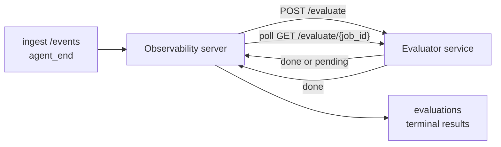

Failproof AI Observability は、完了したすべてのエージェント実行を自動的に品質スコアリングできます。小さなスコアリングサービスを用意するだけで、残りは Observability が処理します。これを使って、気になる評価軸（有用性、ツール効率、事実性、安全性など）を追跡し、リグレッションを早期に検出し、エージェントや環境をひと目で比較できます。スコアリングはオプトイン式で、サーバーに `EVALUATOR_ENDPOINT` を設定するまでパイプラインは何も行いません。

> **注意:** スコアの評価軸はあなたが定義します。評価器は任意の数値キーを返すことができ、Observability は送り返されたものをすべて保存・トレンド表示します。

## 概要

1. **スコアラーを作成する。** セッションのトランスクリプトを読み込んでスコアを返す小さな HTTP サービスを立ち上げます。Observability にはすぐに使えるリファレンス実装が付属しています。[SDK を使った評価器の作成](#writing-an-evaluator-with-the-sdk) を参照してください。
2. **Observability に設定する。** サーバープロセスに `EVALUATOR_ENDPOINT`（と共有の `EVALUATOR_TOKEN`）を設定します。
3. **スコアを確認する。** 完了したすべてのセッションは自動的にスコアリングされ、結果はセッション詳細ページ、セッショングリッド、保存済みダッシュボードに表示されます。


*評価器が設定されると、完了した各実行がスコアリングされ、その結果がセッションの右レールに表示されます。上部にサマリー、その下に推論付きの評価軸ごとのスコアバーが続きます。*

---

## 仕組み



Observability SDK がセッションに対して `agent_end` イベントを発行すると、サーバーは評価をスケジュールします。その後、完全なイベントトランスクリプトを評価器サービスに POST します。評価器は次のいずれかを行います：

- **インラインで結果を返す**: `{"status":"done", "scores":{...}, "reasoning":{...}, "summary":"..."}` の形式で返します。結果はセッションの評価タイムラインに追加されます。`reasoning` と `summary` はオプションです。
- **遅延する**: `{"status":"pending", "job_id":"abc-123"}` で返します。Observability は評価器が `{"status":"done", ...}` または `{"status":"error", "error":"..."}` を返すまで `GET {EVALUATOR_ENDPOINT}/evaluate/abc-123` をポーリングし続けます。

  ポーリング間隔はジョブごとに設定できます。`pending` レスポンスに `next_poll_secs` を含めることで上書きできます。含まれない場合、Observability は `GET /config` の `default_poll_interval_secs` を使用し、それもない場合はサーバーの `EVALUATOR_POLLING_INTERVAL_SECS`（デフォルト 10s）にフォールバックします。すべての値は [1s, 1h] の範囲にクランプされます。

`agent_end` を発行しなかったセッション（たとえばクラッシュしたエージェントプロセス）にも対応できます。評価器の `GET /config` が `{"inactivity_timeout_secs": 1800}` を返すと、Observability はその時間アイドル状態になったセッションを評価します。このフォールバックを無効にするには、フィールドを `null` にするか省略してください。

`EVALUATOR_ENDPOINT` が未設定の場合、パイプラインは完全に no-op になります。

セッションには**複数の終端評価が時間をかけて蓄積**される場合があります。各 `agent_end` イベント（およびダッシュボードからの手動再評価）は新しい評価行を追加します。これは再開された会話を評価するためのサポート方法です。ユーザーがエージェントを終了し、後で戻ってきてイベントを追加送信し、再びエージェントを終了すると、更新された完全なトランスクリプトに対して 2 回目の評価が実行されます。ダッシュボードは最新の評価を見出しとして表示し、以前の評価は折りたたみ可能なタイムラインとして表示します。あるセッションで評価が実行中の場合、そのセッションへの追加の `agent_end` イベントは無視されます。実行中の評価が完了した後の次のイベントで、通常通り新しい評価がキューに追加されます。

非アクティブフォールバックは再開されたセッションにも再適用されます。以前の終端評価の後に新しいイベントが到着し、セッションが `inactivity_timeout_secs` を超えてアイドル状態になると、新しい評価がキューに追加されます。

一時的な障害（5xx、429、タイムアウト、ネットワークエラー）は `EVALUATOR_MAX_ATTEMPTS` まで指数バックオフで再試行されます。4xx レスポンスは終端です。Observability は複数の水平スケールされたサーバーインスタンスで安全に実行できます。同一セッションが同時に 2 回ディスパッチされないよう、作業は分散されます。

---

## HTTP コントラクト

すべての認証済みルートは**ベアラートークン認証**を使用します。両側に同じ値を設定する必要があります：

- Observability サーバー: 環境変数 `EVALUATOR_TOKEN`
- 評価器サービス: 同じ方法で設定（`agenteye-evaluator` SDK は慣例として `EVALUATOR_TOKEN` を読み込みます）

`EVALUATOR_TOKEN` が未設定の場合、サーバーは `Authorization` ヘッダーを送信しません。この場合、評価器は匿名リクエストを受け付けることができますが、内部ネットワーク専用では問題ないものの、パブリックインターネット上では推奨されません。

### 評価器が提供する必要があるルート

| ルート | ボディ / パラメータ | レスポンス |
|---|---|---|
| `GET /health` | なし | `{"status":"ok"}`（オープン、認証なし） |
| `GET /config` | なし | `{"inactivity_timeout_secs": <int> \| null, "default_poll_interval_secs": <int> \| omitted}` |
| `POST /evaluate` | `EvalRequest` JSON | `{"status":"done", ...}` または `{"status":"pending", "job_id":"..."}` |
| `GET /evaluate/{id}` | なし | `/evaluate` と同じレスポンス形式 |

### サーバーが送信する `EvalRequest` ボディ

```json
{
  "schema_version": "1",
  "session_id":     "session-abc123",
  "agent_id":       "planner",
  "environment":    "production",
  "started_at":     "2026-05-10T12:00:00Z",
  "ended_at":       "2026-05-10T12:05:00Z",
  "events": [
    { "id": 1234, "ts": "...", "event_type": "agent_start", "payload": { ... } },
    ...
  ]
}
```

### レスポンス形式

**同期（完了）:**

```json
{
  "status": "done",
  "scores": { "helpfulness": 0.85, "tool_efficiency": 0.6 },
  "reasoning": {
    "helpfulness": "answered the question directly with citations",
    "tool_efficiency": "called list_files three times when one would have done"
  },
  "summary": "strong answer quality, weak tool selection"
}
```

`reasoning`（スコアごとの根拠マップ）と `summary`（全体的な一段落のナラティブ）はどちらもオプションです。`reasoning` のキーは `scores` のキーと対応している必要があります。ダッシュボードはそれぞれのエントリをスコアバーの下にインラインで表示します。`scores` のみを返す古い評価器は変更なく動作し続けます。`reasoning` と `summary` は null として扱われ、対応する UI は省略されます。

**非同期（遅延）:**

```json
{ "status": "pending", "job_id": "abc-123", "next_poll_secs": 30 }
```

`next_poll_secs` はオプションです。省略された場合、サーバーは評価器の `/config` の `default_poll_interval_secs`、次に自身の `EVALUATOR_POLLING_INTERVAL_SECS` 環境変数にフォールバックします。

**評価器側の終端エラー:**

```json
{ "status": "error", "error": "model service unavailable" }
```

サーバーは他の 2xx ボディをプロトコルエラーとして扱い、セッションの終端 `error` を記録します。

---

## SDK を使った評価器の作成

HTTP コントラクトを手動で実装する必要はありません。`agenteye-evaluator` Python パッケージは、認証、ルーティング、リクエスト/レスポンス形式を処理する型付き FastAPI ラッパーを提供します。

Failproof AI Observability には、トランスクリプトの形状から `helpfulness`、`tool_efficiency`、`factuality` をスコアリングする**動作するリファレンス評価器**も付属しています。出発点としてコピーし、LLM ジャッジ、ルールエンジンなど、品質基準に合ったロジックに置き換えてください。

最小限の評価器：

```python
import os
from agenteye_evaluator import Evaluator, EvalRequest, EvalResponse

app = Evaluator(token=os.environ["EVALUATOR_TOKEN"])

@app.evaluator
def run(req: EvalRequest) -> EvalResponse:
    # Inspect req.events (the full session transcript) and return scores.
    tool_calls = sum(1 for e in req.events if e.event_type == "tool_use")
    return EvalResponse(
        scores={"tool_calls": float(tool_calls)},
        reasoning={"tool_calls": f"{tool_calls} tool invocations in the transcript"},
        summary="tight tool loop" if tool_calls < 5 else "agent looped on tools",
    )
```

`app` インスタンスは任意の ASGI サーバーで動作するため、`uvicorn module:app` で起動できます。

重い処理を遅延させる必要がある評価器の場合は、代わりに `JobPending` を返し、`@app.job_lookup` ハンドラーを登録してください。Observability サーバーは評価器が終端ステータスを返すか、`EVALUATOR_MAX_POLL_DURATION_SECS` の上限（デフォルト 1 h）に達するまで `GET /evaluate/{job_id}` をポーリングし続けます。

完全な API リファレンス、非同期パターン、イベントスキーマは `agenteye-evaluator` SDK の README に記載されています。

---

## 評価器の実行

評価器は**あなたのサービス**です。Failproof AI Observability はデフォルトの評価器を提供しないため、自分のサービスを実行している場所でビルドして実行します。任意の ASGI サーバー（例: `uvicorn my_evaluator:app`）で動作し、[HTTP コントラクト](#http-contract) の `/health`、`/config`、`/evaluate` ルートを提供してから、サーバーに向けます（[サーバーの設定](#configuring-the-server) を参照）。

評価器に到達できるようになると、`GET /health` が `{"status":"ok"}` を返します。エージェントがエンドツーエンドで実行された後、サーバーの `GET /evaluations` は `status: "done"` と評価器が生成したスコアを含む行を返します。

---

## サーバーの設定

サーバープロセスに設定します：

| 環境変数 | 意味 |
|---|---|
| `EVALUATOR_ENDPOINT` | 評価器のベース URL（`http://evaluator:9000`）。未設定 = パイプライン無効。 |
| `EVALUATOR_TOKEN` | ベアラートークン。評価器サービスに設定された値と一致する必要があります。 |
| `EVALUATOR_WORKERS` | サーバーインスタンスあたりのワーカータスク数（デフォルト 2）。 |
| `EVALUATOR_CLAIM_BATCH` | ワーカーティックあたりに要求する行数（デフォルト 4）。バッチは**並行して**処理されます。評価器エンドポイントへの実効並行数は `EVALUATOR_WORKERS × EVALUATOR_CLAIM_BATCH` です。 |
| `EVALUATOR_POLL_IDLE_SECS` | 評価が不要な場合にワーカーがディスパッチ試行の間にスリープする時間（デフォルト 2s）。 |
| `EVALUATOR_POLLING_INTERVAL_SECS` | レスポンスごとの `next_poll_secs` も評価器の `default_poll_interval_secs` も設定されていない場合の `GET /evaluate/{id}` 間隔の最終フォールバック（デフォルト 10s）。 |
| `EVALUATOR_REQUEST_TIMEOUT_MS` | リクエストごとのタイムアウト（デフォルト 30000）。 |
| `EVALUATOR_MAX_ATTEMPTS` | この回数の一時的な障害後、結果は終端 `error` として記録されます（デフォルト 5）。 |
| `EVALUATOR_CONFIG_REFRESH_SECS` | `GET /config` の間隔（デフォルト 300）。 |
| `EVALUATOR_MAX_POLL_DURATION_SECS` | セッションがポーリングキューに残れる最大ウォールクロック時間。これを超えると `timeout` として終了します（デフォルト 3600s）。永遠に `pending` を返し続ける評価器に対する保護です。 |

自動スコアリングを有効にするには、サーバーに `EVALUATOR_ENDPOINT` と `EVALUATOR_TOKEN` の両方を設定し、変更を反映させるためにサーバーを再起動します。`EVALUATOR_ENDPOINT` が未設定の場合、パイプラインは no-op のままです。

上記のチューニングパラメータはオプションです。デフォルト値を上書きする必要がある場合にのみ、サーバーに対応する環境変数を設定してください。

---

## API リファレンス

| メソッド | パス | 必要な権限 | 目的 |
|---|---|---|---|
| `GET` | `/evaluations` | `evaluations:read` | 終端結果をクエリします。`session_id`、`agent_id`、`environment`、`status`（`done`/`error`/`timeout`）、`ts_from`、`ts_to`、`cursor`、`limit`、`score_filters`、`latest_per_session` をサポートします。`limit` のデフォルトは 50 で、200 が上限です（1000 が上限の `/events` とは異なる点に注意）。`environment` はカンマ区切りのリストを受け付けます（例: `environment=prod,staging`）。単一の値も引き続き機能します。`latest_per_session=true` を指定すると、レスポンスには `session_id` ごとに最大 1 行（`completed_at` で最新のもの）が含まれます。これはセッションの評価タイムラインを現在の見出しに折りたたむためにセッション一覧ページで使用されます。デフォルトは false（完全な履歴を返す）。 |
| `GET` | `/evaluations/aggregate` | `evaluations:read` | フィルタリングされたスライスの評価ヘルスの集計: 合計カウント、done/error/timeout の内訳、スコアキーごとの統計情報（任意の `scores` キーに対するカウント/平均/最小/最大/p50）、時間バケットのタイムライン。**`/evaluations` と同じフィルタパラメータ**に加えて `featured_keys`（トレンド表示するスコアキーの CSV）と `latest_per_session` を受け付けます。ダッシュボード機能を動かします。メトリクスはサンプリングではなく、一致するセット全体に対して正確に計算されます。 |
| `GET` | `/evaluations/environments` | `evaluations:read` | `evaluations` テーブルから個別の environment 値を取得します。評価読み取り可能なデータにスコープされたフィルタードロップダウンの入力に使用されます。 |
| `GET` | `/evaluation-jobs` | `evaluations:read` | 進行中の評価の可視化。`status`（`pending`/`polling`）でフィルタリングできます。 |
| `GET` | `/events` | `events:read` | セッションの生のイベントをストリームします。`session_id`、`agent_id`、`event_type`（CSV）、`environment`（CSV）、`ts_from`、`ts_to`、`cursor`、`limit`、`order` をサポートします。`order` は `desc`（最新順、デフォルト）または `asc`（古い順）です。認識されない値は `desc` にフォールバックします。レスポンスの `next_cursor`（イベント ID）でカーソルページネーションを行います。`cursor` として渡すと次のページが取得できます。`asc` では次のページはその ID より後のイベント、`desc` ではその ID より前のイベントです。`limit` のデフォルトは 50 で、1000 が上限です。 |
| `GET` | `/sessions/:session_id/export` | `events:read` | このセッションに対して評価器が受け取る正確な JSON ボディを `session-<id>.json` という名前のダウンロード可能な添付ファイルとして返します。本番セッションを `agenteye-evaluator` でオフラインテスト用に再生するのに便利です。バイトは評価器パイプラインが送信するものとバイト単位で同一です。 |
| `POST` | `/sessions/:session_id/re-evaluate` | `evaluations:trigger` | セッションの新しい評価をキューに追加します。以前の評価が存在するかどうかにかかわらず実行されます。新しい結果は以前のものを上書きするのではなく、セッションの評価タイムラインに**追加**されるため、以前のスコアは履歴として残ります。キューに追加された場合は `202`、不明なセッションの場合は `404`、評価がすでに進行中の場合は `409` を返します。新しい評価器をデプロイした後や、`agent_end` を発行しなかったセッションに使用します。 |

### スコア範囲によるフィルタリング: `score_filters`

`GET /evaluations` は、`scores` オブジェクト内の数値でフィルタリングするオプションの `score_filters` パラメータを受け付けます。パラメータは `key:min..max` エントリのカンマ区切りリストです。どちらの境界も省略できます。複数のエントリは論理 AND で結合されます。指定されたキーが存在しないか数値でない行は除外されます。リクエストに指定できるフィルタエントリは最大 20 件です。それを超えると HTTP 400 が返されます。

例:
```text
# helpfulness in [0.5, 0.8]
GET /evaluations?score_filters=helpfulness:0.5..0.8

# tool_efficiency at most 0.3 (no lower bound)
GET /evaluations?score_filters=tool_efficiency:..0.3

# helpfulness >= 0.5 AND factuality >= 0.9
GET /evaluations?score_filters=helpfulness:0.5..,factuality:0.9..
```

各 `/evaluations` レスポンスオブジェクトには次のフィールドがあります：

| フィールド | 型 | 備考 |
|---|---|---|
| `evaluation_id` | string (UUID) | この終端評価の正規識別子。各終端評価には新しい UUID が割り当てられます。1 つのセッションに複数含まれる場合があります。 |
| `id` | string (UUID) | `evaluation_id` と同じ値を持つ後方互換性のエイリアス。 |
| `session_id` | string | この評価が実行されたセッション。1 つのセッションにタイムライン上で複数の評価が存在する場合があります。 |
| `agent_id` | string | セッションを生成したエージェントを識別します。 |
| `environment` | string | セッションからコピーされた環境ラベル。 |
| `status` | enum | `"done"`、`"error"`、`"timeout"` のいずれか。 |
| `scores` | object \| null | 評価器が返したスコア。 |
| `reasoning` | object \| null | 評価器が返したオプションのスコアごとの根拠マップ。キーは通常 `scores` のキーと対応しています。ダッシュボードは各エントリをスコアバーの下に表示します。 |
| `summary` | string \| null | 評価器が返したオプションの全体的な一段落のナラティブ。ダッシュボードはこれをスコア内訳の上部に評価の見出しとして表示します。 |
| `error` | string \| null | `"error"` / `"timeout"` の場合のみ入力されます。 |
| `attempt_count` | integer | ディスパッチの試行回数（≥ 1）。 |
| `duration_ms` | integer \| null | 最終試行の所要時間。 |
| `completed_at` | string (ISO 8601 UTC) | 終端結果が記録された日時。結果は `completed_at` の降順（最新優先）で並べられます。 |
| `created_at` | string (ISO 8601 UTC) | `completed_at` と同じタイムスタンプ（一度書き込まれたら変更されないセマンティクス）。 |

---

## 権限

| 権限 | 付与内容 |
|---|---|
| `evaluations:read` | 評価結果の一覧表示、ダッシュボードでのスコアの表示、ダッシュボードのヘルスメトリクスの読み込み。 |
| `evaluations:trigger` | `POST /sessions/:session_id/re-evaluate` またはダッシュボードの再評価ボタンからセッションの評価を手動でキューに追加する。 |
| `dashboards:read` | 保存済みダッシュボードの表示（メトリクスの読み込みには `evaluations:read` も必要）。 |
| `dashboards:write` | ダッシュボードの作成と編集。 |
| `dashboards:delete` | ダッシュボードの削除。 |

ブートストラップ管理者（`ADMIN_KEY`、`ADMIN_EMAIL`）は自動的にこれらすべてを受け取ります。

---

## 結果の確認

- **`/sessions/<id>`**: イベントタイムライン + セッションのスコアとディスパッチ試行のエラーを表示する右レール。キーに `evaluations:trigger` 権限がある場合、エクスポートボタンの横に**再評価**ボタンが表示されます。`agent_end` を発行しなかったセッションや、新しい評価器をデプロイした後にスコアを更新する際に便利です。ダッシュボードは新しい結果をポーリングし、結果が返ったときに右レールを更新します。
- **`/sessions`**: フィルタリング可能なセッショングリッド。スコア列には各セッションの評価ステータスとスコアがひと目でわかるように表示されます。
- **`/dashboards`**: 保存済みの評価ヘルスビュー（下記の [ダッシュボード](#dashboards) を参照）。


*セッショングリッドは各実行の評価ステータスとスコアをひと目で表示します。赤/琥珀/緑のバッジで低スコアが目立ちます。*

---

## ダッシュボード

**ダッシュボード**ページ（`/dashboards`）では、評価フィルターの組み合わせを名前付きの再利用可能なビューとして保存し、その評価のスライスがひと目でわかるように確認できます。ダッシュボードは**組織全体で共有**されます。`dashboards:read` を持つすべてのユーザーが同じセットを見ることができます。

各ダッシュボードには以下が固定されています：

- **フィルター**: セッションページと同じコントロール: environment、status、エージェント、ローリング時間ウィンドウ、スコア範囲フィルター（`key:min..max`）。
- **表示設定**: 注目するスコアキー、緑/琥珀/赤のヘルスしきい値、表示するパネル、セッションごとに最新の評価に折りたたむかどうか。

各カードは、一致するセッション数、done/error/timeout の内訳、注目スコアの平均値、小さなトレンドスパークラインを表示します。ダッシュボードを開くとフルサイズのパネルが表示され、**「セッションで開く」**をクリックすると、そのスライスでフィルタリング済みのセッションページに移動します。メトリクスはサーバー側で一致するセット全体に対して計算されます（`GET /evaluations/aggregate` を使用）。そのため、数値はサンプリングではなく正確です。


**権限:** 表示には `dashboards:read` と `evaluations:read` の両方が必要です。作成と編集には `dashboards:write` が必要です。削除には `dashboards:delete` が必要です。ブートストラップ管理者はこれらすべてを自動的に受け取ります。

---

## トラブルシューティング

**セッションは存在するが評価が作成されない。** サーバープロセスに `EVALUATOR_ENDPOINT` が設定されているか、サーバーと評価器が同じ `EVALUATOR_TOKEN` の値を共有しているか、評価器の `/health` エンドポイントがサーバーから到達可能かを確認してください。`EVALUATOR_ENDPOINT` が未設定の場合、パイプラインは no-op です。

**進行中の評価が積み上がる。** `GET /evaluation-jobs` をクエリして進行中のキューを確認してください。各行の `attempt_count`、`next_attempt_at`、`last_error` を検査してください。よくある原因: 評価器サービスが到達不能または 5xx を返している（バックオフで再試行）、`EVALUATOR_TOKEN` が間違っている（401 は終端）、または非同期評価器が無限に `pending` を返し続けている（下記参照）。

**セッションが完了したが終端評価がない。** `GET /evaluation-jobs?status=polling` をクエリしてください。まだ進行中の可能性があります。ジョブが `pending` でスタックしている場合は、サーバーが評価器に到達できない可能性があります。評価器が起動しているか、`EVALUATOR_TOKEN` が一致しているかを確認してください。

**`HTTP 401 from evaluator: invalid bearer token`。** サーバーの `EVALUATOR_TOKEN` が評価器サービスに設定された値と一致しません。完全に同一である必要があります。

**非同期評価器が永遠に `pending` を返し続ける。** サーバーは評価器が `done` または `error` を返すか、`EVALUATOR_MAX_POLL_DURATION_SECS`（デフォルト 1 h）の上限が経過するまで `GET /evaluate/{job_id}` をポーリングし続けます。上限を過ぎると、評価は `timeout` として記録され、進行中のキューから削除されます。評価器が正当にデフォルトより長い時間を必要とする場合は `EVALUATOR_MAX_POLL_DURATION_SECS` を増やしてください。

---

## 次のステップ

- [評価器エージェントスキル](/ja/agenteye/evaluator-skill): コーディングエージェントに実際のセッションに対して評価軸を設計させ、このサービスを構築してもらいます。
- [Python SDK](/ja/agenteye/python-sdk): スコアリングをトリガーする `agent_end` イベントを発行します。
- [API キー](/ja/agenteye/api-keys): `evaluations:read` と `evaluations:trigger` 権限。
- [監査](/ja/agenteye/audits): ポリシーベースのレビューのための Observability のもう一つの自動品質機能。