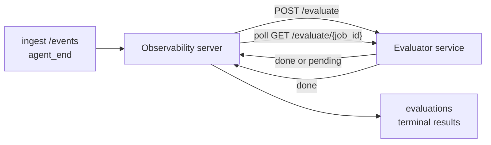

Failproof AI Observability は、完了したすべてのエージェント実行を自動的に品質スコアリングできます。小さなスコアリングサービスを用意するだけで、残りはすべて Observability が処理します。測定したいディメンション（有用性、ツール効率、事実確認、安全性など）を自由に定義してトラッキングし、品質低下を早期に検出して、エージェントや環境を一目で比較できます。スコアリングはオプトイン制です。サーバーに `EVALUATOR_ENDPOINT` を設定するまで、パイプラインは何も行いません。

> **注:** スコアのディメンションはご自身が定義します。評価器は好きな数値キーを返すことができ、Observability は送り返された内容をそのまま保存・トレンド表示・可視化します。

## 概要

1. **スコアラーを作成する。** セッションのトランスクリプトを読み取ってスコアを返す小さな HTTP サービスを立ち上げます。Observability にはすぐに使える参照実装が含まれているのでコピーして使えます。[SDK を使った評価器の作成](#writing-an-evaluator-with-the-sdk) を参照してください。
2. **Observability に評価器を指定する。** サーバープロセスに `EVALUATOR_ENDPOINT`（および共有の `EVALUATOR_TOKEN`）を設定します。
3. **スコアが記録されるのを確認する。** 完了したすべてのセッションが自動的にスコアリングされ、結果はセッション詳細ページ、セッション一覧グリッド、保存済みダッシュボードに表示されます。


*評価器が設定されると、完了した実行ごとにスコアリングが実行され、結果がセッションの右サイドパネルに表示されます。上部にサマリー、その下に各ディメンションのスコアバーと推論が表示されます。*

---

## 仕組み



Observability SDK がセッションの `agent_end` イベントを送信すると、サーバーが評価をスケジュールします。その後、イベントのトランスクリプト全体を評価器サービスに POST します。評価器は以下のいずれかの方法で応答できます。

- **インラインで結果を返す**: `{"status":"done", "scores":{...}, "reasoning":{...}, "summary":"..."}` の形式で返します。結果はセッションの評価タイムラインに追記されます。`reasoning` と `summary` はオプションです。
- **処理を遅延する**: `{"status":"pending", "job_id":"abc-123"}` を返します。Observability は評価器が `{"status":"done", ...}` または `{"status":"error", "error":"..."}` を返すまで `GET {EVALUATOR_ENDPOINT}/evaluate/abc-123` をポーリングし続けます。

  ポーリング間隔はジョブごとに設定できます。`pending` レスポンスに `next_poll_secs` を含めることで上書きできます。省略した場合は `GET /config` の `default_poll_interval_secs` が使用され、それも未設定の場合はサーバーの `EVALUATOR_POLLING_INTERVAL_SECS`（デフォルト 10 秒）にフォールバックします。すべての値は [1 秒、1 時間] の範囲にクランプされます。

`agent_end` を送信しないセッション（クラッシュしたエージェントプロセスなど）も対象にできます。評価器の `GET /config` が `{"inactivity_timeout_secs": 1800}` を返すと、Observability はその時間以上アイドル状態のセッションを評価します。このフォールバックを無効にするには、フィールドを `null` に設定するか省略してください。

`EVALUATOR_ENDPOINT` が未設定の場合、パイプラインは完全にノーオペレーションです。

セッションは**時間の経過とともに複数の終了評価を蓄積**できます。各 `agent_end` イベント（およびダッシュボードからの手動再評価）ごとに新しい評価行が追記されます。これは、再開された会話を評価するためのサポートされた方法です。ユーザーがエージェントを終了し、後で再開してさらにイベントを送信し、再びエージェントを終了すると、更新されたトランスクリプト全体に対して 2 回目の評価が実行されます。ダッシュボードでは最新の評価がヘッドラインとして表示され、それ以前の評価は折りたたみ可能なタイムラインとして表示されます。あるセッションの評価が実行中の場合、そのセッションの追加の `agent_end` イベントは無視されます。実行中の評価が完了した後に届く次のイベントで、通常通り新しい評価がキューに追加されます。

非アクティブフォールバックは再開されたセッションにも適用されます。以前の終了評価の後に新しいイベントが届き、セッションがその後 `inactivity_timeout_secs` を超えてアイドル状態になると、新しい評価がキューに追加されます。

一時的な障害（5xx、429、タイムアウト、ネットワークエラー）は `EVALUATOR_MAX_ATTEMPTS` の回数まで指数バックオフで再試行されます。4xx レスポンスは終了扱いです。Observability は複数の水平スケールされたサーバーインスタンスで安全に実行できます。同じセッションが同時に 2 回ディスパッチされることはないよう、ワークが分割されます。

---

## HTTP コントラクト

認証が必要なすべてのルートは**ベアラートークン認証**を使用します。両側で同じ値を設定する必要があります。

- Observability サーバー: 環境変数 `EVALUATOR_TOKEN`
- 評価器サービス: 同じ方法で設定（`agenteye-evaluator` SDK は慣例として `EVALUATOR_TOKEN` を読み取ります）

`EVALUATOR_TOKEN` が未設定の場合、サーバーは `Authorization` ヘッダーを送信しません。評価器は匿名リクエストを受け入れる場合がありますが、これは内部専用ネットワークでは問題ありませんが、公開インターネットでは推奨されません。

### 評価器が提供すべきルート

| ルート | ボディ / パラメータ | レスポンス |
|---|---|---|
| `GET /health` | なし | `{"status":"ok"}`（認証不要、オープン） |
| `GET /config` | なし | `{"inactivity_timeout_secs": <int> \| null, "default_poll_interval_secs": <int> \| omitted}` |
| `POST /evaluate` | `EvalRequest` JSON | `{"status":"done", ...}` または `{"status":"pending", "job_id":"..."}` |
| `GET /evaluate/{id}` | なし | `/evaluate` と同じレスポンス形式 |

### サーバーが送信する `EvalRequest` ボディ

```json
{
  "schema_version": "1",
  "session_id":     "session-abc123",
  "agent_id":       "planner",
  "environment":    "production",
  "started_at":     "2026-05-10T12:00:00Z",
  "ended_at":       "2026-05-10T12:05:00Z",
  "events": [
    { "id": 1234, "ts": "...", "event_type": "agent_start", "payload": { ... } },
    ...
  ]
}
```

### レスポンス形式

**同期（done）:**

```json
{
  "status": "done",
  "scores": { "helpfulness": 0.85, "tool_efficiency": 0.6 },
  "reasoning": {
    "helpfulness": "answered the question directly with citations",
    "tool_efficiency": "called list_files three times when one would have done"
  },
  "summary": "strong answer quality, weak tool selection"
}
```

`reasoning`（スコアごとの根拠マップ）と `summary`（全体的な概要）はどちらもオプションです。`reasoning` のキーは `scores` のキーと対応させることを推奨します。ダッシュボードでは各エントリがスコアバーの下にインライン表示されます。`scores` のみを返す旧バージョンの評価器は変更なしで引き続き動作します。`reasoning` と `summary` は null として読み取られ、対応する UI 要素は省略されます。

**非同期（遅延）:**

```json
{ "status": "pending", "job_id": "abc-123", "next_poll_secs": 30 }
```

`next_poll_secs` はオプションです。省略した場合、サーバーは評価器の `/config` から `default_poll_interval_secs` にフォールバックし、次に独自の `EVALUATOR_POLLING_INTERVAL_SECS` 環境変数にフォールバックします。

**評価器側の終了エラー:**

```json
{ "status": "error", "error": "model service unavailable" }
```

サーバーは他の 2xx ボディをプロトコルエラーとして扱い、セッションの終了 `error` を記録します。

---

## SDK を使った評価器の作成

HTTP コントラクトを手動で実装する必要はありません。`agenteye-evaluator` Python パッケージは、認証、ルーティング、リクエスト/レスポンス形式を処理する型付き FastAPI ラッパーを提供します。

Failproof AI Observability には、トランスクリプトの形状から `helpfulness`、`tool_efficiency`、`factuality` をスコアリングする**動作する参照評価器**も含まれています。これを出発点としてコピーし、LLM ジャッジ、ルールエンジンなど、品質基準に合ったロジックに置き換えてください。

最小限の評価器の例:

```python
import os
from agenteye_evaluator import Evaluator, EvalRequest, EvalResponse

app = Evaluator(token=os.environ["EVALUATOR_TOKEN"])

@app.evaluator
def run(req: EvalRequest) -> EvalResponse:
    # Inspect req.events (the full session transcript) and return scores.
    tool_calls = sum(1 for e in req.events if e.event_type == "tool_use")
    return EvalResponse(
        scores={"tool_calls": float(tool_calls)},
        reasoning={"tool_calls": f"{tool_calls} tool invocations in the transcript"},
        summary="tight tool loop" if tool_calls < 5 else "agent looped on tools",
    )
```

`app` インスタンスは任意の ASGI サーバーで動作するため、`uvicorn module:app` で起動できます。

高コストな処理を遅延させる必要がある評価器の場合は、代わりに `JobPending` を返し、`@app.job_lookup` ハンドラーを登録してください。Observability サーバーは評価器が終了ステータスを返すか、`EVALUATOR_MAX_POLL_DURATION_SECS` の上限（デフォルト 1 時間）に達するまで `GET /evaluate/{job_id}` をポーリングします。

完全な API リファレンス、非同期パターン、イベントスキーマは `agenteye-evaluator` SDK の README に記載されています。

---

## 評価器の実行

評価器は**ご自身のサービス**です。Failproof AI Observability はデフォルトの評価器を提供していないため、ご自身のサービスを実行している場所でビルドして実行してください。任意の ASGI サーバーで動作します（例：`uvicorn my_evaluator:app`）。[HTTP コントラクト](#http-contract) の `/health`、`/config`、`/evaluate` ルートを提供し、サーバーから評価器を指定します（[サーバーの設定](#configuring-the-server) を参照）。

評価器が到達可能になると、`GET /health` が `{"status":"ok"}` を返します。エージェントがエンドツーエンドで実行された後、サーバーの `GET /evaluations` は `status: "done"` と評価器が生成したスコアを含む行を返します。

---

## サーバーの設定

サーバープロセスに以下を設定してください。

| 環境変数 | 意味 |
|---|---|
| `EVALUATOR_ENDPOINT` | 評価器のベース URL（`http://evaluator:9000`）。未設定 = パイプライン無効。 |
| `EVALUATOR_TOKEN` | ベアラートークン。評価器サービスに設定された値と一致する必要があります。 |
| `EVALUATOR_WORKERS` | サーバーインスタンスあたりのワーカータスク数（デフォルト 2）。 |
| `EVALUATOR_CLAIM_BATCH` | ワーカーティックごとにクレームされる行数（デフォルト 4）。バッチは**並行して**処理されます。評価器エンドポイントへの実効並行数は `EVALUATOR_WORKERS × EVALUATOR_CLAIM_BATCH` です。 |
| `EVALUATOR_POLL_IDLE_SECS` | 評価が予定されていない場合に、ワーカーがディスパッチ試行の間にスリープする時間（デフォルト 2 秒）。 |
| `EVALUATOR_POLLING_INTERVAL_SECS` | レスポンスごとの `next_poll_secs` も評価器の `default_poll_interval_secs` も設定されていない場合の `GET /evaluate/{id}` 間隔の最終フォールバック（デフォルト 10 秒）。 |
| `EVALUATOR_REQUEST_TIMEOUT_MS` | リクエストごとのタイムアウト（デフォルト 30000）。 |
| `EVALUATOR_MAX_ATTEMPTS` | この回数の一時的な障害の後、結果が終了 `error` として記録されます（デフォルト 5）。 |
| `EVALUATOR_CONFIG_REFRESH_SECS` | `GET /config` の呼び出し間隔（デフォルト 300）。 |
| `EVALUATOR_MAX_POLL_DURATION_SECS` | セッションがポーリングキューに留まれる最大ウォールクロック時間。この時間を超えると `timeout` として終了します（デフォルト 3600 秒）。評価器が `pending` を返し続けるケースを防ぎます。 |

自動スコアリングを有効にするには、サーバーに `EVALUATOR_ENDPOINT` と `EVALUATOR_TOKEN` の両方を設定し、変更を反映させるためにサーバーを再起動してください。`EVALUATOR_ENDPOINT` が未設定の場合、パイプラインはノーオペレーションのままです。

上記のチューニングパラメータはオプションです。デフォルト値を変更する必要がある場合にのみ、サーバーで対応する環境変数を設定してください。

---

## API リファレンス

| メソッド | パス | 必要な権限 | 目的 |
|---|---|---|---|
| `GET` | `/evaluations` | `evaluations:read` | 終了結果のクエリ。`session_id`、`agent_id`、`environment`、`status`（`done`/`error`/`timeout`）、`ts_from`、`ts_to`、`cursor`、`limit`、`score_filters`、`latest_per_session` をサポート。`limit` のデフォルトは 50 で上限は 200（`/events` の上限 1000 とは異なることに注意）。`environment` はカンマ区切りのリストを受け入れます（例：`environment=prod,staging`）。単一の値も引き続き使用できます。`latest_per_session=true` の場合、レスポンスには `session_id` ごとに最大 1 行（`completed_at` が最新のもの）が含まれます。セッション一覧ページでセッションの評価タイムラインを現在のヘッドラインに折りたたむために使用されます。デフォルトは false（全履歴を返します）。 |
| `GET` | `/evaluations/aggregate` | `evaluations:read` | フィルタされたスライスの評価ヘルスの集計: 合計数、done/error/timeout の内訳、スコアキーごとの統計（任意の `scores` キーに対するカウント/平均/最小/最大/p50）、時間バケット化されたタイムライン。`/evaluations` と**同じフィルタパラメータ**に加えて `featured_keys`（トレンド表示するスコアキーの CSV）と `latest_per_session` を受け入れます。ダッシュボード機能を支援します。メトリクスはサンプリングではなく、一致するセットの全体に対して正確に計算されます。 |
| `GET` | `/evaluations/environments` | `evaluations:read` | `evaluations` テーブルの個別の環境値。評価データにスコープされたフィルタードロップダウンの生成に使用されます。 |
| `GET` | `/evaluation-jobs` | `evaluations:read` | 実行中の評価の可視化。`status`（`pending`/`polling`）でフィルタリングできます。 |
| `GET` | `/events` | `events:read` | セッションの生イベントのストリーム。`session_id`、`agent_id`、`event_type`（CSV）、`environment`（CSV）、`ts_from`、`ts_to`、`cursor`、`limit`、`order` をサポート。`order` は `desc`（新しい順、デフォルト）または `asc`（古い順）。認識されない値は `desc` にフォールバック。レスポンスの `next_cursor`（イベント ID）でカーソルページネーションを実行します。`cursor` として渡すと次のページを取得できます。`asc` の場合は指定 ID の後のイベント、`desc` の場合は前のイベントが返されます。`limit` のデフォルトは 50 で上限は 1000。 |
| `GET` | `/sessions/:session_id/export` | `events:read` | このセッションに対して評価器が受け取るものと全く同じ JSON ボディを `session-<id>.json` という名前のダウンロード可能な添付ファイルとして返します。本番セッションを `agenteye-evaluator` でオフラインテスト用に再生する際に便利です。バイトは評価器パイプラインが送信するものとバイト単位で同一です。 |
| `POST` | `/sessions/:session_id/re-evaluate` | `evaluations:trigger` | セッションの新しい評価をキューに追加します。以前の評価が存在するかどうかに関わらず実行されます。新しい結果は前の結果を上書きするのではなく、セッションの評価タイムラインに**追記**されるため、以前のスコアが履歴として引き続き表示されます。キュー登録時は `202`、セッションが不明な場合は `404`、評価が既に実行中の場合は `409` を返します。新しい評価器をデプロイした後や、`agent_end` を送信しなかったセッションに使用してください。 |

### スコア範囲によるフィルタリング: `score_filters`

`GET /evaluations` はオプションの `score_filters` パラメータを受け入れます。このパラメータは `scores` オブジェクト内の数値でрезульт果を絞り込みます。パラメータは `key:min..max` エントリのカンマ区切りリストです。どちらの境界も省略できます。複数のエントリは論理 AND で結合されます。指定されたキーが存在しないか非数値の行は除外されます。1 つのリクエストには最大 20 のフィルターエントリを指定できます。超過した場合は HTTP 400 が返されます。

例:
```text
# helpfulness が [0.5, 0.8] の範囲
GET /evaluations?score_filters=helpfulness:0.5..0.8

# tool_efficiency が 0.3 以下（下限なし）
GET /evaluations?score_filters=tool_efficiency:..0.3

# helpfulness >= 0.5 かつ factuality >= 0.9
GET /evaluations?score_filters=helpfulness:0.5..,factuality:0.9..
```

各 `/evaluations` レスポンスオブジェクトには以下のフィールドが含まれます。

| フィールド | 型 | 備考 |
|---|---|---|
| `evaluation_id` | string (UUID) | この終了評価の正規識別子。各終了評価には新しい UUID が割り当てられます。1 つのセッションに複数の UUID が存在する場合があります。 |
| `id` | string (UUID) | `evaluation_id` と同じ値を持つ後方互換性のエイリアス。 |
| `session_id` | string | この評価が実行されたセッション。1 つのセッションのタイムラインに複数の評価が含まれる場合があります。 |
| `agent_id` | string | セッションを生成したエージェントを識別します。 |
| `environment` | string | セッションからコピーされた環境ラベル。 |
| `status` | enum | `"done"`、`"error"`、`"timeout"` のいずれか。 |
| `scores` | object \| null | 評価器が返したスコア。 |
| `reasoning` | object \| null | 評価器が返したオプションのスコアごとの根拠マップ。キーは通常 `scores` のキーと対応します。ダッシュボードでは各エントリがスコアバーの下に表示されます。 |
| `summary` | string \| null | 評価器が返したオプションの全体概要（1 段落）。ダッシュボードではスコア内訳の上に評価のヘッドラインとして表示されます。 |
| `error` | string \| null | `"error"` / `"timeout"` の場合にのみ設定されます。 |
| `attempt_count` | integer | ディスパッチ試行回数（≥ 1）。 |
| `duration_ms` | integer \| null | 最後の試行の所要時間。 |
| `completed_at` | string (ISO 8601 UTC) | 終了結果が記録された日時。結果は `completed_at` の降順（新しい順）で並べられます。 |
| `created_at` | string (ISO 8601 UTC) | `completed_at` と同じタイムスタンプを持ちます（書き込み一回限りのセマンティクス）。 |

---

## 権限

| 権限 | 付与される操作 |
|---|---|
| `evaluations:read` | 評価結果の一覧表示、ダッシュボードでのスコア表示、ダッシュボードヘルスメトリクスの読み込み。 |
| `evaluations:trigger` | `POST /sessions/:session_id/re-evaluate` またはダッシュボードの再評価ボタンからセッションの評価を手動でキューに追加する。 |
| `dashboards:read` | 保存済みダッシュボードの表示（メトリクスの読み込みには `evaluations:read` も必要）。 |
| `dashboards:write` | ダッシュボードの作成と編集。 |
| `dashboards:delete` | ダッシュボードの削除。 |

ブートストラップ管理者（`ADMIN_KEY`、`ADMIN_EMAIL`）はこれらすべてを自動的に受け取ります。

---

## 結果の表示

- **`/sessions/<id>`**: イベントタイムライン + セッションのスコアとディスパッチ試行のエラーを表示する右サイドパネル。キーに `evaluations:trigger` が含まれている場合、エクスポートボタンの隣に**再評価**ボタンが表示されます。`agent_end` を送信しなかったセッションや、新しい評価器をデプロイした後にスコアを更新する場合に便利です。ダッシュボードは新しい結果をポーリングし、結果が届いたら右サイドパネルを更新します。
- **`/sessions`**: フィルタリング可能なセッショングリッド。スコア列には各セッションの評価ステータスとスコアが一目でわかるように表示されます。
- **`/dashboards`**: 保存済みの評価ヘルスビュー（下記の [ダッシュボード](#dashboards) を参照）。


*セッション一覧グリッドでは各実行の評価ステータスとスコアが一目でわかります。赤/黄/緑のバッジにより、低スコアがすぐに目に入ります。*

---

## ダッシュボード

**ダッシュボード**ページ（`/dashboards`）では、評価フィルターの組み合わせを名前付きの再利用可能なビューとして保存し、そのスライスの評価状況を一目で確認できます。ダッシュボードは**組織全体で共有**されます。`dashboards:read` を持つ全員が同じセットを参照します。

各ダッシュボードには以下が固定されます。

- **フィルター**: セッションページと同じコントロール: 環境、ステータス、エージェント、ローリング時間ウィンドウ、スコア範囲フィルター（`key:min..max`）。
- **表示設定**: 注目するスコアキー、緑/黄/赤のヘルス閾値、表示するパネル、セッションごとに最新の評価に折りたたむかどうか。

各カードには一致するセッション数、done/error/timeout の内訳、注目スコアの平均値、小さなトレンドスパークラインが表示されます。ダッシュボードを開くとフルサイズのパネルが表示されます。**「セッションで開く」**をクリックすると、そのスライスにフィルタリング済みのセッションページに遷移します。メトリクスはサーバーサイドで一致するセット全体に対して計算されます（`GET /evaluations/aggregate` 経由）。そのため数値はサンプリングではなく正確な値です。


**権限:** 表示には `dashboards:read` と `evaluations:read` の両方が必要です。作成と編集には `dashboards:write`、削除には `dashboards:delete` が必要です。ブートストラップ管理者はこれらすべてを自動的に受け取ります。

---

## トラブルシューティング

**セッションが存在するのに評価が作成されない。** サーバープロセスに `EVALUATOR_ENDPOINT` が設定されていること、サーバーと評価器が同じ `EVALUATOR_TOKEN` 値を共有していること、評価器の `/health` エンドポイントがサーバーから到達可能であることを確認してください。`EVALUATOR_ENDPOINT` が未設定の場合、パイプラインはノーオペレーションです。

**実行中の評価が積み上がっている。** `GET /evaluation-jobs` で実行中のキューを確認します。各行の `attempt_count`、`next_attempt_at`、`last_error` を調べてください。よくある原因: 評価器サービスが到達不能または 5xx を返している（バックオフで再試行）、`EVALUATOR_TOKEN` が間違っている（401 は終了扱い）、または `pending` を返し続ける非同期評価器（以下を参照）。

**セッションが完了したが終了評価がない。** `GET /evaluation-jobs?status=polling` でクエリします。結果はまだ実行中の可能性があります。ジョブが `pending` で止まっている場合、サーバーが評価器への到達に問題を抱えています。評価器が起動しており `EVALUATOR_TOKEN` が一致していることを確認してください。

**`HTTP 401 from evaluator: invalid bearer token`.** サーバーの `EVALUATOR_TOKEN` が評価器サービスに設定された値と一致していません。両者は完全に同一である必要があります。

**非同期評価器が `pending` を返し続ける。** サーバーは評価器が `done` または `error` を返すか、`EVALUATOR_MAX_POLL_DURATION_SECS`（デフォルト 1 時間）が経過するまで `GET /evaluate/{job_id}` をポーリングします。上限に達すると、評価は `timeout` として記録され、実行中キューから削除されます。評価器がデフォルトより長い時間を必要とする場合は `EVALUATOR_MAX_POLL_DURATION_SECS` を引き上げてください。

---

## 次のステップ

- [評価器エージェントスキル](/ja/agenteye/evaluator-skill): コーディングエージェントに実際のセッションに対してディメンションを設計させ、このサービスを構築させます。
- [Python SDK](/ja/agenteye/python-sdk): スコアリングをトリガーする `agent_end` イベントを送信します。
- [API キー](/ja/agenteye/api-keys): `evaluations:read` と `evaluations:trigger` の権限。
- [監査](/ja/agenteye/audits): ポリシーベースのレビューのための Observability のその他の自動品質機能。