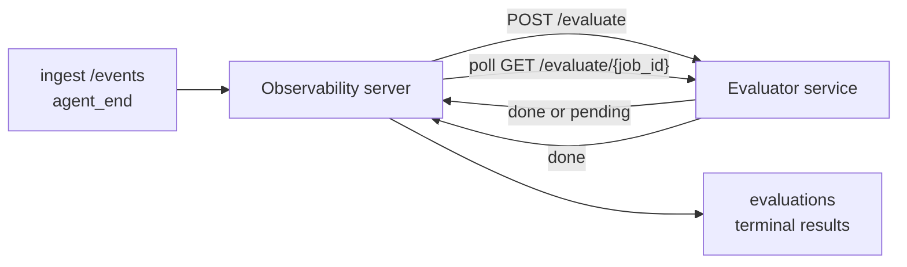

Failproof AI Observabilityは、完了したすべてのエージェント実行を自動的に品質スコアリングできます。小さなスコアリングサービスを用意するだけで、あとはObservabilityが処理します。重視する指標（有用性、ツール効率、事実性、安全性など、選択は自由）を追跡し、早期に回帰を検出し、エージェントや環境をひと目で比較できます。スコアリングはオプトイン制です。サーバーに `EVALUATOR_ENDPOINT` を設定するまで、パイプラインは何も実行しません。

> **注意:** スコアの次元はご自身で定義します。評価器は任意の数値キーを返すことができます。Observabilityは送信された内容をそのまま保存し、トレンド表示し、画面に表示します。

## 概要

1. **スコアラーを作成する。** セッションのトランスクリプトを読み込み、スコアを返す小さなHTTPサービスを立ち上げます。Observabilityには動作する参照実装が同梱されているので、コピーして使えます。[SDKを使った評価器の作成](#writing-an-evaluator-with-the-sdk)を参照してください。
2. **ObservabilityにURLを設定する。** サーバープロセスに `EVALUATOR_ENDPOINT`（および共有の `EVALUATOR_TOKEN`）を設定します。
3. **スコアの確認。** 完了したセッションはすべて自動的にスコアリングされ、結果はセッション詳細ページ、セッショングリッド、保存済みダッシュボードに表示されます。


*評価器が設定されると、完了した各実行がスコアリングされ、結果がセッションの右欄に表示されます。上部にサマリー、次に推論付きの各次元スコアバーが続きます。*

---

## 仕組み



ObservabilityのSDKがセッションの `agent_end` イベントを送出すると、サーバーは評価をスケジュールします。その後、完全なイベントトランスクリプトを評価器サービスにPOSTします。評価器は以下のいずれかの方法で応答できます。

- **結果をインラインで返す**: `{"status":"done", "scores":{...}, "reasoning":{...}, "summary":"..."}` 。結果はセッションの評価タイムラインに追記されます。`reasoning` と `summary` はオプションです。
- **保留する**: `{"status":"pending", "job_id":"abc-123"}` 。Observabilityは評価器が `{"status":"done", ...}` または `{"status":"error", "error":"..."}` を返すまで `GET {EVALUATOR_ENDPOINT}/evaluate/abc-123` を繰り返し呼び出します。

  ポーリング間隔はジョブごとに設定できます。`pending` レスポンスに `next_poll_secs` を含めることでオーバーライドできます。含まれない場合、Observabilityは `GET /config` の `default_poll_interval_secs` を使用し、それもない場合はサーバーの `EVALUATOR_POLLING_INTERVAL_SECS`（デフォルト10秒）にフォールバックします。すべての値は [1秒, 1時間] にクランプされます。

`agent_end` を送出しないセッション（クラッシュしたエージェントプロセスなど）もピックアップできます。評価器の `GET /config` が `{"inactivity_timeout_secs": 1800}` を返すと、Observabilityはそれだけ長くアイドル状態になったセッションを評価します。このフォールバックを無効にするには、フィールドを `null` に設定するか省略します。

`EVALUATOR_ENDPOINT` が未設定の場合、パイプラインは完全に無効（no-op）です。

セッションは**時間の経過とともに複数の終端評価を蓄積できます**。各 `agent_end` イベント（およびダッシュボードからの手動再評価）で新しい評価行が追記されます。これは再開された会話を評価するためのサポートされた方法です。ユーザーがエージェントを終了し、後で戻り、さらにイベントを送信してエージェントを再度終了すると、更新されたトランスクリプト全体に対して2回目の評価が実行されます。ダッシュボードでは最新の評価をヘッドラインとして表示し、以前の評価は折りたたみ可能なタイムラインとして表示します。あるセッションで評価が実行中の場合、そのセッションへの追加の `agent_end` イベントは無視されます。実行中の評価が完了した後の次のイベントで、通常通り新しい評価がキューに入ります。

非アクティビティフォールバックは再開されたセッションにも適用されます。以前の終端評価の後に新しいイベントが届き、セッションが `inactivity_timeout_secs` を超えてアイドル状態になった場合、新しい評価がキューに入ります。

一時的な障害（5xx、429、タイムアウト、ネットワークエラー）は `EVALUATOR_MAX_ATTEMPTS` まで指数バックオフで再試行されます。4xxレスポンスは終端です。Observabilityは複数の水平スケールされたサーバーインスタンスで安全に実行できます。同じセッションが同時に2回ディスパッチされないようにワークが分割されます。

---

## HTTPコントラクト

すべての認証済みルートは**ベアラートークン認証**を使用します。同じ値を両側で設定する必要があります。

- Observabilityサーバー: 環境変数 `EVALUATOR_TOKEN`
- 評価器サービス: 同様に設定（`agenteye-evaluator` SDKは慣例として `EVALUATOR_TOKEN` を読み込みます）

`EVALUATOR_TOKEN` が未設定の場合、サーバーは `Authorization` ヘッダーを送信しません。評価器は匿名リクエストを受け入れることができますが、内部専用ネットワークでは問題ありませんが、公共のインターネットでは推奨されません。

### 評価器が提供すべきルート

| ルート | ボディ / パラメーター | レスポンス |
|---|---|---|
| `GET /health` | なし | `{"status":"ok"}` （オープン、認証不要） |
| `GET /config` | なし | `{"inactivity_timeout_secs": <int> \| null, "default_poll_interval_secs": <int> \| omitted}` |
| `POST /evaluate` | `EvalRequest` JSON | `{"status":"done", ...}` または `{"status":"pending", "job_id":"..."}` |
| `GET /evaluate/{id}` | なし | `/evaluate` と同じレスポンス形式 |

### サーバーが送信する `EvalRequest` ボディ

```json
{
  "schema_version": "1",
  "session_id":     "session-abc123",
  "agent_id":       "planner",
  "environment":    "production",
  "started_at":     "2026-05-10T12:00:00Z",
  "ended_at":       "2026-05-10T12:05:00Z",
  "events": [
    { "id": 1234, "ts": "...", "event_type": "agent_start", "payload": { ... } },
    ...
  ]
}
```

### レスポンス形式

**同期（完了）:**

```json
{
  "status": "done",
  "scores": { "helpfulness": 0.85, "tool_efficiency": 0.6 },
  "reasoning": {
    "helpfulness": "answered the question directly with citations",
    "tool_efficiency": "called list_files three times when one would have done"
  },
  "summary": "strong answer quality, weak tool selection"
}
```

`reasoning`（スコアごとの根拠マップ）と `summary`（全体的な1段落の説明）はどちらもオプションです。`reasoning` のキーは `scores` のキーと対応している必要があります。ダッシュボードでは各エントリをスコアバーの下にインラインで表示します。`scores` のみを返す旧来の評価器は変更なしで動作し続けます。`reasoning` と `summary` はnullとして読み込まれ、対応するUI要素は省略されます。

**非同期（保留）:**

```json
{ "status": "pending", "job_id": "abc-123", "next_poll_secs": 30 }
```

`next_poll_secs` はオプションです。省略した場合、サーバーは `/config` の評価器の `default_poll_interval_secs` にフォールバックし、次に独自の `EVALUATOR_POLLING_INTERVAL_SECS` 環境変数を使用します。

**評価器側の終端エラー:**

```json
{ "status": "error", "error": "model service unavailable" }
```

サーバーは他の2xxボディをプロトコルエラーとして扱い、セッションに終端 `error` を記録します。

---

## SDKを使った評価器の作成

HTTPコントラクトを手動で実装する必要はありません。`agenteye-evaluator` Pythonパッケージは、認証、ルーティング、リクエスト/レスポンス形式を処理する型付きFastAPIラッパーを提供します。

Failproof AI Observabilityには、トランスクリプトの形式から `helpfulness`、`tool_efficiency`、`factuality` をスコアリングする**動作する参照評価器**も同梱されています。出発点としてコピーし、独自のロジック（LLMジャッジ、ルールエンジンなど）に置き換えてください。

最小限の評価器:

```python
import os
from agenteye_evaluator import Evaluator, EvalRequest, EvalResponse

app = Evaluator(token=os.environ["EVALUATOR_TOKEN"])

@app.evaluator
def run(req: EvalRequest) -> EvalResponse:
    # Inspect req.events (the full session transcript) and return scores.
    tool_calls = sum(1 for e in req.events if e.event_type == "tool_use")
    return EvalResponse(
        scores={"tool_calls": float(tool_calls)},
        reasoning={"tool_calls": f"{tool_calls} tool invocations in the transcript"},
        summary="tight tool loop" if tool_calls < 5 else "agent looped on tools",
    )
```

`app` インスタンスはASGIサーバーで動作するため、`uvicorn module:app` で起動できます。

コストのかかる処理を後回しにする必要がある評価器の場合は、代わりに `JobPending` を返して `@app.job_lookup` ハンドラーを登録してください。Observabilityサーバーは評価器が終端ステータスを返すか、`EVALUATOR_MAX_POLL_DURATION_SECS` の上限（デフォルト1時間）に達するまで `GET /evaluate/{job_id}` をポーリングします。

完全なAPIリファレンス、非同期パターン、イベントスキーマは `agenteye-evaluator` SDKのREADMEに記載されています。

---

## 評価器の実行

評価器は**ご自身のサービス**です。Failproof AI Observabilityにはデフォルトの評価器が同梱されていないため、ご自身のサービスと同じ場所でビルドして実行してください。任意のASGIサーバーで動作します（例: `uvicorn my_evaluator:app`）。[HTTPコントラクト](#http-contract)の `/health`、`/config`、`/evaluate` ルートを提供し、サーバーにURLを設定してください（[サーバーの設定](#configuring-the-server)を参照）。

評価器に到達できるようになると、`GET /health` が `{"status":"ok"}` を返します。エージェントがエンドツーエンドで実行された後、サーバーの `GET /evaluations` が `status: "done"` と評価器が生成したスコアを含む行を返します。

---

## サーバーの設定

サーバープロセスに以下を設定します。

| 環境変数 | 意味 |
|---|---|
| `EVALUATOR_ENDPOINT` | 評価器のベースURL（`http://evaluator:9000`）。未設定の場合、パイプラインは無効。 |
| `EVALUATOR_TOKEN` | ベアラートークン。評価器サービスに設定された値と一致する必要があります。 |
| `EVALUATOR_WORKERS` | サーバーインスタンスあたりのワーカータスク数（デフォルト2）。 |
| `EVALUATOR_CLAIM_BATCH` | ワーカーティックごとに取得する行数（デフォルト4）。バッチは**並行して**処理されます。評価器エンドポイントへの実効同時実行数は `EVALUATOR_WORKERS × EVALUATOR_CLAIM_BATCH` です。 |
| `EVALUATOR_POLL_IDLE_SECS` | 評価が予定されていない場合、ワーカーがディスパッチ試行の間にスリープする時間（デフォルト2秒）。 |
| `EVALUATOR_POLLING_INTERVAL_SECS` | レスポンスごとの `next_poll_secs` も評価器の `default_poll_interval_secs` も設定されていない場合の `GET /evaluate/{id}` 間隔の最終フォールバック（デフォルト10秒）。 |
| `EVALUATOR_REQUEST_TIMEOUT_MS` | リクエストごとのタイムアウト（デフォルト30000）。 |
| `EVALUATOR_MAX_ATTEMPTS` | 一時的な障害がこの回数に達すると、結果が終端 `error` として記録される（デフォルト5）。 |
| `EVALUATOR_CONFIG_REFRESH_SECS` | `GET /config` の取得間隔（デフォルト300）。 |
| `EVALUATOR_MAX_POLL_DURATION_SECS` | セッションがポーリングキューに留まれる最大実時間。これを超えると `timeout` として終了します（デフォルト3600秒）。永続的に `pending` を返し続ける評価器に対する保護機能です。 |

自動スコアリングを有効にするには、サーバーに `EVALUATOR_ENDPOINT` と `EVALUATOR_TOKEN` の両方を設定してから再起動して変更を反映させます。`EVALUATOR_ENDPOINT` が未設定の場合、パイプラインはno-opのままです。

上記のチューニングパラメーターはオプションです。デフォルト値をオーバーライドする必要がある場合にのみ、サーバーに対応する環境変数を設定してください。

---

## APIリファレンス

| メソッド | パス | 必要なパーミッション | 目的 |
|---|---|---|---|
| `GET` | `/evaluations` | `evaluations:read` | 終端結果を照会します。`session_id`、`agent_id`、`environment`、`status`（`done`/`error`/`timeout`）、`ts_from`、`ts_to`、`cursor`、`limit`、`score_filters`、`latest_per_session` をサポートします。`limit` はデフォルト50、上限200です（`/events` の上限1000とは異なります）。`environment` はカンマ区切りのリストを受け付けます（例: `environment=prod,staging`）。単一の値も引き続き使用できます。`latest_per_session=true` を指定すると、レスポンスには `session_id` ごとに最新1行（`completed_at` が最新のもの）のみが含まれます。セッションリストページでセッションの評価タイムラインを現在のヘッドラインに集約するために使用されます。デフォルトはfalse（全履歴を返す）。 |
| `GET` | `/evaluations/aggregate` | `evaluations:read` | フィルタリングされたスライスの評価ヘルスをロールアップします。合計数、done/error/timeoutの内訳、スコアキーごとの統計（任意の `scores` キーに対するcount/avg/min/max/p50）、時間バケットのタイムラインを返します。**`/evaluations` と同じフィルターパラメーター**に加えて `featured_keys`（トレンド表示するスコアキーのCSV）と `latest_per_session` を受け付けます。ダッシュボード機能を提供します。メトリクスはサンプリングではなく、一致するセット全体に対して正確に計算されます。 |
| `GET` | `/evaluations/environments` | `evaluations:read` | `evaluations` テーブルの個別の環境値を返します。評価読み取り可能なデータにスコープされたフィルタードロップダウンの生成に使用されます。 |
| `GET` | `/evaluation-jobs` | `evaluations:read` | 進行中の評価を確認できます。`status`（`pending`/`polling`）でフィルタリングできます。 |
| `GET` | `/events` | `events:read` | セッションの生イベントをストリーミングします。`session_id`、`agent_id`、`event_type`（CSV）、`environment`（CSV）、`ts_from`、`ts_to`、`cursor`、`limit`、`order` をサポートします。`order` は `desc`（新しい順、デフォルト）または `asc`（古い順）です。認識できない値は `desc` にフォールバックします。レスポンスの `next_cursor`（イベントID）を使用してカーソルページネーションを行います。`cursor` として渡すと次のページを取得できます。`asc` の場合はそのID以降のイベント、`desc` の場合はそのID以前のイベントが返されます。`limit` はデフォルト50、上限1000です。 |
| `GET` | `/sessions/:session_id/export` | `events:read` | このセッションに対して評価器が受け取るJSONボディそのものを、`session-<id>.json` という名前のダウンロード可能な添付ファイルとして返します。本番セッションをオフラインテスト用に `agenteye-evaluator` で再実行する際に便利です。バイトは評価器パイプラインが送信するものとバイト単位で同一です。 |
| `POST` | `/sessions/:session_id/re-evaluate` | `evaluations:trigger` | セッションの新しい評価をキューに入れます。以前の評価が存在するかどうかにかかわらず実行されます。新しい結果は以前のものを上書きするのではなく、セッションの評価タイムラインに**追記**されるため、以前のスコアが履歴として残ります。キュー登録時に `202` を返します。不明なセッションの場合は `404`、評価がすでに進行中の場合は `409` を返します。新しい評価器をデプロイした後、または `agent_end` を送出しなかったセッションに使用します。 |

### スコア範囲によるフィルタリング: `score_filters`

`GET /evaluations` は、`scores` オブジェクト内の数値でフィルタリングするオプションの `score_filters` パラメーターを受け付けます。このパラメーターはカンマ区切りの `key:min..max` エントリのリストです。どちらの境界も省略できます。複数のエントリは論理ANDで組み合わされます。指定したキーが存在しないか、数値でない行は除外されます。1回のリクエストで最大20件のフィルターエントリを指定できます。超過した場合はHTTP 400が返されます。

例:
```text
# helpfulness in [0.5, 0.8]
GET /evaluations?score_filters=helpfulness:0.5..0.8

# tool_efficiency at most 0.3 (no lower bound)
GET /evaluations?score_filters=tool_efficiency:..0.3

# helpfulness >= 0.5 AND factuality >= 0.9
GET /evaluations?score_filters=helpfulness:0.5..,factuality:0.9..
```

各 `/evaluations` レスポンスオブジェクトには以下のフィールドがあります。

| フィールド | 型 | 備考 |
|---|---|---|
| `evaluation_id` | string (UUID) | この終端評価の正規識別子。各終端評価に新しいUUIDが付与されます。単一のセッションが複数持てます。 |
| `id` | string (UUID) | `evaluation_id` と同じ値を持つ後方互換エイリアス。 |
| `session_id` | string | この評価が実行されたセッション。セッションはタイムライン内に複数の評価を持てます。 |
| `agent_id` | string | セッションを生成したエージェントを識別します。 |
| `environment` | string | セッションからコピーされた環境ラベル。 |
| `status` | enum | `"done"`、`"error"`、`"timeout"` のいずれか。 |
| `scores` | object \| null | 評価器が返したスコア。 |
| `reasoning` | object \| null | 評価器が返したオプションのスコアごとの根拠マップ。キーは通常 `scores` のキーと対応します。ダッシュボードでは各エントリをスコアバーの下に表示します。 |
| `summary` | string \| null | 評価器が返したオプションの全体的な1段落の説明。ダッシュボードではスコアの内訳の上に評価のヘッドラインとして表示します。 |
| `error` | string \| null | `"error"` / `"timeout"` の場合のみ設定されます。 |
| `attempt_count` | integer | ディスパッチ試行回数（1以上）。 |
| `duration_ms` | integer \| null | 最終試行の所要時間。 |
| `completed_at` | string (ISO 8601 UTC) | 終端結果が記録された日時。結果は `completed_at` の降順（新しい順）で並べられます。 |
| `created_at` | string (ISO 8601 UTC) | `completed_at` と同じタイムスタンプ（書き込み一回限りのセマンティクス）。 |

---

## パーミッション

| パーミッション | 付与内容 |
|---|---|
| `evaluations:read` | 評価結果の一覧表示、ダッシュボードでのスコア閲覧、ダッシュボードヘルスメトリクスの読み込み。 |
| `evaluations:trigger` | `POST /sessions/:session_id/re-evaluate` またはダッシュボードの再評価ボタンからセッションの評価を手動でキューに入れる。 |
| `dashboards:read` | 保存済みダッシュボードの閲覧（メトリクスの読み込みには `evaluations:read` も必要）。 |
| `dashboards:write` | ダッシュボードの作成と編集。 |
| `dashboards:delete` | ダッシュボードの削除。 |

ブートストラップ管理者（`ADMIN_KEY`、`ADMIN_EMAIL`）にはこれらすべてが自動的に付与されます。

---

## 結果の確認

- **`/sessions/<id>`**: イベントタイムライン + セッションのスコアとディスパッチ試行のエラーを表示する右欄。キーに `evaluations:trigger` がある場合、エクスポートボタンの横に**再評価**ボタンが表示されます。`agent_end` を送出しなかったセッションや、新しい評価器をデプロイした後にスコアを更新する際に便利です。ダッシュボードは新しい結果をポーリングし、到着したときに右欄を更新します。
- **`/sessions`**: フィルタリング可能なセッショングリッド。スコア列に各セッションの評価ステータスとスコアがひと目でわかる形で表示されます。
- **`/dashboards`**: 保存済みの評価ヘルスビュー（下記の[ダッシュボード](#dashboards)を参照）。


*セッショングリッドでは各実行の評価ステータスとスコアをひと目で確認できます。赤/黄/緑のバッジで低スコアを一目で識別できます。*

---

## ダッシュボード

**ダッシュボード**ページ（`/dashboards`）では、評価フィルターの組み合わせを名前付きの再利用可能なビューとして保存し、そのスライスの評価状況をひと目で確認できます。ダッシュボードは**組織全体で共有**されます。`dashboards:read` を持つ全員が同じセットを閲覧できます。

各ダッシュボードには以下が固定されます。

- **フィルター**: セッションページと同じコントロール。環境、ステータス、エージェント、ローリング時間ウィンドウ、スコア範囲フィルター（`key:min..max`）。
- **表示設定**: 注目するスコアキー、緑/黄/赤のヘルスしきい値、表示するパネル、セッションごとに最新評価に集約するかどうか。

各カードには一致するセッション数、done/error/timeoutの内訳、各注目スコアの平均、小さなトレンドスパークラインが表示されます。ダッシュボードを開くと全サイズのパネルが表示されます。**「セッションで開く」**をクリックすると、そのスライスで事前フィルタリングされたセッションページに移動します。メトリクスはサーバーサイドで一致するセット全体に対して計算されます（`GET /evaluations/aggregate` 経由）。サンプリングではなく正確な数値です。


**パーミッション:** 閲覧には `dashboards:read` と `evaluations:read` の両方が必要です。作成と編集には `dashboards:write`、削除には `dashboards:delete` が必要です。ブートストラップ管理者にはこれらすべてが自動的に付与されます。

---

## トラブルシューティング

**セッションは存在するが評価が作成されない。** `EVALUATOR_ENDPOINT` がサーバープロセスに設定されていること、サーバーと評価器が同じ `EVALUATOR_TOKEN` 値を共有していること、評価器の `/health` エンドポイントがサーバーから到達可能であることを確認してください。`EVALUATOR_ENDPOINT` が未設定の場合、パイプラインはno-opです。

**進行中の評価が溜まっている。** `GET /evaluation-jobs` をクエリして進行中のキューを確認してください。各行の `attempt_count`、`next_attempt_at`、`last_error` を確認してください。よくある原因: 評価器サービスに到達できないか5xxを返している（バックオフで再試行）、`EVALUATOR_TOKEN` が間違っている（401は終端）、または無限に `pending` を返す非同期評価器（以下を参照）。

**セッションは完了したが終端評価がない。** `GET /evaluation-jobs?status=polling` をクエリしてください。結果がまだ進行中の可能性があります。ジョブが `pending` で止まっている場合、サーバーが評価器に到達できない問題があります。評価器が起動しており、`EVALUATOR_TOKEN` が一致していることを確認してください。

**`HTTP 401 from evaluator: invalid bearer token`。** サーバーの `EVALUATOR_TOKEN` が評価器サービスに設定された値と一致していません。両者は完全に同一である必要があります。

**非同期評価器が永遠に `pending` を返す。** サーバーは評価器が `done` または `error` を返すか、`EVALUATOR_MAX_POLL_DURATION_SECS`（デフォルト1時間）の上限に達するまで `GET /evaluate/{job_id}` をポーリングします。上限に達すると評価は `timeout` として記録され、進行中キューから削除されます。評価器がデフォルト以上の時間を必要とする場合は `EVALUATOR_MAX_POLL_DURATION_SECS` を増やしてください。

---

## 次のステップ

- [評価器エージェントスキル](/ja/agenteye/evaluator-skill): コーディングエージェントに実際のセッションに対する次元設計とこのサービスのビルドを任せる。
- [Python SDK](/ja/agenteye/python-sdk): スコアリングをトリガーする `agent_end` イベントを送出する。
- [APIキー](/ja/agenteye/api-keys): `evaluations:read` と `evaluations:trigger` パーミッション。
- [監査](/ja/agenteye/audits): ポリシーベースのレビューのためのObservabilityのもう一つの自動品質機能。