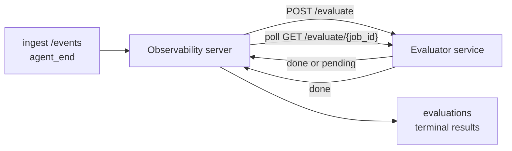

Failproof AI Observability は、完了したすべてのエージェント実行を自動的に品質スコアリングできます。小さなスコアリングサービスを用意するだけで、残りは Observability が処理します。追跡したい評価軸（有用性、ツール効率、事実性、安全性など、自由に定義可能）を監視し、品質低下を早期に検出し、エージェントや環境をひと目で比較できます。スコアリングはオプトイン方式で、サーバーに `EVALUATOR_ENDPOINT` を設定するまでパイプラインは何もしません。

> **注記:** スコアの評価軸はあなたが定義します。評価器は任意の数値キーを返せます。Observability はあなたが返すデータを保存・トレンド分析・表示します。

## 概要

1. **スコアラーを作成する。** セッションのトランスクリプトを読み込んでスコアを返す小さな HTTP サービスを立ち上げます。Observability には参考になる動作済みリファレンスが同梱されています。[SDK を使った評価器の作成](#writing-an-evaluator-with-the-sdk)を参照してください。
2. **Observability に接続先を設定する。** サーバープロセスに `EVALUATOR_ENDPOINT`（および共有 `EVALUATOR_TOKEN`）を設定します。
3. **スコアの反映を確認する。** 完了したすべてのセッションが自動的にスコアリングされ、結果はセッション詳細ページ、セッショングリッド、保存済みダッシュボードに表示されます。


*評価器を設定すると、完了した各実行がスコアリングされ、結果がセッションの右パネルに表示されます。上部にサマリー、その下に評価軸別のスコアバーと推論テキストが並びます。*

---

## 仕組み



Observability SDK がセッションの `agent_end` イベントを送信すると、サーバーは評価をスケジュールします。次に、完全なイベントトランスクリプトを評価器サービスに POST します。評価器は以下のいずれかを行います。

- **結果をインラインで返す**: `{"status":"done", "scores":{...}, "reasoning":{...}, "summary":"..."}` を返すと、結果がセッションの評価タイムラインに追記されます。`reasoning` と `summary` はオプションです。
- **遅延処理する**: `{"status":"pending", "job_id":"abc-123"}` を返すと、Observability は評価器が `{"status":"done", ...}` または `{"status":"error", "error":"..."}` を返すまで `GET {EVALUATOR_ENDPOINT}/evaluate/abc-123` を呼び続けます。

  ポーリング間隔はジョブごとに設定できます。`pending` レスポンスに `next_poll_secs` を含めることで上書きできます。指定がない場合は `GET /config` の `default_poll_interval_secs` を使用し、それもない場合はサーバーの `EVALUATOR_POLLING_INTERVAL_SECS`（デフォルト 10 秒）にフォールバックします。すべての値は [1 秒, 1 時間] の範囲にクランプされます。

`agent_end` を送信しなかったセッション（例: クラッシュしたエージェントプロセス）も拾えます。評価器の `GET /config` が `{"inactivity_timeout_secs": 1800}` を返すと、Observability はその時間以上アイドル状態のセッションを評価します。このフォールバックを無効にするには、フィールドを `null` に設定するか省略してください。

`EVALUATOR_ENDPOINT` が未設定の場合、パイプラインは完全に no-op です。

セッションには**複数の終了評価が時系列で蓄積**されます。`agent_end` イベントのたびに（また、ダッシュボードからの手動再評価のたびに）新しい評価行が追記されます。これは再開された会話を評価するためのサポートされた方式です。ユーザーがエージェントを終了し、後で戻り、さらにイベントを送信してエージェントを再び終了すると、更新された完全なトランスクリプトに対して 2 回目の評価が実行されます。ダッシュボードは最新の評価をヘッドラインとして表示し、それ以前の評価は折りたたみ可能なタイムラインとして表示されます。あるセッションに対して評価が実行中の間、そのセッションへの追加の `agent_end` イベントは無視されます。実行中の評価が完了した後の次の `agent_end` で、通常通り新しい評価がエンキューされます。

アイドルタイムアウトのフォールバックは再開されたセッションにも適用されます。以前の終了評価の後に新しいイベントが到着し、セッションが再び `inactivity_timeout_secs` を超えてアイドル状態になると、新しい評価がエンキューされます。

一時的な障害（5xx、429、タイムアウト、ネットワークエラー）は `EVALUATOR_MAX_ATTEMPTS` まで指数バックオフで再試行されます。4xx レスポンスは終了扱いです。Observability は複数の水平スケールされたサーバーインスタンスで安全に実行できます。同じセッションが同時に 2 回ディスパッチされないようにワークが分割されます。

---

## HTTP コントラクト

認証が必要なすべてのルートは**ベアラートークン認証**を使用します。同じ値を両側に設定する必要があります。

- Observability サーバー: 環境変数 `EVALUATOR_TOKEN`
- 評価器サービス: 同様に設定（`agenteye-evaluator` SDK は慣例として `EVALUATOR_TOKEN` を読み取ります）

`EVALUATOR_TOKEN` が未設定の場合、サーバーは `Authorization` ヘッダーを送信しません。評価器は匿名リクエストを受け付けることができますが、これは内部ネットワーク専用環境では問題ありませんが、公開インターネット上では推奨されません。

### 評価器が提供すべきルート

| ルート | ボディ / パラメータ | レスポンス |
|---|---|---|
| `GET /health` | なし | `{"status":"ok"}` （認証不要、オープン） |
| `GET /config` | なし | `{"inactivity_timeout_secs": <int> \| null, "default_poll_interval_secs": <int> \| omitted}` |
| `POST /evaluate` | `EvalRequest` JSON | `{"status":"done", ...}` または `{"status":"pending", "job_id":"..."}` |
| `GET /evaluate/{id}` | なし | `/evaluate` と同じレスポンス形式 |

### サーバーが送信する `EvalRequest` ボディ

```json
{
  "schema_version": "1",
  "session_id":     "session-abc123",
  "agent_id":       "planner",
  "environment":    "production",
  "started_at":     "2026-05-10T12:00:00Z",
  "ended_at":       "2026-05-10T12:05:00Z",
  "events": [
    { "id": 1234, "ts": "...", "event_type": "agent_start", "payload": { ... } },
    ...
  ]
}
```

### レスポンス形式

**同期（完了）:**

```json
{
  "status": "done",
  "scores": { "helpfulness": 0.85, "tool_efficiency": 0.6 },
  "reasoning": {
    "helpfulness": "answered the question directly with citations",
    "tool_efficiency": "called list_files three times when one would have done"
  },
  "summary": "strong answer quality, weak tool selection"
}
```

`reasoning`（スコアごとの根拠マップ）と `summary`（全体的な 1 段落の説明文）はどちらもオプションです。`reasoning` のキーは `scores` のキーに対応しているべきです。ダッシュボードは各エントリをスコアバーの下にインライン表示します。`scores` のみを返す旧来の評価器はそのまま動作します。`reasoning` と `summary` は null として扱われ、対応する UI 要素は省略されます。

**非同期（遅延）:**

```json
{ "status": "pending", "job_id": "abc-123", "next_poll_secs": 30 }
```

`next_poll_secs` はオプションです。省略した場合、サーバーは `/config` の評価器の `default_poll_interval_secs` にフォールバックし、それもない場合は自身の `EVALUATOR_POLLING_INTERVAL_SECS` 環境変数を使用します。

**評価器側の終了エラー:**

```json
{ "status": "error", "error": "model service unavailable" }
```

サーバーはそれ以外の 2xx ボディをプロトコルエラーとして扱い、セッションに終了 `error` を記録します。

---

## SDK を使った評価器の作成

HTTP コントラクトを手動で実装する必要はありません。`agenteye-evaluator` Python パッケージは、認証、ルーティング、リクエスト/レスポンス形式を処理する型付き FastAPI ラッパーを提供します。

Failproof AI Observability には、トランスクリプトの形式から `helpfulness`、`tool_efficiency`、`factuality` をスコアリングする**動作済みリファレンス評価器**も同梱されています。これをコピーして出発点として使い、LLM ジャッジ、ルールエンジン、品質基準に合わせた独自のロジックに置き換えてください。

最小限の評価器の例:

```python
import os
from agenteye_evaluator import Evaluator, EvalRequest, EvalResponse

app = Evaluator(token=os.environ["EVALUATOR_TOKEN"])

@app.evaluator
def run(req: EvalRequest) -> EvalResponse:
    # Inspect req.events (the full session transcript) and return scores.
    tool_calls = sum(1 for e in req.events if e.event_type == "tool_use")
    return EvalResponse(
        scores={"tool_calls": float(tool_calls)},
        reasoning={"tool_calls": f"{tool_calls} tool invocations in the transcript"},
        summary="tight tool loop" if tool_calls < 5 else "agent looped on tools",
    )
```

`app` インスタンスは任意の ASGI サーバーで動作するため、`uvicorn module:app` で起動できます。

高コストな処理を遅延させる必要がある評価器では、代わりに `JobPending` を返し、`@app.job_lookup` ハンドラーを登録してください。Observability サーバーは評価器が終了ステータスを返すか、`EVALUATOR_MAX_POLL_DURATION_SECS` の上限（デフォルト 1 時間）に達するまで `GET /evaluate/{job_id}` をポーリングします。

完全な API リファレンス、非同期パターン、イベントスキーマは `agenteye-evaluator` SDK の README に記載されています。

---

## 評価器の実行

評価器は**あなた自身のサービス**です。Failproof AI Observability はデフォルトの評価器を同梱していないため、自分のサービスを実行する環境でビルドして実行します。任意の ASGI サーバー（例: `uvicorn my_evaluator:app`）で動作します。[HTTP コントラクト](#http-contract)に記載された `/health`、`/config`、`/evaluate` ルートを提供し、サーバーに接続先を設定してください（[サーバーの設定](#configuring-the-server)を参照）。

評価器に到達可能になると、`GET /health` が `{"status":"ok"}` を返します。エージェントがエンドツーエンドで実行された後、サーバーの `GET /evaluations` は `status: "done"` と評価器が返したスコアを含む行を返します。

---

## サーバーの設定

サーバープロセスに設定する環境変数:

| 環境変数 | 意味 |
|---|---|
| `EVALUATOR_ENDPOINT` | 評価器のベース URL（例: `http://evaluator:9000`）。未設定の場合、パイプラインは無効になります。 |
| `EVALUATOR_TOKEN` | ベアラートークン。評価器サービスに設定された値と一致する必要があります。 |
| `EVALUATOR_WORKERS` | サーバーインスタンスあたりのワーカータスク数（デフォルト 2）。 |
| `EVALUATOR_CLAIM_BATCH` | ワーカーティックあたりの処理行数（デフォルト 4）。バッチは**並行処理**されます。評価器エンドポイントへの実効並行数は `EVALUATOR_WORKERS × EVALUATOR_CLAIM_BATCH` です。 |
| `EVALUATOR_POLL_IDLE_SECS` | 評価が不要な場合にワーカーがディスパッチ試行の間にスリープする時間（デフォルト 2 秒）。 |
| `EVALUATOR_POLLING_INTERVAL_SECS` | レスポンスごとの `next_poll_secs` も評価器の `default_poll_interval_secs` も設定されていない場合の `GET /evaluate/{id}` のポーリング間隔の最終フォールバック（デフォルト 10 秒）。 |
| `EVALUATOR_REQUEST_TIMEOUT_MS` | リクエストごとのタイムアウト（デフォルト 30000）。 |
| `EVALUATOR_MAX_ATTEMPTS` | この回数だけ一時的な障害が発生すると、結果は終了 `error` として記録されます（デフォルト 5）。 |
| `EVALUATOR_CONFIG_REFRESH_SECS` | `GET /config` のポーリング間隔（デフォルト 300）。 |
| `EVALUATOR_MAX_POLL_DURATION_SECS` | セッションがポーリングキューに残れる最大ウォールクロック時間。この時間を超えると `timeout` として終了します（デフォルト 3600 秒）。`pending` を返し続ける評価器に対するガードです。 |

自動スコアリングを有効にするには、サーバーに `EVALUATOR_ENDPOINT` と `EVALUATOR_TOKEN` の両方を設定し、変更を反映させるためにサーバーを再起動します。`EVALUATOR_ENDPOINT` が未設定の場合、パイプラインは no-op のままです。

上記のチューニングパラメータはオプションです。デフォルト値を上書きする必要がある場合にのみ、対応する環境変数をサーバーに設定してください。

---

## API リファレンス

| メソッド | パス | 必要な権限 | 目的 |
|---|---|---|---|
| `GET` | `/evaluations` | `evaluations:read` | 終了結果のクエリ。`session_id`、`agent_id`、`environment`、`status`（`done`/`error`/`timeout`）、`ts_from`、`ts_to`、`cursor`、`limit`、`score_filters`、`latest_per_session` をサポート。`limit` のデフォルトは 50、上限は 200（1000 が上限の `/events` とは異なる点に注意）。`environment` はカンマ区切りリストを受け付けます（例: `environment=prod,staging`）。単一の値も引き続き動作します。`latest_per_session=true` の場合、レスポンスには `session_id` ごとに最大 1 行（`completed_at` が最新のもの）が含まれます。これはセッションの評価タイムラインを現在のヘッドラインに折りたたむセッションリストページで使用されます。デフォルトは false（完全な履歴を返す）。 |
| `GET` | `/evaluations/aggregate` | `evaluations:read` | フィルタリングされたスライスの評価ヘルスのロールアップ: 総数、done/error/timeout の内訳、スコアキーごとの統計（任意の `scores` キーにわたる count/avg/min/max/p50）、時間バケット化されたタイムライン。`/evaluations` と**同じフィルターパラメータ**に加えて `featured_keys`（トレンド表示するスコアキーの CSV）と `latest_per_session` を受け付けます。ダッシュボード機能を動作させます。メトリクスは一致するセット全体に対して正確に計算され、サンプリングされません。 |
| `GET` | `/evaluations/environments` | `evaluations:read` | `evaluations` テーブルから個別の環境値を取得します。評価データにスコープされたフィルタードロップダウンの生成に使用されます。 |
| `GET` | `/evaluation-jobs` | `evaluations:read` | 実行中の評価の可視化。`status`（`pending`/`polling`）でフィルタリング可能。 |
| `GET` | `/events` | `events:read` | セッションの生イベントのストリーム取得。`session_id`、`agent_id`、`event_type`（CSV）、`environment`（CSV）、`ts_from`、`ts_to`、`cursor`、`limit`、`order` をサポート。`order` は `desc`（新しい順、デフォルト）または `asc`（古い順）。不明な値は `desc` にフォールバックします。レスポンスの `next_cursor`（イベント ID）を使用してカーソルページネーションを行います。これを `cursor` として渡すと次のページが取得できます。`asc` では次のページはその ID 以降のイベント、`desc` ではその ID 以前のイベントになります。`limit` のデフォルトは 50、上限は 1000。 |
| `GET` | `/sessions/:session_id/export` | `events:read` | このセッションに対して評価器が受信する正確な JSON ボディを、`session-<id>.json` という名前のダウンロード可能な添付ファイルとして返します。本番セッションを `agenteye-evaluator` でオフラインテスト用に再生する際に便利です。バイトは評価器パイプラインが送信するものと完全に一致します。 |
| `POST` | `/sessions/:session_id/re-evaluate` | `evaluations:trigger` | セッションに対して新しい評価をエンキューします。以前の評価が存在するかどうかに関わらず実行されます。新しい結果は、以前の結果を上書きするのではなく、セッションの評価タイムラインに**追記**されるため、以前のスコアは履歴として残ります。エンキュー時に `202`、不明なセッションには `404`、評価が既に実行中の場合は `409` を返します。新しい評価器をデプロイした後、または `agent_end` を送信しなかったセッションに対して使用します。 |

### スコア範囲によるフィルタリング: `score_filters`

`GET /evaluations` はオプションの `score_filters` パラメータを受け付け、`scores` オブジェクト内の数値によって結果を絞り込みます。このパラメータは `key:min..max` エントリのカンマ区切りリストで、どちらの境界も省略できます。複数のエントリは論理 AND で結合されます。指定されたキーが存在しないか数値でない行は除外されます。1 つのリクエストに設定できるフィルターエントリは最大 20 件で、超過した場合は HTTP 400 が返されます。

例:
```text
# helpfulness が [0.5, 0.8] の範囲
GET /evaluations?score_filters=helpfulness:0.5..0.8

# tool_efficiency が 0.3 以下（下限なし）
GET /evaluations?score_filters=tool_efficiency:..0.3

# helpfulness >= 0.5 AND factuality >= 0.9
GET /evaluations?score_filters=helpfulness:0.5..,factuality:0.9..
```

各 `/evaluations` レスポンスオブジェクトのフィールド:

| フィールド | 型 | 備考 |
|---|---|---|
| `evaluation_id` | string (UUID) | この終了評価の正規識別子。各終了評価には新しい UUID が割り当てられます。1 つのセッションに複数保持できます。 |
| `id` | string (UUID) | `evaluation_id` と同じ値を持つ後方互換エイリアス。 |
| `session_id` | string | この評価が実行されたセッション。セッションはタイムラインに複数の評価を持てます。 |
| `agent_id` | string | セッションを生成したエージェントの識別子。 |
| `environment` | string | セッションからコピーされた環境ラベル。 |
| `status` | enum | `"done"`、`"error"`、`"timeout"` のいずれか。 |
| `scores` | object \| null | 評価器が返したスコア。 |
| `reasoning` | object \| null | 評価器が返したスコアごとのオプションの根拠マップ。キーは通常 `scores` のキーと対応しています。ダッシュボードは各エントリをスコアバーの下に表示します。 |
| `summary` | string \| null | 評価器が返したオプションの全体的な 1 段落の説明文。ダッシュボードはこれをスコア内訳の上に評価のヘッドラインとして表示します。 |
| `error` | string \| null | `"error"` / `"timeout"` の場合のみ入力されます。 |
| `attempt_count` | integer | ディスパッチ試行回数（1 以上）。 |
| `duration_ms` | integer \| null | 最終試行の所要時間。 |
| `completed_at` | string (ISO 8601 UTC) | 終了結果が記録された日時。結果は `completed_at` の降順（新しい順）で並べられます。 |
| `created_at` | string (ISO 8601 UTC) | `completed_at` と同じタイムスタンプを持ちます（書き込み一回限りのセマンティクス）。 |

---

## 権限

| 権限 | 付与する操作 |
|---|---|
| `evaluations:read` | 評価結果の一覧表示、ダッシュボードでのスコア閲覧、ダッシュボードヘルスメトリクスの読み込み。 |
| `evaluations:trigger` | `POST /sessions/:session_id/re-evaluate` またはダッシュボードの再評価ボタンを使用してセッションの評価を手動でエンキューする。 |
| `dashboards:read` | 保存済みダッシュボードの閲覧（メトリクスの読み込みには `evaluations:read` も必要）。 |
| `dashboards:write` | ダッシュボードの作成と編集。 |
| `dashboards:delete` | ダッシュボードの削除。 |

ブートストラップ管理者（`ADMIN_KEY`、`ADMIN_EMAIL`）はこれらすべての権限を自動的に受け取ります。

---

## 結果の確認

- **`/sessions/<id>`**: イベントタイムラインと、セッションのスコアおよびディスパッチ試行からのエラーを表示する右パネル。キーに `evaluations:trigger` 権限がある場合、エクスポートボタンの横に**再評価**ボタンが表示されます。これは `agent_end` を送信しなかったセッションや、新しい評価器をデプロイした後にスコアを更新する際に便利です。ダッシュボードは新しい結果をポーリングし、結果が得られたら右パネルを更新します。
- **`/sessions`**: フィルタリング可能なセッショングリッド。スコアカラムには各セッションの評価ステータスとスコアがひと目でわかるように表示されます。
- **`/dashboards`**: 保存済みの評価ヘルスビュー（下記の[ダッシュボード](#dashboards)を参照）。


*セッショングリッドは各実行の評価ステータスとスコアをひと目で表示します。赤/オレンジ/緑のバッジで低スコアが目立ちます。*

---

## ダッシュボード

**ダッシュボード**ページ（`/dashboards`）では、評価フィルターの組み合わせを名前付きの再利用可能なビューとして保存し、その評価スライスの状況をひと目で把握できます。ダッシュボードは**組織全体で共有**されます。`dashboards:read` を持つ全員が同じセットを閲覧できます。

各ダッシュボードには以下が保存されます。

- **フィルター**: セッションページと同じコントロール: 環境、ステータス、エージェント、ローリングタイムウィンドウ、スコア範囲フィルター（`key:min..max`）。
- **表示設定**: フィーチャーするスコアキー、緑/オレンジ/赤のヘルス閾値、表示するパネル、セッションごとの最新評価に折りたたむかどうか。

各カードには、一致するセッション数、done/error/timeout の内訳、各フィーチャードスコアの平均、小さなトレンドスパークラインが表示されます。ダッシュボードを開くとフルサイズのパネルが表示されます。**「セッションで開く」**をクリックすると、そのスライスで事前フィルタリングされたセッションページに移動します。メトリクスはサーバーサイドで一致するセット全体に対して計算されます（`GET /evaluations/aggregate` 経由）。そのため、数値はサンプリングではなく正確です。


**権限:** 閲覧には `dashboards:read` と `evaluations:read` の両方が必要です。作成と編集には `dashboards:write` が必要です。削除には `dashboards:delete` が必要です。ブートストラップ管理者はこれらすべてを自動的に受け取ります。

---

## トラブルシューティング

**セッションは存在するが評価が作成されない。** サーバープロセスに `EVALUATOR_ENDPOINT` が設定されていること、サーバーと評価器が同じ `EVALUATOR_TOKEN` 値を共有していること、評価器の `/health` エンドポイントがサーバーから到達可能であることを確認してください。`EVALUATOR_ENDPOINT` が未設定の場合、パイプラインは no-op です。

**実行中の評価が溜まっている。** `GET /evaluation-jobs` をクエリして実行中のキューを確認します。各行の `attempt_count`、`next_attempt_at`、`last_error` を調べてください。よくある原因: 評価器サービスに到達できないか 5xx を返している（バックオフで再試行）、`EVALUATOR_TOKEN` が間違っている（401 は終了扱い）、または `pending` を無期限に返す非同期評価器（下記参照）。

**セッションが完了したが終了評価がない。** `GET /evaluation-jobs?status=polling` をクエリしてください。結果はまだ実行中かもしれません。ジョブが `pending` のまま stuck している場合は、サーバーが評価器に到達できない可能性があります。評価器が起動していること、`EVALUATOR_TOKEN` が一致していることを確認してください。

**`HTTP 401 from evaluator: invalid bearer token`。** サーバーの `EVALUATOR_TOKEN` が評価器サービスに設定された値と一致していません。同一である必要があります。

**非同期評価器が `pending` を返し続ける。** サーバーは評価器が `done` または `error` を返すか、`EVALUATOR_MAX_POLL_DURATION_SECS`（デフォルト 1 時間）が経過するまで `GET /evaluate/{job_id}` をポーリングします。上限に達すると、評価は `timeout` として記録され、実行中のキューから削除されます。評価器が正当にデフォルトより長い時間を必要とする場合は、`EVALUATOR_MAX_POLL_DURATION_SECS` を増やしてください。

---

## 次のステップ

- [評価器エージェントスキル](/ja/agenteye/evaluator-skill): コーディングエージェントに実際のセッションに基づいて評価軸を設計させ、このサービスを構築させます。
- [Python SDK](/ja/agenteye/python-sdk): スコアリングをトリガーする `agent_end` イベントを送信します。
- [API キー](/ja/agenteye/api-keys): `evaluations:read` と `evaluations:trigger` の権限。
- [監査](/ja/agenteye/audits): ポリシーベースのレビューのための Observability のもう一つの自動品質機能。