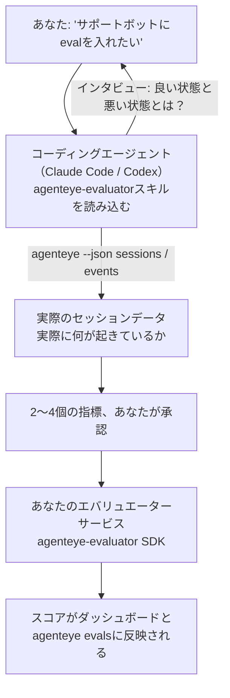

*「エージェントの品質が怪しい気がする」* から本番稼働のスコアリングサービスまで、コーディングエージェントが設計から実装まで一手に担います。**Failproof AI Observability エバリュエータースキル**（`agenteye-evaluator`）は*エージェントスキル*です。Claude Code や Codex などのコーディングエージェントが必要に応じて読み込む小さなインストラクションフォルダで、*あなたの*エージェントに対してどの品質指標を追跡すべきかを検討し、それを計測する[エバリュエーターサービス](/ja/agenteye/evaluation-suite)を記述・テスト・デプロイする方法をエージェントに教えます。

これはホスト型スコアラーでも、アップロード先のレジストリでも、プラグインシステムでもありません。エバリュエーターは[Evaluation suite](/ja/agenteye/evaluation-suite)ガイドに記載された通り、あなた自身のインフラ上で動作するあなた自身のHTTPサービスとして維持されます。スキルはただ、エージェントがそれをうまく構築できるよう教えるだけです。エージェントが行うことは、すべてあなたが同じコードを書くことで自分でもできます。

---

## 難しいのは「何をスコアするか」を決めること

SDKの表面積は小さく、デコレーターとモデル2つだけです。エージェントは[コントラクト](/ja/agenteye/evaluation-suite#http-contract)だけからでもそれを書けます。問題はそこではありません。エバリュエーターが失敗する理由は、間違ったものをスコアするからです。そして間違ったものをスコアするエバリュエーターは、何もないより悪いです。誰もが無視することを覚えるダッシュボードを生み出すだけです。

だからスキルの大半は、コードが一行も書かれる前の段階に充てられています。エージェントはあなたにインタビューし（*「うまくいったセッションを説明してください。では、うまくいかなかったものを」*）、[`agenteye` CLI](/ja/agenteye/cli)を通じて実際のセッションを取得して最初から最後まで読み込みます。この2つの情報源は通常一致せず、そのギャップこそが重要です。あなたが測定しようとしているものと、トランスクリプトが実際に支持できるものの違いです。指標として残るのは、イベントから**計算可能**で、かつ**識別力がある**ものだけです。良いセッションにも悪いセッションにも0.9のスコアをつけるような指標は何も教えてくれないため、除外されます。

返ってくるのは2〜4個の指標の提案と、その根拠です。コードが一行も書かれる前に、あなたが承認します。



---

## 他の評価関連ドキュメントとの関係

スコアリングに関するドキュメントは4つあり、順番に引き継がれます。

| ページ | 内容 | 参照するタイミング |
|---|---|---|
| **[Evaluations](/ja/agenteye/evaluations)** | 機能：セッショングリッドのスコア、ダッシュボード、再評価 | 自動スコアリングで何が得られるかを知りたいとき |
| **[Evaluation suite](/ja/agenteye/evaluation-suite)** | HTTPコントラクト、SDK、サーバー環境変数 | エバリュエーターを自分で実装またはデバッグするとき |
| **エバリュエータースキル**（このドキュメント） | スコアラーの設計と構築への自然言語インターフェース | 「evalを入れたい」から稼働中のサービスに至りたいとき |
| **[CLIスキル](/ja/agenteye/cli-skill)** | `agenteye` CLIへの自然言語インターフェース | すでにあるスコアを*読み取り*たいとき |
| **[Python SDKスキル](/ja/agenteye/python-sdk-skill)** | エージェントのインストルメント化への自然言語インターフェース | エージェントがセッションを送信していない場合（スコアする対象がない） |

### CLIスキルとの違い：構築と読み取り

2つのスキルは意図的に重複しないよう設計されており、両方インストールするのが通常の構成です。エージェントはあなたの質問に基づいてどちらを使うか選択します。

- **`agenteye-evaluator`**（このドキュメント）はスコアを*生成する*ものを構築します。スコアが初めて反映された時点でその役割は終わります。
- **[`agenteye-cli`](/ja/agenteye/cli-skill)**はすでに存在するスコアを読み取ります（`agenteye evals`）。「今週品質は落ちたか？」というのがこちらのスキルの問いであり、このスキルの問いではありません。

---

## 前提条件

1. **`agenteye` CLIがインストール済みでログイン済みであること**（`pipx install agenteye`、次に`agenteye login`）。スキルはCLIを2回使用します。設計に使う実際のセッションの取得と、最後にスコアが反映されたことの確認です。ログインには`events:read`、および最終確認に`evaluations:read`が必要です。CLIスキルと同様、メールで届くワンタイムコードのログインを代わりに完了することは**できません**。
2. **エバリュエーターの置き場所。** イメージとしてビルドされ、長期稼働サービスとして実行されるため、一時ファイルではなく実際のリポジトリが必要です。エバリュエーターは、スコアリング対象のエージェントとは別の独自のリポジトリに置かれることが多いです。スキルは既存のリポジトリを探し、新たにスキャフォールドする前に確認を求めます。
3. **`agenteye-evaluator` SDKホイール** — エージェントが`pip`コマンドを打ち始める前に次のセクションをお読みください。

---

## 入手先

スキルはFailproof AIのパブリックスキルコレクションで公開されています。

**[github.com/FailproofAI/skills](https://github.com/FailproofAI/skills)** → [`skills/agenteye-evaluator/`](https://github.com/FailproofAI/skills/tree/main/skills/agenteye-evaluator)

リポジトリは公開されており、スキル自体は独自のクレデンシャルを必要としません。あなたがログインしたCLIセッションで`agenteye` CLIを操作し、*あなたの*リポジトリにコードを書くだけです。スキルは独自のフォルダとして提供され、`pipx install agenteye`パッケージの中には含まれていない点に注意してください。

## スキルのインストール

最速の方法は[`skills`](https://skills.sh) CLIです。フォルダを取得して、エージェントが参照する場所に配置します。

```bash
# Claude Code、このプロジェクトのみ
npx skills add FailproofAI/skills --skill agenteye-evaluator -a claude-code

# すべてのプロジェクト（~/.claude/skills/ にインストール）
npx skills add FailproofAI/skills --skill agenteye-evaluator -a claude-code -g --copy

# Codexの場合
npx skills add FailproofAI/skills --skill agenteye-evaluator -a codex
```

その後は他のスキルと同様に管理できます。

```bash
npx skills list -a claude-code           # インストール済みスキルの確認
npx skills update agenteye-evaluator     # 最新バージョンに更新
npx skills remove agenteye-evaluator     # 削除
```

手動でインストールする場合は、エージェントスキルは`SKILL.md`（およびオプションの参照ファイル）を含むフォルダに過ぎないため、コピーするだけでも機能します。

- **Claude Code**: `agenteye-evaluator/`フォルダを`~/.claude/skills/`（すべてのプロジェクト）または`<your-repo>/.claude/skills/`（そのリポジトリのみ）に配置します。Claude Codeは自動検出します。`/skills`リストで確認するか、evalについて聞いてみてください。
- **Codex（OpenAI）**: Codexは同じ`SKILL.md`を読みます。同梱の`agents/openai.yaml`は`allow_implicit_invocation: true`を設定しているため、タスクが合致すればCodexが自動的にスキルを選択します。明示的に呼び出す場合は`$agenteye-evaluator`を使用してください。

---

## SDKはパブリックのPyPIにありません

> **警告:** エージェントにSDKをインストールさせる前にこれを読んでください。

スキルは公開されていますが、それが動かすSDKは公開されていません。`agenteye-evaluator`はプライベートリリースアーティファクトとしてのみ提供されており、`agenteye`とは異なり、パブリックPyPIでその名前は**未登録**です。つまり`pip install agenteye-evaluator`を素のまま実行すると、見知らぬ第三者のパッケージが本番トランスクリプトを読み取るサービスに混入する可能性があります。これは誤字ではなく、サプライチェーンの問題です。

スキルはこの点を把握しており、代わりにインストールの優先順位を順番に試します。AgentEyeリポジトリ内にいる場合はモノリポのソース、そうでなければGitHub Releases上のプライベートリリースホイール（アクセス権が必要）、どちらも使えない場合は**`pip install`を試みず、Failproof AIの担当者にホイールを問い合わせるよう指示して処理を停止**します。

エージェントがパブリックPyPIからの素の`pip install agenteye-evaluator`を提案してきた場合、それはスキルが読み込まれていないサインです。そこで立ち止まり、インストールを確認してください。

---

## 何を依頼できるか

実際のやり取りは曖昧な要求から始まり、コードではなく承認済みの設計で終わります。

```text
あなた  ▸ サポートボットにevalを入れたい。品質が怪しい気がする。

エージェント ▸ コードを書く前に確認させてください：うまくいったセッションを
              1つ説明してください。次に、うまくいかなかったものを。

あなた  ▸ 良い例：ドキュメントから回答する。悪い例：でたらめを言う、
          または諦めて「サポートに連絡してください」と言う。

エージェント ▸ 実行中: agenteye --json sessions --status error --since 7d
              5セッションを読み込んでいます（あなたが悪いと言ったものを2つ含む）。

              あなたの言葉は「事実性」と「回避」を示しています。トランスクリプトは
              回避については一致しています（5件中2件はサポートへの引き継ぎで終わり、
              model_response.contentに明確に表れています）が、事実性には
              イベントが持っていないグラウンドトゥルースが必要です。

              そのため、以下の3つをスコアします:
                - deflection      ルールベース、低コスト、2つのセッションを区別できる
                - tool_efficiency ルールベース、run-004のリトライループを検出する
                - groundedness    LLMジャッジ：すべての主張が取得したドキュメントにあるか？

              「事実性」にはグラウンドトゥルースが必要で手元にありません。
              「groundedness」はトランスクリプトで実際に計測できる最も近い代替です。
              この3つの名前で進めてよいですか？後で変更すると履歴が分断されます。

あなた  ▸ はい

エージェント ▸ このリポジトリにエバリュエーターが見つかりません。ここにスキャフォールドしますか、
              それとも別の場所にありますか？
```

そこからまずルールベースの指標を記述します（無償、即時、決定論的）。空のセッションや未完了のセッションなど、単純なエバリュエーターをクラッシュさせる実際のキャプチャセッションに対してテストし、主観的な指標に対してのみLLMジャッジを使用します。スキルは[ディスパッチャーの制限](/ja/agenteye/evaluation-suite#configuring-the-server)（リクエストタイムアウト30秒、デプロイメント全体で同時8コール）を把握しているため、ジャッジが確実に収まらない場合は、5倍のコストで5回キャンセルされリトライされるのではなく、`JobPending`で非同期処理に切り替えます。

その後デプロイし、サーバーの環境変数2つを設定し、`agenteye --json evals --session-id <id>`でスコアが実際に反映されたことを確認します。スコアが反映されることが唯一の証明です。

---

## 注意すべき点

- **指標名はほぼ恒久的です。** スコアのキーは任意の文字列であり、プラットフォームはあなたが送ったものを何でもトレンド表示します。つまりダウンストリームで誤った選択を修正する仕組みはありません。後で名前を変更すると履歴が分断されます。古いセッションは古いキーを保持し、トレンドが壊れます。これがスキルがコードを書く前に明示的な承認を求める理由です。このプロンプトを真剣に受け止めてください。
- **フィクスチャは実際の本番トランスクリプトです。** 実際のセッションで設計するということは、それらをディスクに取得することを意味し、顧客データが含まれる可能性があります。スキルはgitにコミットする前に確認を求めます。不安な場合は`fixtures/`をリポジトリから除外し、各開発者が自分でプルするようにしてください。
- **エージェントはすべてのトランスクリプトを読み取るサービスを記述してデプロイします。** あなたのCLIログインの権限の範囲内であなたの代わりに動作しますが、本番データに触れる他のコードと同様にエバリュエーターをレビューしてください。

---

## 次のステップ

- **[Evaluation suite](/ja/agenteye/evaluation-suite)**: スキルが設定するHTTPコントラクト、SDK、サーバー環境変数。
- **[Evaluations](/ja/agenteye/evaluations)**: スコアが反映された後に表示される場所。
- **[CLIスキル](/ja/agenteye/cli-skill)**: スコアラーを構築するのではなく、結果を読み取るための姉妹スキル。
- **[CLI](/ja/agenteye/cli)**: スキルが設計に使用するセッションデータのコマンドリファレンス。