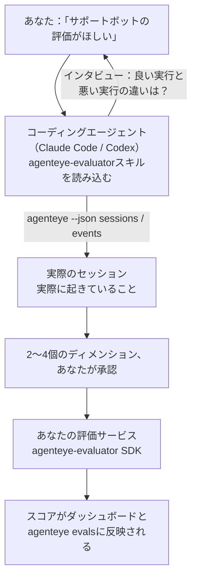

*「エージェントの品質がときどき悪い気がする」* という状態から、デプロイ済みのスコアリングサービスまで一気に到達できます。設計もビルドも、コーディングエージェントが担います。**Failproof AI オブザーバビリティ評価スキル**（`agenteye-evaluator`）は *Agent Skill* の一種です。Claude Code や Codex などのコーディングエージェントがオンデマンドで読み込む、小さな指示フォルダです。このスキルは、*あなたの*エージェントにとって追跡する価値のある品質ディメンションを見極め、それらをスコアリングする[評価サービス](/ja/agenteye/evaluation-suite)を記述・テスト・デプロイする方法をエージェントに教えます。

これはホスト型スコアラーでも、アップロード先のレジストリでも、プラグインシステムでもありません。評価エージェントは[Evaluation suite](/ja/agenteye/evaluation-suite)ガイドに記載のとおり、あなた自身のインフラ上でHTTPサービスとして動作し続けます。スキルはそれをうまく構築するための指示を提供するだけであり、スキルが行うことはすべて、あなた自身が同じコードを書けば実現できます。

---

## 難しいのは「何をスコアするか」の決断

SDKの表面積は小さく、デコレーターとふたつのモデルのみです。エージェントは[コントラクト](/ja/agenteye/evaluation-suite#http-contract)だけからでもそれを書けます。評価エージェントが失敗するのはそこではありません。間違ったものをスコアするから失敗するのです。そして間違ったものをスコアする評価エージェントは、ないよりも悪い。誰もが無視することを学んだダッシュボードを生み出すだけです。

だからこそ、スキルの大部分はコードが存在する前の段階に費やされます。スキルはエージェントにあなたへのインタビューをさせ（*「うまくいった実行を教えてください。次に、うまくいかなかった実行を」*）、[`agenteye` CLI](/ja/agenteye/cli)を通じて実際のセッションを取得し、最初から最後まで読み込ませます。ふたつの情報源はたいてい食い違います。そのギャップこそが重要です。あなたが計測しようとしていることと、トランスクリプトが実際にサポートできることの差異。ディメンションが生き残るのは、イベントから**計算可能**であり、かつ**識別力がある**場合のみです。良い実行でも悪い実行でも0.9をスコアするなら、何も教えてくれないのでカットされます。

最終的に返ってくるのは、2〜4個のディメンションと、それぞれの根拠を添えた提案です。コードが一行も書かれる前に、あなたが承認します。



---

## 他の評価コンポーネントとの関係

スコアリングに関するドキュメントは4つあり、順番に引き継がれます：

| ページ | 内容 | 参照するタイミング |
|---|---|---|
| **[Evaluations](/ja/agenteye/evaluations)** | 機能：セッショングリッドのスコア、ダッシュボード、再評価 | 自動スコアリングで何が得られるかを知りたいとき |
| **[Evaluation suite](/ja/agenteye/evaluation-suite)** | HTTPコントラクト、SDK、サーバー環境変数 | 評価エージェントを自分で実装またはデバッグしているとき |
| **評価エージェントスキル**（このドキュメント） | スコアラーの設計と構築への自然言語フロントエンド | 「評価がほしい」から稼働するサービスまで進みたいとき |
| **[CLIスキル](/ja/agenteye/cli-skill)** | `agenteye` CLIへの自然言語フロントエンド | すでに持っているスコアを*読みたい*とき |
| **[Python SDKスキル](/ja/agenteye/python-sdk-skill)** | エージェントのインストルメント化への自然言語フロントエンド | エージェントがまだセッションを送出していない——スコアするものが何もないとき |

### CLIスキルとの違い：構築 vs 読み取り

ふたつのスキルは意図的に重複しないように設計されており、両方インストールするのが通常のセットアップです。エージェントはあなたの質問に基づいて使い分けます：

- **`agenteye-evaluator`**（このドキュメント）はスコアを*生成する*ものを構築します。初めてスコアが反映された時点でその役割は終わりです。
- **[`agenteye-cli`](/ja/agenteye/cli-skill)** はすでに存在するスコアを読み取ります（`agenteye evals`）。「今週、品質は下がったか？」がこのスキルの問いであり、このドキュメントのスキルの問いではありません。

---

## 前提条件

1. **`agenteye` CLIのインストールとログイン**（`pipx install agenteye` の後 `agenteye login`）。スキルはこれを2回使います。設計対象となる実際のセッションの取得と、最後にスコアが反映されたことの確認です。ログインには `events:read`、最終確認には `evaluations:read` が必要です。CLIスキルと同様に、メールで送られるワンタイムコードのログインをエージェントが代わりに完了することは**できません**。
2. **評価エージェントの置き場所。** イメージにビルドされ、長時間稼働するサービスとして実行されるため、スクラッチファイルではなく実際のリポジトリが必要です。評価エージェントは多くの場合、スコアリング対象のエージェントとは別のリポジトリに置かれます。スキルは既存のリポジトリを探し、新しくスキャフォールドする前に確認を求めます。
3. **`agenteye-evaluator` SDKホイール** — エージェントが `pip` コマンドを打ち始める前に次のセクションを読んでください。

---

## 入手方法

スキルはFailproof AIの公開スキルコレクションで公開されています：

**[github.com/FailproofAI/skills](https://github.com/FailproofAI/skills)** → [`skills/agenteye-evaluator/`](https://github.com/FailproofAI/skills/tree/main/skills/agenteye-evaluator)

リポジトリは公開されており、スキル自体には独自の認証情報は不要です。ログイン済みの `agenteye` CLIを操作し、*あなたの*リポジトリにコードを書くだけです。なお、このスキルは独自のフォルダとして提供されており、`pipx install agenteye` パッケージには含まれていません。そちらを探さないようにしてください。

## スキルのインストール

最速の方法は [`skills`](https://skills.sh) CLIです。フォルダを取得し、エージェントが参照する場所に配置します：

```bash
# Claude Code、このプロジェクトのみ
npx skills add FailproofAI/skills --skill agenteye-evaluator -a claude-code

# すべてのプロジェクト（~/.claude/skills/ にインストール）
npx skills add FailproofAI/skills --skill agenteye-evaluator -a claude-code -g --copy

# Codex の場合
npx skills add FailproofAI/skills --skill agenteye-evaluator -a codex
```

その後は他のスキルと同様に管理できます：

```bash
npx skills list -a claude-code           # インストール済みの確認
npx skills update agenteye-evaluator     # 最新バージョンに更新
npx skills remove agenteye-evaluator     # 削除
```

手動インストールを好む場合は、Agent Skillは `SKILL.md`（とオプションの参照ファイル）を含むフォルダに過ぎないため、コピーするだけでも動作します：

- **Claude Code**：`agenteye-evaluator/` フォルダを `~/.claude/skills/`（すべてのプロジェクト）または `<your-repo>/.claude/skills/`（そのリポジトリのみ）に配置します。Claude Code が自動検出します。`/skills` リストで確認するか、評価について尋ねるだけで確認できます。
- **Codex（OpenAI）**：Codex は同じ `SKILL.md` を読み込みます。同梱の `agents/openai.yaml` に `allow_implicit_invocation: true` が設定されているため、タスクが一致するとCodexが自動的にスキルを選択します。明示的に呼び出す場合は `$agenteye-evaluator` を使用してください。

---

## SDKは公開PyPIにありません

> **警告：** エージェントがSDKをインストールし始める前にこれを読んでください。

スキルは公開されていますが、それが利用するSDKは公開されていません。`agenteye-evaluator` はプライベートリリース成果物としてのみ提供されており、`agenteye` と異なり、**公開PyPIでその名前は未登録です**。つまり、素の `pip install agenteye-evaluator` を実行すると、本番トランスクリプトを読み込むサービスに見知らぬパッケージが引き込まれる可能性があります。これはタイポの問題ではなく、サプライチェーンの問題です。

スキルはこれを認識しており、代わりにインストール手順を順番に試します。最初に該当するもので止まります。AgentEyeリポジトリ内にいる場合はモノリポのソースを使用し、そうでなければGitHub Releasesのプライベートリリースホイールを試します（アクセス権が必要）。どちらも到達できない場合は**処理を止め、Failproof AIの担当者にホイールを問い合わせるよう伝えます**。独自に解決しようとはしません。

エージェントが公開PyPIからの素の `pip install agenteye-evaluator` を提案した場合、それはスキルが読み込まれていないサインです。そこで止めて、スキルがインストールされているか確認してください。

---

## 依頼できること

実際のやり取りは漠然とした依頼から始まり、コードではなく承認済みの設計で終わります：

```text
あなた  ▸ サポートボットの評価をしたいです。たまに品質が悪い気がします。

エージェント ▸ 何かを書く前に確認します。うまくいった実行と、
               うまくいかなかった実行を教えてください。

あなた  ▸ 良い場合：ドキュメントから正確に答えてくれる。
          悪い場合：でたらめを言う、または諦めて「サポートに連絡してください」と言う。

エージェント ▸ 実行中：agenteye --json sessions --status error --since 7d
               5セッションを読み込み中。そのうち2つがあなたの言う悪い例です。

               あなたの言葉からは「正確性」と「丸投げ」が浮かび上がります。
               トランスクリプトは「丸投げ」には同意しています（5件中2件がサポートへの
               引き渡しで終わっており、model_response.content で明確に確認できます）が、
               「正確性」にはイベントに含まれていないグラウンドトゥルースが必要です。

               そこで3つをスコアすることを提案します：
                 - deflection      ルールベース、低コスト、2つの実行を明確に区別
                 - tool_efficiency ルールベース、run-004のリトライループを検出
                 - groundedness    LLMジャッジ：すべての主張が取得したドキュメントにあるか？

               「factuality（正確性）」にはグラウンドトゥルースが必要ですが、それがありません。
               「groundedness」がトランスクリプトで実際にサポートできる最も近い概念です。
               この3つの名前でよいですか？後で変更するとスコア履歴が分断されます。

あなた  ▸ はい

エージェント ▸ このリポジトリに評価エージェントが見当たりません。
               ここにスキャフォールドしますか？それとも別の場所にありますか？
```

その後、まずルールベースのディメンション（コスト無料・即時・決定論的）を記述し、空のセッションや未完了のセッションなど、単純な実装がクラッシュするケースを含む実際のキャプチャセッションに対してテストします。そして主観的なディメンションにのみLLMジャッジを使用します。スキルは[ディスパッチャーの制限](/ja/agenteye/evaluation-suite#configuring-the-server)（リクエストタイムアウト30秒、デプロイメント全体で同時8件）を把握しているため、ジャッジが確実に収まらない場合は `JobPending` で非同期化します。ジャッジがキャンセルされ5倍のコストで5回リトライされる事態を防ぐためです。

その後、デプロイし、2つのサーバー環境変数を設定し、`agenteye --json evals --session-id <id>` でスコアが実際に反映されたことを確認します。スコアの反映が唯一の証明です。

---

## 注意点

- **ディメンション名はほぼ永続的です。** スコアキーは任意の文字列であり、プラットフォームは送信した内容をトレンドとして追跡します。つまり、下流では誤った選択が修正されません。後で名前を変更するとスコア履歴が分断されます。古いセッションは古いキーを保持し、トレンドが壊れます。だからこそスキルはコードを書く前に明示的な承認を求めます。そのプロンプトを真剣に受け止めてください。
- **フィクスチャは実際の本番トランスクリプトです。** 実際のセッションを基に設計するということは、それらをディスクに取得することを意味し、顧客データが含まれている可能性があります。スキルはそれらをgitにコミットする前に確認を求めます。不安な場合は `fixtures/` をリポジトリの外に置き、開発者ごとに独自に取得するようにしてください。
- **エージェントはすべてのトランスクリプトを読み込むサービスを記述してデプロイします。** CLIログインの権限内であなたの代わりに動作しますが、本番データに触れる他のコードと同様に評価エージェントをレビューしてください。

---

## 次のステップ

- **[Evaluation suite](/ja/agenteye/evaluation-suite)**：スキルが設定するHTTPコントラクト、SDK、サーバー環境変数。
- **[Evaluations](/ja/agenteye/evaluations)**：スコアが反映されると表示される場所。
- **[CLIスキル](/ja/agenteye/cli-skill)**：スコアラーを構築するのではなく、結果を読み取るための兄弟スキル。
- **[CLI](/ja/agenteye/cli)**：スキルが設計対象とするセッションデータの背後にあるコマンドリファレンス。