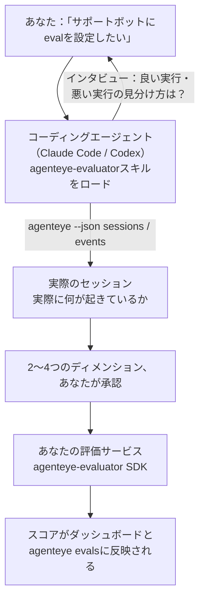

*「エージェントの品質が低い気がする」* という状態から、デプロイ済みのスコアリングサービスへ — コーディングエージェントが設計もビルドも担います。**Failproof AI オブザーバビリティ評価スキル**（`agenteye-evaluator`）は *Agent Skill* です。これは Claude Code や Codex などのコーディングエージェントがオンデマンドで読み込む小さなインストラクション群です。このスキルはエージェントに対し、*あなたの*エージェントで追跡する価値のある品質ディメンションを判断し、それらをスコアリングする[評価エージェントサービス](/ja/agenteye/evaluation-suite)を記述・テスト・デプロイする方法を教えます。

これはホスト型のスコアラーでも、アップロード先のレジストリでも、プラグインシステムでもありません。評価サービスは[Evaluation suite](/ja/agenteye/evaluation-suite)ガイドに記載されているとおり、あなた自身のインフラ上に置くHTTPサービスとして完全にあなたのものです。このスキルはエージェントがそれをうまく構築できるよう教えるだけです。エージェントがやることは、あなた自身が同じコードを書けば実現できることと変わりません。

---

## 難しいのは「何をスコアリングするか」を決めること

SDKのインターフェースはデコレーターと2つのモデルだけと小さく、エージェントは[コントラクト](/ja/agenteye/evaluation-suite#http-contract)だけから書き起こすことができます。評価がうまくいかない原因はそこではありません。間違ったものをスコアリングしてしまうことが失敗の原因です。間違ったものをスコアリングする評価は、評価がないより悪いです。誰もが無視するダッシュボードを生み出してしまいます。

だからこそ、スキルの大部分はコードが存在する前の段階に費やされます。エージェントがあなたにインタビューし（*「うまくいった実行を説明してください。次に、うまくいかなかった実行を」*）、[`agenteye` CLI](/ja/agenteye/cli)を使って実際のセッションを取得し、最初から最後まで読み通します。この2つの情報源は大抵食い違います。そのギャップこそが重要なのです。測定しようとしていることと、トランスクリプトが実際にサポートできることの差です。ディメンションが生き残るのは、イベントから**計算可能**かつ**識別力がある**場合のみです — 良い実行でも悪い実行でも0.9をスコアするなら、何も教えてくれないのでカットされます。

返ってくるのは2〜4つのディメンションの提案と根拠のセットです。コードが1行も書かれる前に、あなたが承認します。



---

## 他の評価関連ドキュメントとの関係

スコアリングに関するドキュメントは4つあり、順番に連携しています：

| ページ | 内容 | 参照するタイミング |
|---|---|---|
| **[Evaluations](/ja/agenteye/evaluations)** | 機能：セッショングリッド・ダッシュボード・再評価のスコア | 自動スコアリングで何が得られるかを知りたいとき |
| **[Evaluation suite](/ja/agenteye/evaluation-suite)** | HTTPコントラクト、SDK、サーバー環境変数 | 評価サービスを自分で実装またはデバッグするとき |
| **評価スキル**（このドキュメント） | スコアラーの設計と構築への自然言語フロントエンド | 「evalが欲しい」から稼働中のサービスへ進みたいとき |
| **[CLIスキル](/ja/agenteye/cli-skill)** | `agenteye` CLIへの自然言語フロントエンド | すでに持っているスコアを*読み取り*たいとき |
| **[Python SDKスキル](/ja/agenteye/python-sdk-skill)** | エージェントのインストルメンテーションへの自然言語フロントエンド | エージェントがまだセッションを送信していない — スコアリングするものが何もないとき |

### CLIスキルとの違い：構築か読み取りか

2つのスキルは意図的に重複しないよう設計されており、両方インストールするのが通常の使い方です — エージェントはあなたの質問に基づいてどちらを使うか選びます：

- **`agenteye-evaluator`**（このドキュメント）は、スコアを*生成する*ものを構築します。スコアが初めて反映されたらその仕事は終わりです。
- **[`agenteye-cli`](/ja/agenteye/cli-skill)** は既存のスコアを読み取ります（`agenteye evals`）。「今週、品質は下がったか？」はこちらのスキルの問いであり、このスキルの問いではありません。

---

## 前提条件

1. **`agenteye` CLIのインストールとログイン**（`pipx install agenteye`、次に `agenteye login`）。スキルはこれを2回使います：設計に使う実際のセッションを取得するときと、最後にスコアが反映されたことを確認するときです。ログインには `events:read` と、最終確認用の `evaluations:read` が必要です。CLIスキルと同様に、メールで送られるワンタイムコードのログインをエージェントが代わりに完了することは**できません**。
2. **評価サービスの置き場所。** イメージにビルドされ、長期稼働サービスとして実行されるため、スクラッチファイルではなく実際のリポジトリが必要です。評価サービスはスコアリング対象のエージェントとは別のリポジトリに置かれることがよくあります — スキルは既存のリポジトリを探し、新しくスキャフォールドする前に確認します。
3. **`agenteye-evaluator` SDKホイール** — エージェントが `pip` コマンドを入力し始める前に次のセクションを読んでください。

---

## 入手方法

スキルはFailproof AIの公開スキルコレクションで公開されています：

**[github.com/FailproofAI/skills](https://github.com/FailproofAI/skills)** → [`skills/agenteye-evaluator/`](https://github.com/FailproofAI/skills/tree/main/skills/agenteye-evaluator)

リポジトリは公開されており、スキル自体に認証情報は不要です — あなたがログインしたCLIセッションで `agenteye` CLIを操作し、*あなたの*リポジトリにコードを書くだけです。なお、このスキルは独自フォルダとして提供されており、`pipx install agenteye` パッケージの中には**含まれていない**ため、そちらは探さないでください。

## スキルのインストール

最も手軽なのは [`skills`](https://skills.sh) CLIを使う方法です。フォルダを取得してエージェントが参照する場所に配置します：

```bash
# Claude Code、このプロジェクトのみ
npx skills add FailproofAI/skills --skill agenteye-evaluator -a claude-code

# 全プロジェクト共通（~/.claude/skills/ にインストール）
npx skills add FailproofAI/skills --skill agenteye-evaluator -a claude-code -g --copy

# Codexの場合
npx skills add FailproofAI/skills --skill agenteye-evaluator -a codex
```

その後は他のスキルと同様に管理できます：

```bash
npx skills list -a claude-code           # インストール済みの確認
npx skills update agenteye-evaluator     # 最新バージョンに更新
npx skills remove agenteye-evaluator     # 削除
```

手動でインストールしたい場合は、Agent Skillは `SKILL.md`（およびオプションの参照ファイル）を含むフォルダに過ぎないため、コピーでも動作します：

- **Claude Code**: `agenteye-evaluator/` フォルダを `~/.claude/skills/`（全プロジェクト共通）または `<your-repo>/.claude/skills/`（そのリポジトリのみ）に置きます。Claude Codeが自動的に検出します — `/skills` リストで確認するか、evalについて聞いてみてください。
- **Codex (OpenAI)**: Codexは同じ `SKILL.md` を読み込みます。同梱の `agents/openai.yaml` に `allow_implicit_invocation: true` が設定されているため、タスクが一致するとCodexがスキルを自動選択します。そうでない場合は `$agenteye-evaluator` として明示的に呼び出してください。

---

## SDKは公開PyPIにありません

> **警告：** エージェントにSDKをインストールさせる前にこちらを読んでください。

スキルは公開されていますが、スキルが使うSDKは非公開です。`agenteye-evaluator` はプライベートなリリースアーティファクトとしてのみ提供されており、`agenteye` とは異なり、**公開PyPI上でこの名前は未登録**です — つまり `pip install agenteye-evaluator` を素のまま実行すると、本番のトランスクリプトを読み取るサービスに見知らぬパッケージが入り込む可能性があります。これはタイプミスではなく、サプライチェーンの問題です。

スキルはこれを把握しており、代わりにインストールの優先順位に従って動作します。最初に該当する条件で停止します：AgentEyeリポジトリ内にいる場合はモノレポのソース、そうでなければGitHub Releasesからプライベートリリースのホイール（アクセス権が必要）、どちらも利用できない場合は即興で対処するのではなく、**FailproofAIの担当者にホイールを問い合わせるよう伝えて停止します**。

エージェントが公開PyPIからの素の `pip install agenteye-evaluator` を提案してきた場合、それはスキルがロードされていないサインです。その場でインストールを確認してください。

---

## 依頼できること

実際のやり取りは漠然とした依頼から始まり、コードではなく承認済みの設計で終わります：

```text
あなた  ▸ サポートボットにevalを設定したい。品質が低い気がするんだよね。

エージェント ▸ コードを書く前に：うまくいった実行を説明してください、
               それから、うまくいかなかった実行を。

あなた  ▸ 良い：ドキュメントから回答する。悪い：でたらめを言う、
          あるいは諦めて「サポートに問い合わせてください」と言う。

エージェント ▸ 実行中：agenteye --json sessions --status error --since 7d
               5セッションを読み込み、うち2つはあなたが「悪い」と呼ぶもの。

               あなたの言葉では事実性と逃げ（deflection）。
               トランスクリプトはdeflectionには同意しています（5件中2件が
               サポートへの引き継ぎで終わっており、model_response.contentで明確）、
               ただし事実性にはイベントが持っていないground truthが必要です。

               そこで3つをスコアリングします：
                 - deflection      ルールベース、低コスト、2つの実行を区別
                 - tool_efficiency ルールベース、run-004のリトライループを検出
                 - groundedness    LLMジャッジ：すべての主張が取得したドキュメントにあるか？

               「事実性」はground truthが必要で持っていません。groundednessが
               トランスクリプトで実際にサポートできる最も近いものです。
               この3つの名前でよいですか？後でリネームすると履歴が分断されます。

あなた  ▸ はい

エージェント ▸ このリポジトリに評価サービスがありません。ここにスキャフォールドするか、
               別の場所にありますか？
```

ここからルールベースのディメンション（無料、即時、決定論的）を最初に書き、空のセッションや未完了のセッションなど単純な実装をクラッシュさせる実際にキャプチャしたセッションに対してテストし、主観的なディメンションにのみLLMジャッジを使います。[ディスパッチャーの制限](/ja/agenteye/evaluation-suite#configuring-the-server) — リクエストタイムアウト30秒とデプロイ全体で同時実行8件 — を把握しているため、ジャッジが確実に収まらない場合は、ジャッジがキャンセルされて5倍のコストで5回リトライされるのではなく、`JobPending` で非同期に処理します。

その後デプロイし、2つのサーバー環境変数を設定し、`agenteye --json evals --session-id <id>` でスコアが実際に反映されたことを確認します。スコアが反映されることが唯一の証明です。

---

## 注意すべき点

- **ディメンション名はほぼ永続的です。** スコアキーは任意の文字列であり、プラットフォームは送信されたものをトレンド表示します。つまり、ダウンストリームでは誤った選択を修正できません。後でリネームすると履歴が分断されます：古いセッションには古いキーが残り、トレンドが崩れます。だからこそスキルはコードを書く前に明示的な承認を求めます — そのプロンプトを真剣に受け止めてください。
- **フィクスチャは本番のトランスクリプトです。** 実際のセッションを設計に使うということは、それらをディスクに取得することを意味し、顧客データが含まれている場合があります。スキルはgitにコミットする前に確認を求めます。不安な場合は `fixtures/` をリポジトリの外に置き、各開発者が自分でプルするようにしてください。
- **エージェントはすべてのトランスクリプトを読み取るサービスを記述・デプロイします。** CLIログインの権限の範囲内であなたとして動作しますが、本番データに触れる他のコードと同様に評価サービスをレビューしてください。

---

## 次のステップ

- **[Evaluation suite](/ja/agenteye/evaluation-suite)**：スキルが設定するHTTPコントラクト、SDK、サーバー環境変数。
- **[Evaluations](/ja/agenteye/evaluations)**：スコアが反映された後の表示場所。
- **[CLIスキル](/ja/agenteye/cli-skill)**：スコアラーを構築するのではなく結果を読み取るための兄弟スキル。
- **[CLI](/ja/agenteye/cli)**：スキルが設計に使うセッションデータのコマンドリファレンス。