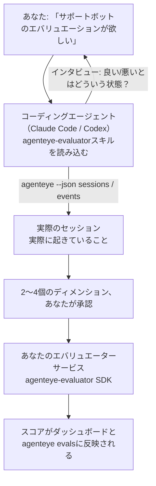

*「エージェントの品質がときどき悪い気がする」* から、デプロイ済みのスコアリングサービスまで——コーディングエージェントが設計もビルドも担当します。**Failproof AI Observability エバリュエータースキル**（`agenteye-evaluator`）は *Agent Skill* です。Claude Code や Codex などのコーディングエージェントがオンデマンドで読み込む、小さな指示ファイルのセットです。このスキルはエージェントに対して、*あなたの*エージェントに追跡する価値のある品質ディメンションを特定し、それをスコアリングする[エバリュエーターサービス](/ja/agenteye/evaluation-suite)を作成・テスト・デプロイする方法を教えます。

これはホスト型のスコアラーでも、アップロード先のレジストリでも、プラグインシステムでもありません。あなたのエバリュエーターは、[Evaluation suite](/ja/agenteye/evaluation-suite) ガイドに記載のとおり、あなた自身のインフラ上の HTTP サービスとして運用されます。このスキルはエージェントがそれをうまく構築できるよう教えるだけです——スキルが行うことはすべて、あなた自身が同じコードを書くことで実現できます。

---

## 難しいのは「何をスコアリングするか」を決めること

SDK のインターフェースは小さく、デコレーターと 2 つのモデルだけです。エージェントは[コントラクト](/ja/agenteye/evaluation-suite#http-contract)さえあれば実装できます。エバリュエーターが失敗するのはそこではありません。失敗するのは、間違ったものをスコアリングするからです。間違ったものをスコアリングするエバリュエーターは、ないよりも悪い——誰もが無視するダッシュボードを生み出すだけです。

だからこそ、このスキルの大部分はコードを書く前の段階に費やされます。エージェントはあなたにインタビューし（*「うまくいった実行を教えてください。次に、うまくいかなかった実行を」*）、[`agenteye` CLI](/ja/agenteye/cli) を通じて実際のセッションを取得し、最初から最後まで読み込みます。この 2 つの情報源はたいてい食い違います——そのギャップこそが重要です。あなたが意図して測定したいことと、トランスクリプトが実際にサポートできることの差です。ディメンションは、イベントから**算出可能**であり、かつ**識別力がある**場合にのみ残ります——良い実行でも悪い実行でも 0.9 を出すようなら、何も教えてくれないので除外されます。

コードが 1 行も書かれる前に、2〜4 個のディメンションとその理由を含むプロポーザルが返され、あなたが承認します。



---

## 他の評価関連ドキュメントとの関係

スコアリングに関するドキュメントは 4 つあり、順番に引き継がれます。

| ページ | 内容 | 参照するタイミング |
|---|---|---|
| **[Evaluations](/ja/agenteye/evaluations)** | 機能：セッショングリッドのスコア、ダッシュボード、再評価 | 自動スコアリングで何が得られるかを知りたいとき |
| **[Evaluation suite](/ja/agenteye/evaluation-suite)** | HTTP コントラクト、SDK、サーバー環境変数 | エバリュエーターを自分で実装またはデバッグするとき |
| **エバリュエータースキル**（このドキュメント） | スコアラーの設計と構築への自然言語インターフェース | 「エバリュエーションが欲しい」から稼働中のサービスまでを目指すとき |
| **[CLI skill](/ja/agenteye/cli-skill)** | `agenteye` CLI への自然言語インターフェース | すでにあるスコアを*読み取り*たいとき |
| **[Python SDK skill](/ja/agenteye/python-sdk-skill)** | エージェントの計装への自然言語インターフェース | エージェントがまだセッションを出力していない——スコアリング対象が存在しない——とき |

### CLI skill との違い：ビルドか、読み取りか

2 つのスキルは意図的に重複しないように設計されており、両方をインストールするのが通常の使い方です——エージェントは要求内容に応じてどちらを使うか判断します。

- **`agenteye-evaluator`**（このドキュメント）はスコアを*生成する*ものを構築します。スコアが初めて反映された時点でその役割は終わります。
- **[`agenteye-cli`](/ja/agenteye/cli-skill)** はすでに存在するスコアを読み取ります（`agenteye evals`）。*「今週、品質は下がったか？」* はこのスキルの問いであり、このスキルのものではありません。

---

## 前提条件

1. **`agenteye` CLI のインストールとログイン**（`pipx install agenteye`、その後 `agenteye login`）。このスキルは CLI を 2 回使用します。設計の基となる実際のセッションを取得するときと、最終的にスコアが反映されたことを確認するときです。ログインには `events:read` 権限が必要で、最終確認には `evaluations:read` も必要です。CLI skill と同様に、メールで届くワンタイムコードのログインを代わりに行うことは**できません**。
2. **エバリュエーターの置き場所。** エバリュエーターはイメージとしてビルドされ、長期稼働のサービスとして実行されるため、スクラッチファイルではなく実際のリポジトリが必要です。エバリュエーターはスコアリング対象のエージェントとは別の独立したリポジトリに置かれることが多く、スキルは既存のリポジトリを探し、新しくスキャフォールドする前に確認を求めます。
3. **`agenteye-evaluator` SDK ホイール**——エージェントが `pip` コマンドを入力し始める前に、次のセクションを読んでください。

---

## 入手方法

このスキルは Failproof AI の公開スキルコレクションで公開されています。

**[github.com/FailproofAI/skills](https://github.com/FailproofAI/skills)** → [`skills/agenteye-evaluator/`](https://github.com/FailproofAI/skills/tree/main/skills/agenteye-evaluator)

リポジトリは公開されており、スキル自体に認証情報は不要です——あなたがログインした `agenteye` CLI を使い、*あなたの*リポジトリにコードを書くだけです。スキルは独立したフォルダーとして配布されており、`pipx install agenteye` パッケージには**含まれていない**ことに注意してください。

## スキルのインストール

最も簡単な方法は [`skills`](https://skills.sh) CLI を使うことです。フォルダーを取得して、エージェントが参照する場所に配置します。

```bash
# Claude Code、このプロジェクトのみ
npx skills add FailproofAI/skills --skill agenteye-evaluator -a claude-code

# すべてのプロジェクト（~/.claude/skills/ にインストール）
npx skills add FailproofAI/skills --skill agenteye-evaluator -a claude-code -g --copy

# Codex の場合
npx skills add FailproofAI/skills --skill agenteye-evaluator -a codex
```

その後は他のスキルと同様に管理できます。

```bash
npx skills list -a claude-code           # インストール済みを確認
npx skills update agenteye-evaluator     # 最新版に更新
npx skills remove agenteye-evaluator     # 削除
```

手動でインストールしたい場合も、Agent Skill は `SKILL.md`（およびオプションの参照ファイル）を含むフォルダーに過ぎないので、コピーするだけで使えます。

- **Claude Code**：`agenteye-evaluator/` フォルダーを `~/.claude/skills/`（すべてのプロジェクト）または `<your-repo>/.claude/skills/`（そのリポジトリのみ）に配置してください。Claude Code は自動で検出します——`/skills` リストで確認するか、エバリュエーションについて質問するだけで確かめられます。
- **Codex（OpenAI）**：Codex も同じ `SKILL.md` を読み込みます。同梱の `agents/openai.yaml` には `allow_implicit_invocation: true` が設定されているため、タスクが一致すれば Codex が自動的にスキルを選択します。明示的に呼び出すには `$agenteye-evaluator` と指定してください。

---

## SDK は公開 PyPI にありません

> **警告：** エージェントに SDK をインストールさせる前に必ず読んでください。

スキルは公開されていますが、それが使用する SDK は公開されていません。`agenteye-evaluator` はプライベートリリースアーティファクトとしてのみ配布されており、`agenteye` とは異なり、公開 PyPI ではその名前が**未登録**です——そのため、単純に `pip install agenteye-evaluator` を実行すると、あなたの本番トランスクリプトを読み取るサービスに見知らぬ人のパッケージが混入する可能性があります。これはタイプミスではなく、サプライチェーンの問題です。

このスキルはその点を認識しており、代わりにインストールのラダーを順に試みます。最初に該当するステップで停止します。AgentEye リポジトリ内にいる場合はモノリポのソースを使用し、そうでなければ GitHub Releases からプライベートリリースホイールを使用します（アクセス権が必要）。どちらも利用できない場合は**即座に処理を止め、Failproof AI の担当者にホイールを問い合わせるよう案内します**——自己判断で代替手段を取ることはありません。

エージェントが公開 PyPI への単純な `pip install agenteye-evaluator` を提案してきた場合、それはスキルが読み込まれていないサインです。その場でインストールを確認してください。

---

## 何を依頼できるか

実際のやりとりは、曖昧な依頼から始まり、設計の承認で終わります——コードはまだ書かれません。

```text
あなた ▸ サポートボットのエバリュエーションが欲しい。
         ときどき質が悪い気がして。

エージェント ▸ 何か書く前に確認させてください。
               うまくいった実行と、うまくいかなかった実行を
               それぞれ教えていただけますか？

あなた ▸ 良い場合：ドキュメントから正しく回答する。
         悪い場合：でたらめを言うか、諦めて
         「サポートに連絡してください」と言う。

エージェント ▸ 実行中: agenteye --json sessions --status error --since 7d
               5 セッションを読み込み中。うち 2 つがあなたの言う「悪い」実行です。

               あなたの言葉では「正確性」と「回避」です。トランスクリプトは
               回避については一致しています（5 件中 2 件がサポート引き渡しで終わり、
               model_response.content に明確に表れています）が、正確性は
               イベントに含まれていないグラウンドトゥルースが必要です。

               そのため、以下の 3 つをスコアリングします：
                 - deflection      ルールベース、低コスト、2 つの実行を明確に区別
                 - tool_efficiency ルールベース、run-004 のリトライループを捕捉
                 - groundedness    LLM ジャッジ：取得したドキュメントに基づいた主張か？

               「正確性」にはイベントに存在しないグラウンドトゥルースが必要です。
               groundedness はトランスクリプトが実際にサポートできる最も近い指標です。
               この 3 つの名前でよいですか？後から変更すると履歴が分断されます。

あなた ▸ はい

エージェント ▸ このリポジトリにエバリュエーターが見当たりません。
               ここにスキャフォールドしますか、それとも別の場所にありますか？
```

ここからエージェントは、まずルールベースのディメンション（無料、即時、決定論的）を実装し、空のセッションや未完了のセッションなど、ナイーブな実装をクラッシュさせる実際のキャプチャセッションに対してテストします。そして主観的なディメンションにのみ LLM ジャッジを使用します。[ディスパッチャーの制限](/ja/agenteye/evaluation-suite#configuring-the-server)——30 秒のリクエストタイムアウトとデプロイ全体で 8 並列呼び出し——を把握しているため、ジャッジが確実に収まらない場合は、コストを 5 倍にしながらキャンセルと再試行を繰り返す代わりに、`JobPending` で非同期処理を行います。

その後デプロイし、2 つのサーバー環境変数を設定し、`agenteye --json evals --session-id <id>` でスコアが実際に反映されたことを確認します。スコアが反映されることが唯一の証明です。

---

## 注意すべき点

- **ディメンション名はほぼ永続的です。** スコアキーは任意の文字列で、プラットフォームはあなたが送ったものをトレンドに反映します。つまり、誤った選択はダウンストリームで修正されません。後から名前を変更すると履歴が分断され、古いセッションには古いキーが残り、トレンドが壊れます。これがスキルがコードを書く前に明示的な承認を求める理由です——そのプロンプトを真剣に受け止めてください。
- **フィクスチャーは実際の本番トランスクリプトです。** 実際のセッションを基に設計するということは、それをディスクに取得することを意味し、顧客データが含まれている可能性があります。スキルは git にコミットする前に確認を求めます。不安な場合は `fixtures/` をリポジトリから除外し、各開発者が自分で取得するようにしてください。
- **エージェントはすべてのトランスクリプトを読み取るサービスを作成・デプロイします。** CLI ログインの権限の範囲内であなたとして動作しますが、本番データに触れる他のコードと同様にエバリュエーターをレビューしてください。

---

## 次のステップ

- **[Evaluation suite](/ja/agenteye/evaluation-suite)**：スキルが設定する HTTP コントラクト、SDK、サーバー環境変数。
- **[Evaluations](/ja/agenteye/evaluations)**：スコアが反映された後に表示される場所。
- **[CLI skill](/ja/agenteye/cli-skill)**：スコアラーを構築するのではなく、結果を読み取るための姉妹スキル。
- **[CLI](/ja/agenteye/cli)**：スキルが設計の基とするセッションデータのコマンドリファレンス。