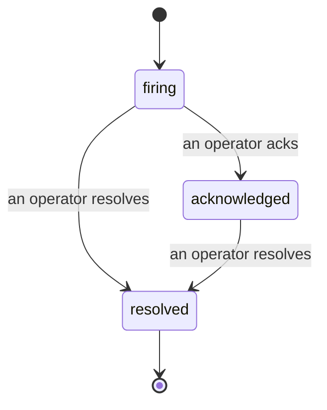

アラートが発火したとき、最初に浮かぶ疑問は常に「誰が対応中か？」です。インシデントはその答えを提供します。何かが閾値を超えた瞬間に、誰でもインシデントが開いていること、誰が担当しているか、そしてこれまでに何が起きたかを正確に把握できます。また、ポストモーテムにそのまま引き渡せる、きれいな帰属記録が残ります。

*受信トレイは未解決のインシデントを状態別にグループ化し、重要度や担当者でフィルタリングできるため、今すぐ人が対応すべきものだけを表示します。*

## 担当者を一目で確認

「誰か見てますか？」とチャットスレッドで聞き回る必要はもうありません。閾値を超えると自動的にインシデントが開き、状態別にグループ化された共有受信トレイに追加されます。承認すると自分の名前が表示され、チームの他のメンバーは対応済みだとわかります。承認は共有されます。複数のオペレーターが同じインシデントを承認でき、それぞれが個別に記録されるため、ウォールームの全員が名前で表示され、互いの操作が重複しません。トリアージの担当者を一人アサインし、重要度や担当者で受信トレイをフィルタリングして、自分に関係するものだけに絞り込めます。

## 全経緯を一つのタイムラインで

インシデントが終わったとき、すでに報告書の下書きができています。任意のインシデントを開くと、閾値超過の証拠、担当者とサブスクライバー、その場での調整用コメントスレッド、そして追記専用のアクティビティタイムラインが表示されます。

*起きたことがすべて、時系列で、各行に実行者の署名付きで記録されます。*

すべてのアクション（開始、承認、解決など）はそのタイムラインに書き込まれ、編集されることはありません。各エントリーには帰属情報が付きます。アクションを取ったオペレーターのメールアドレス、または Failproof AI Observability が自律的に行ったもの（閾値超過時のインシデント開始など）には **automated** と表示されます。匿名のものも、失われるものもないため、ポストモーテムはほぼ自然と書き上がります。

## インシデントの遷移

- **未対応（firing）：** 閾値超過によりインシデントが開き、チャンネルに一度だけ通知されます。繰り返し発生する閾値超過は同じインシデントにまとめられ、何度も通知する代わりに証拠が更新されます。
- **承認済み（acknowledged）：** オペレーターが対応を引き受けます。インシデントは開いたままで、その後の閾値超過は静かに証拠を更新します。
- **解決済み（resolved）：** オペレーターがクローズします。条件が解消されたときの自動解決は計画中ですがまだ有効ではないため、インシデントは人間が解決するまで開いたままになります。これにより、実際に何が解消されたかについて全員が誠実でいられます。同じアラートで後から新しいインシデントを開くことができます。

一つのアラートに同時に開けるインシデントは最大一つです。そのため、フラッピングなルールによって重複インシデントに埋もれることはありません。また、手動でインシデントを開くこともできます。アラートが検知しなかった事象に対するスタンドアロンのインシデントや、既存のアラートに紐づけたインシデントを、`incidents:write` 権限があれば作成できます。

## アクセス方法

インシデントは `/<org-slug>/incidents` にあります。閲覧には **`incidents:read`**、手動でインシデントを開くには **`incidents:write`**、承認・アサイン・コメント・解決には **`incidents:ack`** が必要です。廃止された `alerts:ack` を付与された古いキーも引き続き動作します。`incidents:ack` として扱われるため、オンコールローテーションを再発行する必要はありません。

## 関連情報

- [アラート](/ja/agenteye/alerts)：閾値超過時にインシデントを開くルール。
- [エラートラッキング](/ja/agenteye/error-tracking)：すべての障害を一か所で確認し、アラートに昇格させる。
- [監査](/ja/agenteye/audits)：どのルールも監視していなかった障害を発見するスケジュール分析機能。