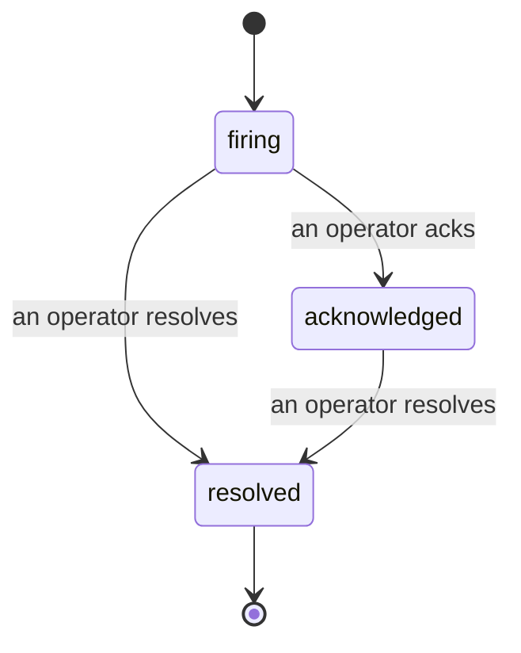

アラートが発火したとき、最初の疑問は常に「誰が対応しているのか？」です。インシデントはその答えを提供します。何かが閾値を超えた瞬間、インシデントが発生していること、誰が担当しているか、そしてこれまでに何が起きたかを全員が確認できます。また、ポストモーテムにそのまま使える、クリーンな帰属記録が残ります。

*受信ボックスはオープン中のインシデントを状態別にグループ化し、重大度と担当者でフィルタリングできるため、今すぐ人間が対応すべきものが一目でわかります。*

## 誰が対応しているかを一目で把握

チャットスレッドで「誰か見てる？」と聞く必要はもうありません。閾値超過があると自動的にインシデントが開かれ、状態別にグループ化された共有受信ボックスに投入されます。確認（Acknowledge）するとあなたの名前が表示され、チームの残りのメンバーは対応済みであることを把握できます。確認は共有されており、複数のオペレーターが同じインシデントを確認でき、それぞれが個別に記録されます。そのため、ウォールームの全メンバーが名前で表示され、互いに上書きされることはありません。トリアージのオーナーを一人アサインし、重大度や担当者で受信ボックスをフィルタリングして、自分が担当するものだけに絞り込めます。

## 全経緯を一つのタイムラインで

インシデントが終了したとき、レポートはすでに手元にあります。任意のインシデントを開くと、閾値超過の証拠、担当者とサブスクライバー、その場で調整するためのコメントスレッド、そして追記専用のアクティビティタイムラインが表示されます。

*起きたことすべてが時系列に並び、各行には実行した担当者の署名が付いています。*

すべてのアクション（開始、確認、解決など）はタイムラインに記録され、後から編集されることはありません。各エントリは帰属付きです。アクションを実行したオペレーターのメールアドレス、またはFailproof AI Observabilityが自律的に実行したもの（閾値超過によるインシデントの自動開始など）は **automated** として記録されます。匿名のものは何もなく、失われるものも何もないため、ポストモーテムはほぼ自動的に書き上がります。

## インシデントの状態遷移

- **オープン（firing）：** 閾値超過によりインシデントが開かれ、チャンネルに一度通知が送られます。繰り返し発生する閾値超過は同じインシデントにまとめられ、何度も通知を送る代わりに証拠が更新されます。
- **確認済み（acknowledged）：** オペレーターが対応を引き受けます。インシデントはオープンのまま維持され、その後の閾値超過は静かに証拠を更新します。
- **解決済み（resolved）：** オペレーターがクローズします。条件が解消された際の自動解決は計画中ですが、まだ有効化されていません。そのため、人間が解決するまでインシデントはオープンのままとなり、実際に何が解消されたかについて全員が正直でいられます。同じアラートで後から新たなインシデントが開かれることもあります。

一つのアラートには同時にオープンのインシデントが最大一件のみ存在できるため、頻繁にフラッピングするルールによって重複が大量発生することはありません。アラートが検知しなかった事象に対してスタンドアロンのインシデントを手動で開くことも、既存のアラートに紐づけたインシデントを開くことも可能です（`incidents:write` が必要です）。

## アクセス方法

インシデントは `/<org-slug>/incidents` にあります。閲覧には **`incidents:read`**、手動インシデントの作成には **`incidents:write`**、確認・アサイン・コメント・解決には **`incidents:ack`** が必要です。廃止された `alerts:ack` が付与された古いキーは `incidents:ack` として扱われるため、引き続き有効です。オンコールローテーションの再発行は不要です。

## 関連ページ

- [アラート](/ja/agenteye/alerts)：閾値超過時にインシデントを開くルール。
- [エラートラッキング](/ja/agenteye/error-tracking)：すべての障害を一か所で確認し、アラートに昇格させる。
- [監査](/ja/agenteye/audits)：どのルールも監視していなかった障害を発見するスケジュール済みアナリスト。