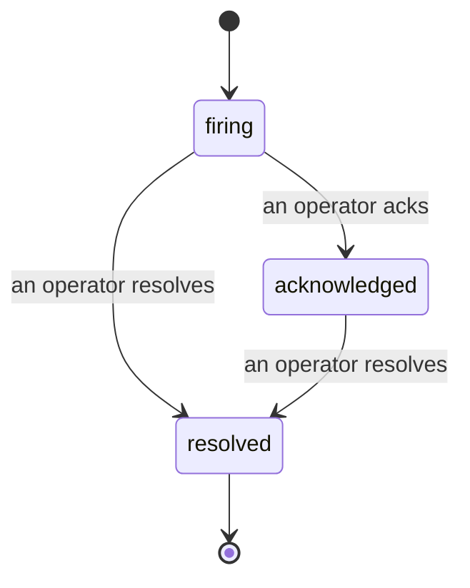

アラートが発火したとき、最初に湧く疑問は常に「誰が対応しているのか？」です。インシデントはその疑問に答えます。何かが閾値を超えた瞬間から、インシデントがオープンであること、誰が担当しているか、これまでに正確に何が起きたかを、クリーンな帰属記録とともに誰もが確認できます。その記録はそのままポストモーテムに渡せます。

*インボックスはオープンなインシデントを状態ごとにグループ化し、シビラリティや担当者でフィルタリングできるため、今すぐ人間の対応が必要なものだけが見えます。*

## 誰が担当しているかを一目で把握する

チャットスレッドで「誰か見てる？」と聞く必要はもうありません。閾値超過が発生すると自動的にインシデントがオープンになり、状態ごとにグループ化された共有インボックスに追加されます。承認（ack）すると自分の名前が表示されるので、チームの他のメンバーは対応済みだと分かります。承認は共有されます。複数のオペレーターが同じインシデントを承認でき、それぞれが個別に記録されるため、ウォールームに集まった全員が名前で表示され、互いに上書きされることはありません。トリアージの担当者を一人アサインし、シビラリティや担当者でインボックスをフィルタリングして、自分に関係するものだけに絞り込めます。

## 全ての経緯を、一本のタイムラインで

インシデントが解決したとき、書き起こしはすでに出来上がっています。任意のインシデントを開くと、閾値超過の証拠、担当者とサブスクライバー、その場で連携するためのコメントスレッド、そして追記専用のアクティビティタイムラインが表示されます。

*起きたこと全てが、発生順に、各行に実行者の署名付きで記録されています。*

全てのアクション（オープン、承認、解決など）はタイムラインに書き込まれ、編集されることはありません。各エントリには帰属情報が付きます。アクションを実行したオペレーターのメールアドレス、もしくは Failproof AI Observability が自律的に行った操作（例：超過発生時のインシデントオープン）に対しては **automated** と表示されます。匿名の操作も、消えてしまう記録もないため、ポストモーテムはほぼ自動的に書き上がります。

## インシデントの状態遷移

- **オープン (firing):** 閾値超過によりインシデントがオープンになり、設定されたチャンネルに一度だけ通知されます。繰り返し発生する超過は同じインシデントにまとめられ、何度も通知する代わりに証拠が更新されます。
- **承認済み (acknowledged):** オペレーターが対応を引き受けた状態です。インシデントはオープンのままで、その後の超過発生は静かに証拠を更新します。
- **解決済み (resolved):** オペレーターがクローズした状態です。条件がクリアされた際の自動解決は計画中ですが、まだ有効になっていないため、インシデントは人間が解決するまでオープンのままです。これにより、実際に何がクリアされたかについて全員が正直でいられます。同じアラートで後から新しいインシデントをオープンすることも可能です。

一つのアラートに同時にオープンできるインシデントは最大一つです。そのため、頻繁にフラッピングするルールが重複インシデントで埋め尽くされることはありません。`incidents:write` 権限があれば、手動でインシデントをオープンすることもできます。アラートが検知しなかった事象に対するスタンドアロンのインシデントとして、あるいは既存のアラートに紐づけて作成できます。

## 参照先

インシデントは `/<org-slug>/incidents` にあります。閲覧には **`incidents:read`** が必要です。手動インシデントのオープンには **`incidents:write`** が必要です。承認、アサイン、コメント、解決には **`incidents:ack`** が必要です。廃止された `alerts:ack` を付与された古いキーは `incidents:ack` として扱われるため、引き続き動作します。オンコールローテーションを再発行する必要はありません。

## 関連ページ

- [アラート](/ja/agenteye/alerts): 閾値超過時にインシデントをオープンするルール。
- [エラートラッキング](/ja/agenteye/error-tracking): 全ての障害を一か所で確認し、アラートに昇格させる。
- [監査](/ja/agenteye/audits): どのルールも監視していなかった障害を発見するスケジュール実行のアナリスト。