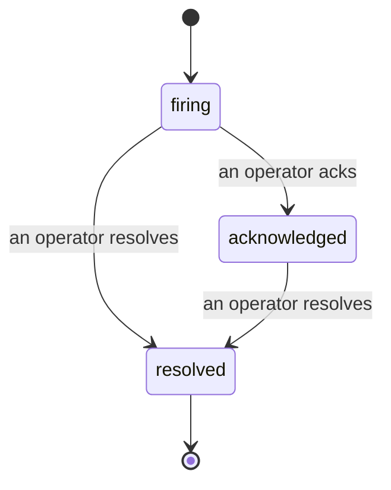

アラートが発火したとき、最初の疑問は常に「誰が対応しているのか？」です。インシデントはその答えを提供します。何かが閾値を超えた瞬間、インシデントが開いていること、誰が担当しているか、そしてこれまでに何が起きたかが、ポストモーテムにそのまま使えるクリーンな属性付き記録とともに、全員に見えるようになります。

*受信トレイでは、オープンなインシデントが状態ごとにグループ化され、深刻度と担当者でフィルタリングできるため、今すぐ人間の対応が必要なものだけが表示されます。*

## 担当者を一目で把握

チャットスレッドで「誰か見ている？」と聞く必要はもうありません。閾値超過が起きると自動的にインシデントが開き、状態ごとにグループ化された共有受信トレイに追加されます。確認（Acknowledge）すると自分の名前が紐づくため、チームの他のメンバーは対応中であることがわかります。確認は共有されます。複数のオペレーターが同じインシデントを確認でき、それぞれが個別に記録されるため、ウォールームの全員が互いに上書きされることなく名前で表示されます。トリアージ用のオーナーを一人アサインし、受信トレイを深刻度や担当者でフィルタリングして自分に関係するものだけを絞り込めます。

## 一本のタイムラインで全経緯を把握

インシデントが終わったときには、すでに報告書が手元にあります。任意のインシデントを開くと、閾値超過の証拠、アサインされた担当者とサブスクライバー、その場でのコーディネーション用のコメントスレッド、そして追記専用のアクティビティタイムラインが確認できます。

*起きたことすべてが、順番に、各行には誰がそれを行ったかが署名されています。*

すべてのアクション（オープン、確認、解決など）はそのタイムラインに書き込まれ、決して編集されません。各エントリには属性が付きます。アクションを取ったオペレーターにはメールで、Failproof AI Observability が自律的に行ったこと（閾値超過時のインシデント開設など）には **automated** という属性が付きます。匿名のものはなく、失われるものもないため、ポストモーテムはほぼ自動的に書き上がります。

## インシデントの状態遷移

- **オープン（firing）:** 閾値超過によりインシデントが開き、チャンネルに一度だけ通知されます。繰り返しの閾値超過は同じインシデントにまとめられ、何度も通知されることなく証拠が更新されます。
- **確認済み（acknowledged）:** オペレーターが対応を引き受けます。インシデントはオープンのまま維持され、その後の閾値超過は静かに証拠を更新します。
- **解決済み（resolved）:** オペレーターがクローズします。条件が解消された際の自動解決は計画中ですがまだ有効化されていないため、インシデントは人間が解決するまでオープンのままです。これにより、実際に解消されたものについて全員が正直でいられます。同じアラートで後から新しいインシデントが開くこともあります。

一つのアラートが同時に保持できるオープンなインシデントは最大一つです。そのため、フラッピングするルールによって重複インシデントに埋もれることはありません。手動でインシデントを開くこともできます。アラートが検知していないものに対するスタンドアロンのインシデント、または既存のアラートに紐づけるインシデントを、`incidents:write` 権限があれば作成できます。

## 場所

インシデントは `/<org-slug>/incidents` にあります。閲覧には **`incidents:read`** が必要で、手動インシデントの開設には **`incidents:write`** が、確認・アサイン・コメント・解決には **`incidents:ack`** が必要です。廃止された `alerts:ack` が付与された古いキーは引き続き動作します。`incidents:ack` として扱われるため、オンコールローテーションを再発行する必要はありません。

## 関連

- [アラート](/ja/agenteye/alerts): 閾値超過時にインシデントを開くルール。
- [エラートラッキング](/ja/agenteye/error-tracking): すべての障害を一か所で確認し、アラートに昇格させる。
- [監査](/ja/agenteye/audits): どのルールも監視していなかった障害を発見するスケジュール型アナリスト。