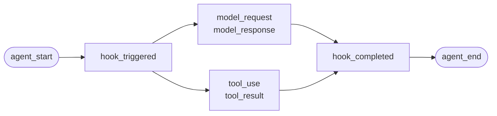
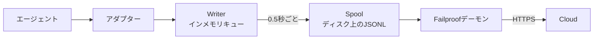

自作のエージェント、またはFailproof AIがアダプターを提供していないフレームワーク向けの説明です。インストルメンテーションの設定は不要です。イベントを自分で送出するだけです。

これは、4つのフレームワークアダプターが内部で呼び出しているのと同じAPIです。それらのアダプターは、このAPIの変換テーブルにすぎません。

## インストール

```bash
pip install failproofai-sdk
```

追加パッケージも依存関係もありません。

## インストルメンテーション

```python
import failproofai_sdk

failproofai_sdk.configure(environment="production")

with failproofai_sdk.session():                 # 1回の実行
    with failproofai_sdk.agent("planner"):      # 1つの作業単位
        with failproofai_sdk.tool_call("search", input={"q": q}) as t:
            t.output = search(q)                # 1回のツール呼び出し
```

上から読んでいくと、その意味がそのまま伝わります：

| ラップする対象 | 意味 |
| --- | --- |
| `session()` | これらのイベントは同じ実行に属する |
| `agent()` | 何かが作業をしている — リストで認識できる名前を付ける |
| `tool_call()` | これは1つのツールであり、その返り値がここにある |

各スコープが実際に送出するイベント：

| スコープ | 送出するイベント | 目的 |
| --- | --- | --- |
| `session()` | なし | セッションIDをバインドし、1回の実行をグループ化する |
| `agent()` | `agent_start`、`agent_end` | 作業単位の前後を囲む |
| `tool_call()` | `tool_use`、`tool_result` | 1つのツールを囲み、計測する |

スコープ内のコードは `session_id` や `agent_id` を省略できます。スコープはコンテキスト変数にIDをバインドし、すべてのイベント呼び出しがそこから読み取るため、関数にIDを引き回す必要はありません。

3つのスコープはいずれも `async with` と `with` の両方で動作します。

エージェントをネストするとツリーが構築されます。`parent_id` と深さはスタックから自動計算されます：

```python
with failproofai_sdk.session():
    with failproofai_sdk.agent("supervisor"):
        with failproofai_sdk.agent("researcher"):    # parent_id = "supervisor"
            ...
```

## スコープの終了方法

`agent()` は例外を自動で処理します：

| 発生したこと | イベント | 結果 |
| --- | --- | --- |
| 例外なし | `agent_end` | `success` |
| `Exception` | `error`、次に `agent_end` | `failed` |
| `KeyboardInterrupt`、`SystemExit` | `error`、次に `agent_end` | `failed` |
| `CancelledError`、`GeneratorExit` | `agent_end` のみ | `cancelled` |

エラーは `agent_end` の前に送出されます。これはダッシュボードが `agent_end` でスパンを閉じるため、それ以降に発生したイベントはどのスパンにも帰属しなくなるためです。キャンセルは失敗ではないため、キャンセルされた実行はエラーサーフェスを汚染しません。例外は常に再送出されます。スコープが例外を握りつぶすことはありません。

## イベントメソッド

6つのファミリーに分類された15のメソッドがあります。ほとんどはペアで提供されます — オープナーを送出し、次にクローザーを送出すると、SDKがその間のスパンを計測します。

| ファミリー | 開く | 閉じる | 単独 |
| --- | --- | --- | --- |
| **エージェント** | `agent_start` | `agent_end` | — |
| | `agent_pause` | `agent_resume` | — |
| **モデル** | `model_request` | `model_response` | — |
| **ツール** | `tool_use` | `tool_result` | — |
| **フック** | `hook_triggered` | `hook_completed` | — |
| **人間** | `human_wait` | `human_input` | `human_pause`、`human_interrupt` |
| **失敗** | — | — | `error` |

<Tip>
  可能な限りスコープ — `agent()` と `tool_call()` — を優先してください。本体が例外を送出した場合でも、クローズイベントの送出を保証します。制御フローがネストされない場合（ヘルパー内のモデル呼び出しなど）は、これらのメソッドを直接使用してください。
</Tip>

<CodeGroup>
```python Agents
failproofai_sdk.event.agent_start(agent_id="planner", goal="find the cheapest flight")
failproofai_sdk.event.agent_end(agent_id="planner", outcome="success", summary="...")
failproofai_sdk.event.agent_pause(pause_id="p1", reason="awaiting approval")
failproofai_sdk.event.agent_resume(pause_id="p1")
```

```python Models
failproofai_sdk.event.model_request(
    model="gpt-4o-mini",
    messages=[{"role": "user", "content": "..."}],
    request_id="req-1",
)
failproofai_sdk.event.model_response(
    model="gpt-4o-mini",
    content="...",
    input_tokens=139,
    output_tokens=21,
    request_id="req-1",
    duration_ms=5202,
)
```

```python Tools
failproofai_sdk.event.tool_use(tool_name="search", tool_call_id="c1", input={"q": "..."})
failproofai_sdk.event.tool_result(tool_name="search", tool_call_id="c1", output="...")
```

```python Hooks
failproofai_sdk.event.hook_triggered(hook_name="retrieve", hook_id="h1", trigger_event="node")
failproofai_sdk.event.hook_completed(hook_name="retrieve", hook_id="h1", outcome="success")
```

```python Humans
failproofai_sdk.event.human_wait(input_id="i1", prompt="Approve?", options=["yes", "no"])
failproofai_sdk.event.human_input(input_id="i1", response="yes")
failproofai_sdk.event.human_pause(reason="operator paused the run", user_id="dana")
failproofai_sdk.event.human_interrupt(reason="operator stopped the run", at_step="step_3")
```

```python Failures
failproofai_sdk.event.error(
    error_type="TimeoutError",
    message="provider timed out after 30s",
    traceback="...",
)
```
</CodeGroup>

<Note>
  **2つの人間ファミリーは方向が逆です。**

  | メソッド | 意味 |
  | --- | --- |
  | `human_wait` / `human_input` | **エージェントが人間に問いかけた** — 承認ゲート、確認のための質問 |
  | `human_pause` / `human_interrupt` | **人間がエージェントに働きかけた** — 停止ボタン、オペレーターによる一時停止 |

  どのフレームワークも後者のペアを通知しないため、常に自分で送出する必要があります。
</Note>

<Warning>
  **モデル呼び出しを並行実行する場合は `request_id` を渡してください。** 指定しない場合、リクエストとレスポンスはエージェントごとの受信順にペアリングされます。並行呼び出しでは順序が保証されないため、各レスポンスが誤ったリクエストに紐付く可能性があります。
</Warning>

## 使用例

エージェントフレームワークなしで、OpenAI APIに対してツール呼び出しループを実行する例：

```python
import json

import failproofai_sdk
from openai import OpenAI

failproofai_sdk.configure(environment="production")
client = OpenAI()
MODEL = "gpt-4o-mini"


def turn(messages: list):
    """1回のモデル呼び出し。ペアで囲む。"""
    failproofai_sdk.event.model_request(model=MODEL, messages=messages)
    reply = client.chat.completions.create(model=MODEL, messages=messages, tools=TOOLS)
    usage = reply.usage
    failproofai_sdk.event.model_response(
        model=MODEL,
        content=reply.choices[0].message.content or "",
        input_tokens=usage.prompt_tokens,
        output_tokens=usage.completion_tokens,
    )
    return reply.choices[0].message


with failproofai_sdk.session():
    with failproofai_sdk.agent("inventory", goal="price report"):
        for _ in range(4):          # 上限あり。無制限のエージェントループはそれ自体がバグ
            message = turn(messages)
            if not message.tool_calls:
                break
            messages.append(message.model_dump(exclude_none=True))
            for call in message.tool_calls:
                args = json.loads(call.function.arguments or "{}")
                with failproofai_sdk.tool_call(
                    call.function.name, tool_call_id=call.id, input=args
                ) as handle:
                    handle.output = run_tool(call.function.name, args)
                messages.append({
                    "role": "tool",
                    "tool_call_id": call.id,
                    "content": str(handle.output),
                })
```

これにより、アダプターが生成するのと同じ6種類のイベントタイプが生成されます。ツール定義を含む完全な実行可能バージョンは、SDKリポジトリの `docs/manual/examples/` に含まれています。

## スレッドと非同期

コンテキスト変数はasyncioタスクに自動的に伝播します。新しいスレッドには伝播しません。スレッドは空のコンテキストで開始されるためです。

```python
# asyncio: 特別な操作不要
async with failproofai_sdk.session():
    await asyncio.gather(worker(1), worker(2))

# スレッド: callableをラップする
pool.submit(failproofai_sdk.propagate(work), x)
threading.Thread(target=failproofai_sdk.propagate(work)).start()
loop.run_in_executor(None, failproofai_sdk.propagate(work), x)
```

`propagate()` なしでは、ワーカーのイベントがセッションなしで着信する代わりに、修正方法を示す `TypeError` が発生します。これは意図的な設計です。セッションのないイベントはインジェスト側でスキップされつつ `200` が返されるため、無音の失敗となります。それを防ぐためにIDレイヤーが存在します。

## アダプターのないフレームワークへのインストルメンテーション

どのエージェントフレームワークにも同じ3つの接合点があります。それらをマッピングすれば、完全なトレースが得られます — 4つの既存アダプターもこれ以上のことはしていません。

| 接合点 | 書くコード | 記録されるイベント |
| --- | --- | --- |
| 実行 | `session()` + `agent()` | `agent_start`、`agent_end` |
| 各ツール | `tool_call()` | `tool_use`、`tool_result` |
| 各モデル呼び出し | `model_*` のペア | `model_request`、`model_response` |

<Steps>
  <Step title="実行を囲む">
    ```python
    with failproofai_sdk.session():
        with failproofai_sdk.agent(agent_name, goal=task):
            result = framework.run(task)
    ```
  </Step>
  <Step title="各ツールを囲む">
    フレームワークのツールラッパーまたはミドルウェアに相当する箇所に追加します。

    ```python
    with failproofai_sdk.tool_call(name, input=args) as call:
        call.output = original(**args)
    ```
  </Step>
  <Step title="各モデル呼び出しをペアにする">
    ```python
    failproofai_sdk.event.model_request(model=model, messages=messages)
    reply = provider.complete(...)
    failproofai_sdk.event.model_response(
        model=model,
        content=text,
        input_tokens=usage.prompt_tokens,
        output_tokens=usage.completion_tokens,
    )
    ```
  </Step>
</Steps>

<Tip>
  **ノード、ステップ、ミドルウェア境界を可視化したい場合は？** ネストされた `agent()` ではなく、フックペア — `hook_triggered` / `hook_completed` — でラップしてください。`agent_id` は低カーディナリティのファセットであり、ノードごとに1エントリ追加するとすぐに埋め尽くされます。フックスパンは同様にレンダリングされ、ノードごとのレイテンシを確認できます。
</Tip>

<Note>
  **手動計装と自動計装は組み合わせ可能です。** 手書きスコープ内で実行されるアダプターは、そのセッションに参加し、そのエージェントを親として設定します。2つのツリーではなく1つのツリーが得られるため、対応フレームワークと独自フレームワークを同時に計装する際に便利です。
</Note>

<Accordion title="AutoGenアダプターがない理由">
  2つの理由があります。上記の3つの接合点が、その両方に対する答えです：

  - `autogen-core` は2025年9月以降メンテナンスされていません。
  - AG2には他のフレームワークのフックに相当するプロセス全体の登録ポイントがないため、計装するにはすべての構築箇所でエージェントをラップする必要があります。

  接合点を手動でマッピングすることで、既存アダプターと同じイベントが同じ精度で記録されます。
</Accordion>

## 詳細

記録の実際の仕組みについて。始めるために必要な知識ではありません。

<AccordionGroup>

<Accordion title="フレームワークごとの記録の形" icon="eye">

すべての記録は同じ形をしています。スパンが開き、その中に作業がネストされ、各オープンイベントに対応するクローズイベントがあります。



**ペア**が基本単位です。各クローズイベントには、SDKがオープンイベントからの経過時間として計測したdurationが含まれます。

以下は各フレームワークの実際の1回の実行 — SDKに同梱されているサンプルから取得、モデル名は正規化済み。1回の呼び出しでどれだけ多くの情報が返されるかに注目してください。

<Tabs>
  <Tab title="LangGraph">
    ```text 14 events
     1  +0.000s  agent_start       LangGraph
     2  +0.001s    hook_triggered  agent
     3  +0.002s      model_request   gpt-4o-mini
     4  +3.023s      model_response  gpt-4o-mini · 21 out-tok
     5  +3.024s    hook_completed  agent
     6  +3.024s    hook_triggered  tools
     7  +3.025s      tool_use      word_count
     8  +3.025s      tool_result   word_count · ok
     9  +3.025s    hook_completed  tools
    10  +3.026s    hook_triggered  agent
    11  +3.027s      model_request   gpt-4o-mini
    12  +5.717s      model_response  gpt-4o-mini · 5 out-tok
    13  +5.720s    hook_completed  agent
    14  +5.721s  agent_end         LangGraph · success
    ```

    ノードがフックペアになるため、エージェントリストを埋め尽くすことなくノードごとのレイテンシを確認できます。
  </Tab>

  <Tab title="CrewAI">
    ```text 10 events
     1  +0.000s  agent_start       crew
     2  +0.050s    agent_start     analyst · under crew
     3  +0.057s      model_request   gpt-4o-mini
     4  +3.475s      model_response  gpt-4o-mini · 19 out-tok
     5  +3.478s      tool_use      lookup_metric
     6  +3.478s      tool_result   lookup_metric · ok
     7  +3.486s      model_request   gpt-4o-mini
     8  +5.694s      model_response  gpt-4o-mini · 9 out-tok
     9  +5.727s    agent_end       analyst · success
    10  +5.739s  agent_end         crew · success
    ```

    各エージェントの `role` がスパン名になるため、レイテンシとトークン消費をロールごとに分析できます。
  </Tab>

  <Tab title="LlamaIndex">
    ```text 26 events
     1  +0.000s  agent_start       Agent
     2  +0.001s    hook_triggered  init_run
     4  +0.501s    hook_triggered  setup_agent
     6  +0.503s    hook_triggered  run_agent_step
     7  +0.505s      model_request   gpt-4o-mini
     8  +3.083s      model_response  gpt-4o-mini · 18 out-tok
    10  +3.197s    hook_triggered  parse_agent_output
    12  +3.355s    hook_triggered  call_tool
    13  +3.355s      tool_use      city_population
    14  +3.355s      tool_result   city_population · ok
    16  +3.356s    hook_triggered  aggregate_tool_results
       ...                        2回目のイテレーション
    26  +7.038s  agent_end         Agent · success
    ```

    エージェントループ自体が可視化され、モデル呼び出しだけでなくループ全体が見えます。
  </Tab>

  <Tab title="Pydantic AI">
    ```text 8 events
    1  +0.000s  agent_start       agent
    2  +0.001s    model_request   gpt-4o-mini
    3  +4.413s    model_response  gpt-4o-mini · 17 out-tok
    4  +4.415s    tool_use        population
    5  +4.415s    tool_result     population · ok
    6  +4.416s    model_request   gpt-4o-mini
    7  +8.118s    model_response  gpt-4o-mini · 6 out-tok
    8  +8.119s  agent_end         agent · success
    ```

    フックペアなし: Pydantic AIにはブラケットで囲むべきノードやステップ境界がありません。
  </Tab>

  <Tab title="Custom agents">
    ```text 6 events
    1  +0.000s  agent_start       main
    2  +0.000s    tool_use        population
    3  +0.000s    tool_result     population · ok
    4  +0.000s    model_request   gpt-4o-mini
    5  +0.000s    model_response  gpt-4o-mini · 3 out-tok
    6  +0.000s  agent_end         main · success
    ```

    これらを自分で送出します。同じイベントタイプ、同じ精度 — 呼び出し箇所を書くコストがかかります。
  </Tab>
</Tabs>

</Accordion>

<Accordion title="セッションの開始と終了" icon="circle-play">

**セッション終了イベントは存在しません。** セッションは閉じるものではなく、同じ `session_id` を共有するイベントのグループです。

ステータスはトレースの形状から導出されます：

| ステータス | 条件 |
| --- | --- |
| `ongoing` | 少なくとも1つのスパンがまだ開いている |
| `paused` | `agent_pause` に対応する `agent_resume` がない |
| `error` | 開いているスパンがなく、少なくとも1つのイベントが失敗した |
| `done` | 開いているスパンがなく、失敗もない |

つまり、すべてのペアが閉じられるとセッションが終了します。アダプターは `agent_end` を自動送出し、テアダウン時にはまだ開いているものをすべて閉じてincompleteとしてマークします — クラッシュした実行は永遠にハングするのではなく、visible gapを持つ `done` として落ち着きます。

<Note>
  これが、1つのセッションが2回の呼び出しにまたがれる理由です。LangGraphの `interrupt()` は実行を一時停止し、ルートスパンを意図的に開いたままにします。再開する呼び出しがそれを閉じます。両方の呼び出しが1つのセッションです。
</Note>

</Accordion>

<Accordion title="ID: session_id、agent_id、および発行者" icon="fingerprint">

`session_id` と `agent_id` はすべてのイベントメソッドでオプションです。省略した場合、囲んでいるスコープから解決されます：

```python
with failproofai_sdk.session():
    with failproofai_sdk.agent("planner"):
        failproofai_sdk.event.tool_use(tool_name="search", tool_call_id="c1")
```

明示的に渡すことも可能で、その場合は優先されます。何もバインドされておらず何も渡されない場合、セッションなしでイベントを送出する代わりに、修正方法を示す `TypeError` が発生します（インジェストはセッションなしのイベントをスキップしつつ `200` を返します）。

スコープはコンテキスト変数にIDをバインドします。asyncioタスクには自動的に伝播しますが、新しいスレッドには伝播しません — ワーカーを `failproofai_sdk.propagate()` でラップしてください。

#### どのIDを誰が発行するか

| ID | 発行者 | 備考 |
| --- | --- | --- |
| `session_id` | ユーザー、またはSDK | `session("chat-42")` はそのまま使用される。省略時、SDKは `uuid4().hex` を生成する |
| `agent_id` | ユーザー、またはフレームワーク | `agent("analyst")`、CrewAIの `role`、`FunctionAgent.name` から。UUIDのような値は拒否されて置換される |
| `tool_call_id`、`hook_id`、`request_id` | ユーザー、またはフレームワーク | アダプターはフレームワーク独自の実行IDを再利用する。ペアがスレッドホップを越えて一致するのはそのためである |
| **イベントID** | **Cloud（インジェスト時）** | SDKは送出しない |
| **`dedup_key`** | **Cloud（インジェスト時）** | org、session、timestamp、type、payloadのハッシュ。これが実際のID — 再試行されたバッチが重複する代わりに折りたたまれる |

#### アダプターが `session_id` を解決する方法

最初のマッチが優先されます：

1. 明示的な `session_id` オプション
2. 呼び出しごとのメタデータ
3. 囲んでいる `session()` スコープ
4. フレームワークのメタデータ
5. フレームワーク独自の実行ID

これらのいずれかが存在する間は、IDが新規生成されることはありません — 合成されたIDは1回の実行を複数のセッションに分割してしまうためです。

#### `agent_id` は低カーディナリティに保つ

すべてのダッシュボードサーフェスの主要ファセットであり、`LowCardinality(String)` カラムです。実行ごとの値を使用するとカラムが劣化し、フィルターのドロップダウンが実行1件につき1エントリで埋まります。

アダプターはそのカラムを守ります：

| フレームワークが渡す値 | 記録される値 | 理由 |
| --- | --- | --- |
| `3f9a1c2b-…`（UUID） | `main` | 読める情報がない |
| 長い16進数文字列 | `main` | 同上 |
| `agent-3f9a1c2b-…` | `agent` | 実行IDを削除し、読める部分を保持 |
| `agent-v2` | `agent-v2` | 短いセグメントはそのまま残す |
| `step-3` | `step-3` | 同上 |

実際のIDは `fw_agent_id` / `fw_run_id` に保持されるため、ファセットにならずともクエリ可能です。

<Warning>
  **このガードは*フレームワーク*が選んだラベルにのみ適用されます。** `event.*` や `failproofai_sdk.agent(...)` に自分で渡す `agent_id` は、渡したとおりに記録されます。明示的な引数を暗黙的に書き換えることは、防ごうとするカーディナリティの問題よりも悪いため、スパン名は適切に命名してください。
</Warning>

</Accordion>

<Accordion title="イベントタイプの一覧 — およびフレームワークごとの記録内容" icon="table">

| グループ | イベント |
| --- | --- |
| エージェント | `agent_start`、`agent_end`、`agent_pause`、`agent_resume` |
| モデル | `model_request`、`model_response` |
| ツール | `tool_use`、`tool_result` |
| フック | `hook_triggered`、`hook_completed` |
| 人間 | `human_wait`、`human_input`、`human_pause`、`human_interrupt` |
| 失敗 | `error` |

上記の実行から計測した、フレームワークごとの記録内容：

| イベント | LangGraph | CrewAI | LlamaIndex | Pydantic AI | カスタム |
| --- | :--: | :--: | :--: | :--: | :--: |
| エージェント開始・終了 | あり | あり | あり | あり | 自前 |
| モデルリクエスト・レスポンス | あり | あり | あり | あり | 自前 |
| ツール使用・結果 | あり | あり | あり | あり | 自前 |
| フックトリガー・完了 | ノード | タスク | ステップ | — | 自前 |
| エラー | あり | あり | あり | あり | 自動 |
| 人間の待機・入力 | あり | あり | あり | — | 自前 |
| エージェント一時停止・再開 | あり | あり | あり | — | 自前 |

ダッシュはそのフレームワークにその概念がないことを意味します。`human_pause` と `human_interrupt` は*人間*がエージェントに働きかけることを表しており、どのフレームワークも通知しません — これらは自分で送出してください。

</Accordion>

<Accordion title="ペア、相関、およびduration" icon="link">

イベントは単独では届きません。1つがスパンを開き、1つが閉じます。クローズイベントには、SDKがオープンイベントからの経過時間として計測したdurationが含まれます。

| 開く | 閉じる | クローズイベントが持つ値 |
| --- | --- | --- |
| `agent_start` | `agent_end` | `outcome`、`summary` |
| `model_request` | `model_response` | トークン数、`stop_reason`、レイテンシ |
| `tool_use` | `tool_result` | `output` または `error`、duration |
| `hook_triggered` | `hook_completed` | `outcome`、duration |
| `agent_pause` | `agent_resume` | 一時停止の継続時間 |
| `human_wait` | `human_input` | 回答、および人間が要した時間 |

<Warning>
  クローズイベントのないオープンイベントは、永遠に終わらないスパンです。セッションはずっと実行中としてレンダリングされ、アクティブdurationが増え続けます。これは手動で計装する際に注意すべき失敗パターンです。
</Warning>

#### 相関ルール

- マッチするクロージングイベントには同じ `tool_call_id`、`hook_id`、`pause_id`、または `input_id` を再利用してください。
- SDKは `tool_result`、`hook_completed`、`agent_resume`、`human_input` の `duration_ms` を計算します。これらのメソッドに渡すと `ValueError` が発生します。
- `duration_ms` は `model_response` では**受け付けられます**。これは実際のプロバイダーレイテンシを知っているのが呼び出し側だけだからです。整数でなければなりません — floatを渡すと呼び出し箇所で `ValueError` が発生します（サーバーはそのカラムを符号なし32ビット整数として読み取るため、それ以外はNULLとして保存されます）。
- 相関キーはkindとsessionでスコープされます。ツール呼び出しとフックは同じIDを安全に共有でき、2つの並行セッションは衝突なく同じIDを再利用できます。agentによるスコープはありません。あるエージェントで開かれ別のエージェントで閉じられたペアも相関します。これはマルチエージェントフレームワークでは通常のケースです。
- `request_id` は `model_request` と `model_response` をペアリングします。指定しない場合、モデルイベントはエージェントごとの順序でペアリングされるため、並行呼び出しではペアが誤ります。
- プロセスをまたいで分割されたペアはダウンストリームで相関しますが、SDKはプロセス内のdurationを計算できません。
- ペンディングマップは最大10,000エントリを保持し、満杯になると最古のエントリを削除します。

</Accordion>

<Accordion title="パッケージの内容と instrument() によるフレームワーク検出の仕組み" icon="box">

`failproofai-sdk` をインストールすると、4つのアダプターを含むすべてがインストールされます。extrasが引き込むのはアダプターではなく**フレームワーク**です。

```python
import failproofai_sdk        # 標準ライブラリ以外は何もロードしない
failproofai_sdk.instrument()  # 実際に必要なアダプターのみインポートする
```

`import failproofai_sdk` は契約上ゼロ依存であり、`--no-deps` でビルド済みwheelをインストールするテストと、どのフレームワークも `sys.modules` に到達しないことを証明するテストによって強制されます。

<Warning>
  `failproofai_sdk.crewai` という属性は存在しません。アダプターはトップレベルパッケージに意図的に公開されていません。属性アクセスの副作用としてフレームワークがインポートされ、ゼロ依存の約束が破られるためです。`instrument()` を使用してください。
</Warning>

```python
failproofai_sdk.instrument()              # インポート済みのすべてのフレームワーク
failproofai_sdk.instrument("crewai")      # 名前で1つだけ指定
failproofai_sdk.uninstrument("crewai")    # 元に戻す
```

| 名前 | 別名 |
| --- | --- |
| `langchain` | `langgraph`、`langchain_core` |
| `crewai` | — |
| `llama_index` | `llamaindex`、`llama-index` |
| `pydantic_ai` | `pydantic-ai`、`pydanticai` |

自動検出はインストール済みパッケージリストではなく `sys.modules` を読み取ります。インストールはしてあるがインポートしていないフレームワークは計装されず、代わりにインポートされることもありません。現在の状態を確認するには：

```python
from failproofai_sdk.integrations import active, available

available()   # ('crewai', 'langchain', 'llama_index', 'pydantic_ai')
active()      # ('langchain',)
```

<Note>
  **CrewAIがインストールされていないマシンで `instrument("crewai")` を呼び出しても例外は発生しません。** 警告をログに記録して `()` を返すため、1つのフレームワークが欠けていても他を計装するプロセスが停止することはありません。

  警告には元の `ImportError` が含まれており、そのメッセージに正確なインストールコマンドが示されています — 修正方法はログに記録されており、隠されていません。

  ```text
  ImportError: failproofai_sdk: cannot instrument 'crewai' because 'crewai.events'
  is not importable. Install it with:  pip install 'failproofai_sdk[crewai]'
  ```

  代わりに例外を発生させるには `FAILPROOFAI_SDK_STRICT=1` を設定してください。このフラグは**一度だけ読み取られてキャッシュされます**。実行中に設定するのではなく、プロセス起動前にエクスポートしてください。
</Note>

<Warning>
  **`instrument()` はフレームワークのインポートの*後*に呼び出す必要があります。** 自動検出は `sys.modules` を読み取るため、インポートより前に呼び出すと何も見つからず、何もインストールされず、`()` が返されます。
</Warning>

<CodeGroup>
```python Wrong
import failproofai_sdk
failproofai_sdk.instrument()   # sys.modulesにlangchainがまだない -> ()

import langchain               # 遅すぎる。何もワイヤリングされない
```

```python Right
import langchain               # 先にフレームワークをインポート
import failproofai_sdk

failproofai_sdk.instrument()   # 検出される -> ('langchain',)
```

```python Right, order-proof
import failproofai_sdk

# 名前を指定するとアダプターが要求時にインポートされるため、どこからでも動作する
failproofai_sdk.instrument("langchain")
```
</CodeGroup>

これを誤ると、SDKがインポートされアダプターが一見インストールされているのに、**イベントが1件も送出されない**状態になります。ログにその旨の警告が記録されます — 実行が何も記録しない場合、まずログを確認してください。

</Accordion>

<Accordion title="イベントがCloudに届くまでの流れ" icon="cloud-upload">



| ステージ | 役割 | 実行場所 |
| --- | --- | --- |
| アダプター | フレームワークのコールバックを15種類のイベントタイプに変換 | プロセス内 |
| Writer | キューに追加、バッチ化、JSONLをアトミックに書き込む | プロセス内（バックグラウンドスレッド） |
| Spool | 耐久性のある引き渡し。プロセス終了後も保存される | ローカルディスク |
| デーモン | Spoolを監視し、バッチを送信し、送信済みを削除する | マシン上 |
| インジェスト | 行IDとdedup keyを割り当て、クエリ可能なカラムに昇格させる | Cloud |

Spoolがこれを安全にする理由です。エージェントはネットワークをブロックすることなく動作し、Cloudの障害は消失したイベントではなくディレクトリの増大として現れます。

各フラッシュは1つのバッチファイルを書き込みます。`.tmp` で書き始め、次に `fsync`、そしてアトミックリネームを行います：

```text
~/.failproofai/custom-agents/events/
  event-2026-08-20T10-15-00-123Z-48213-0.jsonl
```

デーモンは `.jsonl` のみを読み取るため、書き込み途中のファイルを読むことは決してありません。ファイル名にはタイムスタンプ、プロセスID、シーケンス番号が含まれるため、2つのプロセスが同じミリ秒にフラッシュしても衝突しません。キューの上限は10,000イベントで、それを超えると最古のものを削除してログに記録します。

<Warning>
  **`collector.redact` はSDKイベントには適用されません。** SDKイベントは `collector.redact` の処理対象外です。
</Warning>

デーモンはバッチを**送信**します。バッチを開いたり書き換えたりしません。

| イベント | 書き込み者 | `collector.redact` による編集 |
| --- | --- | --- |
| CLIセッションのトランスクリプト | デーモン | あり |
| フックのアクティビティ | デーモン | あり |
| **SDKが送出するすべてのイベント** | **プロセス** | **なし** |

編集はデーモンが自身のイベントを*書き込む*場所で実行されます — バッチが*送信される*場所ではありません。そのため、APIキーを含むプロンプトやツール引数は、到着時もそのままの状態です。

これは意図的な設計です。これらはご自身の計装コールであり、送受信中に書き換えることは、送出したイベントと受け取るイベントが異なるものになることを意味します。

<Tip>
  **ペイロードはソースの2箇所で制御できます：**

  - アダプターでコンテンツキャプチャを無効にする。**オプション名はアダプターによって異なり、対応していないアダプターもあります** — 共通の単一スイッチではありません：
    - LangChain / LangGraph、Pydantic AI — `capture_content=False`
    - LlamaIndex — `capture_messages=False`
    - CrewAI — **コンテンツスイッチなし**。読み取るオプションは `session_id` のみのため、プロンプトと補完は常に記録されます。

    `instrument()` はアダプターが読み取らないオプションを無視するため、誤った名前を渡しても何も起きず、何も変わりません。
  - そもそもシークレットを `input=` に渡さない。

  `collector.redact` はどちらの代替手段にもなりません。
</Tip>

<Warning>
  **Spoolディレクトリが空の状態が正常です。** 配信確認のために使用しないでください。
</Warning>

デーモンは送信後数ミリ秒以内に各バッチを削除するため、`ls` はコレクターと競合し、実際に送出したイベントのごく一部しか表示されません — 何も記録していないSDKと区別がつきません。

イベントが実際に届いたかどうかはダッシュボードで確認してください。Spoolが埋まる様子を観察するには、先にデーモンを停止してください。

</Accordion>

<Accordion title="計装が失敗した場合" icon="triangle-alert">

すべてのコールバックは再送出のみを行うラッパー内で実行されます。コードは1つの `try` の中に置かれ、SDKが行うすべての処理はその外側で実行されます。

| 発生したこと | 結果 |
| --- | --- |
| フックが例外を送出した | トレースバック付きで1回ログに記録される。コードは影響を受けない |
| 同じフックが3回例外を送出した | そのフックはプロセスの残り時間中無効化され、1行のエラーログが記録される |
| `FAILPROOFAI_SDK_STRICT=1` が設定されている | 代わりに例外が再送出される |
| フレームワークのバージョンがテスト済み範囲外 | 1回警告が出されるが、計装は続行される |
| 1つの機能が欠けている | そのフックのみ無効化される。アダプター全体は無効化されない |

デフォルトは本番環境では適切ですが、デバッグ時には不適切です。「クラッシュしなかった」ことしか証明できないためです。隠れた失敗を顕在化させるには `FAILPROOFAI_SDK_STRICT=1` を設定してください。

</Accordion>

</AccordionGroup>

## よくある問題

<AccordionGroup>
  <Accordion title="スパンが終わらない">
    オープンイベントに対応するクローズイベントがありません。`model_request` に `model_response` がない、または `tool_use` に `tool_result` がない状態です。スコープを使用してください。本体が例外を送出した場合でもペアが保証されます。イベントメソッドを直接呼び出す場合は `try` と `finally` を使用してください。
  </Accordion>

  <Accordion title="duration_ms を渡すと ValueError が発生する">
    `tool_result`、`hook_completed`、`agent_resume`、`human_input` では、対応するオープンイベントからの経過時間として計測されるため拒否されます。`model_response` では受け付けられます。実際のプロバイダーレイテンシを知っているのが呼び出し側だけだからです。整数でなければなりません。
  </Accordion>

  <Accordion title="ワーカースレッドのイベントで TypeError が発生する">
    スレッドがコンテキストを継承していません。callableを `failproofai_sdk.propagate()` でラップしてください。[スレッドと非同期](#threads-and-async) を参照してください。
  </Accordion>

  <Accordion title="追加フィールドが消えた、または既存フィールドを上書きした">
    追加フィールドは最後にマージされます。`model` や `outcome` など実際のフィールドと同じ名前を使用すると上書きされ、保存されるカラムが変わります。独自フィールドには名前空間を付けてください。アダプターは `fw_` プレフィックスを使用しています。
  </Accordion>

  <Accordion title="エージェントフィルターのエントリが数千件ある">
    `agent_id` は低カーディナリティのファセットですが、実行IDを設定しています。ロール名やノード名を使用し、実際のIDはペイロードフィールドに格納してください。
  </Accordion>
</AccordionGroup>

## 次のステップ

<Columns cols={3}>
  <Card title="仕組みを理解する" icon="workflow" href="/ja/reference/custom-agents">
    ペア、ID、セッションのライフサイクル、配信の詳細。
  </Card>
  <Card title="トレースを読む" icon="route" href="/ja/sessions/read-a-trace">
    記録したセッションの因果関係をたどる。
  </Card>
  <Card title="フレームワークアダプター" icon="plug" href="/ja/start/integrations">
    LangGraph、CrewAI、LlamaIndex、Pydantic AI。
  </Card>
</Columns>