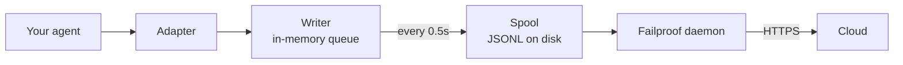

自作のエージェント、またはFailproof AIがアダプターを提供していないフレームワークを対象としています。インストゥルメントするものは何もありません。イベントを直接発行するだけです。

これは4つのフレームワークアダプターが内部で呼び出しているAPIと同じです。アダプターはその上に構築された変換テーブルにすぎません。

## インストール

```bash
pip install failproofai-sdk
```

追加パッケージもなく、依存関係もありません。

## インストゥルメント

```python
import failproofai_sdk

failproofai_sdk.configure(environment="production")

with failproofai_sdk.session():                 # one run
    with failproofai_sdk.agent("planner"):      # one unit of work
        with failproofai_sdk.tool_call("search", input={"q": q}) as t:
            t.output = search(q)                # one tool call
```

上から下に読めば、そのまま意味がわかります：

| スコープ | 意味 |
| --- | --- |
| `session()` | これらのイベントは同じ実行に属する |
| `agent()` | 何かが作業を行っている — リストで認識できる名前を付ける |
| `tool_call()` | これは1つのツールで、返した結果がこれ |

各スコープが実際に発行するもの：

| スコープ | 発行するイベント | 用途 |
| --- | --- | --- |
| `session()` | なし | セッションIDをバインドし、1回の実行をグループ化する |
| `agent()` | `agent_start`、`agent_end` | 作業単位を囲む |
| `tool_call()` | `tool_use`、`tool_result` | 1つのツールを囲み、計測する |

内部では `session_id` と `agent_id` を省略できます。スコープはコンテキスト変数にIDをバインドし、すべてのイベント呼び出しがそれを参照するため、関数間でIDを引き回す必要はありません。

3つすべてが `async with` にも `with` にも対応しています。

エージェントをネストするとツリーが構築されます。`parent_id` と深さはスタックから自動的に計算されます：

```python
with failproofai_sdk.session():
    with failproofai_sdk.agent("supervisor"):
        with failproofai_sdk.agent("researcher"):    # parent_id = "supervisor"
            ...
```

## スコープのクローズ方法

`agent()` は例外を自動的に処理します：

| 状況 | イベント | 結果 |
| --- | --- | --- |
| 例外なし | `agent_end` | `success` |
| `Exception` | `error`、その後 `agent_end` | `failed` |
| `KeyboardInterrupt`、`SystemExit` | `error`、その後 `agent_end` | `failed` |
| `CancelledError`、`GeneratorExit` | `agent_end` のみ | `cancelled` |

エラーは `agent_end` の前に発行されます。ダッシュボードが `agent_end` でスパンを閉じるため、それ以降のものは何にも帰属されないからです。キャンセルは失敗ではないため、キャンセルされた実行はエラー画面を汚染しません。例外は必ず再スローされます。スコープが例外を飲み込むことはありません。

## イベントメソッド

6つのファミリーに分かれた15のメソッドです。ほとんどはペアで提供されます。開始側を発行し、次に終了側を発行すると、SDKがその間のスパンを計測します。

| ファミリー | 開始 | 終了 | 単独 |
| --- | --- | --- | --- |
| **エージェント** | `agent_start` | `agent_end` | — |
| | `agent_pause` | `agent_resume` | — |
| **モデル** | `model_request` | `model_response` | — |
| **ツール** | `tool_use` | `tool_result` | — |
| **フック** | `hook_triggered` | `hook_completed` | — |
| **ヒューマン** | `human_wait` | `human_input` | `human_pause`、`human_interrupt` |
| **失敗** | — | — | `error` |

<Tip>
  制御フローがネストできる場合は、`agent()` や `tool_call()` などのスコープを優先してください。本体が例外を発生させても、クローズイベントが保証されます。ヘルパー内のモデル呼び出しなど、制御フローがネストしない場合は、これらのメソッドを直接使用してください。
</Tip>

<CodeGroup>
```python Agents
failproofai_sdk.event.agent_start(agent_id="planner", goal="find the cheapest flight")
failproofai_sdk.event.agent_end(agent_id="planner", outcome="success", summary="...")
failproofai_sdk.event.agent_pause(pause_id="p1", reason="awaiting approval")
failproofai_sdk.event.agent_resume(pause_id="p1")
```

```python Models
failproofai_sdk.event.model_request(
    model="gpt-4o-mini",
    messages=[{"role": "user", "content": "..."}],
    request_id="req-1",
)
failproofai_sdk.event.model_response(
    model="gpt-4o-mini",
    content="...",
    input_tokens=139,
    output_tokens=21,
    request_id="req-1",
    duration_ms=5202,
)
```

```python Tools
failproofai_sdk.event.tool_use(tool_name="search", tool_call_id="c1", input={"q": "..."})
failproofai_sdk.event.tool_result(tool_name="search", tool_call_id="c1", output="...")
```

```python Hooks
failproofai_sdk.event.hook_triggered(hook_name="retrieve", hook_id="h1", trigger_event="node")
failproofai_sdk.event.hook_completed(hook_name="retrieve", hook_id="h1", outcome="success")
```

```python Humans
failproofai_sdk.event.human_wait(input_id="i1", prompt="Approve?", options=["yes", "no"])
failproofai_sdk.event.human_input(input_id="i1", response="yes")
failproofai_sdk.event.human_pause(reason="operator paused the run", user_id="dana")
failproofai_sdk.event.human_interrupt(reason="operator stopped the run", at_step="step_3")
```

```python Failures
failproofai_sdk.event.error(
    error_type="TimeoutError",
    message="provider timed out after 30s",
    traceback="...",
)
```
</CodeGroup>

<Note>
  **2つのヒューマンファミリーは方向が逆です。**

  | メソッド | 意味 |
  | --- | --- |
  | `human_wait` / `human_input` | **エージェントが人に尋ねた** — 承認ゲート、確認の質問 |
  | `human_pause` / `human_interrupt` | **人がエージェントに作用した** — 停止ボタン、オペレーターによる一時停止 |

  フレームワークは後者のペアをシグナルしないため、常に自分で発行する必要があります。
</Note>

<Warning>
  **モデル呼び出しが並行して実行される場合は `request_id` を渡してください。** 指定しない場合、リクエストとレスポンスはエージェントごとの到着順にペアリングされ、並行呼び出しでは各レスポンスが誤ったリクエストに関連付けられます。
</Warning>

## 例

エージェントフレームワークを使わず、OpenAI APIに対するツール呼び出しループの例：

```python
import json

import failproofai_sdk
from openai import OpenAI

failproofai_sdk.configure(environment="production")
client = OpenAI()
MODEL = "gpt-4o-mini"


def turn(messages: list):
    """One model call, bracketed by the pair."""
    failproofai_sdk.event.model_request(model=MODEL, messages=messages)
    reply = client.chat.completions.create(model=MODEL, messages=messages, tools=TOOLS)
    usage = reply.usage
    failproofai_sdk.event.model_response(
        model=MODEL,
        content=reply.choices[0].message.content or "",
        input_tokens=usage.prompt_tokens,
        output_tokens=usage.completion_tokens,
    )
    return reply.choices[0].message


with failproofai_sdk.session():
    with failproofai_sdk.agent("inventory", goal="price report"):
        for _ in range(4):          # bounded; an unbounded agent loop is its own bug
            message = turn(messages)
            if not message.tool_calls:
                break
            messages.append(message.model_dump(exclude_none=True))
            for call in message.tool_calls:
                args = json.loads(call.function.arguments or "{}")
                with failproofai_sdk.tool_call(
                    call.function.name, tool_call_id=call.id, input=args
                ) as handle:
                    handle.output = run_tool(call.function.name, args)
                messages.append({
                    "role": "tool",
                    "tool_call_id": call.id,
                    "content": str(handle.output),
                })
```

これにより、アダプターが生成するものと同じ6種類のイベントタイプが生成されます。ツール定義を含む完全な実行可能バージョンは、SDKリポジトリの `docs/manual/examples/` に収録されています。

## スレッドと非同期

コンテキスト変数はasyncioタスクに自動的に伝播します。新しいスレッドには伝播しません。スレッドは空のコンテキストで開始するためです。

```python
# asyncio: nothing to do
async with failproofai_sdk.session():
    await asyncio.gather(worker(1), worker(2))

# threads: wrap the callable
pool.submit(failproofai_sdk.propagate(work), x)
threading.Thread(target=failproofai_sdk.propagate(work)).start()
loop.run_in_executor(None, failproofai_sdk.propagate(work), x)
```

`propagate()` なしでは、ワーカーのイベントがセッションなしで着信する代わりに、修正方法を示す `TypeError` が発生します。これは意図的な設計です。セッションのないイベントはインジェスト時にスキップされ `200` が返されますが、それはIDレイヤーが防ごうとしているサイレントな失敗だからです。

## アダプターのないフレームワークをインストゥルメントする

どのエージェントフレームワークにも同じ3つのシームがあります。それらをマッピングすれば完全なトレースが得られます。出荷済みの4つのアダプターもこれ以上のことはしていません。

| シーム | 書くもの | 記録されるもの |
| --- | --- | --- |
| 実行 | `session()` + `agent()` | `agent_start`、`agent_end` |
| 各ツール | `tool_call()` | `tool_use`、`tool_result` |
| 各モデル呼び出し | `model_*` ペア | `model_request`、`model_response` |

<Steps>
  <Step title="実行を囲む">
    ```python
    with failproofai_sdk.session():
        with failproofai_sdk.agent(agent_name, goal=task):
            result = framework.run(task)
    ```
  </Step>
  <Step title="各ツールを囲む">
    フレームワークがツールラッパーまたはミドルウェアと呼ぶものの中で。

    ```python
    with failproofai_sdk.tool_call(name, input=args) as call:
        call.output = original(**args)
    ```
  </Step>
  <Step title="各モデル呼び出しをペアにする">
    ```python
    failproofai_sdk.event.model_request(model=model, messages=messages)
    reply = provider.complete(...)
    failproofai_sdk.event.model_response(
        model=model,
        content=text,
        input_tokens=usage.prompt_tokens,
        output_tokens=usage.completion_tokens,
    )
    ```
  </Step>
</Steps>

<Tip>
  **確認する価値のあるノード、ステップ、ミドルウェアの境界がありますか？** ネストされた `agent()` ではなく、フックペア（`hook_triggered` / `hook_completed`）で囲んでください。`agent_id` は低カーディナリティのファセットで、ノードごとに1エントリあるとリストが溢れます。フックスパンは同じように表示され、ノードごとのレイテンシが確認できます。
</Tip>

<Note>
  **手動と自動は組み合わせられます。** 手書きのスコープ内で実行するアダプターはそのセッションに参加し、そのエージェントの配下に入るため、2つのツリーではなく1つのツリーが得られます。サポート済みのフレームワークと並行して自分でインストゥルメントするときに便利です。
</Note>

<Accordion title="AutoGenアダプターが存在しない理由">
  2つの理由があり、上記の3つのシームがその両方に対する答えです：

  - `autogen-core` は2025年9月以降メンテナンスされていません。
  - AG2は他のフレームワークのフックに相当するプロセス全体の登録ポイントを公開していないため、インストゥルメントするにはすべての構築サイトでエージェントをラップする必要があります。

  シームを手動でマッピングすることで、出荷済みアダプターと同じイベントを同じ精度で記録できます。
</Accordion>

## より深く理解する

記録の実際の仕組みです。始めるためには何も必要ありません。

<AccordionGroup>

<Accordion title="フレームワーク別の記録の様子" icon="eye">

すべての記録は同じ形をしています。スパンが開き、作業がその中にネストされ、各開始イベントに対応する終了イベントがあります。


**ペア**が基本単位です。各終了イベントには、対応する開始イベントからSDKが計測した期間が含まれます。

以下はフレームワークごとの実際の1回の実行です。SDKに付属するサンプルからキャプチャし、モデル名を正規化しています。1回の呼び出しでどれだけ多くの情報が返ってくるかに注目してください。

<Tabs>
  <Tab title="LangGraph">
    ```text 14 events
     1  +0.000s  agent_start       LangGraph
     2  +0.001s    hook_triggered  agent
     3  +0.002s      model_request   gpt-4o-mini
     4  +3.023s      model_response  gpt-4o-mini · 21 out-tok
     5  +3.024s    hook_completed  agent
     6  +3.024s    hook_triggered  tools
     7  +3.025s      tool_use      word_count
     8  +3.025s      tool_result   word_count · ok
     9  +3.025s    hook_completed  tools
    10  +3.026s    hook_triggered  agent
    11  +3.027s      model_request   gpt-4o-mini
    12  +5.717s      model_response  gpt-4o-mini · 5 out-tok
    13  +5.720s    hook_completed  agent
    14  +5.721s  agent_end         LangGraph · success
    ```

    ノードがフックペアになるため、エージェントリストを圧迫することなくノードごとのレイテンシが確認できます。
  </Tab>

  <Tab title="CrewAI">
    ```text 10 events
     1  +0.000s  agent_start       crew
     2  +0.050s    agent_start     analyst · under crew
     3  +0.057s      model_request   gpt-4o-mini
     4  +3.475s      model_response  gpt-4o-mini · 19 out-tok
     5  +3.478s      tool_use      lookup_metric
     6  +3.478s      tool_result   lookup_metric · ok
     7  +3.486s      model_request   gpt-4o-mini
     8  +5.694s      model_response  gpt-4o-mini · 9 out-tok
     9  +5.727s    agent_end       analyst · success
    10  +5.739s  agent_end         crew · success
    ```

    各エージェントの `role` がスパン名になるため、レイテンシとトークン消費をロールごとに分析できます。
  </Tab>

  <Tab title="LlamaIndex">
    ```text 26 events
     1  +0.000s  agent_start       Agent
     2  +0.001s    hook_triggered  init_run
     4  +0.501s    hook_triggered  setup_agent
     6  +0.503s    hook_triggered  run_agent_step
     7  +0.505s      model_request   gpt-4o-mini
     8  +3.083s      model_response  gpt-4o-mini · 18 out-tok
    10  +3.197s    hook_triggered  parse_agent_output
    12  +3.355s    hook_triggered  call_tool
    13  +3.355s      tool_use      city_population
    14  +3.355s      tool_result   city_population · ok
    16  +3.356s    hook_triggered  aggregate_tool_results
       ...                        second iteration
    26  +7.038s  agent_end         Agent · success
    ```

    モデル呼び出しだけでなく、エージェントループ自体が可視化されます。
  </Tab>

  <Tab title="Pydantic AI">
    ```text 8 events
    1  +0.000s  agent_start       agent
    2  +0.001s    model_request   gpt-4o-mini
    3  +4.413s    model_response  gpt-4o-mini · 17 out-tok
    4  +4.415s    tool_use        population
    5  +4.415s    tool_result     population · ok
    6  +4.416s    model_request   gpt-4o-mini
    7  +8.118s    model_response  gpt-4o-mini · 6 out-tok
    8  +8.119s  agent_end         agent · success
    ```

    フックペアなし：Pydantic AIにはブラケットするノードやステップの境界がありません。
  </Tab>

  <Tab title="Custom agents">
    ```text 6 events
    1  +0.000s  agent_start       main
    2  +0.000s    tool_use        population
    3  +0.000s    tool_result     population · ok
    4  +0.000s    model_request   gpt-4o-mini
    5  +0.000s    model_response  gpt-4o-mini · 3 out-tok
    6  +0.000s  agent_end         main · success
    ```

    これらは自分で発行します。同じイベントタイプ、同じ精度 — 呼び出しサイトのコストがかかります。
  </Tab>
</Tabs>

</Accordion>

<Accordion title="セッションの開始と終了の仕組み" icon="circle-play">

**セッション終了イベントはありません。** セッションはクローズするものではなく、`session_id` を共有するイベントのグループです。

ステータスはトレースの形から導出されます：

| ステータス | 条件 |
| --- | --- |
| `ongoing` | 少なくとも1つのスパンがまだ開いている |
| `paused` | `agent_pause` に対応する `agent_resume` がない |
| `error` | 開いているものがなく、少なくとも1つのイベントが失敗した |
| `done` | 開いているものがなく、失敗もない |

つまり、すべてのペアが閉じられるとセッションが終了します。アダプターは `agent_end` を自動で発行し、ティアダウン時に残っているものをすべて閉じて不完全とマークします。クラッシュした実行は、永遠にハングするのではなく、可視ギャップのある `done` として落ち着きます。

<Note>
  これがセッションが2回の呼び出しにまたがれる理由です。LangGraphの `interrupt()` が実行を一時停止し、ルートスパンが意図的に開いたままになり、再開する呼び出しがそれを閉じます。両方の呼び出しが1つのセッションです。
</Note>

</Accordion>

<Accordion title="ID：session_id、agent_id、そして誰が生成するか" icon="fingerprint">

`session_id` と `agent_id` はすべてのイベントメソッドでオプションです。省略した場合、囲むスコープから解決されます：

```python
with failproofai_sdk.session():
    with failproofai_sdk.agent("planner"):
        failproofai_sdk.event.tool_use(tool_name="search", tool_call_id="c1")
```

明示的に渡すことも可能で、その場合は優先されます。何もバインドされておらず何も渡されていない場合、セッションなしのイベントを発行する代わりに（インジェストはそれをスキップして `200` を返します）、修正方法を示す `TypeError` が発生します。

スコープはコンテキスト変数にIDをバインドします。それらはasyncioタスクには自動的に伝播しますが、新しいスレッドには伝播しません。ワーカーを `failproofai_sdk.propagate()` でラップしてください。

#### 誰がどのIDを生成するか

| ID | 生成者 | 備考 |
| --- | --- | --- |
| `session_id` | あなた、またはSDK | `session("chat-42")` はそのまま使用される。省略した場合、SDKが `uuid4().hex` を生成する |
| `agent_id` | あなた、またはフレームワーク | `agent("analyst")`、CrewAIの `role`、`FunctionAgent.name` から。UUID形式の値は拒否されて置き換えられる |
| `tool_call_id`、`hook_id`、`request_id` | あなた、またはフレームワーク | アダプターはフレームワーク自身の実行IDを再利用するため、スレッドをまたいでもペアが維持される |
| **イベントID** | **クラウド、インジェスト時** | SDKは発行しない |
| **`dedup_key`** | **クラウド、インジェスト時** | org、セッション、タイムスタンプ、タイプ、ペイロードのハッシュ。これが本当のID — リトライされたバッチが重複する代わりに集約される |

#### アダプターが `session_id` を解決する方法

最初にマッチしたものが使われます：

1. 明示的な `session_id` オプション
2. 呼び出しごとのメタデータ
3. 囲む `session()` スコープ
4. フレームワークのメタデータ
5. フレームワーク自身の実行ID

これらのいずれかが存在する間は生成されません。合成されたIDは1つの実行を複数のセッションに分割してしまいます。

#### `agent_id` は低カーディナリティに保つ

これはすべてのダッシュボード画面の主要ファセットであり、`LowCardinality(String)` カラムです。実行ごとの値はカラムを劣化させ、フィルタードロップダウンを実行ごとの1エントリで埋めてしまいます。

アダプターはそのカラムを守ります：

| フレームワークが渡す値 | 記録される値 | 理由 |
| --- | --- | --- |
| `3f9a1c2b-…`（UUID） | `main` | 読める部分がない |
| 長い生の16進数文字列 | `main` | 同上 |
| `agent-3f9a1c2b-…` | `agent` | 実行IDが除去され、読める部分が保持される |
| `agent-v2` | `agent-v2` | 短いセグメントはそのまま |
| `step-3` | `step-3` | 同上 |

実際のIDは `fw_agent_id` / `fw_run_id` に保持され、ファセットにならずにクエリ可能なままです。

<Warning>
  **このガードは*フレームワーク*が選んだラベルにのみ適用されます。** `event.*` や `failproofai_sdk.agent(...)` に自分で渡す `agent_id` はそのまま記録されます。明示的な引数をサイレントに書き換えることは、それが防ぐカーディナリティ問題よりも悪いためです。自分のスパンには適切な名前を付けてください。
</Warning>

</Accordion>

<Accordion title="イベントタイプ一覧 — フレームワーク別の記録対象" icon="table">

| グループ | イベント |
| --- | --- |
| エージェント | `agent_start`、`agent_end`、`agent_pause`、`agent_resume` |
| モデル | `model_request`、`model_response` |
| ツール | `tool_use`、`tool_result` |
| フック | `hook_triggered`、`hook_completed` |
| ヒューマン | `human_wait`、`human_input`、`human_pause`、`human_interrupt` |
| 失敗 | `error` |

上記の実行から計測した、フレームワーク別の記録対象：

| イベント | LangGraph | CrewAI | LlamaIndex | Pydantic AI | カスタム |
| --- | :--: | :--: | :--: | :--: | :--: |
| エージェント開始・終了 | Yes | Yes | Yes | Yes | あなた |
| モデルリクエスト・レスポンス | Yes | Yes | Yes | Yes | あなた |
| ツール使用・結果 | Yes | Yes | Yes | Yes | あなた |
| フックトリガー・完了 | Node | Task | Step | — | あなた |
| エラー | Yes | Yes | Yes | Yes | 自動 |
| ヒューマン待機・入力 | Yes | Yes | Yes | — | あなた |
| エージェント一時停止・再開 | Yes | Yes | Yes | — | あなた |

ダッシュはフレームワークにそのような概念がないことを意味します。`human_pause` と `human_interrupt` は*人*がエージェントに作用することを表しており、どのフレームワークもシグナルしません。自分で発行してください。

</Accordion>

<Accordion title="ペア、相関、期間" icon="link">

イベントは単独では届きません。1つが開き、1つが閉じ、終了イベントにはSDKが開始イベントから計測した期間が含まれます。

| 開始 | 終了 | 終了イベントが持つもの |
| --- | --- | --- |
| `agent_start` | `agent_end` | `outcome`、`summary` |
| `model_request` | `model_response` | トークン、`stop_reason`、レイテンシ |
| `tool_use` | `tool_result` | `output` または `error`、期間 |
| `hook_triggered` | `hook_completed` | `outcome`、期間 |
| `agent_pause` | `agent_resume` | 一時停止の継続時間 |
| `human_wait` | `human_input` | 回答、および人が要した時間 |

<Warning>
  対応する終了イベントのない開始イベントは、永遠に終わらないスパンになります。セッションは永遠に実行中として表示され、アクティブな期間が増え続けます。これが手動インストゥルメント時に注意すべき失敗モードです。
</Warning>

#### 相関ルール

- マッチする完了イベントには同じ `tool_call_id`、`hook_id`、`pause_id`、または `input_id` を再利用してください。
- SDKは `tool_result`、`hook_completed`、`agent_resume`、`human_input` の `duration_ms` を計算します。これらのメソッドに渡すと `ValueError` が発生します。
- `duration_ms` は `model_response` では**受け付けられます**。本当のプロバイダーレイテンシを知っているのは呼び出し元だけだからです。整数でなければなりません。浮動小数点数は呼び出しサイトで `ValueError` が発生します。サーバーはカラムを符号なし32ビット整数として読み取るため、それ以外はNULLとして格納されます。
- 相関キーはKindとセッションでスコープされているため、ツール呼び出しとフックは安全にIDを共有でき、2つの並行セッションは同じIDを衝突なしに再利用できます。エージェントではスコープされません。あるエージェントで開かれ別のエージェントで閉じられたペアも相関します。これはマルチエージェントフレームワークでの通常のケースです。
- `request_id` は `model_request` と `model_response` をペアにします。これなしでは、モデルイベントはエージェントごとの順序でペアリングされるため、並行呼び出しは誤ってペアリングされます。
- プロセスをまたぐペアは下流で相関しますが、SDKはプロセス内の期間を計算できません。
- ペンディングマップは最大10,000件の開始エントリを保持し、満杯になると最古のエントリを削除します。

</Accordion>

<Accordion title="パッケージの中身と、instrument()がフレームワークを見つける方法" icon="box">

`failproofai-sdk` をインストールすると、4つのアダプターすべてを含むすべてのものがインストールされます。エクストラは**フレームワーク**を引き込むものであり、アダプターではありません。

```python
import failproofai_sdk        # loads nothing outside the standard library
failproofai_sdk.instrument()  # imports only the adapters you actually need
```

`import failproofai_sdk` は契約上ゼロ依存です。ビルドされたwheelを `--no-deps` でインストールするテストと、フレームワークが `sys.modules` に到達しないことを証明するテストによって強制されています。

<Warning>
  `failproofai_sdk.crewai` 属性はありません。アダプターはトップレベルパッケージに意図的に公開されていません。属性アクセスの副作用としてフレームワークがインポートされ、ゼロ依存の約束が破られるからです。`instrument()` を使用してください。
</Warning>

```python
failproofai_sdk.instrument()              # every framework already imported
failproofai_sdk.instrument("crewai")      # exactly one, by name
failproofai_sdk.uninstrument("crewai")    # put it back
```

| 名前 | 別名 |
| --- | --- |
| `langchain` | `langgraph`、`langchain_core` |
| `crewai` | — |
| `llama_index` | `llamaindex`、`llama-index` |
| `pydantic_ai` | `pydantic-ai`、`pydanticai` |

自動検出はインストール済みパッケージリストではなく `sys.modules` を読み取るため、インストール済みだがインポートしていないフレームワークはインストゥルメントされず、代わりにインポートされることもありません。接続されているものを確認するには：

```python
from failproofai_sdk.integrations import active, available

available()   # ('crewai', 'langchain', 'llama_index', 'pydantic_ai')
active()      # ('langchain',)
```

<Note>
  **CrewAIのないマシンで `instrument("crewai")` を呼び出しても例外は発生しません。** 警告をログに記録して `()` を返すため、フレームワークが1つ欠けていても他のインストゥルメントをしているプロセスを停止させません。

  警告には根本的な `ImportError` が含まれており、そのメッセージには正確なインストールコマンドが記載されています。修正方法はログにあり、隠れていません。

  ```text
  ImportError: failproofai_sdk: cannot instrument 'crewai' because 'crewai.events'
  is not importable. Install it with:  pip install 'failproofai_sdk[crewai]'
  ```

  `FAILPROOFAI_SDK_STRICT=1` を設定すると、代わりに例外が発生します。このフラグは**一度だけ読み取られてキャッシュされる**ため、プロセス実行中に設定するのではなく、プロセスが開始する前にエクスポートしてください。
</Note>

<Warning>
  **`instrument()` はフレームワークのインポートの*後*に呼び出す必要があります。** 自動検出は `sys.modules` を読み取るため、インポートより前に呼び出すと何も見つからず、何もインストールされず、`()` が返されます。
</Warning>

<CodeGroup>
```python Wrong
import failproofai_sdk
failproofai_sdk.instrument()   # sys.modules has no langchain yet -> ()

import langchain               # too late, nothing is wired
```

```python Right
import langchain               # import the framework first
import failproofai_sdk

failproofai_sdk.instrument()   # finds it -> ('langchain',)
```

```python Right, order-proof
import failproofai_sdk

# Naming it imports the adapter on request, so this works from anywhere.
failproofai_sdk.instrument("langchain")
```
</CodeGroup>

これを誤るとプロセスはSDKがインポートされ、アダプターが明らかにインストールされているにもかかわらず、**1つもイベントが発行されない**状態で動作します。まさにそれを示す警告がログに記録されます。実行が何も記録しない場合はまずログを確認してください。

</Accordion>

<Accordion title="イベントがクラウドに届く仕組み" icon="cloud-upload">



| ステージ | 役割 | 実行場所 |
| --- | --- | --- |
| アダプター | フレームワークのコールバックを15種類のイベントタイプのいずれかに変換する | あなたのプロセス |
| ライター | キューに入れ、バッチ処理し、JSONLをアトミックに書き込む | あなたのプロセス、バックグラウンドスレッド |
| スプール | 耐久性のあるハンドオフ。プロセスが終了しても生き残る | ローカルディスク |
| デーモン | スプールを監視し、バッチを送信し、送信済みのものを削除する | あなたのマシン |
| インジェスト | 行IDとdedupキーを割り当て、クエリ可能なカラムを昇格させる | クラウド |

スプールがこれを安全にしています。エージェントがネットワークをブロックすることはなく、クラウドが停止してもイベントが失われる代わりにディレクトリが大きくなるだけです。

各フラッシュは1つのバッチファイルを書き込みます。`.tmp` として書き込み、`fsync`、その後アトミックなリネームを行います：

```text
~/.failproofai/custom-agents/events/
  event-2026-08-20T10-15-00-123Z-48213-0.jsonl
```

デーモンは `.jsonl` のみを読み取るため、半分書かれたファイルを読む可能性はありません。ステムにはタイムスタンプ、プロセスID、シーケンス番号が含まれているため、同じミリ秒にフラッシュする2つのプロセスが衝突することはありません。キューの上限は10,000イベントで、それを超えると最古のものをドロップしてログに記録します。

<Warning>
  **`collector.redact` はSDKイベントにもデフォルトで `minimal` が適用されます。** SDKはバッチをディスクに書き込む前にスクラブし、デーモンはアップロード前に同じ決定論的パスを繰り返します。これにより古いSDKからのバッチも保護されます。
</Warning>

デーモンは各バッチを読み取り、アップロード前にメモリ内でリダクションを適用します。読み取ったスプールファイルを書き換えることはありません。

| イベント | 書き込み元 | 最小リダクションの実行タイミング |
| --- | --- | --- |
| CLIセッションのトランスクリプト | デーモン | デーモンがバッチを書き込む前 |
| フックアクティビティ | デーモン | デーモンがバッチを書き込む前 |
| **SDKが発行するすべてのもの** | **あなたのプロセス** | **SDKがバッチを書き込む前、およびデーモンのアップロード前** |

逐語的なペイロードが明示的な要件である場合にのみ `collector.redact` を `off` に設定してください。SDKとデーモンの両方がその設定を尊重します。最小リダクションは一般的なAPIキー、ベアラートークン、JWT、シークレットの代入をキャッチします。任意の機密テキストを識別することはできません。

<Tip>
  **ペイロードはソースで2か所制御できます：**

  - アダプターのコンテンツキャプチャをオフにする。**オプション名は異なり、コンテンツスイッチのないアダプターもあります** — これは単一の汎用スイッチではありません：
    - LangChain / LangGraph、Pydantic AI — `capture_content=False`
    - LlamaIndex — `capture_messages=False`
    - CrewAI — **コンテンツスイッチなし**。読み取るオプションは `session_id` のみで、プロンプトと補完は常に記録されます。

    `instrument()` はアダプターが読み取らないオプションをドロップするため、誤った名前を渡しても例外は発生せず、何も変わりません。
  - そもそもシークレットを `input=` に渡さない。

  `collector.redact` は多層防御であり、どちらかの代替ではありません。
</Tip>

<Warning>
  **スプールディレクトリが空なのが正常な状態です。** 配信確認にそれを使わないでください。
</Warning>

デーモンは送信から数ミリ秒以内に各バッチを削除するため、`ls` はコレクターと競合し、実際に発行したもののごく一部しか表示されません。これは何も記録していないSDKと区別がつきません。

イベントが実際に届いたことを確認するにはダッシュボードを確認してください。スプールが満たされるのを見るにはまずデーモンを停止してください。

</Accordion>

<Accordion title="インストゥルメントが失敗した場合" icon="triangle-alert">

すべてのコールバックは、再スローすることだけが役割のラッパー内で実行されます。呼び出しは正確に1つの `try` の中にあり、SDKが行うすべてのことはその外で行われます。

| 状況 | 結果 |
| --- | --- |
| フックが例外を発生させる | トレースバック付きで1回ログに記録される。呼び出しへの影響なし |
| 同じフックが3回例外を発生させる | そのフックはプロセスの残りの間無効化され、エラー行が1つ記録される |
| `FAILPROOFAI_SDK_STRICT=1` が設定されている | 例外が代わりに再スローされる |
| フレームワークのバージョンがテスト済み範囲外 | 1回警告し、インストゥルメントを続行する |
| 単一の機能が欠けている | そのフックのみ無効化され、アダプター全体ではない |

デフォルトは本番では正しく、デバッグ中は誤りです。「クラッシュしなかった」ことしか証明できないからです。`FAILPROOFAI_SDK_STRICT=1` を設定して、飲み込まれた失敗を顕在化させてください。

</Accordion>

</AccordionGroup>

## よくある問題

<AccordionGroup>
  <Accordion title="スパンが終了しない">
    開始イベントに対応する終了イベントがありません。`model_request` に `model_response` がない、または `tool_use` に `tool_result` がない場合です。本体が例外を発生させてもペアを保証するスコープを使用してください。イベントメソッドを直接呼び出す場合は `try` と `finally` を使用してください。
  </Accordion>

  <Accordion title="duration_msを渡すとValueErrorが発生する">
    これは対応する開始イベントから計測されるため、`tool_result`、`hook_completed`、`agent_resume`、`human_input` では拒否されます。本当のプロバイダーレイテンシを知っているのは呼び出し元だけであるため、`model_response` では受け付けられます。整数でなければなりません。
  </Accordion>

  <Accordion title="ワーカースレッドからのイベントがTypeErrorを発生させる">
    スレッドがコンテキストを継承しませんでした。呼び出し可能オブジェクトを `failproofai_sdk.propagate()` でラップしてください。[スレッドと非同期](#threads-and-async)を参照してください。
  </Accordion>

  <Accordion title="追加フィールドが消えたか、何かを上書きした">
    追加フィールドは最後にマージされるため、`model` や `outcome` などの実際のフィールドと同じ名前のものはそれを上書きし、格納されるカラムを変更します。独自のものには名前空間を付けてください。アダプターは `fw_` プレフィックスを使用しています。
  </Accordion>

  <Accordion title="エージェントフィルターに数千のエントリがある">
    `agent_id` は低カーディナリティのファセットで、実行IDが入っています。ロール名またはノード名を使用し、実際のIDはペイロードフィールドに入れてください。
  </Accordion>
</AccordionGroup>

## 次のステップ

<Columns cols={3}>
  <Card title="仕組みを理解する" icon="workflow" href="/ja/reference/custom-agents">
    ペア、ID、セッションライフサイクル、配信について。
  </Card>
  <Card title="トレースを読む" icon="route" href="/ja/sessions/read-a-trace">
    キャプチャしたセッションを通じて因果関係を追う。
  </Card>
  <Card title="フレームワークアダプター" icon="plug" href="/ja/start/integrations">
    LangGraph、CrewAI、LlamaIndex、Pydantic AI。
  </Card>
</Columns>