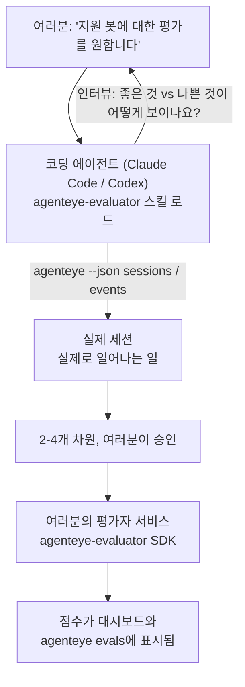

*"에이전트가 가끔 이상한 것 같다"*는 막연한 생각에서 실제 배포된 스코어링 서비스까지, 코딩 에이전트가 설계와 구현을 모두 담당합니다. **Failproof AI Observability 평가자 스킬** (`agenteye-evaluator`)은 *에이전트 스킬*입니다. Claude Code나 Codex 같은 코딩 에이전트가 필요할 때 로드하는 소규모 지시문 폴더로, 에이전트가 *여러분의* 에이전트에서 추적할 가치가 있는 품질 차원을 스스로 결정하고, 그것들을 평가하는 [평가자 서비스](/ko/agenteye/evaluation-suite)를 작성, 테스트, 배포하도록 가르칩니다.

이것은 호스팅된 스코어러, 업로드하는 레지스트리, 또는 플러그인 시스템이 **아닙니다**. 여러분의 평가자는 [Evaluation suite](/ko/agenteye/evaluation-suite) 가이드에 설명된 대로 여러분 자신의 인프라에서 운영하는 HTTP 서비스로 유지됩니다. 스킬은 에이전트가 그것을 잘 구축하도록 가르칠 뿐이므로, 에이전트가 하는 모든 일은 여러분이 직접 같은 코드를 작성하여 할 수 있습니다.

---

## 어려운 부분은 무엇을 평가할지 결정하는 것입니다

SDK 표면은 작습니다 — 데코레이터 하나와 두 가지 모델 — 에이전트는 [계약서](/ko/agenteye/evaluation-suite#http-contract)만으로도 그것을 작성할 수 있습니다. 평가자가 실패하는 이유는 그것이 아닙니다. 잘못된 것을 평가하기 때문에 실패합니다. 잘못된 것을 평가하는 평가자는 없는 것보다 더 나쁩니다. 모든 사람이 무시하는 법을 배우는 대시보드를 만들어내기 때문입니다.

따라서 스킬의 대부분은 코드가 존재하기 전 단계입니다. 에이전트가 여러분을 인터뷰하고 (*"잘 됐던 실행 하나를 설명해 주세요; 이제 잘못됐던 것 하나를"*), 그런 다음 [`agenteye` CLI](/ko/agenteye/cli)를 통해 실제 세션을 가져와 처음부터 끝까지 읽습니다. 이 두 가지는 보통 일치하지 않으며, 그 차이가 핵심입니다. 즉, 측정하려는 의도와 트랜스크립트가 실제로 지원할 수 있는 것의 차이입니다. 차원은 이벤트에서 **계산 가능**하고 **변별력이 있을** 때만 살아남습니다 — 좋은 실행과 나쁜 실행 모두에서 0.9점이 나온다면 아무것도 가르치지 못하므로 제거됩니다.

결과물은 여러분이 코드 작성 전에 승인할 수 있도록 추론이 첨부된 2-4개 차원 제안입니다.



---

## 다른 평가 구성 요소와의 관계

네 가지 문서가 스코어링을 다루며, 순서대로 연결됩니다:

| 페이지 | 내용 | 참조 시점 |
|---|---|---|
| **[Evaluations](/ko/agenteye/evaluations)** | 기능: 세션 그리드의 점수, 대시보드, 재평가 | 자동 스코어링이 무엇을 제공하는지 알고 싶을 때 |
| **[Evaluation suite](/ko/agenteye/evaluation-suite)** | HTTP 계약, SDK, 서버 환경 변수 | 직접 평가자를 구현하거나 디버깅할 때 |
| **평가자 스킬** (이 문서) | 스코어러 설계 *및* 구축을 위한 자연어 진입점 | "평가를 원한다"에서 실행 중인 서비스까지 가고 싶을 때 |
| **[CLI 스킬](/ko/agenteye/cli-skill)** | `agenteye` CLI에 대한 자연어 진입점 | 이미 보유한 점수를 *읽고* 싶을 때 |
| **[Python SDK 스킬](/ko/agenteye/python-sdk-skill)** | 에이전트 계측을 위한 자연어 진입점 | 에이전트가 아직 세션을 내보내지 않는 경우 — 평가할 것이 없을 때 |

### CLI 스킬과의 비교: 구축 대 읽기

두 스킬은 의도적으로 겹치지 않으며, 둘 다 설치하는 것이 일반적인 설정입니다 — 에이전트는 요청 내용에 따라 둘 중 하나를 선택합니다:

- **`agenteye-evaluator`** (이 문서)는 점수를 *생성하는* 것을 구축합니다. 점수가 처음으로 도착하면 역할이 끝납니다.
- **[`agenteye-cli`](/ko/agenteye/cli-skill)**는 이미 존재하는 점수를 읽습니다 (`agenteye evals`). *"이번 주에 품질이 떨어졌나요?"*가 이 스킬의 질문이며, 이 문서의 스킬 질문이 아닙니다.

---

## 전제 조건

1. **`agenteye` CLI 설치 및 로그인** (`pipx install agenteye`, 그런 다음 `agenteye login`). 스킬은 두 번 사용합니다: 설계 대상인 실제 세션을 가져올 때, 그리고 마지막에 점수가 도착했는지 확인할 때. 로그인에는 `events:read`와 최종 확인을 위한 `evaluations:read`가 필요합니다. CLI 스킬과 마찬가지로, 이메일로 전송된 일회용 코드 로그인을 대신 완료할 수 **없습니다**.
2. **평가자가 실행될 공간.** 이미지로 빌드되어 장기 실행 서비스로 운영되므로, 임시 파일이 아닌 실제 저장소가 필요합니다. 평가자는 종종 평가 대상 에이전트와 별도의 저장소에 있습니다 — 스킬은 기존 저장소를 찾고, 새로 스캐폴딩하기 전에 먼저 묻습니다.
3. **`agenteye-evaluator` SDK 휠** — 에이전트가 `pip` 명령을 입력하기 전에 다음 섹션을 먼저 읽으세요.

---

## 어디서 구할 수 있나요

스킬은 Failproof AI의 공개 스킬 컬렉션에 게시되어 있습니다:

**[github.com/FailproofAI/skills](https://github.com/FailproofAI/skills)** → [`skills/agenteye-evaluator/`](https://github.com/FailproofAI/skills/tree/main/skills/agenteye-evaluator)

저장소는 공개이며 스킬 자체에는 별도의 자격 증명이 필요하지 않습니다 — 여러분이 로그인한 세션으로 `agenteye` CLI를 구동하고, *여러분의* 저장소에 코드를 작성할 뿐입니다. `pipx install agenteye` 패키지 내부가 아닌 별도 폴더로 제공되므로, 그곳에서 찾지 마세요.

## 스킬 설치

가장 빠른 방법은 [`skills`](https://skills.sh) CLI를 사용하는 것으로, 폴더를 가져와 에이전트가 찾는 위치에 배치합니다:

```bash
# Claude Code, 이 프로젝트만
npx skills add FailproofAI/skills --skill agenteye-evaluator -a claude-code

# 모든 프로젝트 (이 경우 ~/.claude/skills/에 설치됨)
npx skills add FailproofAI/skills --skill agenteye-evaluator -a claude-code -g --copy

# Codex 대신 사용
npx skills add FailproofAI/skills --skill agenteye-evaluator -a codex
```

그런 다음 다른 스킬처럼 관리합니다:

```bash
npx skills list -a claude-code           # 설치된 항목 확인
npx skills update agenteye-evaluator     # 최신 버전 가져오기
npx skills remove agenteye-evaluator     # 제거
```

직접 설치하고 싶으신가요? 에이전트 스킬은 `SKILL.md`(선택적 참조 파일 포함)가 들어 있는 폴더일 뿐이므로, 복사해도 됩니다:

- **Claude Code**: `agenteye-evaluator/` 폴더를 `~/.claude/skills/` (모든 프로젝트) 또는 `<저장소>/.claude/skills/` (해당 저장소만)에 넣으세요. Claude Code가 자동으로 감지합니다 — `/skills` 목록으로 확인하거나 평가를 요청해보세요.
- **Codex (OpenAI)**: Codex도 동일한 `SKILL.md`를 읽습니다. 번들된 `agents/openai.yaml`에 `allow_implicit_invocation: true`가 설정되어 있어, 작업이 일치하면 Codex가 자동으로 스킬을 선택합니다. 그렇지 않은 경우 `$agenteye-evaluator`로 명시적으로 호출하세요.

---

## SDK는 공개 PyPI에 없습니다

> **경고:** 에이전트가 SDK를 설치하기 전에 이 내용을 읽으세요.

스킬은 공개되어 있지만, 스킬이 구동하는 SDK는 그렇지 않습니다. `agenteye-evaluator`는 비공개 릴리스 아티팩트로만 제공되며, `agenteye`와 달리 공개 PyPI에서 이름이 **등록되지 않았습니다** — 따라서 단순히 `pip install agenteye-evaluator`를 실행하면 프로덕션 트랜스크립트를 읽는 서비스에 낯선 패키지가 설치될 수 있습니다. 이는 오타가 아닌 공급망 문제입니다.

스킬은 이를 인지하고 있으며, 첫 번째로 적용 가능한 단계에서 멈추는 설치 순서를 따릅니다: AgentEye 저장소 내부에 있다면 모노레포 소스를, 그렇지 않으면 GitHub Releases의 비공개 릴리스 휠을 (접근 권한 필요), 둘 다 접근할 수 없다면 임시방편을 사용하는 대신 **Failproof AI 담당자에게 휠을 요청하도록 안내하고 중단합니다**.

따라서 에이전트가 공개 PyPI에서 단순히 `pip install agenteye-evaluator`를 제안한다면, 스킬이 로드되지 않았다는 신호입니다. 그 자리에서 멈추고 설치 여부를 확인하세요.

---

## 무엇을 요청할 수 있나요

실제 대화는 막연한 요청으로 시작하여 코드가 아닌 승인된 설계로 끝납니다:

```text
여러분  ▸ 지원 봇에 대한 평가를 원합니다. 가끔 이상한 것 같아요.

에이전트 ▸ 코드 작성 전에: 잘 됐던 실행 하나를 설명해 주세요,
           그리고 잘못됐던 것도 하나 설명해 주세요.

여러분  ▸ 좋음: 문서에서 답변을 찾아줌. 나쁨: 내용을 지어내거나,
           포기하고 "고객 지원에 연락하세요"라고 함.

에이전트 ▸ 실행 중: agenteye --json sessions --status error --since 7d
           5개 세션 읽는 중, 나쁘다고 하신 것 두 개 포함.

           말씀에 따르면 사실성과 회피가 문제입니다. 트랜스크립트는
           회피에 동의하지만 (5개 중 2개가 고객 지원 연결로 끝나며,
           model_response.content에 명확히 나타남), 사실성은
           이벤트에 없는 ground truth가 필요합니다.

           따라서 세 가지를 평가하겠습니다:
             - deflection      규칙 기반, 저렴, 두 실행을 구별함
             - tool_efficiency 규칙 기반, run-004의 재시도 루프 포착
             - groundedness    LLM 판정: 검색된 문서에 모든 주장이 있나요?

           "factuality"는 없는 ground truth가 필요합니다; groundedness가
           트랜스크립트로 실제 지원할 수 있는 가장 가까운 대안입니다.
           이 세 가지 이름으로 괜찮으신가요? 나중에 이름을 바꾸면 기록이 분리됩니다.

여러분  ▸ 네

에이전트 ▸ 이 저장소에 평가자가 없습니다. 여기에 스캐폴딩할까요,
           아니면 다른 곳에 기존 것이 있나요?
```

그 후 규칙 기반 차원을 먼저 작성합니다 (무료, 즉각적, 결정론적). 그런 다음 나이브한 평가자를 망가뜨리는 빈 세션과 완료되지 않은 세션을 포함한 실제 캡처된 세션으로 테스트하고, 주관적 차원에 대해서만 LLM 판정을 사용합니다. [디스패처 제한](/ko/agenteye/evaluation-suite#configuring-the-server)을 알고 있습니다 — 30초 요청 타임아웃과 배포 전체에서 동시 8개 호출 — 따라서 판정이 안정적으로 맞지 않을 경우, 비용이 다섯 배가 되는 취소와 재시도 대신 `JobPending`으로 비동기 처리합니다.

그런 다음 배포하고, 두 서버 환경 변수를 설정하고, `agenteye --json evals --session-id <id>`로 점수가 실제로 도착했는지 확인합니다. 점수 도착만이 유일한 증명입니다.

---

## 주의해야 할 사항

- **차원 이름은 거의 영구적입니다.** 점수 키는 임의 문자열이고 플랫폼은 전송한 모든 것을 추적하는데, 이는 다운스트림에서 잘못된 선택을 수정하지 않는다는 의미입니다. 나중에 이름을 바꾸면 기록이 분리됩니다: 이전 세션은 이전 키를 유지하고 추세가 끊어집니다. 이것이 스킬이 코드 작성 전에 명시적인 승인을 받는 이유입니다 — 그 프롬프트를 진지하게 받아들이세요.
- **픽스처는 실제 프로덕션 트랜스크립트입니다.** 실제 세션을 기반으로 설계한다는 것은 디스크에 가져온다는 의미이며, 고객 데이터가 포함될 수 있습니다. 스킬은 git에 커밋하기 전에 물어봅니다; 확실하지 않다면 `fixtures/`를 저장소 밖에 두고 각 개발자가 직접 가져오도록 하세요.
- **에이전트는 모든 트랜스크립트를 읽는 서비스를 작성하고 배포합니다.** CLI 로그인 권한으로 제한된 범위에서 여러분을 대신해 행동하지만, 프로덕션 데이터를 다루는 다른 코드처럼 평가자를 검토하세요.

---

## 다음 단계

- **[Evaluation suite](/ko/agenteye/evaluation-suite)**: 스킬이 구성하는 HTTP 계약, SDK, 서버 환경 변수.
- **[Evaluations](/ko/agenteye/evaluations)**: 점수가 도착하면 표시되는 곳.
- **[CLI 스킬](/ko/agenteye/cli-skill)**: 스코어러를 구축하는 것이 아닌 결과를 읽기 위한 형제 스킬.
- **[CLI](/ko/agenteye/cli)**: 스킬이 설계 대상으로 삼는 세션 데이터 뒤의 명령어 참조.