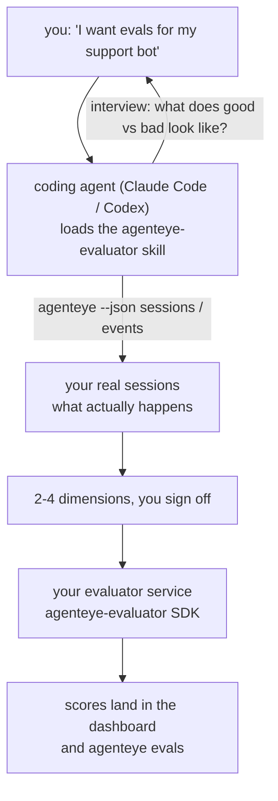

*"에이전트가 가끔 이상한 것 같아"*에서 배포된 스코어링 서비스까지, 코딩 에이전트가 설계와 구현을 모두 담당합니다. **Failproof AI Observability 평가자 스킬** (`agenteye-evaluator`)은 *에이전트 스킬*입니다. Claude Code나 Codex 같은 코딩 에이전트가 필요할 때 로드하는 소규모 지침 폴더로, 에이전트에게 *여러분의* 에이전트에 추적할 가치가 있는 품질 차원을 파악하고, 이를 점수화하는 [평가자 서비스](/ko/agenteye/evaluation-suite)를 작성·테스트·배포하는 방법을 가르칩니다.

이것은 호스팅된 스코어러, 업로드할 레지스트리, 또는 플러그인 시스템이 **아닙니다**. 평가자는 [Evaluation suite](/ko/agenteye/evaluation-suite) 가이드에 설명된 대로 여러분 자신의 인프라에서 운영하는 HTTP 서비스로 그대로 유지됩니다. 스킬은 에이전트가 잘 구축할 수 있도록 가르칠 뿐이므로, 에이전트가 하는 모든 작업은 직접 동일한 코드를 작성해서 구현할 수 있습니다.

---

## 어려운 부분은 무엇을 점수화할지 결정하는 것입니다

SDK 인터페이스는 작습니다 — 데코레이터 하나와 두 개의 모델 — 그리고 에이전트는 [계약](/ko/agenteye/evaluation-suite#http-contract)만으로도 이를 작성할 수 있습니다. 평가자가 실패하는 이유는 거기에 있지 않습니다. 잘못된 것을 점수화하기 때문에 실패하는 것이며, 잘못된 것을 점수화하는 평가자는 없는 것보다 나쁩니다. 모두가 무시하는 법을 배우는 대시보드만 생성하기 때문입니다.

따라서 스킬의 대부분은 코드가 존재하기 이전 단계에 해당합니다. 스킬은 에이전트가 여러분을 인터뷰하도록 합니다(*"잘 진행된 실행을 설명해주세요. 이제 잘못된 실행도요"*), 그리고 [`agenteye` CLI](/ko/agenteye/cli)를 통해 실제 세션을 가져와 처음부터 끝까지 읽습니다. 이 두 부분은 대개 일치하지 않으며, 그 차이가 핵심입니다. 측정하려는 의도와 실제 트랜스크립트로 지원할 수 있는 것의 차이입니다. 차원은 이벤트에서 **계산 가능**하고 **변별력**이 있을 때만 살아남습니다 — 좋은 실행과 나쁜 실행 모두에서 0.9를 기록한다면, 아무것도 알려주지 않으므로 제거됩니다.

반환되는 것은 코드 한 줄도 작성되기 전에 여러분이 승인해야 하는 근거가 첨부된 2-4개 차원의 제안입니다.



---

## 다른 평가 구성 요소와의 관계

점수화를 다루는 네 가지 문서가 있으며, 순서대로 서로 연결됩니다:

| 페이지 | 내용 | 적합한 상황 |
|---|---|---|
| **[Evaluations](/ko/agenteye/evaluations)** | 기능: 세션 그리드의 점수, 대시보드, 재평가 | 자동 점수화가 무엇을 제공하는지 알고 싶을 때 |
| **[Evaluation suite](/ko/agenteye/evaluation-suite)** | HTTP 계약, SDK, 서버 환경 변수 | 평가자를 직접 구현하거나 디버깅할 때 |
| **평가자 스킬** (이 문서) | 스코어러 설계 *및* 구축을 위한 자연어 진입점 | "평가를 원한다"에서 실행 중인 서비스까지 진행하고 싶을 때 |
| **[CLI 스킬](/ko/agenteye/cli-skill)** | `agenteye` CLI를 위한 자연어 진입점 | 이미 보유한 점수를 *읽고* 싶을 때 |
| **[Python SDK 스킬](/ko/agenteye/python-sdk-skill)** | 에이전트 계측을 위한 자연어 진입점 | 에이전트가 아직 세션을 내보내지 않아 점수화할 내용이 없을 때 |

### CLI 스킬과의 비교: 구축 vs. 읽기

두 스킬은 의도적으로 겹치지 않으며, 둘 다 설치하는 것이 일반적인 설정입니다 — 에이전트는 요청에 따라 어느 것을 사용할지 선택합니다:

- **`agenteye-evaluator`** (이 문서)는 점수를 *생성*하는 것을 구축합니다. 처음으로 점수가 확인되면 작업이 완료됩니다.
- **[`agenteye-cli`](/ko/agenteye/cli-skill)**는 이미 존재하는 점수를 읽습니다(`agenteye evals`). *"이번 주에 품질이 떨어졌나요?"*는 이 스킬의 질문이지, 여기서 다룰 질문이 아닙니다.

---

## 사전 요구 사항

1. **`agenteye` CLI 설치 및 로그인** (`pipx install agenteye`, 그런 다음 `agenteye login`). 스킬은 두 가지 목적으로 CLI를 활용합니다: 설계 기반이 되는 실제 세션 가져오기, 그리고 마지막에 점수가 확인되었는지 확인하기. 로그인에는 `events:read`와 최종 확인을 위한 `evaluations:read`가 필요합니다. CLI 스킬과 마찬가지로, 이메일로 전송된 일회성 코드 로그인은 **완료할 수 없습니다**.
2. **평가자가 실행될 공간.** 이미지로 빌드되어 장기 실행 서비스로 운영되므로 임시 파일이 아닌 실제 레포지토리가 필요합니다. 평가자는 종종 점수화되는 에이전트와는 별도의 자체 레포지토리에 있습니다 — 스킬은 기존 레포지토리를 찾고 새로 스캐폴딩하기 전에 물어봅니다.
3. **`agenteye-evaluator` SDK 휠** — 에이전트가 `pip` 명령을 입력하기 전에 다음 섹션을 읽으세요.

---

## 설치 위치

스킬은 Failproof AI의 공개 스킬 컬렉션에 게시되어 있습니다:

**[github.com/FailproofAI/skills](https://github.com/FailproofAI/skills)** → [`skills/agenteye-evaluator/`](https://github.com/FailproofAI/skills/tree/main/skills/agenteye-evaluator)

레포지토리는 공개되어 있으며 스킬은 자체 자격 증명이 필요 없습니다 — 여러분이 로그인한 세션으로 `agenteye` CLI를 실행하고 *여러분의* 레포지토리에 코드를 작성할 뿐입니다. 스킬은 자체 폴더로 제공되며 `pipx install agenteye` 패키지 **내부에 포함되어 있지 않으므로**, 거기서 찾지 마세요.

## 스킬 설치

가장 빠른 방법은 [`skills`](https://skills.sh) CLI를 사용하는 것으로, 폴더를 가져와 에이전트가 찾는 위치에 배치합니다:

```bash
# Claude Code, 이 프로젝트만
npx skills add FailproofAI/skills --skill agenteye-evaluator -a claude-code

# 모든 프로젝트 (~/.claude/skills/에 설치)
npx skills add FailproofAI/skills --skill agenteye-evaluator -a claude-code -g --copy

# Codex 사용 시
npx skills add FailproofAI/skills --skill agenteye-evaluator -a codex
```

그런 다음 다른 스킬과 마찬가지로 관리합니다:

```bash
npx skills list -a claude-code           # 설치된 항목 확인
npx skills update agenteye-evaluator     # 최신 버전 가져오기
npx skills remove agenteye-evaluator     # 제거
```

수동으로 설치하는 것을 선호하시나요? 에이전트 스킬은 `SKILL.md`(및 선택적 참조)가 포함된 폴더일 뿐이므로 복사해도 됩니다:

- **Claude Code**: `agenteye-evaluator/` 폴더를 `~/.claude/skills/`(모든 프로젝트) 또는 `<your-repo>/.claude/skills/`(해당 레포지토리만)에 배치합니다. Claude Code가 자동으로 검색합니다 — `/skills` 목록으로 확인하거나, 평가에 대해 물어보기만 하면 됩니다.
- **Codex (OpenAI)**: Codex는 동일한 `SKILL.md`를 읽습니다. 번들된 `agents/openai.yaml`이 `allow_implicit_invocation: true`로 설정되어 있어, 작업이 일치하면 Codex가 스킬을 자동으로 선택합니다. 그렇지 않으면 `$agenteye-evaluator`로 명시적으로 호출하세요.

---

## SDK는 공개 PyPI에 없습니다

> **경고:** 에이전트가 SDK를 설치하기 전에 이 내용을 읽으세요.

스킬은 공개되어 있지만, 스킬이 구동하는 SDK는 그렇지 않습니다. `agenteye-evaluator`는 비공개 릴리스 아티팩트로만 제공되며, `agenteye`와 달리 공개 PyPI에서 이름이 **미등록 상태**입니다 — 따라서 단순히 `pip install agenteye-evaluator`를 실행하면 프로덕션 트랜스크립트를 읽는 서비스에 낯선 패키지가 설치될 수 있습니다. 이는 오타가 아니라 공급망 문제입니다.

스킬은 이를 인지하고 있으며, 대신 설치 단계를 순서대로 시도하여 적용 가능한 첫 번째 단계에서 중단합니다: AgentEye 레포지토리 내부에 있다면 모노레포 소스를, 그렇지 않으면 GitHub Releases의 비공개 릴리스 휠(접근 권한 필요)을 시도하며, 어느 쪽도 접근 불가능하면 즉흥적으로 대처하는 대신 **Failproof AI 담당자에게 휠을 요청하라고 알려주고 중단합니다**.

따라서 에이전트가 공개 PyPI에서 단순히 `pip install agenteye-evaluator`를 제안한다면, 스킬이 로드되지 않았다는 신호입니다. 그 자리에서 멈추고 스킬 설치 여부를 확인하세요.

---

## 사용 가능한 요청

실제 진행 과정은 모호한 요청으로 시작해 코드가 아닌 승인된 설계로 끝납니다:

```text
you   ▸ I want evals for our support bot. I think it's sometimes bad.

agent ▸ Before I write anything: describe a run that went well,
        and one that went badly.

you   ▸ Good: it answers from the docs. Bad: it makes stuff up,
        or gives up and says "contact support".

agent ▸ Running: agenteye --json sessions --status error --since 7d
        Reading 5 sessions, including two you'd call bad.

        Your words say factuality and deflection. The transcripts
        agree on deflection (2 of 5 end with a support hand-off,
        and it's plain in model_response.content), but factuality
        needs a ground truth your events don't carry.

        So I'd score three things:
          - deflection      rules, cheap, separates your two runs
          - tool_efficiency rules, catches the retry loop in run-004
          - groundedness    LLM judge: is every claim in the docs it retrieved?

        "factuality" would need ground truth we don't have; groundedness
        is the closest thing your transcripts can actually support.
        OK with those three names? Renaming later splits the history.

you   ▸ yes

agent ▸ No evaluator in this repo. Should I scaffold one here, or do
        you have one elsewhere?
```

그 이후에는 규칙 기반 차원부터 작성합니다(무료, 즉각적, 결정론적). 충돌을 일으키는 빈 세션과 미완료 세션을 포함하여 실제 캡처된 세션을 대상으로 테스트하고, 주관적 차원에서만 LLM 판정자를 사용합니다. 스킬은 [디스패처의 제한](/ko/agenteye/evaluation-suite#configuring-the-server)을 알고 있습니다 — 30초 요청 타임아웃과 배포 전체 8개의 동시 호출 — 따라서 판정자가 안정적으로 맞지 않을 경우, 비용의 다섯 배로 취소되고 다섯 번 재시도되는 것을 방지하기 위해 `JobPending`을 사용하여 비동기로 처리합니다.

그런 다음 배포하고, 두 개의 서버 환경 변수를 설정하고, `agenteye --json evals --session-id <id>`로 점수가 실제로 확인되었는지 확인합니다. 점수가 확인되는 것이 유일한 증거입니다.

---

## 주의할 사항

- **차원 이름은 거의 영구적입니다.** 점수 키는 임의의 문자열이며 플랫폼은 전송하는 모든 것을 추적합니다. 즉, 다운스트림에서 잘못된 선택을 수정하지 않습니다. 나중에 이름을 바꾸면 기록이 분리됩니다: 이전 세션은 이전 키를 유지하고 추세가 깨집니다. 이것이 스킬이 코드 작성 전에 명시적인 승인을 받는 이유입니다 — 해당 프롬프트를 진지하게 받아들이세요.
- **픽스처는 실제 프로덕션 트랜스크립트입니다.** 실제 세션을 기반으로 설계하면 디스크로 가져오게 되며, 고객 데이터가 포함될 수 있습니다. 스킬은 git에 커밋하기 전에 물어봅니다; 확실하지 않은 경우 `fixtures/`를 레포지토리 밖에 두고 각 개발자가 직접 가져오도록 하세요.
- **에이전트는 모든 트랜스크립트를 읽는 서비스를 작성하고 배포합니다.** CLI 로그인 권한 범위 내에서 여러분을 대신해 작동하지만, 프로덕션 데이터에 접근하는 다른 코드와 마찬가지로 평가자를 검토하세요.

---

## 다음 단계

- **[Evaluation suite](/ko/agenteye/evaluation-suite)**: 스킬이 구성하는 HTTP 계약, SDK, 서버 환경 변수.
- **[Evaluations](/ko/agenteye/evaluations)**: 점수가 확인된 후 표시되는 위치.
- **[CLI 스킬](/ko/agenteye/cli-skill)**: 스코어러를 구축하는 대신 결과를 읽기 위한 형제 스킬.
- **[CLI](/ko/agenteye/cli)**: 스킬이 설계 기반으로 삼는 세션 데이터 뒤의 명령어 참조.