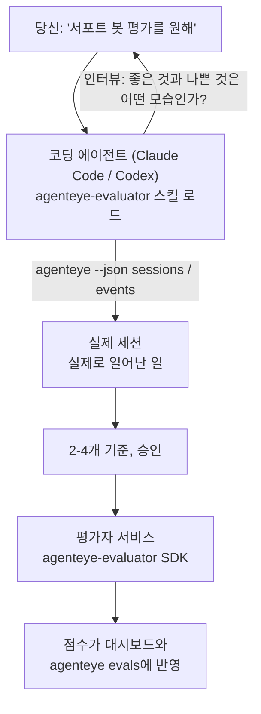

코딩 에이전트가 설계와 구현을 모두 담당하여 *"에이전트가 가끔 이상한 것 같다"*는 막연한 의심을 배포된 스코어링 서비스로 전환합니다. **Failproof AI Observability 평가자 스킬** (`agenteye-evaluator`)은 *에이전트 스킬*입니다. Claude Code나 Codex 같은 코딩 에이전트가 필요할 때 불러오는 소규모 명령 폴더로, 에이전트가 *여러분의* 에이전트에서 추적할 만한 품질 기준을 스스로 파악하고, 그 기준을 점수로 매기는 [평가자 서비스](/ko/agenteye/evaluation-suite)를 작성·테스트·배포하도록 가르칩니다.

이 스킬은 호스팅된 스코어러도, 업로드 레지스트리도, 플러그인 시스템도 **아닙니다**. [평가 스위트](/ko/agenteye/evaluation-suite) 가이드에서 설명하는 것처럼 평가자는 여러분 자신의 인프라에서 실행되는 HTTP 서비스로 온전히 여러분의 것입니다. 스킬은 단지 에이전트가 그것을 잘 구축하도록 가르칠 뿐이므로, 에이전트가 하는 모든 것은 여러분이 직접 같은 코드를 작성해도 할 수 있습니다.

---

## 가장 어려운 부분은 무엇을 점수로 매길지 결정하는 것입니다

SDK 인터페이스는 작습니다 — 데코레이터 하나와 두 개의 모델 — 그리고 에이전트는 [계약](/ko/agenteye/evaluation-suite#http-contract)만으로도 이를 작성할 수 있습니다. 문제는 거기에 있지 않습니다. 평가자는 잘못된 것을 측정할 때 실패하며, 잘못된 것을 측정하는 평가자는 없는 것보다 나쁩니다. 모두가 무시하게 되는 대시보드만 만들어냅니다.

그래서 스킬의 대부분은 코드가 작성되기 전 단계에 집중합니다. 스킬은 에이전트가 여러분을 인터뷰하도록 합니다(*"잘 된 실행을 설명해주세요; 이번엔 잘못된 것도요"*), 그런 다음 [`agenteye` CLI](/ko/agenteye/cli)를 통해 실제 세션을 가져와 처음부터 끝까지 읽습니다. 이 두 부분은 대개 일치하지 않으며, 그 간극이 핵심입니다. 즉, 여러분이 측정하려는 것과 실제 트랜스크립트가 지원할 수 있는 것 사이의 차이입니다. 이벤트에서 **계산 가능**하고 **변별력**이 있을 때만 기준이 살아남습니다 — 좋은 실행과 나쁜 실행 모두에서 0.9를 기록한다면 아무것도 알려주지 못하므로 제거됩니다.

결과물은 코드 한 줄 작성 전에 여러분이 승인할 수 있도록, 근거가 첨부된 2-4개 기준의 제안서입니다.



---

## 다른 평가 구성 요소와의 관계

점수화를 다루는 네 개의 문서가 있으며, 순서대로 연결됩니다:

| 페이지 | 내용 | 참고 시점 |
|---|---|---|
| **[평가](/ko/agenteye/evaluations)** | 기능: 세션 그리드의 점수, 대시보드, 재평가 | 자동 점수화로 얻을 수 있는 것을 알고 싶을 때 |
| **[평가 스위트](/ko/agenteye/evaluation-suite)** | HTTP 계약, SDK, 서버 환경 변수 | 직접 평가자를 구현하거나 디버깅할 때 |
| **평가자 스킬** (이 문서) | 스코어러 설계 *및* 구축을 위한 자연어 진입점 | "평가를 원한다"에서 실행 중인 서비스까지 가고 싶을 때 |
| **[CLI 스킬](/ko/agenteye/cli-skill)** | `agenteye` CLI를 위한 자연어 진입점 | 이미 보유한 점수를 *읽고* 싶을 때 |
| **[Python SDK 스킬](/ko/agenteye/python-sdk-skill)** | 에이전트 계측을 위한 자연어 진입점 | 에이전트가 아직 세션을 내보내지 않아 점수화할 대상이 없을 때 |

### CLI 스킬과의 차이: 구축 vs 읽기

두 스킬은 의도적으로 겹치지 않으며, 둘 다 설치하는 것이 일반적인 설정입니다 — 에이전트는 요청 내용에 따라 적절한 스킬을 선택합니다:

- **`agenteye-evaluator`** (이 문서)는 점수를 *생성*하는 것을 구축합니다. 처음으로 점수가 반영될 때 역할이 끝납니다.
- **[`agenteye-cli`](/ko/agenteye/cli-skill)**는 이미 존재하는 점수를 읽습니다(`agenteye evals`). *"이번 주에 품질이 떨어졌나요?"*가 이 스킬의 질문이지, 이 스킬의 질문이 아닙니다.

---

## 사전 요건

1. **`agenteye` CLI 설치 및 로그인** (`pipx install agenteye`, 그런 다음 `agenteye login`). 스킬은 두 가지 용도로 이를 활용합니다: 설계 기반이 되는 실제 세션을 가져오고, 마지막에 점수가 반영됐는지 확인합니다. 로그인에는 `events:read` 권한이 필요하며, 최종 확인을 위해 `evaluations:read`도 필요합니다. CLI 스킬과 마찬가지로, 이메일 일회용 코드 로그인은 **완료할 수 없습니다**.
2. **평가자가 실행될 공간.** 평가자는 이미지로 빌드되어 장기 실행 서비스로 실행되므로, 임시 파일이 아닌 실제 레포지토리가 필요합니다. 평가자는 채점 대상 에이전트와 별도의 레포지토리에 두는 경우가 많습니다 — 스킬은 기존 레포지토리를 찾아보고 새로 생성하기 전에 물어봅니다.
3. **`agenteye-evaluator` SDK 휠** — 에이전트가 `pip` 명령을 입력하기 전에 다음 섹션을 먼저 읽어보세요.

---

## 스킬 가져오기

스킬은 Failproof AI의 공개 스킬 컬렉션에 게시되어 있습니다:

**[github.com/FailproofAI/skills](https://github.com/FailproofAI/skills)** → [`skills/agenteye-evaluator/`](https://github.com/FailproofAI/skills/tree/main/skills/agenteye-evaluator)

레포지토리는 공개이며 스킬 자체에는 별도의 자격 증명이 필요하지 않습니다 — 여러분이 로그인한 `agenteye` CLI를 통해 세션을 가져오고, *여러분의* 레포지토리에 코드를 작성할 뿐입니다. 이 스킬은 별도 폴더로 제공되며 `pipx install agenteye` 패키지 안에 **포함되어 있지 않으니** 그곳에서 찾지 마세요.

## 스킬 설치

가장 빠른 방법은 [`skills`](https://skills.sh) CLI를 사용하는 것입니다. 폴더를 가져와 에이전트가 찾는 위치에 배치해줍니다:

```bash
# Claude Code, 이 프로젝트에만
npx skills add FailproofAI/skills --skill agenteye-evaluator -a claude-code

# 모든 프로젝트 (~/.claude/skills/에 설치)
npx skills add FailproofAI/skills --skill agenteye-evaluator -a claude-code -g --copy

# Codex 사용 시
npx skills add FailproofAI/skills --skill agenteye-evaluator -a codex
```

그런 다음 다른 스킬과 동일하게 관리합니다:

```bash
npx skills list -a claude-code           # 설치된 스킬 확인
npx skills update agenteye-evaluator     # 최신 버전으로 업데이트
npx skills remove agenteye-evaluator     # 제거
```

직접 설치하는 것을 선호한다면, 에이전트 스킬은 `SKILL.md`(및 선택적 참조 파일)가 포함된 폴더일 뿐이므로 복사해도 됩니다:

- **Claude Code**: `agenteye-evaluator/` 폴더를 `~/.claude/skills/`(모든 프로젝트) 또는 `<your-repo>/.claude/skills/`(해당 레포지토리만)에 넣습니다. Claude Code가 자동으로 감지합니다 — `/skills` 목록으로 확인하거나, 그냥 평가를 요청해보세요.
- **Codex (OpenAI)**: Codex는 동일한 `SKILL.md`를 읽습니다. 번들된 `agents/openai.yaml`은 `allow_implicit_invocation: true`로 설정되어 있어, 작업이 일치하면 Codex가 자동으로 스킬을 선택합니다; 그렇지 않으면 `$agenteye-evaluator`로 명시적으로 호출하세요.

---

## SDK는 공개 PyPI에 없습니다

> **경고:** 에이전트가 SDK를 설치하기 전에 먼저 읽어보세요.

스킬은 공개되어 있지만, 스킬이 구동하는 SDK는 그렇지 않습니다. `agenteye-evaluator`는 비공개 릴리스 아티팩트로만 제공되며, `agenteye`와 달리 공개 PyPI에서 이름이 **등록되지 않았습니다** — 따라서 `pip install agenteye-evaluator`를 그냥 실행하면 프로덕션 트랜스크립트를 읽는 서비스에 출처 불명의 패키지가 설치될 수 있습니다. 이것은 오타가 아니라 공급망 보안 문제입니다.

스킬은 이를 인지하고 있으며, 대신 설치 우선순위를 단계적으로 시도합니다. 첫 번째로 적용 가능한 단계에서 멈춥니다: AgentEye 레포지토리 내부라면 모노레포 소스, 그렇지 않으면 GitHub Releases의 비공개 릴리스 휠(접근 권한 필요), 둘 다 접근할 수 없으면 즉흥적으로 처리하는 대신 **Failproof AI 담당자에게 휠을 요청하라고 알려줍니다**.

따라서 에이전트가 공개 PyPI에서 `pip install agenteye-evaluator`를 제안한다면, 스킬이 로드되지 않았다는 신호입니다. 즉시 멈추고 스킬이 제대로 설치되어 있는지 확인하세요.

---

## 요청할 수 있는 것들

실제 진행 과정은 막연한 요청으로 시작해 코드가 아닌 승인된 설계로 끝납니다:

```text
당신   ▸ 서포트 봇 평가를 원해. 가끔 이상한 것 같아.

에이전트 ▸ 코드를 작성하기 전에: 잘 된 실행을 설명해주세요,
           그리고 잘못된 것도 하나요.

당신   ▸ 좋은 것: 문서에서 답변해. 나쁜 것: 내용을 지어내거나,
         포기하고 "지원팀에 연락하세요"라고 해.

에이전트 ▸ 실행 중: agenteye --json sessions --status error --since 7d
           5개 세션 읽는 중, 나쁘다고 할 두 개 포함.

           말씀하신 내용은 사실성과 회피입니다. 트랜스크립트는
           회피에 대해 동의하지만 (5개 중 2개가 지원 이관으로 끝나며,
           model_response.content에서 명확히 확인됨), 사실성은
           이벤트에 없는 정답 데이터가 필요합니다.

           따라서 세 가지를 측정하겠습니다:
             - deflection      규칙 기반, 저비용, 두 실행을 구분
             - tool_efficiency 규칙 기반, run-004의 재시도 루프 포착
             - groundedness    LLM 판단: 검색된 문서에 모든 주장이 있는가?

           "factuality"는 없는 정답 데이터가 필요하고, groundedness가
           트랜스크립트로 실제 지원 가능한 가장 가까운 대안입니다.
           이 세 이름으로 진행해도 될까요? 나중에 이름을 바꾸면 기록이 분리됩니다.

당신   ▸ 좋아

에이전트 ▸ 이 레포지토리에 평가자가 없습니다. 여기에 만들까요, 아니면
           다른 곳에 있나요?
```

이후 규칙 기반 기준부터 먼저 작성합니다(무료, 즉각적, 결정론적). 그런 다음 빈 세션이나 완료되지 않은 세션처럼 단순한 평가자를 충돌시키는 케이스를 포함한 실제 캡처 세션에 대해 테스트합니다. 주관적 기준에만 LLM 판단을 사용합니다. 스킬은 [디스패처의 제한](/ko/agenteye/evaluation-suite#configuring-the-server) — 요청 타임아웃 30초, 배포 전체에서 동시 호출 8개 — 을 인지하고 있어, 판단이 안정적으로 맞지 않을 것 같으면 5배의 비용이 드는 취소·재시도 대신 `JobPending`으로 비동기 처리합니다.

그런 다음 배포하고, 두 개의 서버 환경 변수를 설정하고, `agenteye --json evals --session-id <id>`로 점수가 실제로 반영됐는지 확인합니다. 점수가 반영되는 것만이 유일한 증거입니다.

---

## 주의해야 할 사항

- **기준 이름은 거의 영구적입니다.** 점수 키는 임의의 문자열이고 플랫폼은 전송된 것을 무엇이든 트렌드로 표시합니다. 즉, 잘못된 선택을 교정해주는 하위 시스템이 없습니다. 나중에 이름을 바꾸면 기록이 분리됩니다: 이전 세션은 이전 키를 유지하고 트렌드가 끊깁니다. 이것이 스킬이 코드 작성 전에 명시적 승인을 받는 이유입니다 — 그 프롬프트를 진지하게 받아들이세요.
- **픽스처는 실제 프로덕션 트랜스크립트입니다.** 실제 세션을 기반으로 설계한다는 것은 디스크에 저장한다는 의미이며, 고객 데이터가 포함될 수 있습니다. 스킬은 git에 커밋하기 전에 확인을 요청합니다; 확신이 없다면 `fixtures/`를 레포지토리에서 제외하고 각 개발자가 직접 가져오도록 하세요.
- **에이전트는 모든 트랜스크립트를 읽는 서비스를 작성하고 배포합니다.** CLI 로그인 권한 범위 내에서 여러분을 대신해 작동하지만, 프로덕션 데이터를 다루는 다른 코드와 마찬가지로 평가자를 검토하세요.

---

## 다음 단계

- **[평가 스위트](/ko/agenteye/evaluation-suite)**: 스킬이 구성하는 HTTP 계약, SDK, 서버 환경 변수.
- **[평가](/ko/agenteye/evaluations)**: 점수가 반영된 후 표시되는 위치.
- **[CLI 스킬](/ko/agenteye/cli-skill)**: 스코어러를 구축하는 것이 아닌 결과를 읽기 위한 형제 스킬.
- **[CLI](/ko/agenteye/cli)**: 스킬이 기반으로 설계하는 세션 데이터의 명령어 참조.