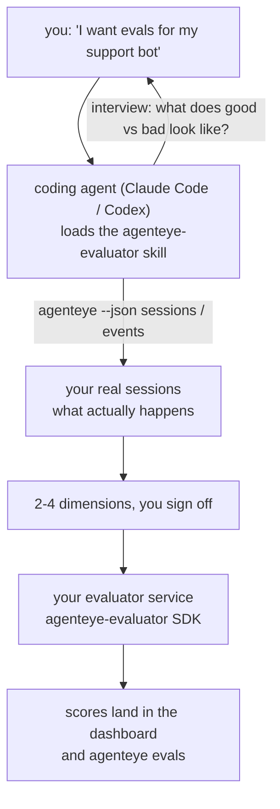

*"우리 에이전트가 가끔 이상한 것 같아"*에서 배포된 채점 서비스까지, 코딩 에이전트가 설계와 구축을 모두 담당합니다. **Failproof AI Observability 평가자 스킬** (`agenteye-evaluator`)은 *에이전트 스킬*입니다. Claude Code나 Codex 같은 코딩 에이전트가 필요할 때 불러오는 소규모 명령어 폴더로, 에이전트에게 *여러분의* 에이전트에서 추적할 만한 품질 지표를 파악하고, [평가자 서비스](/ko/agenteye/evaluation-suite)를 작성·테스트·배포하는 방법을 가르쳐줍니다.

이 스킬은 호스팅된 채점기, 업로드하는 레지스트리, 또는 플러그인 시스템이 **아닙니다**. 여러분의 평가자는 [Evaluation suite](/ko/agenteye/evaluation-suite) 가이드에 설명된 대로 여러분만의 인프라 위에서 동작하는 HTTP 서비스로 유지됩니다. 이 스킬은 에이전트가 잘 구축할 수 있도록 가르쳐줄 뿐이므로, 에이전트가 하는 모든 작업은 여러분이 직접 같은 코드를 작성해도 할 수 있습니다.

---

## 어려운 부분은 무엇을 점수화할지 결정하는 것

SDK 인터페이스는 작습니다 — 데코레이터 하나와 모델 두 개 — 에이전트는 [계약](/ko/agenteye/evaluation-suite#http-contract)만으로도 이를 작성할 수 있습니다. 평가자가 실패하는 이유는 여기에 있지 않습니다. 잘못된 항목을 점수화하기 때문에 실패하며, 잘못된 항목을 점수화하는 평가자는 없는 것보다 오히려 나쁩니다. 모두가 무시하는 법을 배운 대시보드만 만들어낼 뿐이니까요.

그래서 스킬의 대부분은 코드가 존재하기 이전 단계에 해당합니다. 에이전트가 여러분을 인터뷰하고(*"잘 된 실행을 설명해주세요. 이번엔 잘 안 된 것도요"*), [`agenteye` CLI](/ko/agenteye/cli)를 통해 실제 세션을 불러와 처음부터 끝까지 읽습니다. 이 두 가지는 보통 일치하지 않으며, 그 간극이 핵심입니다. 여러분이 측정하려는 것과 트랜스크립트가 실제로 지원할 수 있는 것 사이의 차이죠. 지표는 이벤트에서 **계산 가능**하고 **변별력**이 있을 때만 살아남습니다 — 좋은 실행과 나쁜 실행 모두에서 0.9를 기록한다면, 아무것도 알려주지 못하므로 제거됩니다.

결과물은 2~4개의 지표와 그 근거를 담은 제안서로, 한 줄의 코드가 작성되기 전에 여러분이 승인해야 합니다.



---

## 다른 평가 구성요소와의 관계

채점과 관련된 문서는 네 가지이며, 순서대로 서로를 이어줍니다:

| 페이지 | 내용 | 참고 시점 |
|---|---|---|
| **[Evaluations](/ko/agenteye/evaluations)** | 기능: 세션 그리드의 점수, 대시보드, 재평가 | 자동 채점이 무엇을 제공하는지 알고 싶을 때 |
| **[Evaluation suite](/ko/agenteye/evaluation-suite)** | HTTP 계약, SDK, 서버 환경 변수 | 평가자를 직접 구현하거나 디버깅할 때 |
| **평가자 스킬** (이 문서) | 채점기 설계 *및* 구축을 위한 자연어 진입점 | "평가가 필요해"에서 실행 중인 서비스까지 가고 싶을 때 |
| **[CLI skill](/ko/agenteye/cli-skill)** | `agenteye` CLI에 대한 자연어 진입점 | 이미 보유한 점수를 *읽고* 싶을 때 |
| **[Python SDK skill](/ko/agenteye/python-sdk-skill)** | 에이전트 계측에 대한 자연어 진입점 | 에이전트가 아직 세션을 내보내지 않아 점수화할 대상이 없을 때 |

### vs. CLI 스킬: 구축 대 읽기

두 스킬은 의도적으로 겹치지 않으며, 둘 다 설치하는 것이 일반적인 설정입니다 — 에이전트는 여러분이 무엇을 요청하느냐에 따라 둘 중 하나를 선택합니다:

- **`agenteye-evaluator`** (이 문서)는 점수를 *생성*하는 것을 구축합니다. 처음으로 점수가 기록되면 역할이 끝납니다.
- **[`agenteye-cli`](/ko/agenteye/cli-skill)**는 이미 존재하는 점수를 읽습니다 (`agenteye evals`). *"이번 주에 품질이 떨어졌나요?"*는 이 스킬의 질문이지, 평가자 스킬의 질문이 아닙니다.

---

## 사전 요구사항

1. **`agenteye` CLI가 설치되어 있고 로그인되어 있어야 합니다** (`pipx install agenteye`, 이후 `agenteye login`). 이 스킬은 두 가지 용도로 CLI를 활용합니다: 설계 기반이 될 실제 세션을 불러오는 것과, 마지막에 점수가 기록되었는지 확인하는 것. 로그인 계정에는 `events:read` 권한이 필요하며, 최종 확인을 위해 `evaluations:read`도 필요합니다. CLI 스킬과 마찬가지로, 이메일로 전송되는 일회성 코드 로그인을 대신 완료해줄 수는 **없습니다**.
2. **평가자를 배치할 공간이 필요합니다.** 이미지로 빌드되어 장기 실행 서비스로 동작해야 하므로, 임시 파일이 아닌 실제 저장소가 필요합니다. 평가자는 채점 대상 에이전트와 별도의 저장소에 두는 경우가 많습니다 — 스킬은 기존 저장소를 먼저 찾아보고, 새로 생성하기 전에 먼저 물어봅니다.
3. **`agenteye-evaluator` SDK 휠** — 에이전트가 `pip` 명령을 입력하기 전에 다음 섹션을 먼저 읽어보세요.

---

## 어디서 구하나요

이 스킬은 Failproof AI의 공개 스킬 컬렉션에 게시되어 있습니다:

**[github.com/FailproofAI/skills](https://github.com/FailproofAI/skills)** → [`skills/agenteye-evaluator/`](https://github.com/FailproofAI/skills/tree/main/skills/agenteye-evaluator)

저장소는 공개되어 있으며 스킬 자체는 별도의 자격증명이 필요하지 않습니다 — 여러분이 로그인한 `agenteye` CLI만 사용하고, *여러분의* 저장소에 코드를 작성합니다. 이 스킬은 별도 폴더로 제공되며 `pipx install agenteye` 패키지 안에 포함되어 있지 **않으므로**, 거기서 찾지 마세요.

## 스킬 설치

가장 빠른 방법은 [`skills`](https://skills.sh) CLI로, 폴더를 가져와 에이전트가 찾는 위치에 저장합니다:

```bash
# Claude Code, 이 프로젝트만
npx skills add FailproofAI/skills --skill agenteye-evaluator -a claude-code

# 모든 프로젝트 (~/.claude/skills/에 설치)
npx skills add FailproofAI/skills --skill agenteye-evaluator -a claude-code -g --copy

# Codex 사용 시
npx skills add FailproofAI/skills --skill agenteye-evaluator -a codex
```

이후 다른 스킬과 동일하게 관리합니다:

```bash
npx skills list -a claude-code           # 설치된 목록 확인
npx skills update agenteye-evaluator     # 최신 버전으로 업데이트
npx skills remove agenteye-evaluator     # 제거
```

직접 설치를 원하시나요? 에이전트 스킬은 `SKILL.md`(및 선택적 참조 파일)를 포함한 폴더일 뿐이므로, 복사해도 됩니다:

- **Claude Code**: `agenteye-evaluator/` 폴더를 `~/.claude/skills/`(모든 프로젝트) 또는 `<your-repo>/.claude/skills/`(해당 저장소만)에 넣으세요. Claude Code가 자동으로 인식합니다 — `/skills` 목록으로 확인하거나, 평가를 요청해보세요.
- **Codex (OpenAI)**: Codex는 동일한 `SKILL.md`를 읽습니다. 번들로 제공되는 `agents/openai.yaml`에는 `allow_implicit_invocation: true`가 설정되어 있어 작업이 일치할 때 Codex가 자동으로 스킬을 선택합니다. 직접 호출하려면 `$agenteye-evaluator`를 사용하세요.

---

## SDK는 공개 PyPI에 없습니다

> **경고:** 에이전트가 SDK를 설치하도록 허용하기 전에 이 내용을 읽어보세요.

스킬은 공개되어 있지만, 스킬이 사용하는 SDK는 그렇지 않습니다. `agenteye-evaluator`는 비공개 릴리스 아티팩트로만 제공되며, `agenteye`와 달리 공개 PyPI에서 해당 이름이 **등록되지 않은 상태**입니다 — 따라서 단순히 `pip install agenteye-evaluator`를 실행하면 여러분의 프로덕션 트랜스크립트를 읽는 서비스에 낯선 패키지가 설치될 수 있습니다. 이는 오타가 아닌 공급망 보안 문제입니다.

스킬은 이를 인지하고 있으며, 순서대로 설치 방법을 시도합니다: AgentEye 저장소 내부라면 모노레포 소스를, 그렇지 않으면 GitHub Releases의 비공개 릴리스 휠(접근 권한 필요)을 시도하고, 둘 다 접근할 수 없으면 임기응변 대신 **Failproof AI 담당자에게 휠을 요청하라는 안내를 제공하고 중단**합니다.

에이전트가 공개 PyPI에서 단순히 `pip install agenteye-evaluator`를 제안한다면, 스킬이 로드되지 않았다는 신호입니다. 그 자리에서 멈추고 설치 여부를 확인하세요.

---

## 무엇을 요청할 수 있나요

실제 진행 과정은 막연한 요청으로 시작해 코드가 아닌 승인된 설계로 끝납니다:

```text
you   ▸ I want evals for our support bot. I think it's sometimes bad.

agent ▸ Before I write anything: describe a run that went well,
        and one that went badly.

you   ▸ Good: it answers from the docs. Bad: it makes stuff up,
        or gives up and says "contact support".

agent ▸ Running: agenteye --json sessions --status error --since 7d
        Reading 5 sessions, including two you'd call bad.

        Your words say factuality and deflection. The transcripts
        agree on deflection (2 of 5 end with a support hand-off,
        and it's plain in model_response.content), but factuality
        needs a ground truth your events don't carry.

        So I'd score three things:
          - deflection      rules, cheap, separates your two runs
          - tool_efficiency rules, catches the retry loop in run-004
          - groundedness    LLM judge: is every claim in the docs it retrieved?

        "factuality" would need ground truth we don't have; groundedness
        is the closest thing your transcripts can actually support.
        OK with those three names? Renaming later splits the history.

you   ▸ yes

agent ▸ No evaluator in this repo. Should I scaffold one here, or do
        you have one elsewhere?
```

그 이후, 규칙 기반 지표를 먼저 작성합니다(무료, 즉각적, 결정론적). 그리고 빈 세션이나 완료되지 않은 세션처럼 단순한 평가자를 망가뜨리는 케이스를 포함한 실제 캡처된 세션으로 테스트합니다. 주관적인 지표에만 LLM 심사자를 활용합니다. [디스패처의 한계](/ko/agenteye/evaluation-suite#configuring-the-server) — 30초 요청 타임아웃과 배포 전체에 걸친 8개의 동시 호출 — 를 알고 있으므로, 심사자가 시간 내에 완료되기 어렵다면 5배의 비용으로 취소와 재시도가 반복되는 대신 `JobPending`으로 비동기 처리합니다.

이후 배포하고, 두 개의 서버 환경 변수를 설정하며, `agenteye --json evals --session-id <id>`로 점수가 실제로 기록되었는지 확인합니다. 점수 기록이 유일한 증거입니다.

---

## 주의해야 할 사항

- **지표 이름은 사실상 영구적입니다.** 점수 키는 임의의 문자열이고 플랫폼은 전송된 모든 것을 추세로 표시합니다. 즉, 다운스트림에서 잘못된 선택을 수정해주지 않습니다. 나중에 이름을 변경하면 기록이 분리됩니다: 이전 세션은 이전 키를 유지하고 추세가 끊어집니다. 스킬이 코드를 작성하기 전에 명시적인 승인을 받는 이유입니다 — 그 요청을 진지하게 받아들이세요.
- **픽스처는 실제 프로덕션 트랜스크립트입니다.** 실제 세션을 기반으로 설계한다는 것은 디스크에 저장함을 의미하며, 여기에는 고객 데이터가 포함될 수 있습니다. 스킬은 git에 커밋하기 전에 먼저 물어봅니다. 확실하지 않다면 `fixtures/`를 저장소에서 제외하고 각 개발자가 직접 불러오도록 하세요.
- **에이전트는 모든 트랜스크립트를 읽는 서비스를 작성하고 배포합니다.** CLI 로그인 권한 범위 내에서 여러분을 대신해 동작하지만, 프로덕션 데이터를 다루는 모든 코드와 동일하게 평가자를 검토하세요.

---

## 다음 단계

- **[Evaluation suite](/ko/agenteye/evaluation-suite)**: 스킬이 구성하는 HTTP 계약, SDK, 서버 환경 변수.
- **[Evaluations](/ko/agenteye/evaluations)**: 점수가 기록된 후 표시되는 위치.
- **[CLI skill](/ko/agenteye/cli-skill)**: 채점기를 구축하는 대신 결과를 읽기 위한 보조 스킬.
- **[CLI](/ko/agenteye/cli)**: 스킬이 설계 기반으로 삼는 세션 데이터의 명령어 참고 자료.