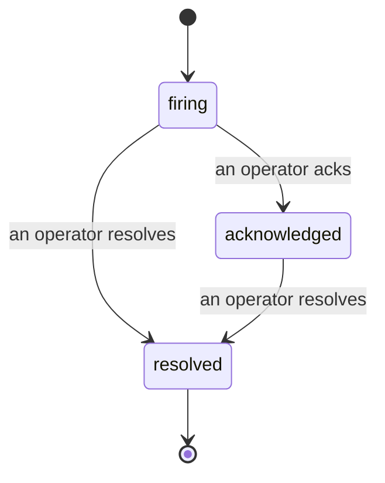

알림이 발생했을 때 가장 먼저 드는 질문은 항상 "누가 처리하고 있나요?"입니다. 인시던트가 이 질문에 답합니다. 임계값이 초과되는 순간, 모든 팀원이 인시던트가 열려 있는지, 누가 담당하고 있는지, 지금까지 정확히 무슨 일이 있었는지를 확인할 수 있으며, 사후 검토(post-mortem)에 바로 활용할 수 있는 명확하고 귀속된 기록을 남깁니다.

*인박스는 열린 인시던트를 상태별로 그룹화하고 심각도와 담당자로 필터링하여, 지금 당장 사람이 처리해야 할 항목을 바로 확인할 수 있게 합니다.*

## 한눈에 담당자 파악

채팅 스레드에서 "누가 보고 있나요?"를 물을 필요가 없습니다. 임계값 초과 시 인시던트가 자동으로 열리고 공유 인박스에 상태별로 그룹화되어 나타납니다. 인시던트를 확인(acknowledge)하면 여러분의 이름이 표시되어 나머지 팀원들이 처리 중임을 알 수 있습니다. 확인은 공유됩니다. 여러 운영자가 동일한 인시던트를 확인할 수 있으며 각각의 기록이 남기 때문에, 전체 대응 팀이 서로 겹치지 않고 이름으로 표시됩니다. 한 명의 담당자를 트리아지에 배정하고, 심각도나 담당자로 인박스를 필터링하여 자신의 항목만 볼 수 있습니다.

## 하나의 타임라인에서 전체 경위 파악

인시던트가 종료되면 이미 보고서가 작성되어 있습니다. 인시던트를 열면 임계값 초과 증거, 담당자 및 구독자, 협업을 위한 댓글 스레드, 그리고 추가만 가능한 활동 타임라인을 확인할 수 있습니다.

*발생한 모든 일이 순서대로 기록되며, 각 항목에는 누가 수행했는지가 명시됩니다.*

모든 동작(열림, 확인, 해결 등)은 해당 타임라인에 기록되며 절대 수정되지 않습니다. 각 항목은 귀속됩니다. 작업을 수행한 운영자의 이메일로 귀속되거나, 임계값 초과 시 인시던트를 자동으로 열거나 하는 등 Failproof AI Observability가 자체적으로 수행한 작업에는 **automated**로 표시됩니다. 익명 항목도 없고 누락된 항목도 없기 때문에, 사후 검토 보고서가 거의 자동으로 작성됩니다.

## 인시던트 진행 방식

- **열림 (firing):** 임계값 초과 시 인시던트가 열리고 채널에 한 번 알림을 보냅니다. 반복적인 임계값 초과는 동일한 인시던트에 통합되어 증거를 갱신하며, 반복적으로 알림을 보내지 않습니다.
- **확인됨 (acknowledged):** 운영자가 인시던트를 맡습니다. 인시던트는 열린 상태를 유지하며, 이후 임계값 초과가 발생해도 증거만 조용히 업데이트됩니다.
- **해결됨 (resolved):** 운영자가 인시던트를 종료합니다. 조건이 해소될 때 자동으로 해결되는 기능은 계획 중이나 아직 활성화되지 않았습니다. 따라서 인시던트는 사람이 직접 해결할 때까지 열린 상태로 유지되며, 이를 통해 실제로 해소된 것에 대해 투명성을 유지합니다. 나중에 동일한 알림으로 새 인시던트가 열릴 수 있습니다.

하나의 알림에는 동시에 열린 인시던트가 최대 하나만 존재하므로, 불안정하게 반복되는 규칙으로 인해 중복 인시던트가 쌓이지 않습니다. `incidents:write` 권한이 있다면 인시던트를 수동으로 열 수도 있습니다. 어떤 알림에도 연결되지 않은 독립 인시던트이거나, 기존 알림에 연결된 인시던트일 수 있습니다.

## 위치

인시던트는 `/<org-slug>/incidents`에 있습니다. 조회에는 **`incidents:read`** 권한이 필요하고, 수동 인시던트 열기에는 **`incidents:write`** 권한이 필요하며, 확인, 배정, 댓글 작성, 해결에는 **`incidents:ack`** 권한이 필요합니다. 이전에 폐기된 `alerts:ack` 권한을 부여받은 키는 `incidents:ack`로 인정되므로 계속 작동합니다. 따라서 온콜 로테이션을 다시 설정할 필요가 없습니다.

## 관련 항목

- [알림](/ko/agenteye/alerts): 임계값 초과 시 인시던트를 여는 규칙입니다.
- [오류 추적](/ko/agenteye/error-tracking): 모든 장애를 한곳에서 확인하고 하나를 알림으로 승격합니다.
- [감사](/ko/agenteye/audits): 어떤 규칙도 감시하지 않던 장애를 찾아내는 예약된 분석기입니다.