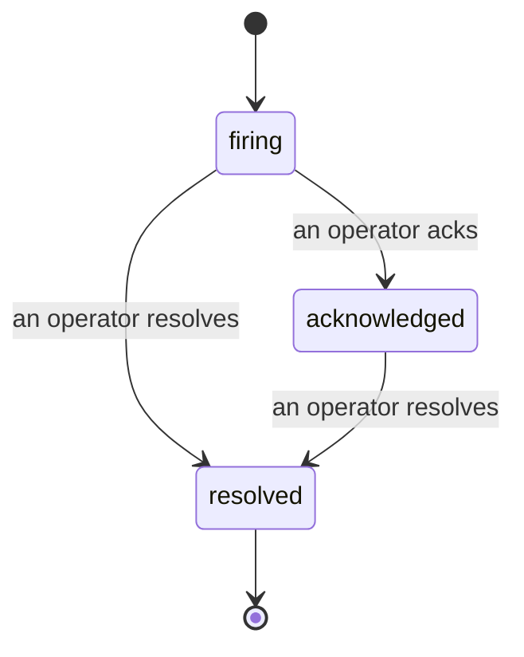

알림이 발생하면 가장 먼저 드는 질문은 항상 "누가 보고 있지?"입니다. 인시던트가 그 답을 줍니다. 임계값이 위반되는 순간, 모든 팀원이 인시던트가 열려 있는지, 담당자가 누구인지, 지금까지 정확히 어떤 일이 일어났는지 확인할 수 있습니다. 사후 분석(post-mortem)에 바로 활용할 수 있는 깔끔한 기록도 함께 남습니다.

*인박스는 열린 인시던트를 상태별로 그룹화하고, 심각도와 담당자로 필터링할 수 있어 지금 당장 사람이 처리해야 할 항목을 바로 확인할 수 있습니다.*

## 담당자를 한눈에 파악하기

채팅 스레드에서 "누가 보고 있나요?"라고 물을 필요가 없습니다. 임계값이 위반되면 인시던트가 자동으로 열리고 상태별로 그룹화된 공유 인박스에 추가됩니다. 인시던트를 인지(acknowledge)하면 담당자 이름이 표시되어 나머지 팀원들이 처리 중임을 알 수 있습니다. 인지는 공유됩니다. 여러 운영자가 동일한 인시던트를 인지할 수 있으며 각각 별도로 기록됩니다. 덕분에 여러 명이 대응하는 상황에서도 서로 겹치지 않고 이름별로 확인할 수 있습니다. 트리아지를 위한 단일 담당자를 지정하고, 심각도나 담당자로 인박스를 필터링하여 자신의 항목만 볼 수 있습니다.

## 전체 내용을 하나의 타임라인으로

인시던트가 종료되면 이미 보고서 작성이 완료된 상태입니다. 인시던트를 열면 위반 증거, 담당자 및 구독자 목록, 현장 조율을 위한 댓글 스레드, 그리고 추가만 가능한 활동 타임라인이 제공됩니다.

*발생한 모든 일이 순서대로 기록되며, 각 항목에는 수행한 사람의 정보가 표시됩니다.*

모든 액션(열림, 인지, 해결 등)은 타임라인에 기록되며 절대 수정되지 않습니다. 각 항목에는 작성자가 표시됩니다. 액션을 취한 운영자의 이메일이 기록되거나, Failproof AI Observability가 위반 발생 시 인시던트를 자동으로 열었을 경우 **automated**로 표시됩니다. 익명으로 처리되거나 누락되는 정보가 없으므로 사후 분석이 거의 자동으로 작성됩니다.

## 인시던트 상태 흐름

- **열림 (firing):** 위반이 발생하면 인시던트가 열리고 채널에 한 번 알림을 보냅니다. 이후 반복되는 위반은 동일한 인시던트에 포함되어 증거가 업데이트될 뿐, 알림이 반복해서 발송되지 않습니다.
- **인지됨 (acknowledged):** 운영자가 인시던트를 확인합니다. 인시던트는 열린 상태로 유지되며, 이후 위반이 발생해도 증거만 조용히 업데이트됩니다.
- **해결됨 (resolved):** 운영자가 인시던트를 종료합니다. 조건이 해소될 때 자동으로 해결되는 기능은 계획 중이나 아직 활성화되지 않았으므로, 사람이 직접 해결하기 전까지 인시던트는 열린 상태로 유지됩니다. 이를 통해 실제로 해결된 내용에 대한 책임이 유지됩니다. 이후 동일한 알림에 대해 새 인시던트가 열릴 수 있습니다.

하나의 알림에는 최대 하나의 열린 인시던트만 존재할 수 있으므로, 불안정한 규칙으로 인해 중복 인시던트가 쌓이는 일이 발생하지 않습니다. 알림이 감지하지 못한 상황을 위해 독립적인 인시던트를 수동으로 열거나, `incidents:write` 권한이 있다면 기존 알림에 연결된 인시던트를 수동으로 열 수도 있습니다.

## 인시던트 위치

인시던트는 `/<org-slug>/incidents`에 있습니다. 조회에는 **`incidents:read`** 권한이 필요하며, 수동 인시던트 열기에는 **`incidents:write`** 권한이, 인지·배정·댓글·해결에는 **`incidents:ack`** 권한이 필요합니다. 기존에 발급된 `alerts:ack` 키는 `incidents:ack`로 인정되어 계속 작동하므로, 온콜 로테이션의 키를 재발급할 필요가 없습니다.

## 관련 항목

- [알림](/ko/agenteye/alerts): 임계값 위반 시 인시던트를 여는 규칙입니다.
- [오류 추적](/ko/agenteye/error-tracking): 모든 실패를 한 곳에서 확인하고 알림으로 전환할 수 있습니다.
- [감사](/ko/agenteye/audits): 어떤 규칙도 감지하지 못한 실패를 찾아내는 예약 분석기입니다.